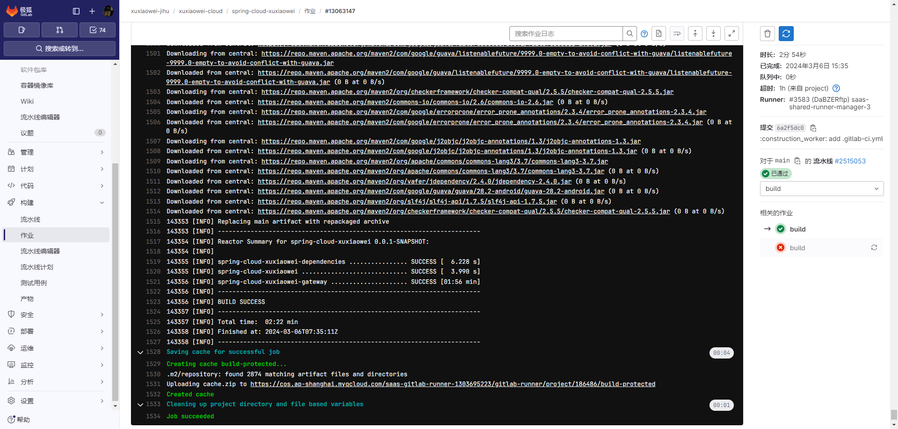
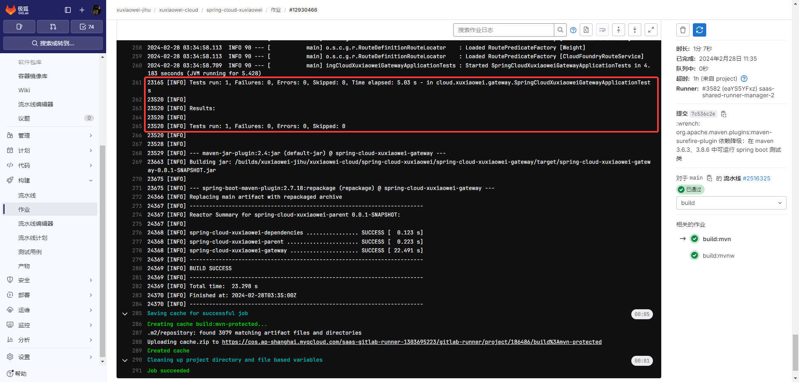
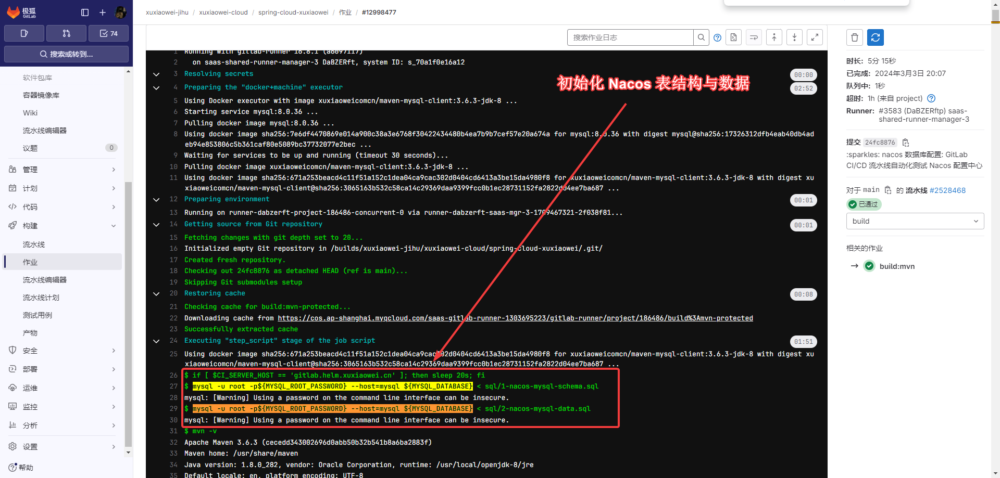
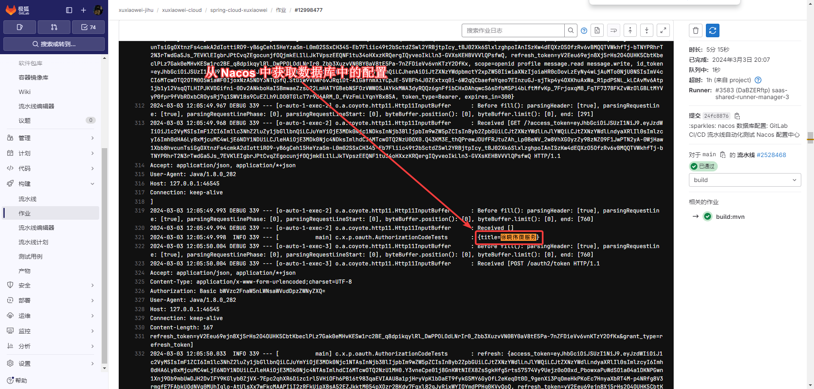

# 提升个人开发效率与安全性：极狐 GitLab CI/CD 助力编译、构建、测试与发布

在现代软件开发中，个人开发者常常面临项目维护过程中的重复性工作和安全隐患。为了解决这些问题，极狐 GitLab CI/CD 成为了一个强大的工具，
为个人开发者提供了一套完整的解决方案。

## 前提

作者前几年开发了一个微服务项目，由于长期不维护，存在很多问题，比如：接口 bug 多，功能不完善，依赖版本过低、漏洞过多、上手困难等原因，
现在准备将之前的微服务进行重构。

重构要求如下：

1. 为了减轻开发者的手动操作负担，避免重复性的编译和构建工作，希望加入流水线自动化执行，让本人只需专注于代码的编写，而无需担心构建过程的繁琐细节。
2. 为了保证接口的质量，需要给接口添加自动化的测试（单元测试、集成测试），有助于及时发现潜在的问题，提高了项目的代码质量。。
3. 为了了解软件供应链，需要对使用的依赖进行安全扫描和管理。

## 现实

1. 作者对 GitLab CI/CD 比较了解，希望使用 GitLab CI/CD 来完成自动构建、测试与发布。
2. 作者本人无云服务器，没有办法随时提交代码进行自动化测试。
3. 作者有一台实体机器，虽然配置很高（双路 20 核 40 线程 256G 内存 8T 硬盘），但是功率感人，每小时至少 200W。

## 契机

在 2024 年 2 月，一个偶然的机会，作者获得了 极狐 GitLab 旗舰版 一年的授权，这对于个人开发者来说，就是雪中送炭。

于是在当月便创建了一个项目，着手工作开始重构，避免浪费授权。

## 进展

1. 将代码推送到`默认分支`，即可触发流水线自动打包：
   作者使用 Maven 来管理项目依赖，
   下方流水线配置文件 [历史提交记录](https://jihulab.com/xuxiaowei-jihu/xuxiaowei-cloud/spring-cloud-xuxiaowei/-/commit/6a2f5dc0)，
   根据 极狐 GitLab
   [流水线](https://jihulab.com/xuxiaowei-jihu/xuxiaowei-cloud/spring-cloud-xuxiaowei/-/pipelines/2515053)
   可知，本次提交可正常编译打包，说明本次提交的代码编译时正常

    ```yaml
    stages:
      - build
    
    build:
      stage: build
      image: maven:3-openjdk-8
      variables:
        MAVEN_OPTS: >-
          -Dhttps.protocols=TLSv1.2
          -Dmaven.repo.local=$CI_PROJECT_DIR/.m2/repository
          -Dorg.slf4j.simpleLogger.showDateTime=true
          -Djava.awt.headless=true
        MAVEN_CLI_OPTS: >-
          --batch-mode
          --errors
          --fail-at-end
          --show-version
          --no-transfer-progress
          -DinstallAtEnd=true
          -DdeployAtEnd=true
      script:
        - mvn clean package -DskipTests=false
      cache:
        key: "${CI_JOB_NAME}"
        paths:
          - .m2/repository
      only:
        variables:
          - $CI_COMMIT_BRANCH == $CI_DEFAULT_BRANCH
    ```
   

2. 接下来调整代码，修复了项目自动化测试的功能，
   [流水线](https://jihulab.com/xuxiaowei-jihu/xuxiaowei-cloud/spring-cloud-xuxiaowei/-/pipelines/2516325)
   

3. 上述测试只是微服务中单个服务的测试，没有做集成测试，比如：Nacos 使用 MySQL 启动，微服务注册到 Nacos，从 Nacos 中获取配置，
   微服务之间进行相互调用等等。

4. 于是接下来给流水线配置 MySQL services，用于 Nacos 连接 MySQL 数据库，微服务连接 Nacos，从 Nacos 中获取配置，
   [历史提交记录](https://jihulab.com/xuxiaowei-jihu/xuxiaowei-cloud/spring-cloud-xuxiaowei/-/commit/24fc8876)，
   根据 极狐 GitLab
   [流水线](https://jihulab.com/xuxiaowei-jihu/xuxiaowei-cloud/spring-cloud-xuxiaowei/-/pipelines/2528468)
   可知，流水线使用 mysql:8.0.36 镜像创建了一个 MySQL 数据库，并初始化了表结构和数据，从测试日志中可知，微服务连接 Nacos，
   并通过 Nacos 拿到数据库配置的数据（日志中的 `徐晓伟微服务`）

    ```yaml
    build:mvn:
       stage: build
       image: xuxiaoweicomcn/maven-mysql-client:3.6.3-jdk-8
       services:
          - mysql:8.0.36
       variables:
          MAVEN_OPTS: >-
             -Dhttps.protocols=TLSv1.2
             -Dmaven.repo.local=$CI_PROJECT_DIR/.m2/repository
             -Dorg.slf4j.simpleLogger.showDateTime=true
             -Djava.awt.headless=true
          MAVEN_CLI_OPTS: >-
             --batch-mode
             --errors
             --fail-at-end
             --show-version
             --no-transfer-progress
             -DinstallAtEnd=true
             -DdeployAtEnd=true
          MYSQL_DATABASE: nacos
          MYSQL_ROOT_PASSWORD: nacos
          XUXIAOWEI_NACOS_MYSQL_IP: mysql
          XUXIAOWEI_NACOS_MYSQL_USERNAME: root
          XUXIAOWEI_NACOS_MYSQL_DATABASE: nacos
       before_script:
          - if [ $CI_SERVER_HOST == 'gitlab.helm.xuxiaowei.cn' ]; then
             sleep 20s;
             fi
          - mysql -u root -p${MYSQL_ROOT_PASSWORD} --host=mysql ${MYSQL_DATABASE} < sql/1-nacos-mysql-schema.sql
          - mysql -u root -p${MYSQL_ROOT_PASSWORD} --host=mysql ${MYSQL_DATABASE} < sql/2-nacos-mysql-data.sql
       script:
          - mvn -v
          - mvn clean package -U -pl nacos -DskipTests=false -s settings.xml
          - nohup java -jar nacos/target/nacos-0.0.1-SNAPSHOT.jar > nohup.out 2>&1 &
          - sleep 10s
          - cat nohup.out
          - curl "http://127.0.0.1:8848/nacos/v1/cs/configs?dataId=&group=&appName=&config_tags=&pageNo=1&pageSize=10&tenant=&search=blur" && echo
          - cat nohup.out
          - >-
             mvn clean package -U
             -pl spring-cloud-xuxiaowei-passport
             -pl spring-cloud-xuxiaowei-commons/spring-cloud-xuxiaowei-commons-core
             -pl spring-cloud-xuxiaowei-commons/spring-cloud-xuxiaowei-commons-loadbalancer
             -DskipTests=false -s settings.xml
          - nohup java -jar spring-cloud-xuxiaowei-passport/target/spring-cloud-xuxiaowei-passport-0.0.1-SNAPSHOT.jar > nohup.out 2>&1 &
          - sleep 10s
          - mvn clean package -U -pl !nacos,!spring-cloud-xuxiaowei-passport -DskipTests=false -s settings.xml
       cache:
          key: "${CI_JOB_NAME}"
          paths:
             - .m2/repository
       only:
          variables:
             - $CI_COMMIT_BRANCH == $CI_DEFAULT_BRANCH
    ```
   
   
