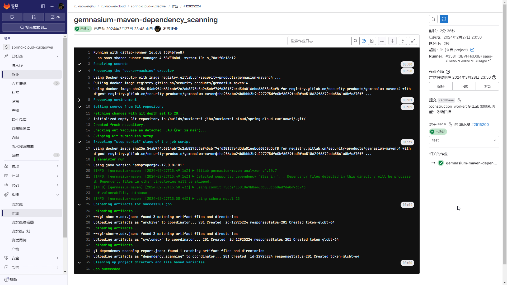
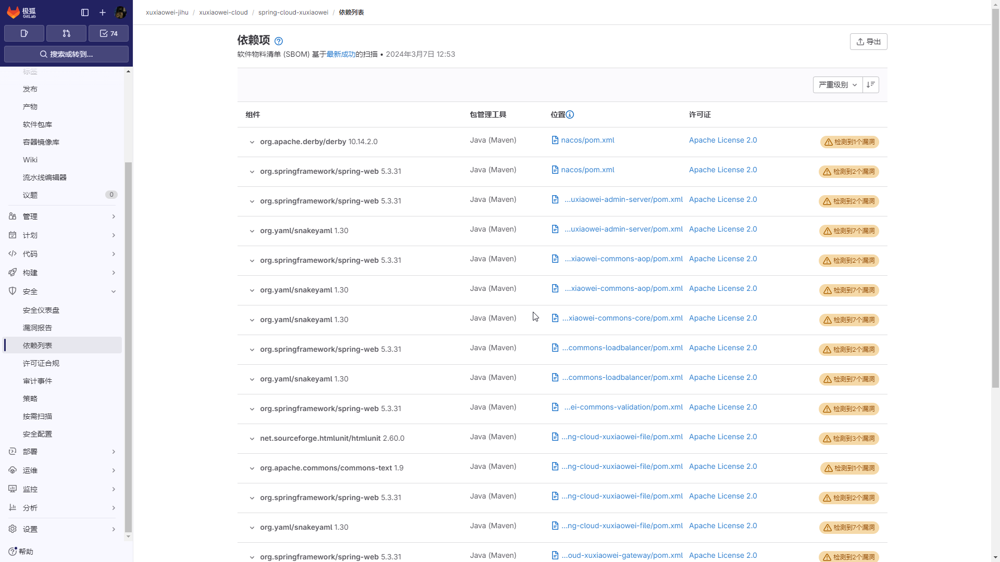
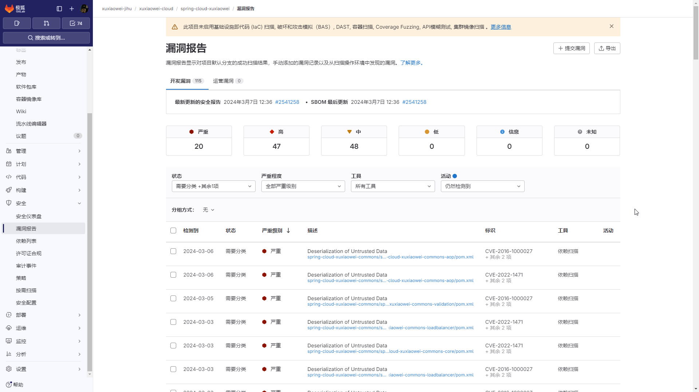
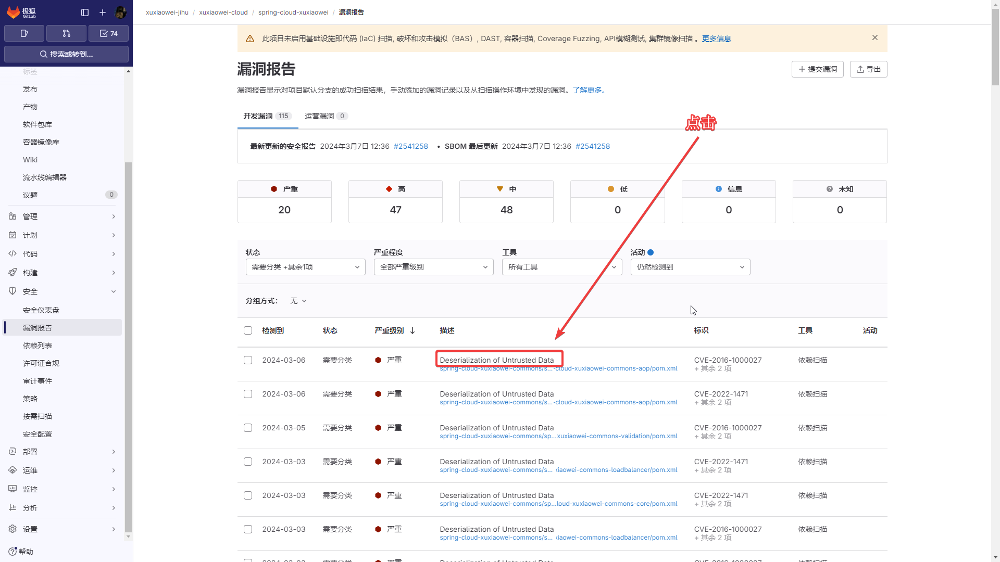
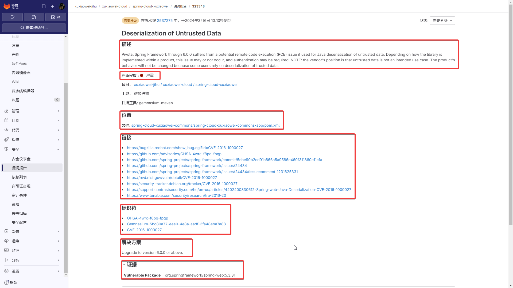
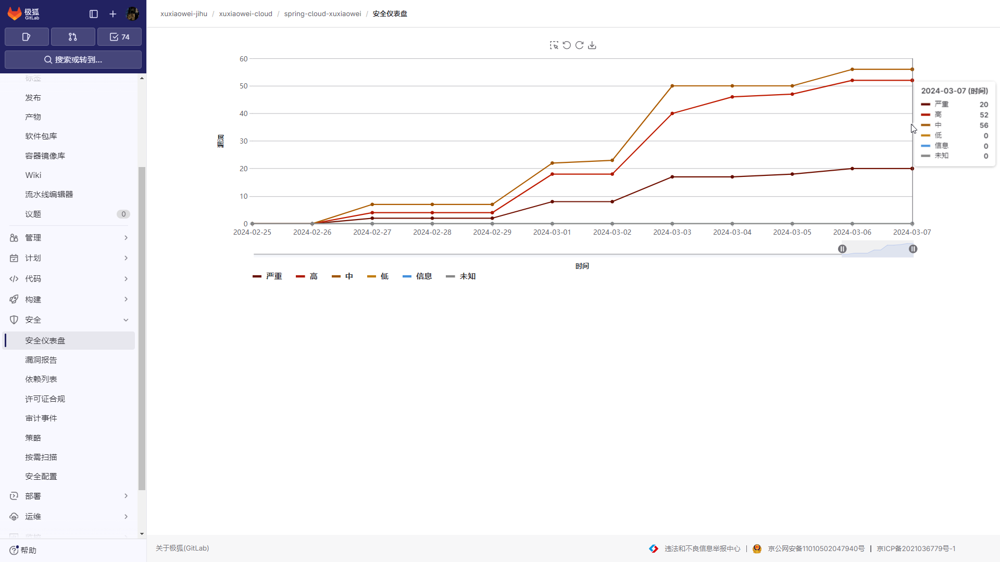

# 极狐 GitLab 依赖扫描：助力开发者管理软件供应链

## 问题

你知道一个 Java 项目需要多少个依赖吗？
你知道一个 Java 项目使用的依赖是否存在漏洞吗？
你知道如何查看一个依赖漏洞的相关信息吗？
你知道如何修复一个依赖漏洞吗？

# 项目依赖数量

1. 在 [Spring Boot 官网](https://start.spring.io) 项目类型选择 `Maven`，依赖只选择一个 `Spring Web`，打包后，解压产物，
   在 `BOOT-INF\lib` 文件夹中，可以发现程序使用了 30 个依赖。

2. 作者本人在上个月（2024年2月）刚创建的一个[微服务项目](https://jihulab.com/xuxiaowei-jihu/xuxiaowei-cloud/spring-cloud-xuxiaowei)，
   功能简单（就连数据库功能都没有），暂无业务，打包后，解压产物，依赖去重后，有 144 个，
   目前功能仅有（截止到 2024-03-07）：
    1. 网关功能
    2. OAuth 2.1 授权功能
    3. OAuth 2 资源功能
    4. AOP 功能
    5. 监控 功能
    6. Swagger 文档

3. 在 Gitee [后台管理框架](https://gitee.com/explore/backend) 名列前茅的项目 [pig](https://gitee.com/log4j/pig)，打包后，
   解压产物，依赖去重后，有 394 个（截止到 2024-03-07）

# 解决方案

本人使用 极狐 GitLab 扫描项目依赖，查看依赖漏洞。

可以轻松帮助我们扫描项目依赖，识别依赖的漏洞，提高项目安全性。

## 配置

1. 在 GitLab 流水线中添加 4 行代码，
   [提交记录](https://jihulab.com/xuxiaowei-jihu/xuxiaowei-cloud/spring-cloud-xuxiaowei/-/commit/7a6b0aae61cd6f59db4127b84348da5a02ce0019)，
   [流水线执行记录](https://jihulab.com/xuxiaowei-jihu/xuxiaowei-cloud/spring-cloud-xuxiaowei/-/pipelines/2515200)，
   执行结果如下：

    ```yml
    stages:
      - test
    
    include:
      - template: Jobs/Dependency-Scanning.gitlab-ci.yml
    ```
   

2. 查看扫描结果

   

3. 查看漏洞报告

   

4. 查看某个漏洞

   

   

5. 项目仪表盘，观察引入依赖的漏洞数量折线图

   
