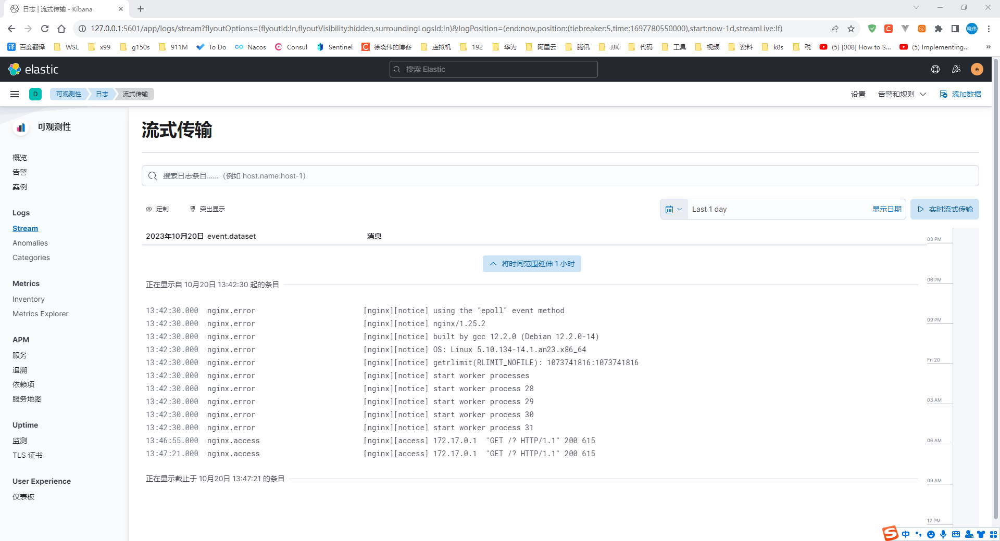

# Anolis 23 中安装 Filebeat 7.x

## 文档

- 请注意文档链接中的版本号

1. https://www.elastic.co/guide/en/beats/filebeat/7.17/filebeat-installation-configuration.html

## 说明

1. 本文以 Anolis 龙蜥 23 为例，CentOS 同理
2. 本文以 Filebeat 7.17.14 为例，首次发稿时的最新版
3. 强烈建议 Filebeat 与要连接的 Elasticsearch 版本一致，否则有可能导致 Filebeat 与 Elasticsearch 无法正常通信

## 安装 Filebeat

```shell
curl -L -O https://artifacts.elastic.co/downloads/beats/filebeat/filebeat-7.17.14-x86_64.rpm
sudo rpm -vi filebeat-7.17.14-x86_64.rpm
```

```shell
[root@elasticsearch-1 ~]# curl -L -O https://artifacts.elastic.co/downloads/beats/filebeat/filebeat-7.17.14-x86_64.rpm
  % Total    % Received % Xferd  Average Speed   Time    Time     Time  Current
                                 Dload  Upload   Total   Spent    Left  Speed
100 34.0M  100 34.0M    0     0  16.8M      0  0:00:02  0:00:02 --:--:-- 16.8M
[root@elasticsearch-1 ~]# sudo rpm -vi filebeat-7.17.14-x86_64.rpm
Verifying packages...
Preparing packages...
filebeat-7.17.14-1.x86_64
[root@elasticsearch-1 ~]#
```

## 启动

```shell
systemctl start filebeat.service
```

```shell
[root@elasticsearch-1 ~]# systemctl status filebeat.service --no-pager 
○ filebeat.service - Filebeat sends log files to Logstash or directly to Elasticsearch.
     Loaded: loaded (/usr/lib/systemd/system/filebeat.service; disabled; preset: disabled)
     Active: inactive (dead)
       Docs: https://www.elastic.co/beats/filebeat
[root@elasticsearch-1 ~]# systemctl status filebeat.service --no-pager 
○ filebeat.service - Filebeat sends log files to Logstash or directly to Elasticsearch.
     Loaded: loaded (/usr/lib/systemd/system/filebeat.service; disabled; preset: disabled)
     Active: inactive (dead)
       Docs: https://www.elastic.co/beats/filebeat
[root@elasticsearch-1 ~]# systemctl start filebeat.service
[root@elasticsearch-1 ~]# systemctl status filebeat.service --no-pager 
● filebeat.service - Filebeat sends log files to Logstash or directly to Elasticsearch.
     Loaded: loaded (/usr/lib/systemd/system/filebeat.service; disabled; preset: disabled)
     Active: active (running) since Fri 2023-10-20 11:16:36 CST; 3s ago
       Docs: https://www.elastic.co/beats/filebeat
   Main PID: 1592 (filebeat)
      Tasks: 8 (limit: 19155)
     Memory: 35.1M
        CPU: 159ms
     CGroup: /system.slice/filebeat.service
             └─1592 /usr/share/filebeat/bin/filebeat --environment systemd -c /etc/filebeat/filebeat.yml --path.home /usr/share/filebeat --path.config /etc/filebeat --path.data /var/lib/filebeat --path.logs /var/log/fil…

Oct 20 11:16:36 elasticsearch-1 systemd[1]: Started filebeat.service - Filebeat sends log files to Logstash or directly to Elasticsearch..
Oct 20 11:16:36 elasticsearch-1 filebeat[1592]: 2023-10-20T11:16:36.407+0800        INFO        instance/beat.go:698        Home path: [/usr/share/filebeat] Config path: [/etc/filebeat] Data path: [/var… Hostfs Path: [/]
Oct 20 11:16:36 elasticsearch-1 filebeat[1592]: 2023-10-20T11:16:36.408+0800        INFO        instance/beat.go:706        Beat ID: be7acbbe-0e0b-4b3c-9c21-e7feaeaec800
Hint: Some lines were ellipsized, use -l to show in full.
[root@elasticsearch-1 ~]#
```

## 设置开机自启

```shell
systemctl enable filebeat.service
```

```shell
[root@elasticsearch-1 ~]# systemctl enable filebeat.service
Synchronizing state of filebeat.service with SysV service script with /usr/lib/systemd/systemd-sysv-install.
Executing: /usr/lib/systemd/systemd-sysv-install enable filebeat
Created symlink /etc/systemd/system/multi-user.target.wants/filebeat.service → /usr/lib/systemd/system/filebeat.service.
[root@elasticsearch-1 ~]# systemctl is-enabled filebeat.service
enabled
[root@elasticsearch-1 ~]# 
```

## 配置

### Elasticsearch 地址

```shell
vim /etc/filebeat/filebeat.yml
```

```yaml
# 填写 elasticsearch 的IP与端口
# 此处作者将 elasticsearch、filebeat 安装在同一台机器上，所以使用的是 localhost
output.elasticsearch:
  # Array of hosts to connect to.
  hosts: [ "localhost:9200" ]
```

```shell
systemctl status filebeat.service --no-pager 
systemctl restart filebeat.service
systemctl status filebeat.service --no-pager 
```

### Elasticsearch 用户名、密码、协议（可选）

```shell
vim /etc/filebeat/filebeat.yml
```

```yaml
# 填写 elasticsearch 的IP与端口
# 此处作者将 elasticsearch、filebeat 安装在同一台机器上，所以使用的是 localhost
output.elasticsearch:
  # Array of hosts to connect to.
  hosts: [ "localhost:9200" ]

  # Protocol - either `http` (default) or `https`.
  #protocol: "https"

  # Authentication credentials - either API key or username/password.
  #api_key: "id:api_key"
  username: "elastic"
  password: "DP2P6CtPbZWYaOoAZBin"
```

```shell
systemctl status filebeat.service --no-pager 
systemctl restart filebeat.service
systemctl status filebeat.service --no-pager 
```

## Filebeat 收集日志

### Filebeat 默认模板

- Filebeat 提供多种默认日志模板可以使用
- 以 `.disabled` 为后缀的文件是默认模板的禁用文件
- 如需开启默认配置，将 `.disabled` 去掉即可，快捷命令 `sudo filebeat modules enable mysql`

```shell
ll /etc/filebeat/modules.d/
```

```shell
[root@elasticsearch-1 ~]# ll /etc/filebeat/modules.d/
total 300
-rw-r--r--. 1 root root   484 Oct  6 03:21 activemq.yml.disabled
-rw-r--r--. 1 root root   476 Oct  6 03:21 apache.yml.disabled
-rw-r--r--. 1 root root   281 Oct  6 03:21 auditd.yml.disabled
-rw-r--r--. 1 root root 10575 Oct  6 03:21 aws.yml.disabled
-rw-r--r--. 1 root root  2112 Oct  6 03:21 awsfargate.yml.disabled
-rw-r--r--. 1 root root  1707 Oct  6 03:21 azure.yml.disabled
-rw-r--r--. 1 root root  1078 Oct  6 03:21 barracuda.yml.disabled
-rw-r--r--. 1 root root   602 Oct  6 03:21 bluecoat.yml.disabled
-rw-r--r--. 1 root root   527 Oct  6 03:21 cef.yml.disabled
-rw-r--r--. 1 root root   834 Oct  6 03:21 checkpoint.yml.disabled
-rw-r--r--. 1 root root  5143 Oct  6 03:21 cisco.yml.disabled
-rw-r--r--. 1 root root   319 Oct  6 03:21 coredns.yml.disabled
-rw-r--r--. 1 root root   302 Oct  6 03:21 crowdstrike.yml.disabled
-rw-r--r--. 1 root root   761 Oct  6 03:21 cyberark.yml.disabled
-rw-r--r--. 1 root root   724 Oct  6 03:21 cyberarkpas.yml.disabled
-rw-r--r--. 1 root root   598 Oct  6 03:21 cylance.yml.disabled
-rw-r--r--. 1 root root   965 Oct  6 03:21 elasticsearch.yml.disabled
-rw-r--r--. 1 root root   328 Oct  6 03:21 envoyproxy.yml.disabled
-rw-r--r--. 1 root root  1058 Oct  6 03:21 f5.yml.disabled
-rw-r--r--. 1 root root  2406 Oct  6 03:21 fortinet.yml.disabled
-rw-r--r--. 1 root root  3021 Oct  6 03:21 gcp.yml.disabled
-rw-r--r--. 1 root root  1512 Oct  6 03:21 google_workspace.yml.disabled
-rw-r--r--. 1 root root  2023 Oct  6 03:21 googlecloud.yml.disabled
-rw-r--r--. 1 root root  1595 Oct  6 03:21 gsuite.yml.disabled
-rw-r--r--. 1 root root   377 Oct  6 03:21 haproxy.yml.disabled
-rw-r--r--. 1 root root   296 Oct  6 03:21 ibmmq.yml.disabled
-rw-r--r--. 1 root root   652 Oct  6 03:21 icinga.yml.disabled
-rw-r--r--. 1 root root   471 Oct  6 03:21 iis.yml.disabled
-rw-r--r--. 1 root root   603 Oct  6 03:21 imperva.yml.disabled
-rw-r--r--. 1 root root   598 Oct  6 03:21 infoblox.yml.disabled
-rw-r--r--. 1 root root   367 Oct  6 03:21 iptables.yml.disabled
-rw-r--r--. 1 root root  1437 Oct  6 03:21 juniper.yml.disabled
-rw-r--r--. 1 root root   399 Oct  6 03:21 kafka.yml.disabled
-rw-r--r--. 1 root root   473 Oct  6 03:21 kibana.yml.disabled
-rw-r--r--. 1 root root   472 Oct  6 03:21 logstash.yml.disabled
-rw-r--r--. 1 root root  1462 Oct  6 03:21 microsoft.yml.disabled
-rw-r--r--. 1 root root   476 Oct  6 03:21 misp.yml.disabled
-rw-r--r--. 1 root root   297 Oct  6 03:21 mongodb.yml.disabled
-rw-r--r--. 1 root root   384 Oct  6 03:21 mssql.yml.disabled
-rw-r--r--. 1 root root   472 Oct  6 03:21 mysql.yml.disabled
-rw-r--r--. 1 root root   430 Oct  6 03:21 mysqlenterprise.yml.disabled
-rw-r--r--. 1 root root   288 Oct  6 03:21 nats.yml.disabled
-rw-r--r--. 1 root root   540 Oct  6 03:21 netflow.yml.disabled
-rw-r--r--. 1 root root   603 Oct  6 03:21 netscout.yml.disabled
-rw-r--r--. 1 root root   784 Oct  6 03:21 nginx.yml.disabled
-rw-r--r--. 1 root root  1536 Oct  6 03:21 o365.yml.disabled
-rw-r--r--. 1 root root   341 Oct  6 03:21 okta.yml.disabled
-rw-r--r--. 1 root root   408 Oct  6 03:21 oracle.yml.disabled
-rw-r--r--. 1 root root   496 Oct  6 03:21 osquery.yml.disabled
-rw-r--r--. 1 root root   598 Oct  6 03:21 panw.yml.disabled
-rw-r--r--. 1 root root   359 Oct  6 03:21 pensando.yml.disabled
-rw-r--r--. 1 root root   306 Oct  6 03:21 postgresql.yml.disabled
-rw-r--r--. 1 root root   613 Oct  6 03:21 proofpoint.yml.disabled
-rw-r--r--. 1 root root   344 Oct  6 03:21 rabbitmq.yml.disabled
-rw-r--r--. 1 root root   601 Oct  6 03:21 radware.yml.disabled
-rw-r--r--. 1 root root   567 Oct  6 03:21 redis.yml.disabled
-rw-r--r--. 1 root root   267 Oct  6 03:21 santa.yml.disabled
-rw-r--r--. 1 root root   588 Oct  6 03:21 snort.yml.disabled
-rw-r--r--. 1 root root  3711 Oct  6 03:21 snyk.yml.disabled
-rw-r--r--. 1 root root   605 Oct  6 03:21 sonicwall.yml.disabled
-rw-r--r--. 1 root root  1245 Oct  6 03:21 sophos.yml.disabled
-rw-r--r--. 1 root root   588 Oct  6 03:21 squid.yml.disabled
-rw-r--r--. 1 root root   300 Oct  6 03:21 suricata.yml.disabled
-rw-r--r--. 1 root root   478 Oct  6 03:21 system.yml.disabled
-rw-r--r--. 1 root root  5883 Oct  6 03:21 threatintel.yml.disabled
-rw-r--r--. 1 root root   623 Oct  6 03:21 tomcat.yml.disabled
-rw-r--r--. 1 root root   303 Oct  6 03:21 traefik.yml.disabled
-rw-r--r--. 1 root root  1315 Oct  6 03:21 zeek.yml.disabled
-rw-r--r--. 1 root root   476 Oct  6 03:21 zookeeper.yml.disabled
-rw-r--r--. 1 root root   626 Oct  6 03:21 zoom.yml.disabled
-rw-r--r--. 1 root root   594 Oct  6 03:21 zscaler.yml.disabled
[root@elasticsearch-1 ~]# 
```

### Filebeat 收集 Nginx 日志

#### 开启 Filebeat 收集 Nginx 日志 配置

```shell
sudo filebeat modules enable nginx
```

```shell
[root@elasticsearch-1 ~]# sudo filebeat modules enable nginx
Enabled nginx
[root@elasticsearch-1 ~]# 
```

#### 配置 Filebeat 收集 Nginx 日志 路径

```shell
vim /etc/filebeat/modules.d/nginx.yml
```

- 原始配置

```yaml
# Module: nginx
# Docs: https://www.elastic.co/guide/en/beats/filebeat/7.17/filebeat-module-nginx.html

- module: nginx
  # Access logs
  access:
    enabled: true

    # Set custom paths for the log files. If left empty,
    # Filebeat will choose the paths depending on your OS.
    #var.paths:

  # Error logs
  error:
    enabled: true

    # Set custom paths for the log files. If left empty,
    # Filebeat will choose the paths depending on your OS.
    #var.paths:

  # Ingress-nginx controller logs. This is disabled by default. It could be used in Kubernetes environments to parse ingress-nginx logs
  ingress_controller:
    enabled: false

    # Set custom paths for the log files. If left empty,
    # Filebeat will choose the paths depending on your OS.
    #var.paths:
```

- 新增 nginx 日志位置

```yaml
# Module: nginx
# Docs: https://www.elastic.co/guide/en/beats/filebeat/7.17/filebeat-module-nginx.html

- module: nginx
  # Access logs
  access:
    enabled: true

    # Set custom paths for the log files. If left empty,
    # Filebeat will choose the paths depending on your OS.
    var.paths:
      # 收集正常日志
      # 后面会使用 docker nginx 产生此日志
      - /logs/docker/nginx/*.access.log

  # Error logs
  error:
    enabled: true

    # Set custom paths for the log files. If left empty,
    # Filebeat will choose the paths depending on your OS.
    var.paths:
      # 后面会使用 docker nginx 产生此日志
      - /logs/docker/nginx/error.log

  # Ingress-nginx controller logs. This is disabled by default. It could be used in Kubernetes environments to parse ingress-nginx logs
  ingress_controller:
    enabled: false

    # Set custom paths for the log files. If left empty,
    # Filebeat will choose the paths depending on your OS.
    #var.paths:
```

- 重启 filebeat，使配置生效

```shell
systemctl status filebeat.service --no-pager 
systemctl restart filebeat.service
systemctl status filebeat.service --no-pager 
```

- 安装 docker

```shell
# https://docs.docker.com/engine/install/centos/
sudo yum remove docker \
                  docker-client \
                  docker-client-latest \
                  docker-common \
                  docker-latest \
                  docker-latest-logrotate \
                  docker-logrotate \
                  docker-engine

sudo yum install -y yum-utils
sudo yum-config-manager --add-repo https://download.docker.com/linux/centos/docker-ce.repo

# docker 无法识别 Anolis 龙蜥 23，需要将 yum 仓库修改为固定的 centos 8 镜像
sed -i 's/$releasever/8/g' /etc/yum.repos.d/docker-ce.repo

sudo yum -y install docker-ce docker-ce-cli containerd.io docker-buildx-plugin docker-compose-plugin

sudo systemctl enable docker.socket
sudo systemctl enable docker.service

sudo systemctl start docker.socket
sudo systemctl start docker.service
```

- 使用作者制作的 nginx docker 镜像创建 nginx 容器
    - 访问日志可在容器内的 `/var/log/nginx/` 路径下生成
    - 容器内访问日志将映射到主机的 `/logs/docker/nginx` 路径下

```shell
docker run \
  --restart=always \
  -itd \
  --privileged=true \
  -p 1080:80 -p 1443:443 \
  -v /etc/localtime:/etc/localtime \
  -v /logs/docker/nginx:/var/log/nginx/ \
  --name nginx-1.25.2 registry.jihulab.com/xuxiaowei-com-cn/nginx:1.25.2-host.access.log
```

- Filebeat 收集数据的日志

```shell
# 日志实时输出
# 如果 nginx 没有新日志，这里将不会输出
tail -f /var/lib/filebeat/registry/filebeat/log.json
```

- 访问 nginx，产生 访问日志

```shell
curl 127.0.0.1:1080
```

```shell
[root@elasticsearch-1 ~]# curl 127.0.0.1:1080
<!DOCTYPE html>
<html>
<head>
<title>Welcome to nginx!</title>
<style>
html { color-scheme: light dark; }
body { width: 35em; margin: 0 auto;
font-family: Tahoma, Verdana, Arial, sans-serif; }
</style>
</head>
<body>
<h1>Welcome to nginx!</h1>
<p>If you see this page, the nginx web server is successfully installed and
working. Further configuration is required.</p>

<p>For online documentation and support please refer to
<a href="http://nginx.org/">nginx.org</a>.<br/>
Commercial support is available at
<a href="http://nginx.com/">nginx.com</a>.</p>

<p><em>Thank you for using nginx.</em></p>
</body>
</html>
[root@elasticsearch-1 ~]#
```

- 首次产生日志可能需要手动触发一次

```shell
systemctl status filebeat.service --no-pager 
systemctl restart filebeat.service
systemctl status filebeat.service --no-pager 
```

- Filebeat 收集数据的日志示例

```shell
[root@elasticsearch-1 ~]# tail -f /var/lib/filebeat/registry/filebeat/log.json
{"op":"set","id":1}
{"k":"filebeat::logs::native::135351602-64512","v":{"offset":0,"timestamp":[2062097738578,1697780886],"ttl":-1,"identifier_name":"native","prev_id":"","source":"/logs/docker/nginx/error.log","type":"log","FileStateOS":{"inode":135351602,"device":64512},"id":"native::135351602-64512"}}
{"op":"set","id":2}
{"k":"filebeat::logs::native::135351602-64512","v":{"id":"native::135351602-64512","prev_id":"","source":"/logs/docker/nginx/error.log","timestamp":[2062097738578,1697780886],"ttl":-1,"offset":0,"type":"log","FileStateOS":{"device":64512,"inode":135351602},"identifier_name":"native"}}
{"op":"set","id":3}
{"k":"filebeat::logs::native::135351606-64512","v":{"ttl":-1,"FileStateOS":{"inode":135351606,"device":64512},"identifier_name":"native","id":"native::135351606-64512","source":"/logs/docker/nginx/host.access.log","offset":0,"prev_id":"","timestamp":[2062098015789,1697780886],"type":"log"}}
{"op":"set","id":4}
{"k":"filebeat::logs::native::135351602-64512","v":{"source":"/logs/docker/nginx/error.log","offset":453,"timestamp":[2062175257062,1697780892],"type":"log","FileStateOS":{"inode":135351602,"device":64512},"id":"native::135351602-64512","prev_id":"","ttl":-1,"identifier_name":"native"}}
{"op":"set","id":5}
{"k":"filebeat::logs::native::135351606-64512","v":{"timestamp":[2062175257062,1697780892],"ttl":-1,"FileStateOS":{"inode":135351606,"device":64512},"identifier_name":"native","id":"native::135351606-64512","prev_id":"","source":"/logs/docker/nginx/host.access.log","offset":180,"type":"log"}}
{"op":"set","id":6}
{"k":"filebeat::logs::native::135351602-64512","v":{"source":"/logs/docker/nginx/error.log","offset":569,"timestamp":[2062175463597,1697780892],"FileStateOS":{"inode":135351602,"device":64512},"identifier_name":"native","id":"native::135351602-64512","ttl":-1,"type":"log","prev_id":""}}
{"op":"set","id":7}
{"k":"filebeat::logs::native::135351606-64512","v":{"offset":180,"timestamp":[2062175257062,1697780892],"ttl":-1,"type":"log","FileStateOS":{"inode":135351606,"device":64512},"identifier_name":"native","id":"native::135351606-64512","prev_id":"","source":"/logs/docker/nginx/host.access.log"}}
{"op":"set","id":8}
{"k":"filebeat::logs::native::135351602-64512","v":{"prev_id":"","source":"/logs/docker/nginx/error.log","timestamp":[2061663179792,1697780895],"identifier_name":"native","id":"native::135351602-64512","ttl":-1,"type":"log","FileStateOS":{"inode":135351602,"device":64512},"offset":627}}
{"op":"set","id":9}
{"k":"filebeat::logs::native::135351606-64512","v":{"ttl":-1,"FileStateOS":{"inode":135351606,"device":64512},"identifier_name":"native","prev_id":"","source":"/logs/docker/nginx/host.access.log","timestamp":[2062175257062,1697780892],"id":"native::135351606-64512","offset":180,"type":"log"}}
```

- 登录 Kibana 查看日志

  - 访问地址：http://kibana IP:5601/app/logs/stream


