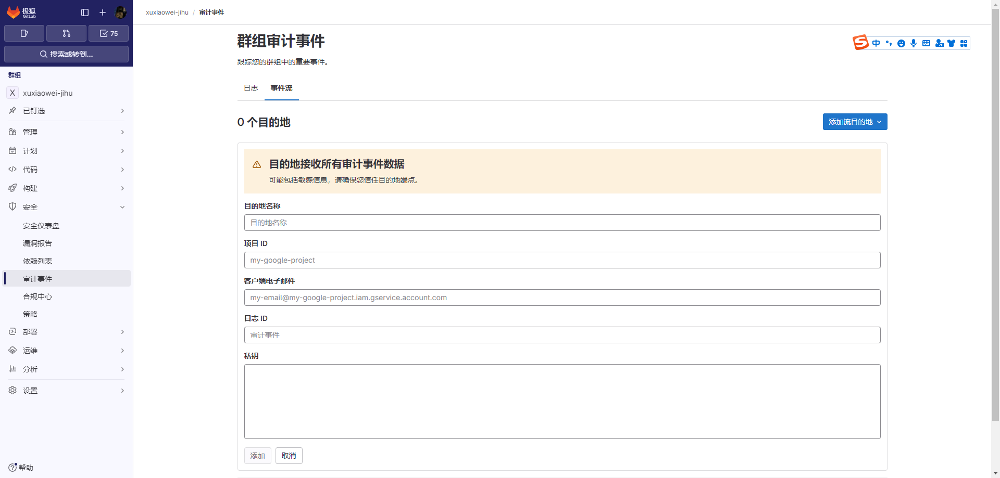

# 审计事件

## 说明

1. 只要你没有付费，无论你安装的是 `gitlab-ce(社区版)`、`gitlab-ee(企业版)`、`gitlab-jh(极狐版，中国特供企业版)`
   其中的哪个版本，只能体验`免费版`的功能

## 群组审计事件

### 可根据`成员`、`时间范围`搜索`成员操作日志`

### 可将`群组审计事件`发送到`HTTP端点`、`Google Cloud 日志`、`AWS S3(对象储存)`

1. `HTTP端点`可自定义`HTTP headers`、`事件`、`群组或项目`发送到指定URL
   

2. `Google Cloud 日志`配置如下
   

3. `AWS S3(对象储存)`配置如下
   

## 项目审计事件

### 可根据`成员`、`时间范围`搜索`成员操作日志`

