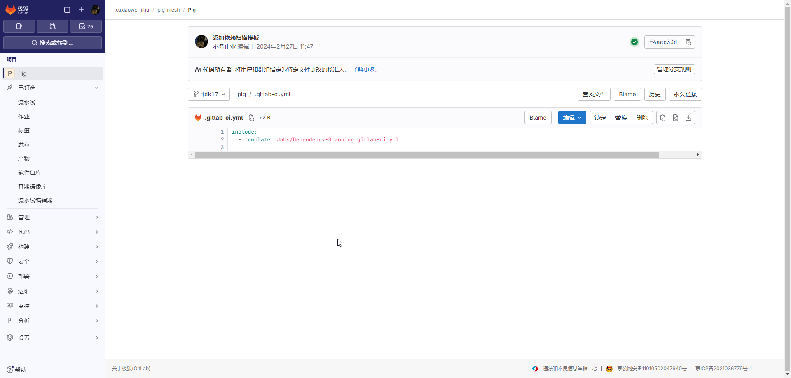
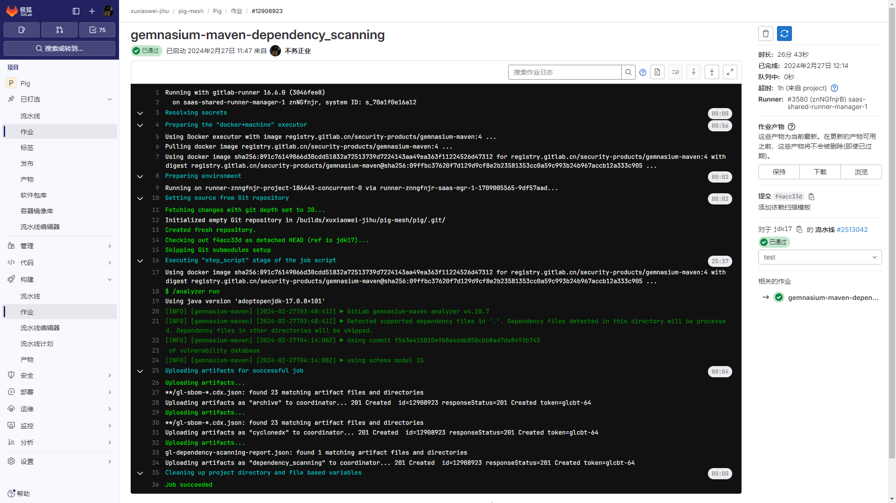
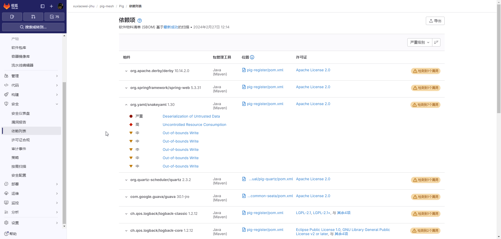
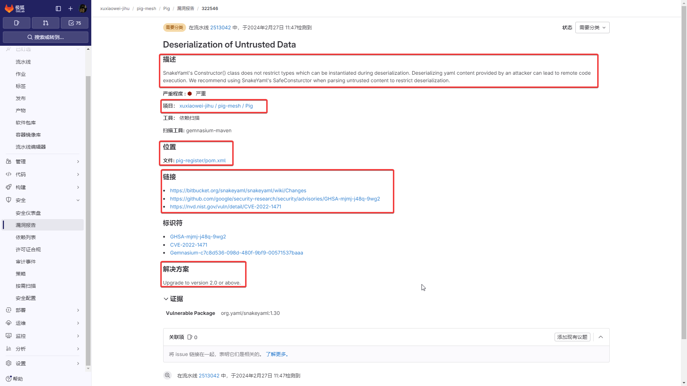
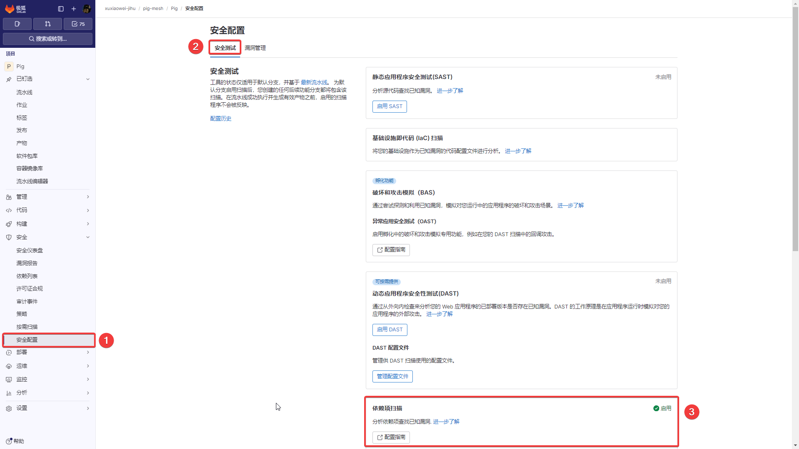

# 依赖列表

使用依赖项列表查看项目或群组的依赖项和有关这些依赖项的关键详细信息，包括它们的已知漏洞。
它是项目中依赖项的集合，包括现有的和新的发现。
该信息有时被称为软件物料清单、SBOM 或 BOM。

## 先决条件

要查看项目的依赖项，请确保满足以下要求：

1. 必须为您的项目配置
   [依赖扫描](https://docs.gitlab.cn/jh/user/application_security/dependency_scanning/index.html) 或
   [容器扫描](https://docs.gitlab.cn/jh/user/application_security/container_scanning/index.html) CI 作业。
2. 您的项目至少使用 Gemnasium 支持的
   [语言和包管理器](https://docs.gitlab.cn/jh/user/application_security/dependency_scanning/index.html#supported-languages-and-package-managers)
   之一。
3. 在默认分支上运行了一条成功的流水线。您不应更改允许
   [应用程序安全作业失败](https://docs.gitlab.cn/jh/user/application_security/index.html#application-coverage) 的默认行为。

## 说明

1. 本文以 https://github.com/pig-mesh/pig 演示为例

## 配置

1. 在项目流水线配置文件 `.gitlab-ci.yml`（默认文件名）中添加

    ```yaml
    include:
      - template: Jobs/Dependency-Scanning.gitlab-ci.yml
    ```

   

2. 等待流水线作业执行完成

   

3. 查看项目依赖列表

    1. 如果依赖存在漏洞，可将依赖展开，查看漏洞信息

       

    2. 点击漏洞，查看`漏洞描述`、`项目`、`位置`、`链接`、`解决方案`等信息

       

### 安全配置说明

当上述正确配置后，`安全配置`会显示`依赖项扫描`已`启用`


