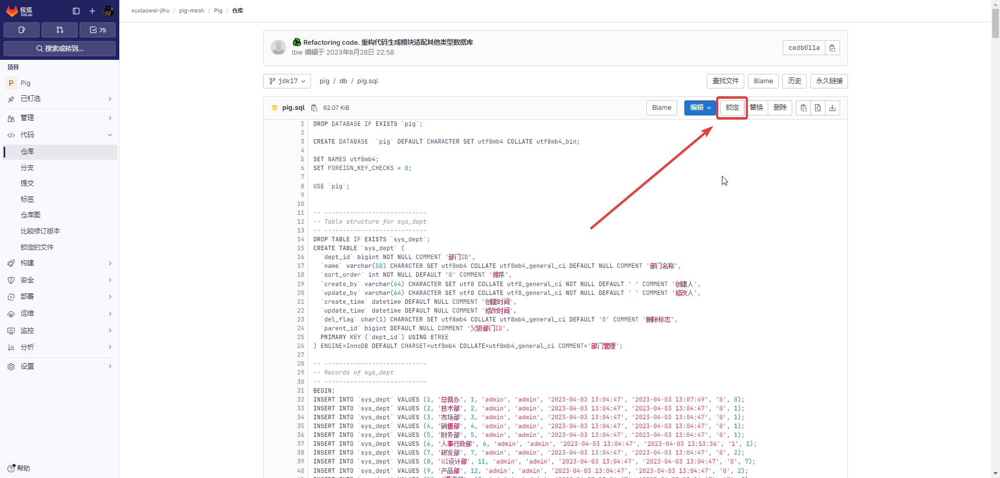
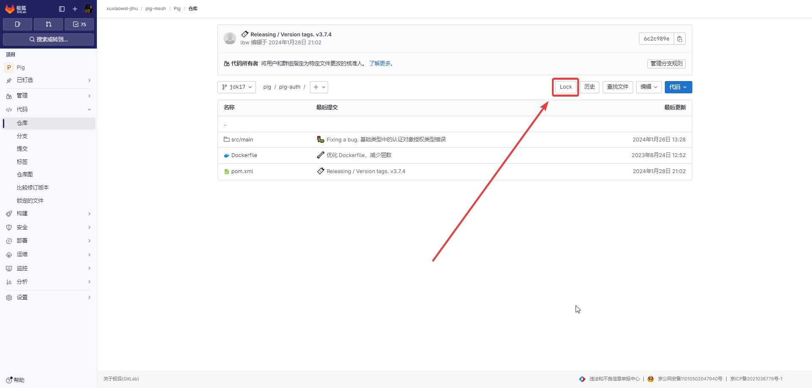

# 默认分支文件和目录锁

此过程允许您通过 GitLab UI 一次锁定一个文件，并且需要访问[专业版](https://about.gitlab.cn/pricing/)或更高级别。

默认分支文件和目录锁仅适用于项目设置中设置的[默认分支](https://docs.gitlab.cn/jh/user/project/repository/branches/default.html)。

阻止对默认分支上锁定文件的更改，包括修改锁定文件的合并请求。解锁文件以允许更改。

## 配置

### 锁定文件

1. 锁定单个文件

   

2. 锁定结果

   

### 锁定文件夹

1. 锁定文件夹

   

2. 锁定结果

   
