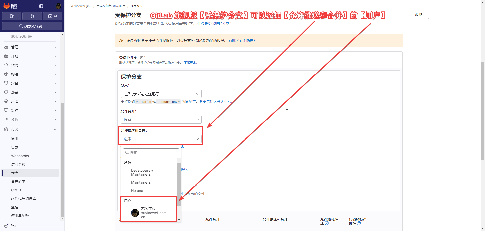

# 仓库受保护分支和标签

## [适用版本](intro.md)

## 免费版

1. 社区版(免费版)【受保护分支】【允许合并】只能添加【角色】`Maintainers`、`Developers + Maintainers`
   
2. 社区版(免费版)【受保护分支】【允许推送和合并】只能添加【角色】`Maintainers`、`Developers + Maintainers`
   
3. 社区版(免费版)【保护标签】【允许创建】只能添加【角色】`Maintainers`、`Developers + Maintainers`
   

## 旗舰版

1. GitLab 旗舰版【受保护分支】可以添加【允许合并】的【用户】
   
2. GitLab 旗舰版【受保护分支】可以添加【允许推送和合并】的【用户】
   
3. GitLab 旗舰版【保护标签】可以添加【允许创建】的【用户】
   
