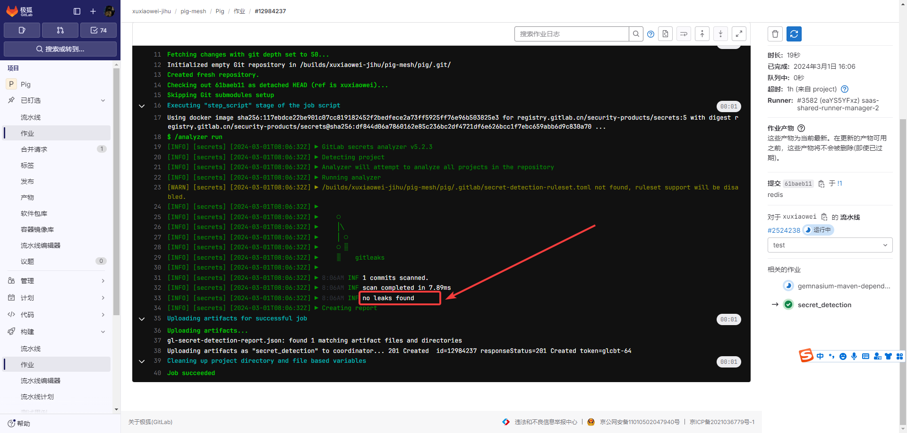

# Secret 检测（未完成）

人们有时会不小心将密钥或 API 令牌等 secret 提交到 Git 仓库。

将敏感值推送到远端仓库后，任何有权访问仓库的人都可以出于恶意目的冒充 secret 的授权用户。

大多数组织都要求撤销和替换暴露的 secret 来解决此风险。

Secret 检测会扫描您的仓库，帮助防止您的 secret 被泄露。

Secret 检测扫描适用于所有文本文件，无论使用何种语言或框架。

## 版本功能

| 能力                                                                                                                                                   | 基础版和专业版 | 旗舰版 |   
|------------------------------------------------------------------------------------------------------------------------------------------------------|---------|-----|
| [配置 secret 检测扫描程序](https://docs.gitlab.cn/jh/user/application_security/secret_detection/index.html#enable-secret-detection)		                        | ✅       | ✅   |
| [自定义 Secret 检测设置](https://docs.gitlab.cn/jh/user/application_security/secret_detection/index.html#configure-scan-settings)                           | ✅       | ✅   |
| 下载 JSON 报告                                                                                                                                           | ✅       | ✅   |
| [在发布之前检查文本中的潜在 secret](https://docs.gitlab.cn/jh/user/application_security/secret_detection/index.html#warnings-for-potential-leaks-in-text-content) | ✅       | ✅   |
| 在合并请求部件中查看新发现                                                                                                                                        | ❌       | ✅   |
| 在流水线的 安全 选项卡中查看已识别的 secret		                                                                                                                         | ❌       | ✅   |
| [管理漏洞](https://docs.gitlab.cn/jh/user/application_security/vulnerability_report/index.html)                                                          | ❌       | ✅   |
| 访问安全仪表盘                                                                                                                                              | ❌       | ✅   |
| [自定义 Secret 检测规则集](https://docs.gitlab.cn/jh/user/application_security/secret_detection/index.html#custom-rulesets) 		                               | ❌       | ✅   |

1. 本文以 https://github.com/pig-mesh/pig 演示为例

## 配置

1. 在项目流水线配置文件 `.gitlab-ci.yml`（默认文件名）中添加

    ```yaml
    include:
      - template: Jobs/Secret-Detection.gitlab-ci.yml
    ```

   

2. 等待流水线作业执行完成

   

3. 未扫描到泄漏示例
   
   

4. 扫描到泄漏示例

   

### 安全配置说明

当上述正确配置后，`安全配置`会显示`Secret 检测`已`启用`


