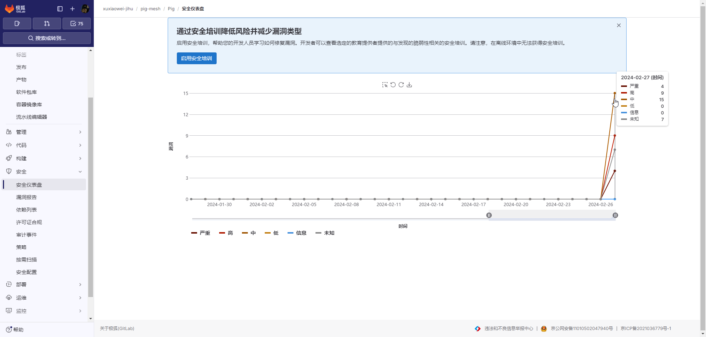

# 安全仪表盘

您可以使用安全仪表盘，查看有关
[安全扫描程序](https://docs.gitlab.cn/jh/user/application_security/index.html#application-coverage)
检测到的漏洞的趋势。
这些趋势显示在项目、群组和安全中心。

## [适用版本](intro.md)

## 先决条件

要使用安全仪表盘，您必须：

在一个项目中配置至少一个[安全扫描器](https://docs.gitlab.cn/jh/user/application_security/index.html#security-scanning-tools)。
配置作业使用 [reports 语法](https://docs.gitlab.cn/jh/ci/yaml/index.html#artifactsreports)。
使用 GitLab Runner 11.5 或更高版本。如果您使用 SaaS 上的共享 runner，则您使用的是正确的版本

## 当安全仪表盘更新时

安全仪表盘显示[默认分支](https://docs.gitlab.cn/jh/user/project/repository/branches/default.html)上的最新安全扫描结果。
安全扫描仅在默认分支更新时运行，因此安全仪表盘上的信息可能不会反映新发现的漏洞。

要运行每日安全扫描，[配置计划流水线](https://docs.gitlab.cn/jh/ci/pipelines/schedules.html)。

## 配置

1. 根据 [依赖列表](dependency-list.md) 进行配置并等待运行结束

2. 查看仪表盘的结果
    
    
