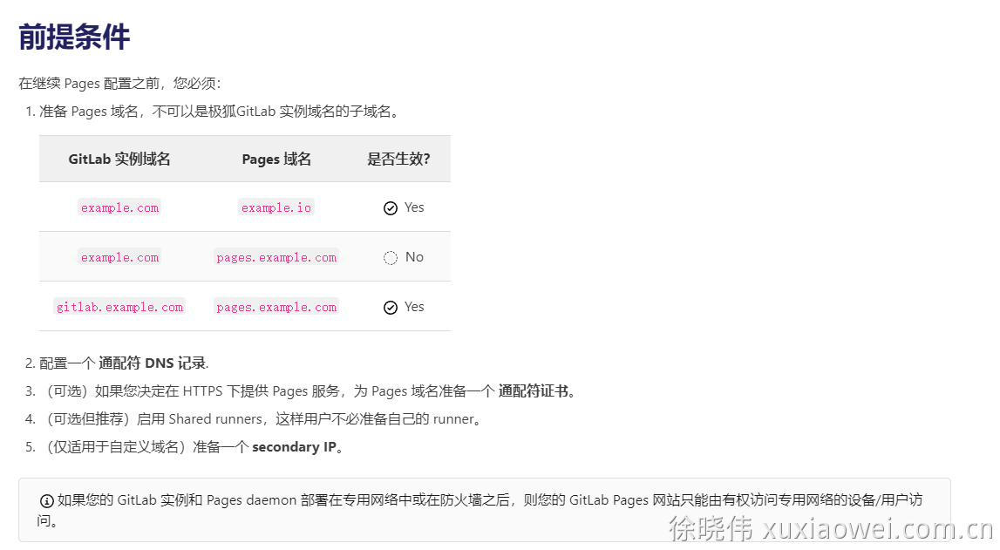

# GitLab Pages 配置 SSL/https

配置 GitLab Pages 域名的 SSL 证书，以实现开启静态页面的功能

## 文档

1. [GitLab 页面管理](https://docs.gitlab.com/ee/administration/pages/)
    1. [极狐 GitLab 中文文档](https://docs.gitlab.cn/jh/administration/pages/)
2. [GitLab 页面管理-前提条件](https://docs.gitlab.com/ee/administration/pages/#prerequisites)
    1. [极狐 GitLab 中文文档](https://docs.gitlab.cn/jh/administration/pages/#%E5%89%8D%E6%8F%90%E6%9D%A1%E4%BB%B6)
3. [GitLab 页面管理-自定义域名](https://docs.gitlab.com/ee/administration/pages/#dns-configuration-for-custom-domains)
    1. [极狐 GitLab 中文文档](https://docs.gitlab.cn/jh/administration/pages/#%E8%87%AA%E5%AE%9A%E4%B9%89%E5%9F%9F%E5%90%8D)
4. [GitLab 页面管理-通配符域名](https://docs.gitlab.com/ee/administration/pages/#custom-domains)
    1. [极狐 GitLab 中文文档](https://docs.gitlab.cn/jh/administration/pages/#%E9%80%9A%E9%85%8D%E7%AC%A6%E5%9F%9F%E5%90%8D)
5. [https://blog.csdn.net/weixin_39926613/article/details/116840085](https://blog.csdn.net/weixin_39926613/article/details/116840085)
6. [自签名证书或自定义证书颁发机构](https://docs.gitlab.cn/runner/configuration/tls-self-signed.html)

## 说明

1. 证书申请请看上文：[GitLab 配置 https](https-configuration.md)

2. 根据上方文档中的说明，**要求如下**
    1. GitLab 使用域名 [http://example.com](http://example.com/) ，GitLab Pages
       使用域名 [http://example.io](http://example.io) 是可以的
    2. GitLab 使用域名 [http://example.com](http://example.com/) ，GitLab Pages
       使用域名 [http://gitlab.example.com](http://gitlab.example.com) 是**不可以**的
    3. GitLab 使用域名 [http://gitlab.example.com](http://gitlab.example.com) ，GitLab Pages
       使用域名 [http://gitlab.example.com](http://gitlab.example.com) 是可以的
    4. GitLab Pages 需要使用与 GitLab 不同的IP
       __假设网卡的IP字段为：192.168.80.*__
        1. Linux 上，可以使用下列命令临时增加IP，重启后失效

            ```shell
            # 安装 net-tools，让 CentOS 支持 ifconfig 命令
            yum -y install net-tools
            
            # 查看网卡与IP
            # 假如：网卡名是 ens33，IP 为 192.168.80.14
            ip addr
            # 在网卡 ens33 基础上，增加一个IP 为 192.168.80.140，重启后失效
            ifconfig ens33:1 192.168.80.140
            # 再次查看IP，即可看到网卡 ens33 有两个IP了
            ip addr
            ```

        2. 永久增加IP

           **温馨提示，如果是虚拟机，请使用多个网卡，并且网卡中要存在net连接与桥接，否则可能无法联网**

            ```shell
            # 查看网卡名
            ip addr
            ```

            ```shell
            # 假设网卡名为 ens33，则该网卡的配置文件为 /etc/sysconfig/network-scripts/ifcfg-ens33
            # 复制网卡 ens33 的配置文件为 ens33:0
            cp /etc/sysconfig/network-scripts/ifcfg-ens33 /etc/sysconfig/network-scripts/ifcfg-ens33:0
            ```

            ```shell
            # 修改网卡 ens33:0 的配置
            vim /etc/sysconfig/network-scripts/ifcfg-ens33:0
            ```

            ```shell
            # ens33:0 的配置 修改内容如下
            
            BOOTPROTO=static
            NAME=ens33:0
            DEVICE=ens33:0
            
            IPADDR=192.168.80.140
            PREFIX=24
            NETMASK=255.255.255.255
            NETWORK=192.168.80.0
            GATEWAY=192.168.80.2
            ```

            ```shell
            # 修改网卡 ens33 的配置
            vim /etc/sysconfig/network-scripts/ifcfg-ens33
            ```

            ```shell
            # ens33 的配置 修改内容如下
            
            BOOTPROTO=static
            NAME=ens33
            DEVICE=ens33
            
            IPADDR=192.168.80.14
            PREFIX=24
            NETMASK=255.255.255.255
            NETWORK=192.168.80.0
            GATEWAY=192.168.80.2
            ```

            ```shell
            # 重启网卡使配置生效
            systemctl restart network
            
            # 查看ip，即可在网卡ens33中看到两个ip了
            ip addr
            ```
    5. 域名

   

3. 修改 gitlab.rb 文件

    ```shell
    vim /etc/gitlab/gitlab.rb
    ```

4. 修改配置如下

    ```shell
    # 配置 GitLab 的域名
    # 填写你的域名
    external_url 'https://gitlab.example.com'
    
    # 对应上方域名的证书
    # 将证书放在 /etc/gitlab/ssl 文件夹中
    nginx['ssl_certificate'] = "/etc/gitlab/ssl/server.crt"
    nginx['ssl_certificate_key'] = "/etc/gitlab/ssl/server.key"
    
    # 限制 GitLab 实例的 Nginx 监听的 IP，防止与 GitLab Pages 冲突
    nginx['listen_addresses'] = ['192.168.80.14']
    
    # 限制 GitLab Registry 的 Nginx 监听的 IP，防止与 GitLab Pages 冲突
    # GitLab 实例、GitLab Registry 可以使用相同的 IP
    # registry_nginx['listen_addresses'] = ['192.168.80.14']
    
    # http 重定向到 https
    nginx['redirect_http_to_https'] = true
    
    # 这里必须填写域名
    pages_external_url "https://pages.example.com"
    # 此处 GitLab Pages 的 IP 应该与 GitLab 的 IP 不同
    gitlab_pages['external_https'] = ['192.168.80.140:443']
    pages_nginx['enable'] = false
    
    # GitLab Pages 域名证书
    # 此处应该使用通配证书
    # 本文档中，为了方便，使用的是相同的证书
    gitlab_pages['cert'] = "/etc/gitlab/ssl/server.crt"
    gitlab_pages['cert_key'] = "/etc/gitlab/ssl/server.key"
    ```

5. 重新配置

    ```shell
    sudo gitlab-ctl reconfigure
    ```

6. 查看 GitLab 各服务的状态，确保都在运行，否则可能是配置错误造成的

    ```shell
    sudo gitlab-ctl status
    ```

7. 在项目的设置中，即可看到 Pages 设置菜单了
