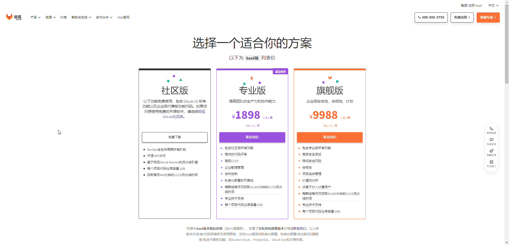
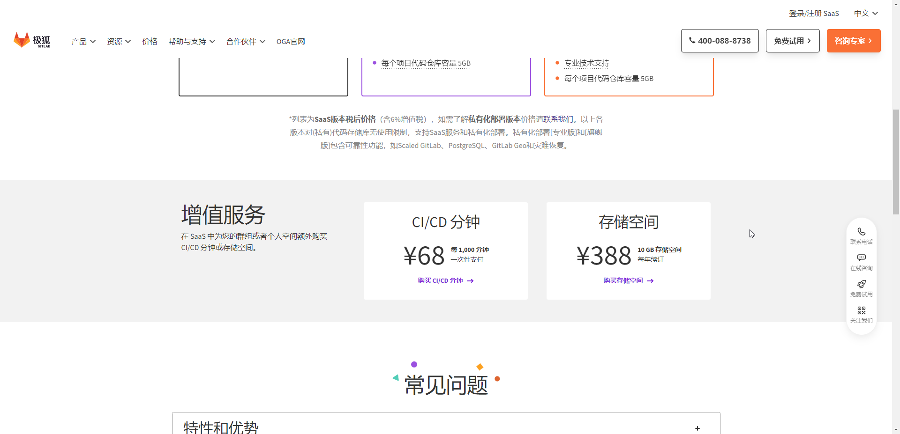
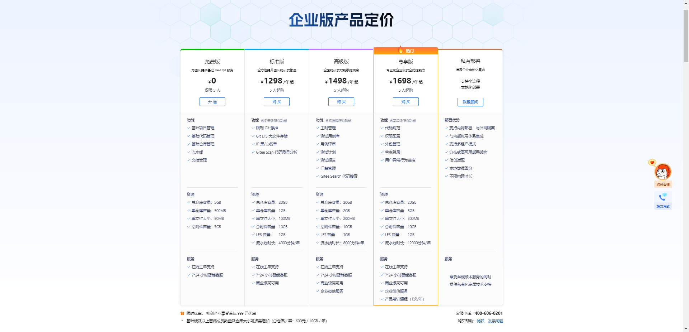

# 极狐GitLab 与 码云Gitee 价格对比

## 说明

1. 此处的 GitLab 指的是国内版 GitLab：[极狐 GitLab](https://jihulab.com)
2. 价格对比时间：2023-07-10
3. 极狐 GitLab 价格：https://gitlab.cn/pricing
4. 码云 Gitee 价格：https://gitee.com/enterprises/price
5. 极狐 GitLab 目前只能查询到 社区版、专业版、旗舰版，如果流水线不够，可单独购买流水线时长
6. 码云 Gitee 目前有 免费版、标准版、高级版、尊享版、私有部署（私有部署新发布，截止 2023-07-10，不足一年）

## 价格对比

| 免费版      | 码云Gitee           | 极狐GitLab                                                                                                   |
|----------|-------------------|------------------------------------------------------------------------------------------------------------|
| 总仓库容量    | 5GB               | 未说明                                                                                                        |
| 单个仓库最大容量 | 500MB             | 2G                                                                                                         |
| 单文件大小    | 50MB              | 未说明                                                                                                        |
| 总附件容量    | 3GB               | 未说明                                                                                                        |
| 流水线      | 1000 分钟/约 左右（不确定） | 页面显示每个群组/用户开源项目是 400分钟/月，但是消费因子是 [1/125](https://forum.gitlab.cn/t/topic/1527)，实际上开源时长为 400*125=50000 分钟/月 |
| 团队人数     | 5 人               | 未说明                                                                                                        |

|          | 码云Gitee：标准版                                         | 极狐GitLab：专业版                                        |
|----------|-----------------------------------------------------|-----------------------------------------------------|
| 价格       | 1298/<strong>5人</strong>/年 | 1898/人/年                                            |
| 总仓库容量    | 20GB                                                | 未说明                                                 |
| 单个仓库最大容量 | 1GB                                                 | 5G                                                  |
| 单文件大小    | 100MB                                               | 未说明                                                 |
| 总附件容量    | 10GB                                                | 未说明                                                 |
| LFS 容量   | 1GB                                                 | 未说明                                                 |
| 流水线      | 4000分钟/<strong>年</strong>  | 10000分钟/<strong>月</strong> |
| 流水线单价    | 3.0817 分钟/元                                         | 63.2244 分钟/元                                        |

|          | 码云Gitee：旗舰版                                         | 极狐GitLab：旗舰版                                        |
|----------|-----------------------------------------------------|-----------------------------------------------------|
| 价格       | 1498/<strong>5人</strong>/年 | 9988/人/年                                            |
| 总仓库容量    | 20GB                                                | 未说明                                                 |
| 单个仓库最大容量 | 2GB                                                 | 5G                                                  |
| 单文件大小    | 200MB                                               | 未说明                                                 |
| 总附件容量    | 10GB                                                | 未说明                                                 |
| LFS 容量   | 1GB                                                 | 未说明                                                 |
| 流水线      | 8000分钟/<strong>年</strong>  | 50000分钟/<strong>月</strong> |
| 流水线单价    | 5.3405 分钟/元                                         | 60.0721 分钟/元                                        |

|          | 码云Gitee：尊享版                                         | 极狐GitLab：旗舰版                                        |
|----------|-----------------------------------------------------|-----------------------------------------------------|
| 价格       | 1698/<strong>5人</strong>/年 | 9988/人/年                                            |
| 总仓库容量    | 20GB                                                | 未说明                                                 |
| 单个仓库最大容量 | 3GB                                                 | 5G                                                  |
| 单文件大小    | 300MB                                               | 未说明                                                 |
| 总附件容量    | 10GB                                                | 未说明                                                 |
| LFS 容量   | 1GB                                                 | 未说明                                                 |
| 流水线      | 12000分钟/<strong>年</strong> | 50000分钟/<strong>月</strong> |
| 流水线单价    | 7.0671 分钟/元                                         | 60.0721 分钟/元                                        |

## 总结

1. 企业与用户，从用户席位上看，码云Gitee 便宜
2. 企业与用户，从流水线时长上看，极狐GitLab 便宜。增值服务：每 1000分钟 需要 68元，增加服务单价 14.7059 分钟/元
3. 个人用户，从流水线时长上看，开源项目 极狐GitLab 更多

## 资料

1. 极狐GitLab
   
   
2. 码云Gitee
   
