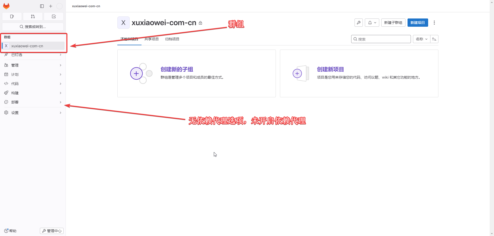
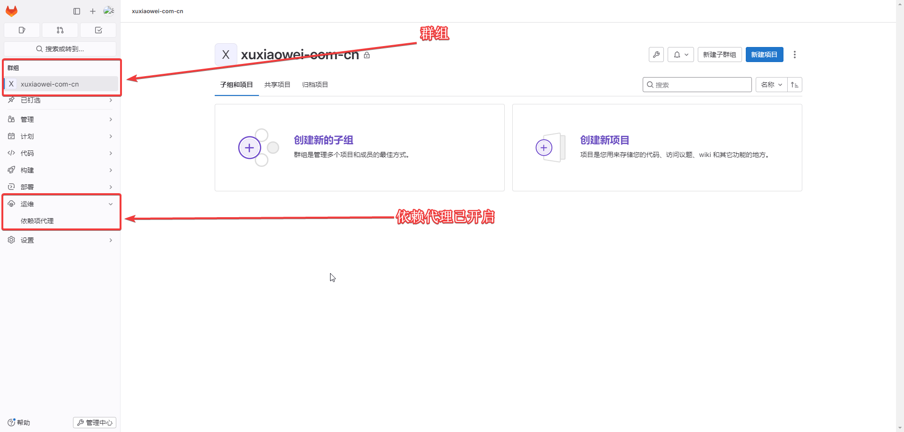
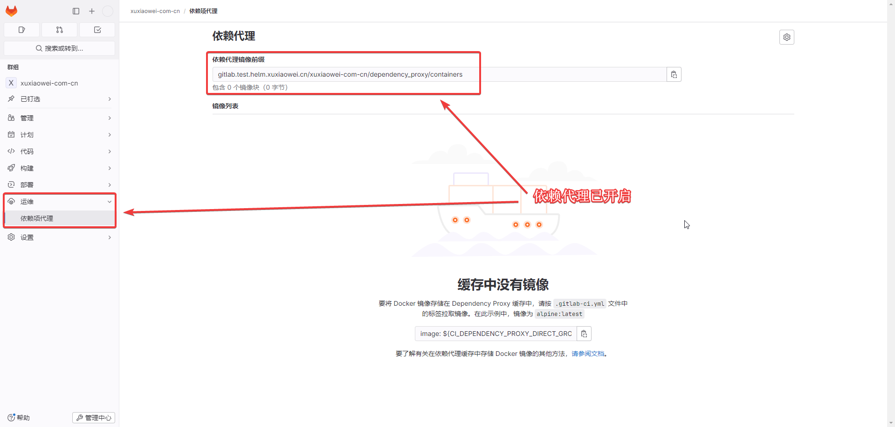
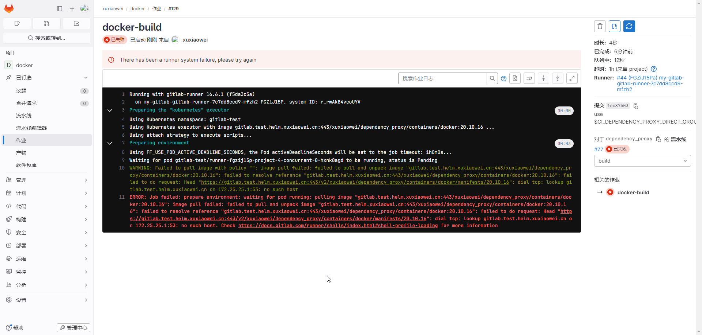
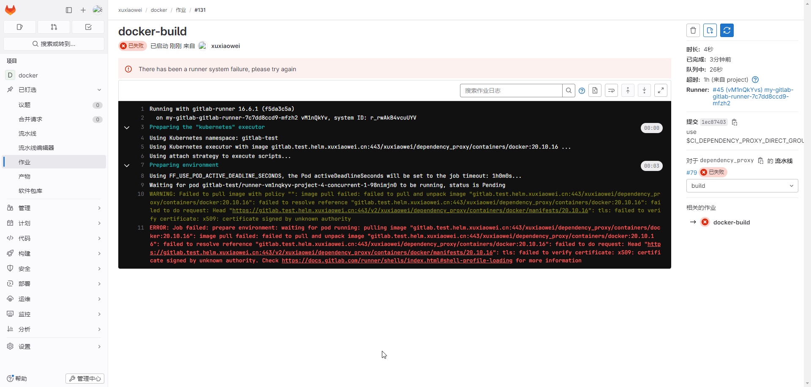

# gitlab 启用 依赖代理功能（未完成）

## 文档

1. [依赖代理](https://docs.gitlab.cn/jh/user/packages/dependency_proxy/index.html)
2. [管理 GitLab 依赖代理](https://docs.gitlab.cn/jh/administration/packages/dependency_proxy.html)
3. [加快作业执行速度](https://docs.gitlab.cn/runner/configuration/speed_up_job_execution.html)
4. [构建容器镜像并将其推送到容器镜像库](https://docs.gitlab.cn/jh/user/packages/container_registry/build_and_push_images.html)
5. [gitlab artifacthub](https://artifacthub.io/packages/helm/gitlab/gitlab?modal=values)

## 配置

### 默认依赖代理是关闭的

不同版本的 gitlab 菜单可能存在差异



### 开启依赖代理

1. 导出 helm gitlab 配置

    ```shell
    # 将已配置的值导出到文件中
    helm -n gitlab-test get values my-gitlab > my-gitlab.yaml
    ```

2. 更新配置

   ```shell
   helm upgrade -n gitlab-test --install my-gitlab gitlab/gitlab --timeout 600s -f my-gitlab.yaml --set global.appConfig.dependencyProxy.enabled=true
   ```

3. 查看开启结果

   不同版本的 gitlab 菜单可能存在差异

   
   

### 使用

1. 原始配置

   ```yaml
   docker-build:
     image: docker:20.10.16
     stage: build
     variables:
       DOCKER_HOST: tcp://docker:2375
       DOCKER_TLS_CERTDIR: ""
     services:
       - docker:20.10.16-dind
   ```

2. 使用群组依赖代理

   ```yaml
   # 项目地址：https://gitlab.test.helm.xuxiaowei.cn/xuxiaowei/docker
   # CI_DEPENDENCY_PROXY_DIRECT_GROUP_IMAGE_PREFIX：代表群组环境变量，也可直接使用 gitlab.test.helm.xuxiaowei.cn/xuxiaowei/dependency_proxy/containers
   docker-build:
     image: ${CI_DEPENDENCY_PROXY_DIRECT_GROUP_IMAGE_PREFIX}/docker:20.10.16
     stage: build
     variables:
       DOCKER_HOST: tcp://docker:2375
       DOCKER_TLS_CERTDIR: ""
     services:
       - ${CI_DEPENDENCY_PROXY_DIRECT_GROUP_IMAGE_PREFIX}/docker:20.10.16-dind
   ```

### 无法解析域名

1. 问题

   

2. 原因

   k8s 工作节点无法解析 gitlab 域名，需要在 k8s 所有工作节点 的 宿主机 增加本机 hosts 解析

3. 解决

   ```shell
   [root@anolis-7-7 ~]# cat /etc/hosts
   127.0.0.1   localhost localhost.localdomain localhost4 localhost4.localdomain4
   ::1         localhost localhost.localdomain localhost6 localhost6.localdomain6
   
   172.25.25.31 	anolis-7-7
   
   172.25.25.32 	gitlab.test.helm.xuxiaowei.cn
   
   [root@anolis-7-7 ~]# 
   ```

   ```shell
   [root@anolis-7-9 ~]# cat /etc/hosts
   127.0.0.1   localhost localhost.localdomain localhost4 localhost4.localdomain4
   ::1         localhost localhost.localdomain localhost6 localhost6.localdomain6
   
   172.25.25.32 	anolis-7-9
   
   172.25.25.32 	gitlab.test.helm.xuxiaowei.cn
   
   [root@anolis-7-9 ~]# 
   ```

### 域名证书信任

1. 问题

   

2. 原因
   
   域名证书无法验证
   
3. 解决
