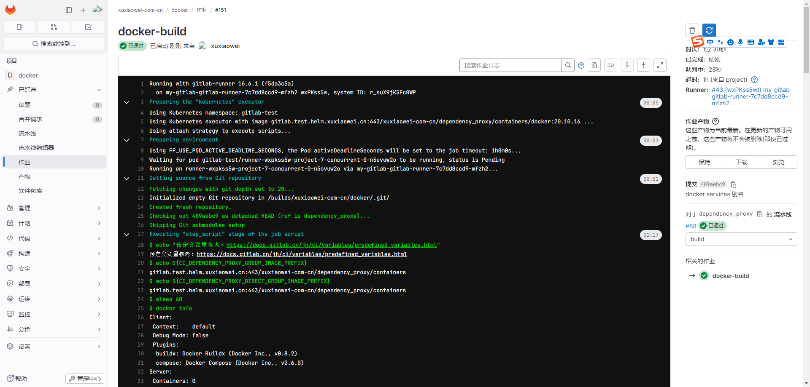

# gitlab 启用 依赖代理功能（未完成）

## 文档

1. [依赖代理](https://docs.gitlab.cn/jh/user/packages/dependency_proxy/index.html)
2. [管理 GitLab 依赖代理](https://docs.gitlab.cn/jh/administration/packages/dependency_proxy.html)
3. [加快作业执行速度](https://docs.gitlab.cn/runner/configuration/speed_up_job_execution.html)
4. [构建容器镜像并将其推送到容器镜像库](https://docs.gitlab.cn/jh/user/packages/container_registry/build_and_push_images.html)
5. [gitlab artifacthub](https://artifacthub.io/packages/helm/gitlab/gitlab?modal=values)
6. [镜像](https://kubernetes.io/zh-cn/docs/concepts/containers/images/)

## 说明

该功能只能在群组下的项目中使用

## 配置

### 默认依赖代理是关闭的

不同版本的 gitlab 菜单可能存在差异


### 开启依赖代理

1. 导出 helm gitlab 配置

    ```shell
    # 将已配置的值导出到文件中
    helm -n gitlab-test get values my-gitlab > my-gitlab.yaml
    ```

2. 更新配置

   ```shell
   helm upgrade -n gitlab-test --install my-gitlab gitlab/gitlab --timeout 600s -f my-gitlab.yaml --set global.appConfig.dependencyProxy.enabled=true
   ```

3. 查看开启结果

   不同版本的 gitlab 菜单可能存在差异

   
   

### 使用

1. 原始配置

   ```yaml
   docker-build:
     image: docker:20.10.16
     stage: build
     variables:
       DOCKER_HOST: tcp://docker:2375
       DOCKER_TLS_CERTDIR: ""
     services:
       - docker:20.10.16-dind
   ```

2. 使用群组依赖代理

   ```yaml
   # 项目地址：https://gitlab.test.helm.xuxiaowei.cn/xuxiaowei/docker
   # CI_DEPENDENCY_PROXY_DIRECT_GROUP_IMAGE_PREFIX：代表群组环境变量，也可直接使用 gitlab.test.helm.xuxiaowei.cn/xuxiaowei/dependency_proxy/containers
   docker-build:
     image: ${CI_DEPENDENCY_PROXY_DIRECT_GROUP_IMAGE_PREFIX}/docker:20.10.16
     stage: build
     variables:
       DOCKER_HOST: tcp://docker:2375
       DOCKER_TLS_CERTDIR: ""
     services:
       - ${CI_DEPENDENCY_PROXY_DIRECT_GROUP_IMAGE_PREFIX}/docker:20.10.16-dind
   ```

### 无法解析域名

1. 问题

   

2. 原因

   k8s 工作节点无法解析 gitlab 域名，需要在 k8s 所有工作节点 的 宿主机 增加本机 hosts 解析

3. 解决（<strong><font color="red">在所有工作节点上操作</font></strong>）

   增加 gitlab 域名 host

   ```shell
   [root@anolis-7-7 ~]# cat /etc/hosts
   127.0.0.1   localhost localhost.localdomain localhost4 localhost4.localdomain4
   ::1         localhost localhost.localdomain localhost6 localhost6.localdomain6
   
   172.25.25.31 	anolis-7-7
   
   172.25.25.32 	gitlab.test.helm.xuxiaowei.cn
   
   [root@anolis-7-7 ~]# 
   ```

   ```shell
   [root@anolis-7-9 ~]# cat /etc/hosts
   127.0.0.1   localhost localhost.localdomain localhost4 localhost4.localdomain4
   ::1         localhost localhost.localdomain localhost6 localhost6.localdomain6
   
   172.25.25.32 	anolis-7-9
   
   172.25.25.32 	gitlab.test.helm.xuxiaowei.cn
   
   [root@anolis-7-9 ~]# 
   ```

### 域名证书信任

1. 问题

   

2. 原因

    1. 域名证书无法验证

3. 解决

    1. 新建群组项目，在群组中的项目测试

    2. 查看 webservice 端口

        ```shell
        kubectl -n gitlab-test get svc | grep webservice
        ```

       记录下方的 IP 10.110.211.99，端口 8080

        ```shell
        [root@anolis-7-9 ~]# kubectl -n gitlab-test get svc | grep webservice
        my-gitlab-webservice-default                 ClusterIP      10.110.211.99    <none>        8080/TCP,8181/TCP,8083/TCP                6d3h
        [root@anolis-7-9 ~]#
        ```

    3. 创建域名配置文件夹（<strong><font color="red">在所有工作节点上操作</font></strong>）

         ```shell
         mkdir -p /etc/containerd/certs.d/gitlab.test.helm.xuxiaowei.cn
         ```

    4. 创建域名配置文件，使用上方 webservice 的 IP、端口（<strong><font color="red">在所有工作节点上操作</font></strong>）

        ```shell
        cat > /etc/containerd/certs.d/gitlab.test.helm.xuxiaowei.cn/hosts.toml << EOF
        server = "https://gitlab.test.helm.xuxiaowei.cn"
        [host."http://10.110.211.99:8080"]
          capabilities = ["pull", "resolve"]
          # 跳过证书验证
          skip_verify = true
        
        EOF
        
        cat /etc/containerd/certs.d/gitlab.test.helm.xuxiaowei.cn/hosts.toml
        ```

    5. 修改 containerd 配置文件 /etc/containerd/config.toml，结果如下（<strong><font color="red">
       在所有工作节点上操作</font></strong>）

       ```shell
            [plugins."io.containerd.grpc.v1.cri".registry]
              config_path = "/etc/containerd/certs.d"
        ```

    6. 重启 containerd（<strong><font color="red">在所有工作节点上操作</font></strong>）

        ```shell
        systemctl restart containerd
        ```

4. 查看结果

   

   ```shell
   # 节选
   [root@anolis-7-9 ~]# kubectl -n gitlab-test describe pod runner-wxpkss5w-project-7-concurrent-0-n5ovuw2o 
   ...
   Events:
     Type    Reason     Age   From               Message
     ----    ------     ----  ----               -------
     Normal  Scheduled  3s    default-scheduler  Successfully assigned gitlab-test/runner-wxpkss5w-project-7-concurrent-0-n5ovuw2o to anolis-7-7
     Normal  Pulled     3s    kubelet            Container image "registry.gitlab.com/gitlab-org/gitlab-runner/gitlab-runner-helper:x86_64-f5da3c5a" already present on machine
     Normal  Created    3s    kubelet            Created container init-permissions
     Normal  Started    2s    kubelet            Started container init-permissions
     Normal  Pulled     1s    kubelet            Container image "gitlab.test.helm.xuxiaowei.cn:443/xuxiaowei-com-cn/dependency_proxy/containers/docker:20.10.16" already present on machine
     Normal  Created    1s    kubelet            Created container build
     Normal  Started    1s    kubelet            Started container build
     Normal  Pulled     1s    kubelet            Container image "registry.gitlab.com/gitlab-org/gitlab-runner/gitlab-runner-helper:x86_64-f5da3c5a" already present on machine
     Normal  Created    1s    kubelet            Created container helper
     Normal  Started    1s    kubelet            Started container helper
     Normal  Pulled     1s    kubelet            Container image "gitlab.test.helm.xuxiaowei.cn:443/xuxiaowei-com-cn/dependency_proxy/containers/docker:20.10.16-dind" already present on machine
     Normal  Created    1s    kubelet            Created container svc-0
     Normal  Started    1s    kubelet            Started container svc-0
   [root@anolis-7-9 ~]# 
   ```
