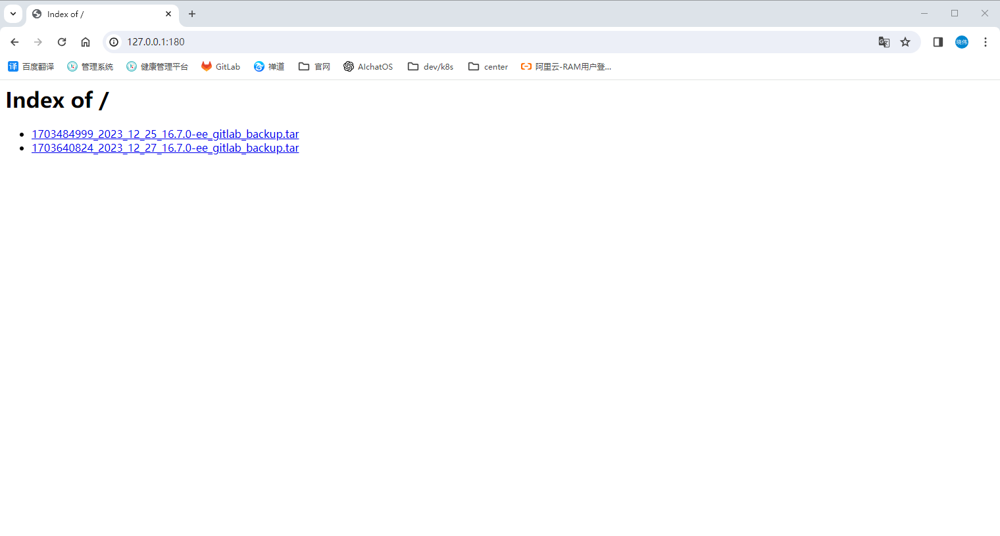

# GitLab 在 helm 中恢复数据

恢复 GitLab 历史备份数据

## 文档

1. [恢复 GitLab 安装实例](https://docs.gitlab.cn/charts/backup-restore/restore.html)

## 本实例数据恢复

如果当前 GitLab 实例数据被误删、实例异常，可通过历史备份进行数据恢复

### 记下数据库客户端的当前副本数，供后续重启使用

```shell
# -n gitlab-test：代表命名空间
# release=my-gitlab：代表 helm 安装 gitlab 时的名称
# -lapp=sidekiq：代表 sidekiq-all-in-1-v2 Deployment，默认 1 个副本
# -lapp=webservice：代表 webservice-default Deployment，默认 2 个副本
# -lapp=prometheus：代表 prometheus-server Deployment，默认 1 个副本
kubectl -n gitlab-test get deploy -lapp=sidekiq,release=my-gitlab -o jsonpath='{.items[].spec.replicas}{"\n"}'
kubectl -n gitlab-test get deploy -lapp=webservice,release=my-gitlab -o jsonpath='{.items[].spec.replicas}{"\n"}'
kubectl -n gitlab-test get deploy -lapp=prometheus,release=my-gitlab -o jsonpath='{.items[].spec.replicas}{"\n"}'
```

### 停止数据库的客户端，防止锁干扰恢复过程

```shell
kubectl -n gitlab-test scale deploy -lapp=sidekiq,release=my-gitlab --replicas=0
kubectl -n gitlab-test scale deploy -lapp=webservice,release=my-gitlab --replicas=0
kubectl -n gitlab-test scale deploy -lapp=prometheus,release=my-gitlab --replicas=0
```

### 查看 Toolbox pod

```shell
kubectl -n gitlab-test get pods -lrelease=my-gitlab,app=toolbox
```

```shell
# manual-backup-1-xxx：代表个人备份的 pod，无需关注
# my-gitlab-toolbox-backup-xxx-xxx：代表定时任务备份的 pod，无需关注
# my-gitlab-toolbox-xxx-xxx：代表 Toolbox pod 容器，需要记录此名称，用于后续使用
[root@anolis-7-9 ~]# kubectl -n gitlab-test get pods -lrelease=my-gitlab,app=toolbox
NAME                                      READY   STATUS      RESTARTS   AGE
manual-backup-1-9db78                     0/1     Completed   0          46h
my-gitlab-toolbox-5b7c4f8c6b-zccrv        1/1     Running     0          8m46s
my-gitlab-toolbox-backup-28393980-f9m8h   0/1     Completed   0          3h3m
[root@anolis-7-9 ~]# 
```

### 直接使用备份数据的 URL 链接恢复数据（推荐）

#### 备份数据目录

```shell
[root@anolis-7-9 ~]# ll -h /gitlab-test/my-gitlab-minio-pv/gitlab-backups/
total 11M
-rw-rw-r-- 1 1000 1000 5.1M Dec 25 14:18 1703484999_2023_12_25_16.7.0-ee_gitlab_backup.tar
-rw-r--r-- 1 1000 1000 5.1M Dec 27 09:38 1703640824_2023_12_27_16.7.0-ee_gitlab_backup.tar
[root@anolis-7-9 ~]# 
```

#### 使用 httpd 创建静态资源服务

使用其他方式创建静态资源服务也可以

```shell
docker run \
  --restart=always \
  -itd \
  --privileged=true \
  --name 2.4.48 \
  -p 180:80 \
  -v /gitlab-test/my-gitlab-minio-pv/gitlab-backups/:/usr/local/apache2/htdocs/ \
  -v /etc/localtime:/etc/localtime \
  -d httpd:2.4.48
```

#### 查看静态资源

- 访问 httpd

  

#### 使用静态资源 URL 恢复数据

```shell
kubectl -n gitlab-test exec my-gitlab-toolbox-5b7c4f8c6b-zccrv -it -- backup-utility --restore -f http://172.25.25.32:180/1703640824_2023_12_27_16.7.0-ee_gitlab_backup.tar
```

成功示例

```shell
[root@anolis-7-9 ~]# kubectl -n gitlab-test exec my-gitlab-toolbox-5b7c4f8c6b-zccrv -it -- backup-utility --restore -f http://172.25.25.32:180/1703640824_2023_12_27_16.7.0-ee_gitlab_backup.tar
Defaulted container "toolbox" out of: toolbox, certificates (init), configure (init)
Downloading from http://172.25.25.32:180/1703640824_2023_12_27_16.7.0-ee_gitlab_backup.tar
############################################################################################################################################################ 100.0%
Unpacking backup
2023-12-27 12:28:10 +0800 -- Restoring database ... 
2023-12-27 12:28:10 +0800 -- Be sure to stop Puma, Sidekiq, and any other process that
connects to the database before proceeding. For Omnibus
installs, see the following link for more information:
https://docs.gitlab.com/ee/raketasks/backup_restore.html#restore-for-omnibus-gitlab-installations

Before restoring the database, we will remove all existing
tables to avoid future upgrade problems. Be aware that if you have
custom tables in the GitLab database these tables and all data will be
removed.
Do you want to continue (yes/no)? yes
Removing all tables. Press `Ctrl-C` within 5 seconds to abort
2023-12-27 12:28:32 +0800 -- Cleaning the database ... 
2023-12-27 12:28:35 +0800 -- done
Restoring PostgreSQL database gitlabhq_production ... ERROR:  must be owner of extension pg_trgm
ERROR:  must be owner of extension btree_gist
ERROR:  must be owner of extension pg_trgm
SET
 set_config 
------------
...
[DONE]
Source backup for the database ci doesn't exist. Skipping the task
2023-12-27 12:28:53 +0800 -- Restoring database ... done
2023-12-27 12:28:53 +0800 -- Deleting backup and restore PID file ... done
2023-12-27 12:29:08 +0800 -- Restoring repositories ... 
{"command":"restore","gl_project_path":"xuxiaowei-com-cn.wiki","level":"info","msg":"started restore","pid":65,"relative_path":"@groups/19/58/19581e27de7ced00ff1ce50b2047e7a567c76b1cbaebabe5ef03f7c3017bb5b7.wiki.git","storage_name":"default","time":"2023-12-27T04:29:08.837Z"}
...
2023-12-27 12:29:09 +0800 -- Restoring repositories ... done
2023-12-27 12:29:09 +0800 -- Deleting backup and restore PID file ... done
Restoring artifacts ...
done
Restoring packages ...
Restoring pages ...
[root@anolis-7-9 ~]# 
```

#### 恢复副本数量

- 使用上述命令记录的副本数进行副本恢复

```shell
kubectl -n gitlab-test scale deploy -lapp=sidekiq,release=my-gitlab --replicas=1
kubectl -n gitlab-test scale deploy -lapp=webservice,release=my-gitlab --replicas=2
kubectl -n gitlab-test scale deploy -lapp=prometheus,release=my-gitlab --replicas=1
```

### 复制备份数据到容器 Toolbox pod 内进行数据恢复（不推荐）

不推荐的原因：如果备份数据过大（例如：超过 10G），可能会存在没有复制完成的情况，导致无法解压备份数据，无法恢复

#### 复制备份数据到容器 Toolbox pod 内

1. 查看历史备份数据
    ```shell
    [root@anolis-7-9 ~]# ll -h /gitlab-test/my-gitlab-minio-pv/gitlab-backups/
    total 11M
    -rw-rw-r-- 1 1000 1000 5.1M Dec 25 14:18 1703484999_2023_12_25_16.7.0-ee_gitlab_backup.tar
    -rw-r--r-- 1 1000 1000 5.1M Dec 27 09:38 1703640824_2023_12_27_16.7.0-ee_gitlab_backup.tar
    [root@anolis-7-9 ~]# 
    ```

2. 复制到容器 Toolbox pod 内的 /srv/gitlab/tmp/backups 目录
    ```shell
    [root@anolis-7-9 ~]# kubectl -n gitlab-test cp /gitlab-test/my-gitlab-minio-pv/gitlab-backups/1703640824_2023_12_27_16.7.0-ee_gitlab_backup.tar my-gitlab-toolbox-5b7c4f8c6b-zccrv:/srv/gitlab/tmp/backups
    Defaulted container "toolbox" out of: toolbox, certificates (init), configure (init)
    [root@anolis-7-9 ~]# 
    [root@anolis-7-9 ~]# kubectl -n gitlab-test exec -it my-gitlab-toolbox-5b7c4f8c6b-zccrv ls /srv/gitlab/tmp/backups
    kubectl exec [POD] [COMMAND] is DEPRECATED and will be removed in a future version. Use kubectl exec [POD] -- [COMMAND] instead.
    Defaulted container "toolbox" out of: toolbox, certificates (init), configure (init)
    1703640824_2023_12_27_16.7.0-ee_gitlab_backup.tar  gitlab-shell
    [root@anolis-7-9 ~]#
    ```

#### 恢复数据

- 使用 <strong><font color="red">`容器内`</font></strong>
  <strong><font color="red">`/srv/gitlab/tmp/backups`</font></strong> 目录下的部分文件名，
  格式：`<timestamp>_<version>`

    ```shell
    kubectl -n gitlab-test exec my-gitlab-toolbox-5b7c4f8c6b-zccrv -it -- backup-utility --restore -t 1703640824_2023_12_27_16.7.0-ee
    ```

- 也可以使用 <strong><font color="red">`file:///<path>`</font></strong> 指定文件路径绝对路径
    ```shell
    kubectl -n gitlab-test exec my-gitlab-toolbox-5b7c4f8c6b-zccrv -it -- backup-utility --restore -t file:///home/git/1703640824_2023_12_27_16.7.0-ee_gitlab_backup.tar
    ```

成功示例

```shell
[root@anolis-7-9 ~]# kubectl -n gitlab-test exec my-gitlab-toolbox-5b7c4f8c6b-zccrv -it -- backup-utility --restore -t 1703640824_2023_12_27_16.7.0-ee
Unpacking backup
2023-12-27 12:38:22 +0800 -- Restoring database ... 
2023-12-27 12:38:22 +0800 -- Be sure to stop Puma, Sidekiq, and any other process that
connects to the database before proceeding. For Omnibus
installs, see the following link for more information:
https://docs.gitlab.com/ee/raketasks/backup_restore.html#restore-for-omnibus-gitlab-installations

Before restoring the database, we will remove all existing
tables to avoid future upgrade problems. Be aware that if you have
custom tables in the GitLab database these tables and all data will be
removed.
Do you want to continue (yes/no)? yes
Removing all tables. Press `Ctrl-C` within 5 seconds to abort
2023-12-27 12:41:21 +0800 -- Cleaning the database ... 
2023-12-27 12:41:23 +0800 -- done
Restoring PostgreSQL database gitlabhq_production ... ERROR:  must be owner of extension pg_trgm
ERROR:  must be owner of extension btree_gist
ERROR:  must be owner of extension pg_trgm
SET
 set_config 
------------
...
[DONE]
Source backup for the database ci doesn't exist. Skipping the task
2023-12-27 12:41:37 +0800 -- Restoring database ... done
2023-12-27 12:41:37 +0800 -- Deleting backup and restore PID file ... done
2023-12-27 12:41:52 +0800 -- Restoring repositories ... 
{"command":"restore","gl_project_path":"xuxiaowei-com-cn.wiki","level":"info","msg":"started restore","pid":236,"relative_path":"@groups/19/58/19581e27de7ced00ff1ce50b2047e7a567c76b1cbaebabe5ef03f7c3017bb5b7.wiki.git","storage_name":"default","time":"2023-12-27T04:41:52.584Z"}
...
2023-12-27 12:41:53 +0800 -- Restoring repositories ... done
2023-12-27 12:41:53 +0800 -- Deleting backup and restore PID file ... done
Restoring artifacts ...
done
Restoring packages ...
Restoring pages ...
[root@anolis-7-9 ~]# 
```

#### 恢复副本数量

- 使用上述命令记录的副本数进行副本恢复

```shell
kubectl -n gitlab-test scale deploy -lapp=sidekiq,release=my-gitlab --replicas=1
kubectl -n gitlab-test scale deploy -lapp=webservice,release=my-gitlab --replicas=2
kubectl -n gitlab-test scale deploy -lapp=prometheus,release=my-gitlab --replicas=1
```

## 问题

### 自定义 toolbox Deployment hostAliases

#### 问题

```shell
2023-12-27 11:48:42 +0800 -- Restoring repositories ... done
2023-12-27 11:48:42 +0800 -- Deleting backup and restore PID file ... done
Restoring artifacts ...
[Error] ERROR: [Errno -2] Name or service not known
ERROR: Connection Error: Error resolving a server hostname.
Please check the servers address specified in 'host_base', 'host_bucket', 'cloudfront_host', 'website_endpoint'

sync existing of artifacts failed
command terminated with exit code 1
```

#### 解决方案

```shell
kubectl -n gitlab-test edit deployments.apps my-gitlab-toolbox
```

```yaml
      # 添加 MinIO 对象储存的 host 解析
      hostAliases:
        - hostnames:
            - minio.test.helm.xuxiaowei.cn
          ip: 172.25.25.32
```

### 信任 MinIO 对象储存域名证书

#### 问题

```shell
Restoring artifacts ...
[Error] ERROR: SSL certificate verification failure: [SSL: CERTIFICATE_VERIFY_FAILED] certificate verify failed: unable to get local issuer certificate (_ssl.c:1129)

sync existing of artifacts failed
command terminated with exit code 1
```

#### 解决办法

```shell
kubectl -n gitlab-test edit deployments.apps my-gitlab-toolbox
```

```yaml
      containers:
        # 不验证证书
        - args:
            - /bin/bash
            - -c
            - cp -v -r -L /etc/gitlab/.s3cfg $HOME/.s3cfg && echo "check_ssl_certificate=false" >> $HOME/.s3cfg && while sleep 3600; do :; done
```
