# gitlab maven 仓库使用

## 文档

1. [软件包库中的 Maven 包](https://docs.gitlab.cn/jh/user/packages/maven_repository/#%E8%BD%AF%E4%BB%B6%E5%8C%85%E5%BA%93%E4%B8%AD%E7%9A%84-maven-%E5%8C%85)

## Maven 仓库类型

### [项目级 Maven 端点](https://docs.gitlab.cn/jh/user/packages/maven_repository/#%E9%A1%B9%E7%9B%AE%E7%BA%A7-maven-%E7%AB%AF%E7%82%B9)

```xml

<project>
    <repositories>
        <repository>
            <id>gitlab-maven</id>
            <!-- PROJECT_ID：填写项目ID，查看方式见下方 -->
            <!-- PROJECT_ID：如果仅在 GitLab Runner 中运行时，可使用环境变量 ${CI_PROJECT_ID} 代替 -->
            <!-- https://gitlab.example.com/api/v4：如果仅在 GitLab Runner 中运行时，可使用环境变量 ${CI_API_V4_URL} 代替 -->
            <url>https://gitlab.example.com/api/v4/projects/PROJECT_ID/packages/maven</url>
        </repository>
    </repositories>
    <distributionManagement>
        <repository>
            <id>gitlab-maven</id>
            <!-- PROJECT_ID：填写项目ID，查看方式见下方 -->
            <!-- PROJECT_ID：如果仅在 GitLab Runner 中运行时，可使用环境变量 ${CI_PROJECT_ID} 代替 -->
            <!-- https://gitlab.example.com/api/v4：如果仅在 GitLab Runner 中运行时，可使用环境变量 ${CI_API_V4_URL} 代替 -->
            <url>https://gitlab.example.com/api/v4/projects/PROJECT_ID/packages/maven</url>
        </repository>
        <snapshotRepository>
            <id>gitlab-maven</id>
            <!-- PROJECT_ID：填写项目ID，查看方式见下方 -->
            <!-- PROJECT_ID：如果仅在 GitLab Runner 中运行时，可使用环境变量 ${CI_PROJECT_ID} 代替 -->
            <!-- https://gitlab.example.com/api/v4：如果仅在 GitLab Runner 中运行时，可使用环境变量 ${CI_API_V4_URL} 代替 -->
            <url>https://gitlab.example.com/api/v4/projects/PROJECT_ID/packages/maven</url>
        </snapshotRepository>
    </distributionManagement>
</project>
```

### [群组级 Maven 端点](https://docs.gitlab.cn/jh/user/packages/maven_repository/#%E7%BE%A4%E7%BB%84%E7%BA%A7-maven-%E7%AB%AF%E7%82%B9)

```xml

<project>
    <repositories>
        <repository>
            <id>gitlab-maven</id>
            <!-- GROUP_ID：填写群组ID，查看方式见下方 -->
            <!-- https://gitlab.example.com/api/v4：如果仅在 GitLab Runner 中运行时，可使用环境变量 ${CI_API_V4_URL} 代替 -->
            <url>https://gitlab.example.com/api/v4/groups/GROUP_ID/-/packages/maven</url>
        </repository>
    </repositories>
    <distributionManagement>
        <repository>
            <id>gitlab-maven</id>
            <!-- PROJECT_ID：填写项目ID，查看方式见下方 -->
            <!-- PROJECT_ID：如果仅在 GitLab Runner 中运行时，可使用环境变量 ${CI_PROJECT_ID} 代替 -->
            <!-- https://gitlab.example.com/api/v4：如果仅在 GitLab Runner 中运行时，可使用环境变量 ${CI_API_V4_URL} 代替 -->
            <url>https://gitlab.example.com/api/v4/projects/PROJECT_ID/packages/maven</url>
        </repository>
        <snapshotRepository>
            <id>gitlab-maven</id>
            <!-- PROJECT_ID：填写项目ID，查看方式见下方 -->
            <!-- PROJECT_ID：如果仅在 GitLab Runner 中运行时，可使用环境变量 ${CI_PROJECT_ID} 代替 -->
            <!-- https://gitlab.example.com/api/v4：如果仅在 GitLab Runner 中运行时，可使用环境变量 ${CI_API_V4_URL} 代替 -->
            <url>https://gitlab.example.com/api/v4/projects/PROJECT_ID/packages/maven</url>
        </snapshotRepository>
    </distributionManagement>
</project>
```

### [实例级 Maven 端点](https://docs.gitlab.cn/jh/user/packages/maven_repository/#%E5%AE%9E%E4%BE%8B%E7%BA%A7-maven-%E7%AB%AF%E7%82%B9)

```xml

<project>
    <repositories>
        <repository>
            <id>gitlab-maven</id>
            <!-- https://gitlab.example.com/api/v4：如果仅在 GitLab Runner 中运行时，可使用环境变量 ${CI_API_V4_URL} 代替 -->
            <url>https://gitlab.example.com/api/v4/packages/maven</url>
        </repository>
    </repositories>
    <distributionManagement>
        <repository>
            <id>gitlab-maven</id>
            <!-- PROJECT_ID：填写项目ID，查看方式见下方 -->
            <!-- PROJECT_ID：如果仅在 GitLab Runner 中运行时，可使用环境变量 ${CI_PROJECT_ID} 代替 -->
            <!-- https://gitlab.example.com/api/v4：如果仅在 GitLab Runner 中运行时，可使用环境变量 ${CI_API_V4_URL} 代替 -->
            <url>https://gitlab.example.com/api/v4/projects/PROJECT_ID/packages/maven</url>
        </repository>
        <snapshotRepository>
            <id>gitlab-maven</id>
            <!-- PROJECT_ID：填写项目ID，查看方式见下方 -->
            <!-- PROJECT_ID：如果仅在 GitLab Runner 中运行时，可使用环境变量 ${CI_PROJECT_ID} 代替 -->
            <!-- https://gitlab.example.com/api/v4：如果仅在 GitLab Runner 中运行时，可使用环境变量 ${CI_API_V4_URL} 代替 -->
            <url>https://gitlab.example.com/api/v4/projects/PROJECT_ID/packages/maven</url>
        </snapshotRepository>
    </distributionManagement>
</project>
```

## 项目ID

1. 截图来源于不同的 gitlab（gitlab 版本） 中的项目，所以项目ID不同
2. 同一个 gitlab 在不同位置查看到的项目ID是相同的

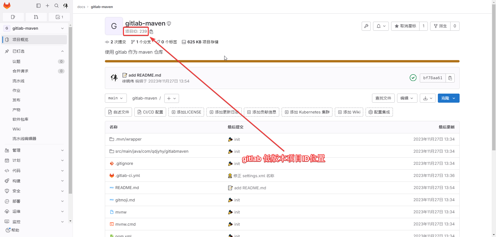
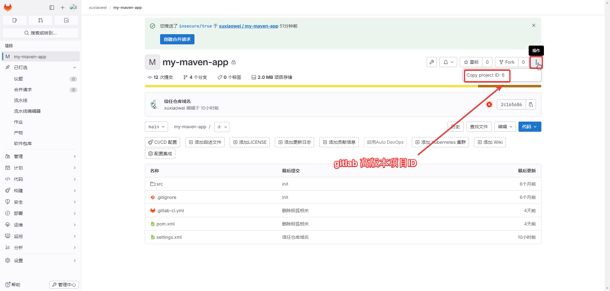
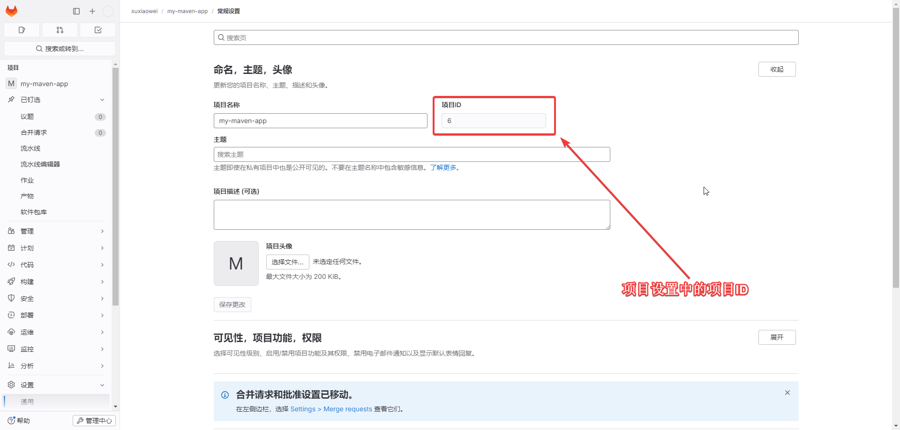

## 群组ID

1. 截图来源于不同的 gitlab（gitlab 版本） 版本中的项目，所以群组ID不同
2. 同一个 gitlab 在不同位置查看到的群组ID是相同的

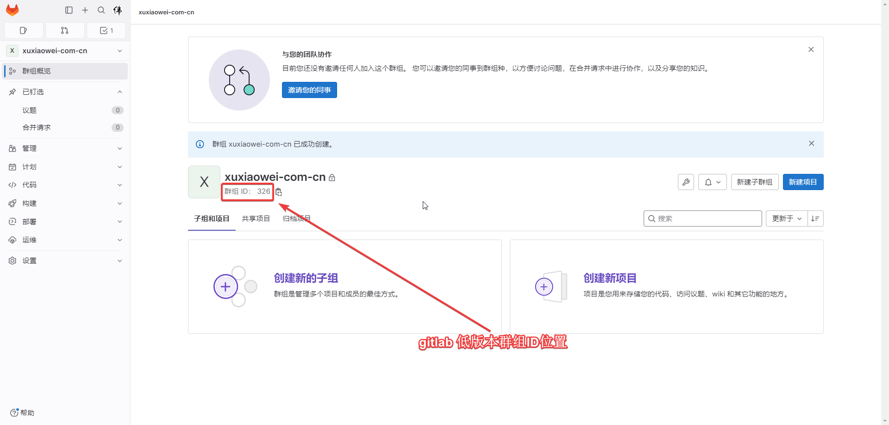
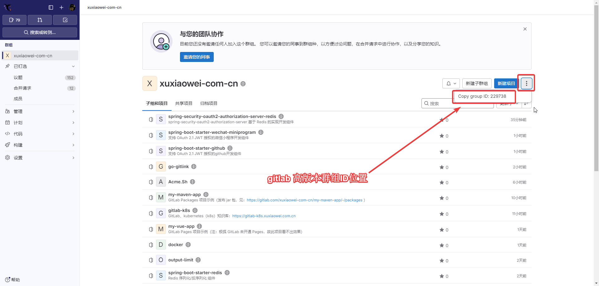
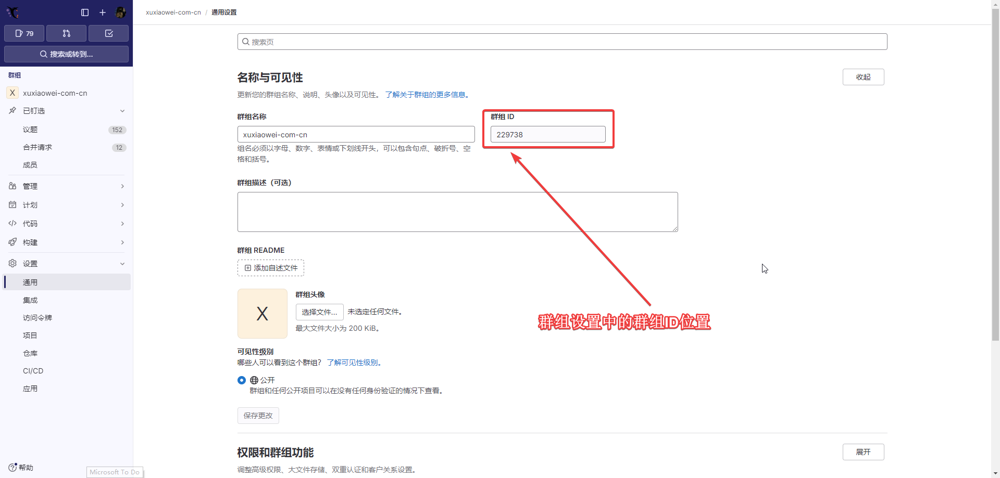

## 认证方式

### [在 Maven 中使用个人访问令牌进行身份验证](https://docs.gitlab.cn/jh/user/packages/maven_repository/#%E5%9C%A8-maven-%E4%B8%AD%E4%BD%BF%E7%94%A8%E4%B8%AA%E4%BA%BA%E8%AE%BF%E9%97%AE%E4%BB%A4%E7%89%8C%E8%BF%9B%E8%A1%8C%E8%BA%AB%E4%BB%BD%E9%AA%8C%E8%AF%81)

```xml

<settings>
    <servers>
        <server>
            <id>gitlab-maven</id>
            <configuration>
                <httpHeaders>
                    <property>
                        <name>Private-Token</name>
                        <!-- 创建 gitlab 个人令牌，替换下方的值 -->
                        <value>REPLACE_WITH_YOUR_PERSONAL_ACCESS_TOKEN</value>
                    </property>
                </httpHeaders>
            </configuration>
        </server>
    </servers>
</settings>
```

### [在 Maven 中使用部署令牌进行身份验证](https://docs.gitlab.cn/jh/user/packages/maven_repository/#%E5%9C%A8-maven-%E4%B8%AD%E4%BD%BF%E7%94%A8%E9%83%A8%E7%BD%B2%E4%BB%A4%E7%89%8C%E8%BF%9B%E8%A1%8C%E8%BA%AB%E4%BB%BD%E9%AA%8C%E8%AF%81)

```xml

<settings>
    <servers>
        <server>
            <id>gitlab-maven</id>
            <configuration>
                <httpHeaders>
                    <property>
                        <name>Deploy-Token</name>
                        <!-- 在仓库中创建部署令牌，替换下方的值 -->
                        <value>REPLACE_WITH_YOUR_DEPLOY_TOKEN</value>
                    </property>
                </httpHeaders>
            </configuration>
        </server>
    </servers>
</settings>
```

### [使用 Maven 中的 CI 作业令牌进行身份验证](https://docs.gitlab.cn/jh/user/packages/maven_repository/#%E4%BD%BF%E7%94%A8-maven-%E4%B8%AD%E7%9A%84-ci-%E4%BD%9C%E4%B8%9A%E4%BB%A4%E7%89%8C%E8%BF%9B%E8%A1%8C%E8%BA%AB%E4%BB%BD%E9%AA%8C%E8%AF%81)

```xml

<settings>
    <servers>
        <server>
            <id>gitlab-maven</id>
            <configuration>
                <httpHeaders>
                    <property>
                        <name>Job-Token</name>
                        <!-- 此用法仅限于在使用 GitLab Runner 中执行使用 -->
                        <!-- 此处取 GitLab Runner 执行时的环境变量，用户无需干预此处的配置 -->
                        <value>${CI_JOB_TOKEN}</value>
                    </property>
                </httpHeaders>
            </configuration>
        </server>
    </servers>
</settings>
```

## 发布 Maven 依赖

1. 项目：https://gitlab.com/xuxiaowei-com-cn/my-maven-app/-/packages/
2. 已发布的依赖：https://gitlab.com/xuxiaowei-com-cn/my-maven-app/-/packages/
3. GitLab Runner 发布日志：https://gitlab.com/xuxiaowei-com-cn/my-maven-app/-/pipelines
4. 认证方式：
   [使用 Maven 中的 CI 作业令牌进行身份验证](https://docs.gitlab.cn/jh/user/packages/maven_repository/#%E4%BD%BF%E7%94%A8-maven-%E4%B8%AD%E7%9A%84-ci-%E4%BD%9C%E4%B8%9A%E4%BB%A4%E7%89%8C%E8%BF%9B%E8%A1%8C%E8%BA%AB%E4%BB%BD%E9%AA%8C%E8%AF%81)
5. 使用的配置
    1. setting.xml 配置
        1. [setting.xml 配置](https://gitlab.com/xuxiaowei-com-cn/my-maven-app/-/blob/main/settings.xml)
        2. [setting.xml 配置 永久链](https://gitlab.com/xuxiaowei-com-cn/my-maven-app/-/blob/70daca317ee7dc8332209812089c15a564bbdeb0/settings.xml)
    2. pom.xml 配置
        1. [pom.xml 配置](https://gitlab.com/xuxiaowei-com-cn/my-maven-app/-/blob/main/pom.xml)
        2. [pom.xml 配置 永久链](https://gitlab.com/xuxiaowei-com-cn/my-maven-app/-/blob/70daca317ee7dc8332209812089c15a564bbdeb0/pom.xml)

## 使用 Maven 依赖

1. 项目：https://gitlab.com/xuxiaowei-com-cn/use-my-maven-app
2. GitLab Runner 打包日志：https://gitlab.com/xuxiaowei-com-cn/use-my-maven-app/-/pipelines
3. 打包失败：
    1. [失败日志](https://gitlab.com/xuxiaowei-com-cn/use-my-maven-app/-/jobs/5818078050)
       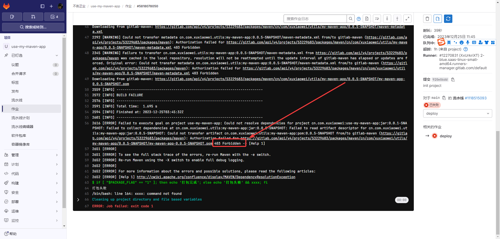
    2. 失败原因：
        1. 没有设置凭证，无法访问非公开的软件包库
        2. 设置了凭证，但该凭证没有权限访问软件包库
4. 成功示例：
    1. `main` 分支：
        1. 代码：https://gitlab.com/xuxiaowei-com-cn/use-my-maven-app/-/tree/6a71d280226ebb4aa16b479bc2b2d7a254f23513
        2. 流水线：https://gitlab.com/xuxiaowei-com-cn/use-my-maven-app/-/pipelines/1118517218
        3. 作业：https://gitlab.com/xuxiaowei-com-cn/use-my-maven-app/-/jobs/5818086715
    2. `delete-server` 分支：
        1. 代码：https://gitlab.com/xuxiaowei-com-cn/use-my-maven-app/-/tree/f493df00dd840f6cc39d89f2adb8e5c44a9ab75e
        2. 流水线：https://gitlab.com/xuxiaowei-com-cn/use-my-maven-app/-/pipelines/1118518272
        3. 作业：https://gitlab.com/xuxiaowei-com-cn/use-my-maven-app/-/jobs/5818091141

### 解决方案1：【允许来自以下项目的 CI 作业令牌访问此项目】

1. 文档依据（注意：中文版可能会比英文版的文档版本低，参见文档右上角）
    1. [限制您项目的作业令牌访问 - 中文](https://docs.gitlab.cn/jh/ci/jobs/ci_job_token.html#%E9%99%90%E5%88%B6%E6%82%A8%E9%A1%B9%E7%9B%AE%E7%9A%84%E4%BD%9C%E4%B8%9A%E4%BB%A4%E7%89%8C%E8%AE%BF%E9%97%AE)
       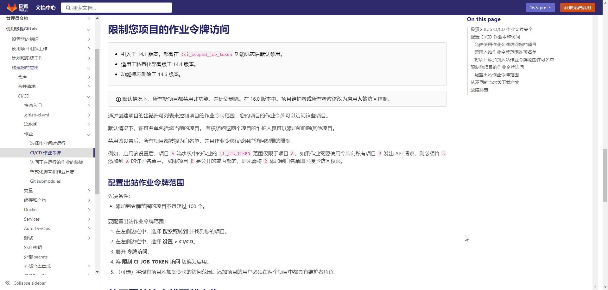
    2. [limit-your-projects-job-token-access - 英文](https://docs.gitlab.com/ee/ci/jobs/ci_job_token.html#limit-your-projects-job-token-access)
       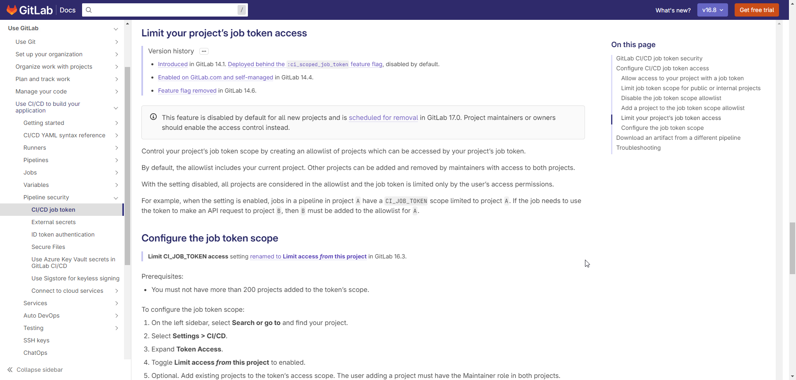
2. 如果你的依赖项目<strong><font color="red">不是</font></strong>公开的，
   软件包库<strong><font color="red">不是</font></strong>公开的，需要使用 `setting.xml` 配置 `server` 标签填写访问凭证
3. 如果使用的方式是
   [使用 Maven 中的 CI 作业令牌进行身份验证](https://docs.gitlab.cn/jh/user/packages/maven_repository/#%E4%BD%BF%E7%94%A8-maven-%E4%B8%AD%E7%9A%84-ci-%E4%BD%9C%E4%B8%9A%E4%BB%A4%E7%89%8C%E8%BF%9B%E8%A1%8C%E8%BA%AB%E4%BB%BD%E9%AA%8C%E8%AF%81)，
   则需要在 被引用的项目（[my-maven-app](https://gitlab.com/xuxiaowei-com-cn/my-maven-app)）中设置【允许来自以下项目的
   CI 作业令牌访问此项目】，填写 引用项目
   （[use-my-maven-app](https://gitlab.com/xuxiaowei-com-cn/use-my-maven-app)）
   的路径（不用填写域名），否则将会提示无权限
4. 设置 【允许来自以下项目的 CI 作业令牌访问此项目】
   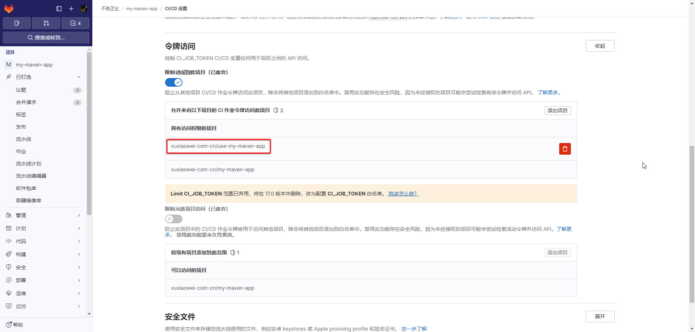

### 解决方案2：不设置 `setting.xml` 的 `server`

1. 如果你的依赖项目<strong><font color="red">是</font></strong>公开的，
   软件包库<strong><font color="red">是</font></strong>公开的，可以不使用 `setting.xml` 配置 `server`，即可访问
2. 如果你配置了 `setting.xml` 配置 `server`，使用方式为
   [使用 Maven 中的 CI 作业令牌进行身份验证](https://docs.gitlab.cn/jh/user/packages/maven_repository/#%E4%BD%BF%E7%94%A8-maven-%E4%B8%AD%E7%9A%84-ci-%E4%BD%9C%E4%B8%9A%E4%BB%A4%E7%89%8C%E8%BF%9B%E8%A1%8C%E8%BA%AB%E4%BB%BD%E9%AA%8C%E8%AF%81)，
   参考上一个解决方案

### 解决方案3：[在 Maven 中使用个人访问令牌进行身份验证](https://docs.gitlab.cn/jh/user/packages/maven_repository/#%E5%9C%A8-maven-%E4%B8%AD%E4%BD%BF%E7%94%A8%E4%B8%AA%E4%BA%BA%E8%AE%BF%E9%97%AE%E4%BB%A4%E7%89%8C%E8%BF%9B%E8%A1%8C%E8%BA%AB%E4%BB%BD%E9%AA%8C%E8%AF%81)

### 解决方案4：[在 Maven 中使用部署令牌进行身份验证](https://docs.gitlab.cn/jh/user/packages/maven_repository/#%E5%9C%A8-maven-%E4%B8%AD%E4%BD%BF%E7%94%A8%E9%83%A8%E7%BD%B2%E4%BB%A4%E7%89%8C%E8%BF%9B%E8%A1%8C%E8%BA%AB%E4%BB%BD%E9%AA%8C%E8%AF%81)

### gitlab 17.0 会删除上述【允许来自以下项目的 CI 作业令牌访问此项目】的，待 gitlab 17.0 发布后，将会提供新方案

## 问题

### maven 证书验证失败

1. 常见于自建 gitlab 中
2. 失败示例
   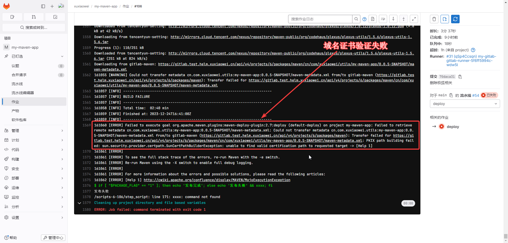
3. 打包时增加参数

| 参数                                   | 解释0           | 说明 |
|--------------------------------------|---------------|----|
| -Dmaven.wagon.http.ssl.insecure=true | 不要验证SSL证书的有效性 |    |
