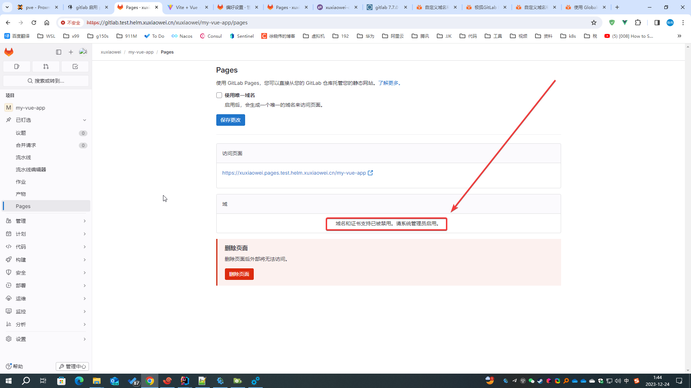

# GitLab 自定义 Pages 域名、SSL/TLS 证书

用于支持用户自定义 Pages 域名、SSL/TLS 域名证书

## 描述

默认情况下，pages 域名和证书 是被禁用的



## 自定义域名配置

### 导出 helm gitlab 配置

```shell
# 将已配置的值导出到文件中
helm -n gitlab-test get values my-gitlab > my-gitlab.yaml
```

### 查看 GitLab Pages Custom Domains Service 的 EXTERNAL-IP

```shell
[root@anolis-7-9 ~]# kubectl -n gitlab-test get service
NAME                                         TYPE           CLUSTER-IP       EXTERNAL-IP                 PORT(S)                                   AGE
cm-acme-http-solver-jpzhd                    NodePort       10.105.18.121    <none>                      8089:32764/TCP                            39h
cm-acme-http-solver-kvj5q                    NodePort       10.99.177.114    <none>                      8089:30973/TCP                            39h
cm-acme-http-solver-q82j2                    NodePort       10.103.217.244   <none>                      8089:32188/TCP                            39h
my-gitlab-certmanager                        ClusterIP      10.101.131.129   <none>                      9402/TCP                                  39h
my-gitlab-certmanager-webhook                ClusterIP      10.104.249.65    <none>                      443/TCP                                   39h
my-gitlab-gitaly                             ClusterIP      None             <none>                      8075/TCP,9236/TCP                         39h
my-gitlab-gitlab-exporter                    ClusterIP      10.104.47.204    <none>                      9168/TCP                                  39h
my-gitlab-gitlab-pages-custom-domains        LoadBalancer   10.97.49.247     172.25.25.32,10.97.49.247   80:32713/TCP                              87m
my-gitlab-gitlab-pages-metrics               ClusterIP      10.109.40.15     <none>                      9235/TCP                                  3h3m
my-gitlab-gitlab-shell                       ClusterIP      10.107.227.187   <none>                      22/TCP                                    39h
my-gitlab-kas                                ClusterIP      10.108.130.73    <none>                      8150/TCP,8153/TCP,8154/TCP,8151/TCP       39h
my-gitlab-minio-svc                          ClusterIP      10.109.30.226    <none>                      9000/TCP                                  39h
my-gitlab-nginx-ingress-controller           LoadBalancer   10.102.62.140    <pending>                   80:30875/TCP,443:31768/TCP,22:30561/TCP   39h
my-gitlab-nginx-ingress-controller-metrics   ClusterIP      10.96.243.11     <none>                      10254/TCP                                 39h
my-gitlab-postgresql                         ClusterIP      10.104.225.8     <none>                      5432/TCP                                  39h
my-gitlab-postgresql-hl                      ClusterIP      None             <none>                      5432/TCP                                  39h
my-gitlab-postgresql-metrics                 ClusterIP      10.107.233.118   <none>                      9187/TCP                                  39h
my-gitlab-prometheus-server                  ClusterIP      10.101.151.224   <none>                      80/TCP                                    39h
my-gitlab-redis-headless                     ClusterIP      None             <none>                      6379/TCP                                  39h
my-gitlab-redis-master                       ClusterIP      10.103.127.195   <none>                      6379/TCP                                  39h
my-gitlab-redis-metrics                      ClusterIP      10.104.184.133   <none>                      9121/TCP                                  39h
my-gitlab-registry                           ClusterIP      10.107.98.111    <none>                      5000/TCP                                  39h
my-gitlab-webservice-default                 ClusterIP      10.110.211.99    <none>                      8080/TCP,8181/TCP,8083/TCP                39h
[root@anolis-7-9 ~]# kubectl -n gitlab-test get svc | grep gitlab-pages-custom-domains
my-gitlab-gitlab-pages-custom-domains        LoadBalancer   10.97.49.247     172.25.25.32,10.97.49.247   80:32713/TCP                              87m
[root@anolis-7-9 ~]#
```

### 修改配置

注意：<strong><font color="red">此处填写的 externalHttp 不能和 gitlab 实例的 IP 相同</font></strong>

1. 作者 gitlab 实例域名 `gitlab.test.helm.xuxiaowei.cn` 解析到 `172.25.25.32`
2. 作者 gitlab pages 域名 `*.pages.test.helm.xuxiaowei.cn`、`*.test.helm.xuxiaowei.io` 解析到 `172.25.25.31`
3. [文档](https://docs.gitlab.cn/jh/administration/pages/#%E8%87%AA%E5%AE%9A%E4%B9%89%E5%9F%9F%E5%90%8D)

```shell
global:
  pages:
    # 用于支持自定义域名：仅支持 HTTP 请求
    externalHttp:
    # HTTP 请求到达 Pages daemon 的 IP 地址列表。用于支持自定义域名。
    # 使用上述 GitLab Pages Custom Domains Service 的部分 EXTERNAL-IP
    - 172.25.25.31
    - 10.97.49.247
```

### 更新配置

    ```shell
    helm upgrade -n gitlab-test --install my-gitlab gitlab/gitlab --timeout 600s -f my-gitlab.yaml
    ```

### 等待所有 pod 更新完成

```shell
[root@anolis-7-9 ~]# kubectl -n gitlab-test get pod -o wide
NAME                                                 READY   STATUS      RESTARTS         AGE     IP                NODE         NOMINATED NODE   READINESS GATES
cm-acme-http-solver-2ldtp                            1/1     Running     14 (10m ago)     37h     192.168.210.234   anolis-7-9   <none>           <none>
cm-acme-http-solver-94dv5                            1/1     Running     14 (10m ago)     37h     192.168.210.247   anolis-7-9   <none>           <none>
cm-acme-http-solver-klkpz                            1/1     Running     14 (10m ago)     37h     192.168.210.230   anolis-7-9   <none>           <none>
my-gitlab-certmanager-8457bfdc8-w858k                1/1     Running     14 (10m ago)     37h     192.168.240.118   anolis-7-7   <none>           <none>
my-gitlab-certmanager-cainjector-74df787cf4-j7cfc    1/1     Running     14 (10m ago)     37h     192.168.240.66    anolis-7-7   <none>           <none>
my-gitlab-certmanager-webhook-7b86db4c96-dhcxl       1/1     Running     14 (10m ago)     37h     192.168.240.95    anolis-7-7   <none>           <none>
my-gitlab-gitaly-0                                   1/1     Running     14 (10m ago)     37h     192.168.210.228   anolis-7-9   <none>           <none>
my-gitlab-gitlab-exporter-55dcfcb595-gl6nm           1/1     Running     14 (10m ago)     37h     192.168.210.242   anolis-7-9   <none>           <none>
my-gitlab-gitlab-pages-848b78cbbb-7x6nt              1/1     Running     0                7m14s   192.168.240.115   anolis-7-7   <none>           <none>
my-gitlab-gitlab-runner-5f6ff5994c-wdw5l             1/1     Running     3 (10m ago)      4h13m   192.168.210.222   anolis-7-9   <none>           <none>
my-gitlab-gitlab-shell-55fdc9cb9f-52gnr              1/1     Running     14 (12m ago)     37h     192.168.240.76    anolis-7-7   <none>           <none>
my-gitlab-gitlab-shell-55fdc9cb9f-cfhsh              1/1     Running     14 (10m ago)     37h     192.168.210.223   anolis-7-9   <none>           <none>
my-gitlab-issuer-37-gqljk                            0/1     Completed   0                7m14s   192.168.240.82    anolis-7-7   <none>           <none>
my-gitlab-kas-688dc97ddd-28gr7                       1/1     Running     40 (9m39s ago)   37h     192.168.240.96    anolis-7-7   <none>           <none>
my-gitlab-kas-688dc97ddd-tvkvd                       1/1     Running     46 (9m34s ago)   37h     192.168.210.245   anolis-7-9   <none>           <none>
my-gitlab-migrations-37-t69sl                        0/1     Completed   0                7m14s   192.168.240.75    anolis-7-7   <none>           <none>
my-gitlab-minio-66f584f746-t6qwb                     1/1     Running     6 (10m ago)      29h     192.168.210.251   anolis-7-9   <none>           <none>
my-gitlab-minio-create-buckets-37-6lsd8              0/1     Completed   0                7m14s   192.168.240.97    anolis-7-7   <none>           <none>
my-gitlab-nginx-ingress-controller-6bdd56c45-ch57n   1/1     Running     14 (10m ago)     37h     192.168.240.67    anolis-7-7   <none>           <none>
my-gitlab-nginx-ingress-controller-6bdd56c45-cm2lz   1/1     Running     14 (10m ago)     37h     192.168.210.246   anolis-7-9   <none>           <none>
my-gitlab-postgresql-0                               2/2     Running     28 (10m ago)     37h     192.168.210.244   anolis-7-9   <none>           <none>
my-gitlab-prometheus-server-646489c599-8mgc9         2/2     Running     28 (10m ago)     37h     192.168.210.208   anolis-7-9   <none>           <none>
my-gitlab-redis-master-0                             2/2     Running     28 (10m ago)     37h     192.168.210.239   anolis-7-9   <none>           <none>
my-gitlab-registry-78fc549f8d-d2zjv                  1/1     Running     14 (10m ago)     37h     192.168.240.98    anolis-7-7   <none>           <none>
my-gitlab-registry-78fc549f8d-xbkvh                  1/1     Running     14 (10m ago)     37h     192.168.210.240   anolis-7-9   <none>           <none>
my-gitlab-sidekiq-all-in-1-v2-7ff55f699b-phhjt       1/1     Running     0                7m14s   192.168.210.235   anolis-7-9   <none>           <none>
my-gitlab-toolbox-7f79f69d96-xvl47                   1/1     Running     0                6m44s   192.168.240.101   anolis-7-7   <none>           <none>
my-gitlab-webservice-default-6f5d96f89c-c779l        2/2     Running     0                7m14s   192.168.240.81    anolis-7-7   <none>           <none>
my-gitlab-webservice-default-6f5d96f89c-m2svw        2/2     Running     0                5m7s    192.168.240.78    anolis-7-7   <none>           <none>
[root@anolis-7-9 ~]# 
```

### 查看项目 Pages 配置

默认 `webservice-default` Deployment 只有两个副本，请等待 `webservice-default` Deployment 恢复正常副本数后再查看，
否则页面数据在每次刷新可能结果不同


### 自定义域名


<strong><font color="red">添加完成后，需要验证 DNS，如果你有域名 DNS 权限，可以选择添加 DNS 后刷新验证。</font></strong>


<strong><font color="red">如果你没有 DNS 权限，或者你不想验证 DNS 权限，可以在管理页面取消验证。</font></strong>

<strong><font color="red">取消验证后，需要重新添加域名才生效</font></strong>


### 访问效果

注意：由于此项目存在项目名问题，所以此效果是使用 https://framagit.org/xuxiaowei-com-cn/my-maven-app 的 `domain`
分支（无项目名）部署的，并且只能使用 http 方式访问


### <strong><font color="red">由于只配置了 externalHttp，所以只能通过 http 方式访问，https 将无法访问</font></strong>


## 自定义域名 SSL/TLS 证书 配置

### 导出 helm gitlab 配置

```shell
# 将已配置的值导出到文件中
helm -n gitlab-test get values my-gitlab > my-gitlab.yaml
```

### 查看 GitLab Pages Custom Domains Service 的 EXTERNAL-IP

```shell
[root@anolis-7-9 ~]# kubectl -n gitlab-test get service
NAME                                         TYPE           CLUSTER-IP       EXTERNAL-IP                 PORT(S)                                   AGE
cm-acme-http-solver-jpzhd                    NodePort       10.105.18.121    <none>                      8089:32764/TCP                            39h
cm-acme-http-solver-kvj5q                    NodePort       10.99.177.114    <none>                      8089:30973/TCP                            39h
cm-acme-http-solver-q82j2                    NodePort       10.103.217.244   <none>                      8089:32188/TCP                            39h
my-gitlab-certmanager                        ClusterIP      10.101.131.129   <none>                      9402/TCP                                  39h
my-gitlab-certmanager-webhook                ClusterIP      10.104.249.65    <none>                      443/TCP                                   39h
my-gitlab-gitaly                             ClusterIP      None             <none>                      8075/TCP,9236/TCP                         39h
my-gitlab-gitlab-exporter                    ClusterIP      10.104.47.204    <none>                      9168/TCP                                  39h
my-gitlab-gitlab-pages-custom-domains        LoadBalancer   10.97.49.247     172.25.25.32,10.97.49.247   80:32713/TCP                              87m
my-gitlab-gitlab-pages-metrics               ClusterIP      10.109.40.15     <none>                      9235/TCP                                  3h3m
my-gitlab-gitlab-shell                       ClusterIP      10.107.227.187   <none>                      22/TCP                                    39h
my-gitlab-kas                                ClusterIP      10.108.130.73    <none>                      8150/TCP,8153/TCP,8154/TCP,8151/TCP       39h
my-gitlab-minio-svc                          ClusterIP      10.109.30.226    <none>                      9000/TCP                                  39h
my-gitlab-nginx-ingress-controller           LoadBalancer   10.102.62.140    <pending>                   80:30875/TCP,443:31768/TCP,22:30561/TCP   39h
my-gitlab-nginx-ingress-controller-metrics   ClusterIP      10.96.243.11     <none>                      10254/TCP                                 39h
my-gitlab-postgresql                         ClusterIP      10.104.225.8     <none>                      5432/TCP                                  39h
my-gitlab-postgresql-hl                      ClusterIP      None             <none>                      5432/TCP                                  39h
my-gitlab-postgresql-metrics                 ClusterIP      10.107.233.118   <none>                      9187/TCP                                  39h
my-gitlab-prometheus-server                  ClusterIP      10.101.151.224   <none>                      80/TCP                                    39h
my-gitlab-redis-headless                     ClusterIP      None             <none>                      6379/TCP                                  39h
my-gitlab-redis-master                       ClusterIP      10.103.127.195   <none>                      6379/TCP                                  39h
my-gitlab-redis-metrics                      ClusterIP      10.104.184.133   <none>                      9121/TCP                                  39h
my-gitlab-registry                           ClusterIP      10.107.98.111    <none>                      5000/TCP                                  39h
my-gitlab-webservice-default                 ClusterIP      10.110.211.99    <none>                      8080/TCP,8181/TCP,8083/TCP                39h
[root@anolis-7-9 ~]# kubectl -n gitlab-test get svc | grep gitlab-pages-custom-domains
my-gitlab-gitlab-pages-custom-domains        LoadBalancer   10.97.49.247     172.25.25.32,10.97.49.247   80:32713/TCP                              87m
[root@anolis-7-9 ~]#
```

### 修改配置

注意：<strong><font color="red">此处填写的 externalHttp 不能和 gitlab 实例的 IP 相同</font></strong>

1. 作者 gitlab 实例域名 `gitlab.test.helm.xuxiaowei.cn` 解析到 `172.25.25.32`
2. 作者 gitlab pages 域名 `*.pages.test.helm.xuxiaowei.cn`、`*.test.helm.xuxiaowei.io` 解析到 `172.25.25.31`
3. [文档](https://docs.gitlab.cn/jh/administration/pages/#%E8%87%AA%E5%AE%9A%E4%B9%89%E5%9F%9F%E5%90%8D)

```shell
global:
  pages:
    # 用于支持自定义域名、SSL/TLS 证书：仅支持 HTTPS 请求
    externalHttps:
    # HTTPS 请求到达 Pages daemon 的 IP 地址列表。用于支持自定义域名。
    # 使用上述 GitLab Pages Custom Domains Service 的部分 EXTERNAL-IP
    - 172.25.25.31
    - 10.97.49.247
```

### 更新配置

```shell
helm upgrade -n gitlab-test --install my-gitlab gitlab/gitlab --timeout 600s -f my-gitlab.yaml
```

### 可以观察到 GitLab Pages 无法部署

```shell
[root@anolis-7-9 ~]# kubectl -n gitlab-test get pod -o wide | grep gitlab-pages
my-gitlab-gitlab-pages-6b5f557b5c-pp6ww              0/1     Init:0/2    0               102s    <none>            anolis-7-9   <none>           <none>
my-gitlab-gitlab-pages-848b78cbbb-7x6nt              1/1     Running     0               94m     192.168.240.115   anolis-7-7   <none>           <none>
[root@anolis-7-9 ~]#
```

### 查看无法部署的原因

无法找到 `my-gitlab-pages-tls` secret，原因是开启了自定义 域名 SSL/TLS 证书后，需要创建一个 TLS secret

```shell
[root@anolis-7-9 ~]# kubectl -n gitlab-test describe pod my-gitlab-gitlab-pages-6b5f557b5c-pp6ww
# 节选
Events:
Type     Reason       Age                  From               Message
  ----     ------       ----                 ----               -------
Normal   Scheduled    2m42s                default-scheduler  Successfully assigned gitlab-test/my-gitlab-gitlab-pages-6b5f557b5c-pp6ww to anolis-7-9
Warning  FailedMount  34s (x9 over 2m42s)  kubelet            MountVolume.SetUp failed for volume "init-pages-secrets" : secret "my-gitlab-pages-tls" not found
[root@anolis-7-9 ~]#
```

### 创建 `my-gitlab-pages-tls` TLS secret

```shell
openssl genrsa -out ca.key 2048
openssl req -new -x509 -days 3650 -key ca.key -subj "/C=CN/ST=山东/L=青岛/O=徐晓伟工作室/OU=徐晓伟工作室/CN=*.pages.test.helm.xuxiaowei.cn/CN=*.test.helm.xuxiaowei.io/emailAddress=xuxiaowei@xuxiaowei.com.cn" -out ca.crt -utf8
```

```shell
KEY_FILE=ca.key
CERT_FILE=ca.crt
CERT_NAME=my-gitlab-pages-tls
kubectl -n gitlab-test create secret tls ${CERT_NAME} --key ${KEY_FILE} --cert ${CERT_FILE}
```

### 重启 pages Deployment

```shell
[root@anolis-7-9 ~]# kubectl -n gitlab-test rollout restart deployment my-gitlab-gitlab-pages
deployment.apps/my-gitlab-gitlab-pages restarted
[root@anolis-7-9 ~]#
```

### 等待所有 pod 更新完成

```shell
[root@anolis-7-9 ~]# kubectl -n gitlab-test get pod -o wide
NAME                                                 READY   STATUS      RESTARTS        AGE     IP                NODE         NOMINATED NODE   READINESS GATES
cm-acme-http-solver-2ldtp                            1/1     Running     14 (121m ago)   39h     192.168.210.234   anolis-7-9   <none>           <none>
cm-acme-http-solver-94dv5                            1/1     Running     14 (121m ago)   39h     192.168.210.247   anolis-7-9   <none>           <none>
cm-acme-http-solver-klkpz                            1/1     Running     14 (121m ago)   39h     192.168.210.230   anolis-7-9   <none>           <none>
my-gitlab-certmanager-8457bfdc8-w858k                1/1     Running     14 (121m ago)   39h     192.168.240.118   anolis-7-7   <none>           <none>
my-gitlab-certmanager-cainjector-74df787cf4-j7cfc    1/1     Running     14 (121m ago)   39h     192.168.240.66    anolis-7-7   <none>           <none>
my-gitlab-certmanager-webhook-7b86db4c96-dhcxl       1/1     Running     14 (121m ago)   39h     192.168.240.95    anolis-7-7   <none>           <none>
my-gitlab-gitaly-0                                   1/1     Running     14 (121m ago)   39h     192.168.210.228   anolis-7-9   <none>           <none>
my-gitlab-gitlab-exporter-55dcfcb595-gl6nm           1/1     Running     14 (121m ago)   39h     192.168.210.242   anolis-7-9   <none>           <none>
my-gitlab-gitlab-pages-6bd898c7d5-tvspn              1/1     Running     0               4m36s   192.168.240.104   anolis-7-7   <none>           <none>
my-gitlab-gitlab-runner-5f6ff5994c-lbbjt             0/1     Running     0               21s     192.168.240.121   anolis-7-7   <none>           <none>
my-gitlab-gitlab-shell-55fdc9cb9f-52gnr              1/1     Running     14 (123m ago)   39h     192.168.240.76    anolis-7-7   <none>           <none>
my-gitlab-gitlab-shell-55fdc9cb9f-cfhsh              1/1     Running     14 (121m ago)   39h     192.168.210.223   anolis-7-9   <none>           <none>
my-gitlab-issuer-38-742q6                            0/1     Completed   0               91m     192.168.240.73    anolis-7-7   <none>           <none>
my-gitlab-issuer-55-fp5rb                            0/1     Completed   0               24m     192.168.240.105   anolis-7-7   <none>           <none>
my-gitlab-kas-688dc97ddd-28gr7                       1/1     Running     40 (120m ago)   39h     192.168.240.96    anolis-7-7   <none>           <none>
my-gitlab-kas-688dc97ddd-tvkvd                       1/1     Running     46 (120m ago)   39h     192.168.210.245   anolis-7-9   <none>           <none>
my-gitlab-migrations-38-9mz5h                        0/1     Completed   0               91m     192.168.210.252   anolis-7-9   <none>           <none>
my-gitlab-migrations-55-tbpvq                        0/1     Completed   0               24m     192.168.240.90    anolis-7-7   <none>           <none>
my-gitlab-minio-66f584f746-t6qwb                     1/1     Running     6 (121m ago)    31h     192.168.210.251   anolis-7-9   <none>           <none>
my-gitlab-minio-create-buckets-38-lzrsj              0/1     Completed   0               91m     192.168.240.79    anolis-7-7   <none>           <none>
my-gitlab-minio-create-buckets-55-g2gvz              0/1     Completed   0               24m     192.168.240.107   anolis-7-7   <none>           <none>
my-gitlab-nginx-ingress-controller-6bdd56c45-ch57n   1/1     Running     14 (121m ago)   39h     192.168.240.67    anolis-7-7   <none>           <none>
my-gitlab-nginx-ingress-controller-6bdd56c45-cm2lz   1/1     Running     14 (121m ago)   39h     192.168.210.246   anolis-7-9   <none>           <none>
my-gitlab-postgresql-0                               2/2     Running     28 (121m ago)   39h     192.168.210.244   anolis-7-9   <none>           <none>
my-gitlab-prometheus-server-646489c599-8mgc9         2/2     Running     28 (121m ago)   39h     192.168.210.208   anolis-7-9   <none>           <none>
my-gitlab-redis-master-0                             2/2     Running     28 (121m ago)   38h     192.168.210.239   anolis-7-9   <none>           <none>
my-gitlab-registry-78fc549f8d-d2zjv                  1/1     Running     14 (121m ago)   39h     192.168.240.98    anolis-7-7   <none>           <none>
my-gitlab-registry-78fc549f8d-xbkvh                  1/1     Running     14 (121m ago)   39h     192.168.210.240   anolis-7-9   <none>           <none>
my-gitlab-sidekiq-all-in-1-v2-84f99f6776-78g2z       1/1     Running     0               24m     192.168.210.197   anolis-7-9   <none>           <none>
my-gitlab-toolbox-6cbbbdcbdf-v6mf2                   1/1     Running     0               24m     192.168.210.202   anolis-7-9   <none>           <none>
my-gitlab-webservice-default-79f7757847-2mw8g        2/2     Running     0               24m     192.168.210.215   anolis-7-9   <none>           <none>
my-gitlab-webservice-default-79f7757847-gz9lm        2/2     Running     0               2m27s   192.168.240.117   anolis-7-7   <none>           <none>
[root@anolis-7-9 ~]# 
```

### 创建一个自定义域名 abc123.xuxiaowei.cn 证书

```shell
openssl genrsa -out ca.key 2048
openssl req -new -x509 -days 3650 -key ca.key -subj "/C=CN/ST=ShanDong/L=QingDao/O=xuxiaowei/OU=xuxiaowei/CN=abc123.xuxiaowei.cn/emailAddress=xuxiaowei@xuxiaowei.com.cn" -out ca.crt -utf8
```

### 新增/编辑域名，填写域名 SSL/TLS 证书


### 体验 域名 SSL/TLS 证书


