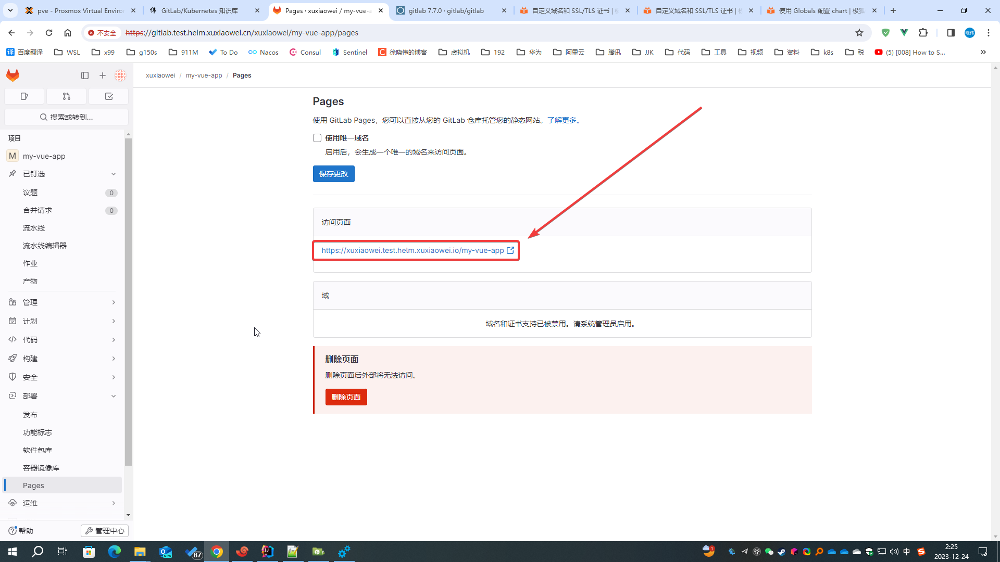

# GitLab 自定义 Pages 根域名

GitLab Pages 使用独立于 GitLab 的根域名

## 配置

1. 导出 helm gitlab 配置

    ```shell
    # 将已配置的值导出到文件中
    helm -n gitlab-test get values my-gitlab > my-gitlab.yaml
    ```

2. 更新配置

   此处的根域名设置为：<strong><font color="red">test.helm.xuxiaowei.io</font></strong>

    ```shell
    helm upgrade -n gitlab-test --install my-gitlab gitlab/gitlab --timeout 600s -f my-gitlab.yaml --set global.pages.host=test.helm.xuxiaowei.io
    ```

3. 等待所有 pod 更新完成

   ```shell
   [root@anolis-7-9 ~]# kubectl -n gitlab-test get pod -o wide
   NAME                                                 READY   STATUS      RESTARTS       AGE     IP                NODE         NOMINATED NODE   READINESS GATES
   cm-acme-http-solver-2ldtp                            1/1     Running     13 (10m ago)   37h     192.168.210.205   anolis-7-9   <none>           <none>
   cm-acme-http-solver-94dv5                            1/1     Running     13 (10m ago)   37h     192.168.210.227   anolis-7-9   <none>           <none>
   cm-acme-http-solver-klkpz                            1/1     Running     13 (10m ago)   37h     192.168.210.232   anolis-7-9   <none>           <none>
   my-gitlab-certmanager-8457bfdc8-w858k                1/1     Running     13 (10m ago)   37h     192.168.240.127   anolis-7-7   <none>           <none>
   my-gitlab-certmanager-cainjector-74df787cf4-j7cfc    1/1     Running     13 (10m ago)   37h     192.168.240.93    anolis-7-7   <none>           <none>
   my-gitlab-certmanager-webhook-7b86db4c96-dhcxl       1/1     Running     13 (10m ago)   37h     192.168.240.109   anolis-7-7   <none>           <none>
   my-gitlab-gitaly-0                                   1/1     Running     13 (10m ago)   37h     192.168.210.212   anolis-7-9   <none>           <none>
   my-gitlab-gitlab-exporter-55dcfcb595-gl6nm           1/1     Running     13 (10m ago)   37h     192.168.210.211   anolis-7-9   <none>           <none>
   my-gitlab-gitlab-pages-f65879869-c9kxd               1/1     Running     0              4m33s   192.168.210.220   anolis-7-9   <none>           <none>
   my-gitlab-gitlab-runner-5f6ff5994c-wdw5l             1/1     Running     2 (10m ago)    3h45m   192.168.210.226   anolis-7-9   <none>           <none>
   my-gitlab-gitlab-shell-55fdc9cb9f-52gnr              1/1     Running     13 (10m ago)   37h     192.168.240.106   anolis-7-7   <none>           <none>
   my-gitlab-gitlab-shell-55fdc9cb9f-cfhsh              1/1     Running     13 (10m ago)   37h     192.168.210.204   anolis-7-9   <none>           <none>
   my-gitlab-issuer-33-jtcbd                            0/1     Completed   0              4m33s   192.168.240.92    anolis-7-7   <none>           <none>
   my-gitlab-kas-688dc97ddd-28gr7                       1/1     Running     37 (10m ago)   37h     192.168.240.65    anolis-7-7   <none>           <none>
   my-gitlab-kas-688dc97ddd-tvkvd                       1/1     Running     43 (10m ago)   37h     192.168.210.229   anolis-7-9   <none>           <none>
   my-gitlab-migrations-33-cnmd7                        0/1     Completed   0              4m33s   192.168.240.91    anolis-7-7   <none>           <none>
   my-gitlab-minio-66f584f746-t6qwb                     1/1     Running     5 (10m ago)    29h     192.168.210.200   anolis-7-9   <none>           <none>
   my-gitlab-minio-create-buckets-33-x7wvv              0/1     Completed   0              4m33s   192.168.240.86    anolis-7-7   <none>           <none>
   my-gitlab-nginx-ingress-controller-6bdd56c45-ch57n   1/1     Running     13 (10m ago)   37h     192.168.240.99    anolis-7-7   <none>           <none>
   my-gitlab-nginx-ingress-controller-6bdd56c45-cm2lz   1/1     Running     13 (10m ago)   37h     192.168.210.201   anolis-7-9   <none>           <none>
   my-gitlab-postgresql-0                               2/2     Running     26 (10m ago)   37h     192.168.210.217   anolis-7-9   <none>           <none>
   my-gitlab-prometheus-server-646489c599-8mgc9         2/2     Running     26 (10m ago)   37h     192.168.210.218   anolis-7-9   <none>           <none>
   my-gitlab-redis-master-0                             2/2     Running     26 (10m ago)   36h     192.168.210.209   anolis-7-9   <none>           <none>
   my-gitlab-registry-78fc549f8d-d2zjv                  1/1     Running     13 (54m ago)   37h     192.168.240.70    anolis-7-7   <none>           <none>
   my-gitlab-registry-78fc549f8d-xbkvh                  1/1     Running     13 (10m ago)   37h     192.168.210.213   anolis-7-9   <none>           <none>
   my-gitlab-sidekiq-all-in-1-v2-589bfd4b96-5kdh7       1/1     Running     0              4m33s   192.168.240.83    anolis-7-7   <none>           <none>
   my-gitlab-toolbox-79c7bf6985-vpkzq                   1/1     Running     0              4m3s    192.168.210.231   anolis-7-9   <none>           <none>
   my-gitlab-webservice-default-654f7fbbbf-pdm5g        2/2     Running     0              2m14s   192.168.240.113   anolis-7-7   <none>           <none>
   my-gitlab-webservice-default-654f7fbbbf-xjk78        2/2     Running     0              4m33s   192.168.210.221   anolis-7-9   <none>           <none>
   [root@anolis-7-9 ~]# 
   ```

4. 查看项目 Pages 配置

   默认 `webservice-default` Deployment 只有两个副本，请等待 `webservice-default` Deployment 恢复正常副本数后再查看，
   否则页面数据在每次刷新可能结果不同

   

5. 访问新 Pages 域名

   此处访问的域名：<strong><font color="red">用户名.test.helm.xuxiaowei.io</font></strong>

   
