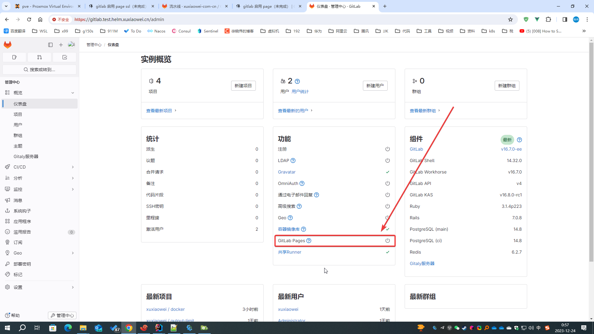
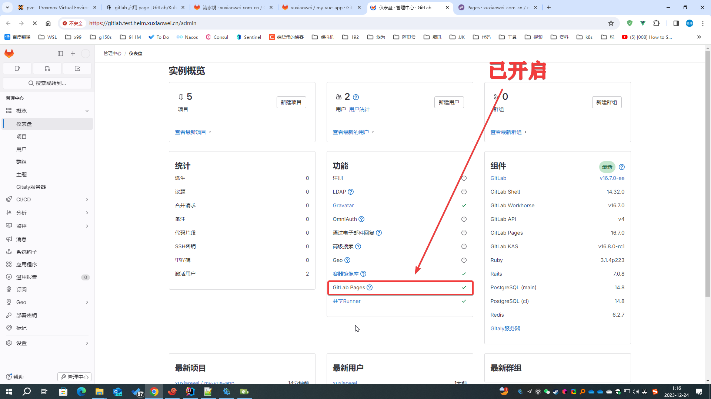
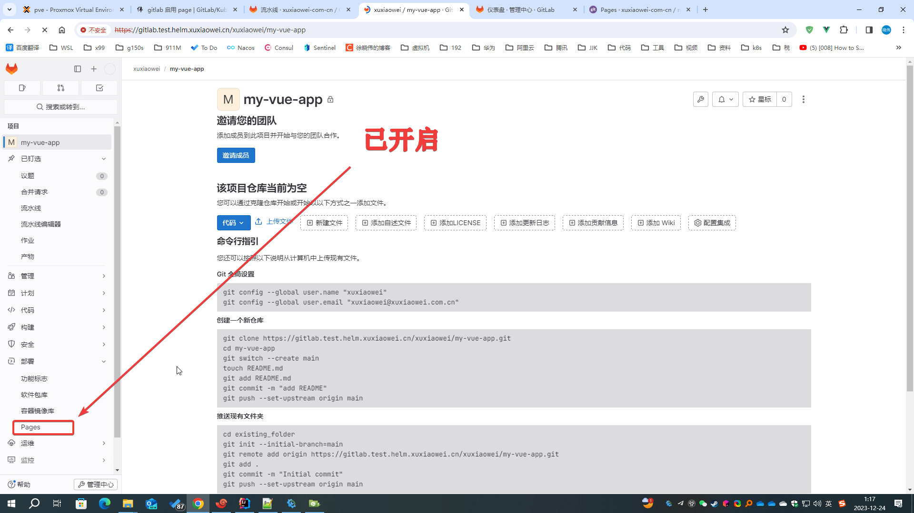
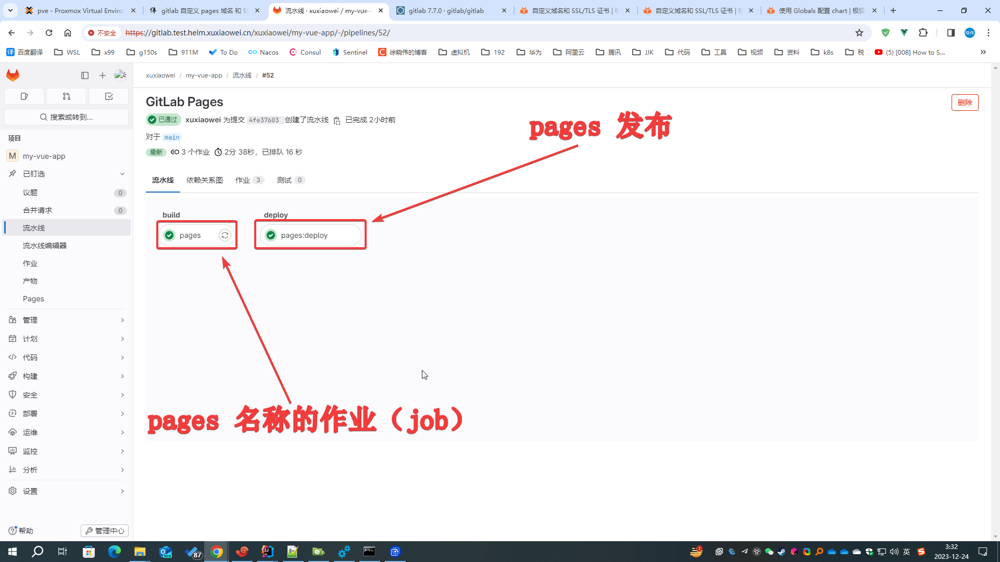
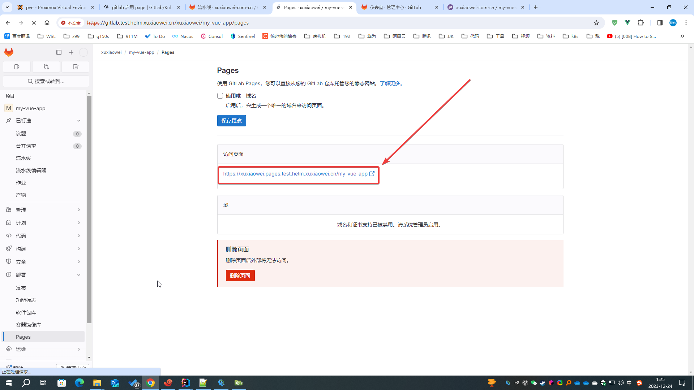

# GitLab 启用 Pages

GitLab 启用静态网站，用于展示文档、演示产品、发布博客等

## 说明

1. 默认没有启用 Pages 功能，`管理员`可以从`仪表盘`查看是否开启
   

2. 或者在项目左侧找不到 Pages 导航栏（不同 GitLab 版本导航栏可能会有区别，早期版本可能会存在与项目设置中）
   

## 启用 Pages 功能

1. 导出 helm gitlab 配置

    ```shell
    # 将已配置的值导出到文件中
    helm -n gitlab-test get values my-gitlab > my-gitlab.yaml
    ```

2. 更新配置

    ```shell
    helm upgrade -n gitlab-test --install my-gitlab gitlab/gitlab --timeout 600s -f my-gitlab.yaml --set global.pages.enabled=true --version 7.7.0
    ```

3. 等待所有 pod 更新完成

   ```shell
   [root@anolis-7-9 ~]# kubectl -n gitlab-test get pod -o wide
   NAME                                                 READY   STATUS      RESTARTS       AGE     IP                NODE         NOMINATED NODE   READINESS GATES
   cm-acme-http-solver-2ldtp                            1/1     Running     12 (20m ago)   36h     192.168.210.254   anolis-7-9   <none>           <none>
   cm-acme-http-solver-94dv5                            1/1     Running     12 (20m ago)   36h     192.168.210.241   anolis-7-9   <none>           <none>
   cm-acme-http-solver-klkpz                            1/1     Running     12 (20m ago)   36h     192.168.210.214   anolis-7-9   <none>           <none>
   my-gitlab-certmanager-8457bfdc8-w858k                1/1     Running     12 (20m ago)   36h     192.168.240.111   anolis-7-7   <none>           <none>
   my-gitlab-certmanager-cainjector-74df787cf4-j7cfc    1/1     Running     12 (20m ago)   36h     192.168.240.122   anolis-7-7   <none>           <none>
   my-gitlab-certmanager-webhook-7b86db4c96-dhcxl       1/1     Running     12 (20m ago)   36h     192.168.240.101   anolis-7-7   <none>           <none>
   my-gitlab-gitaly-0                                   1/1     Running     12 (20m ago)   35h     192.168.210.253   anolis-7-9   <none>           <none>
   my-gitlab-gitlab-exporter-55dcfcb595-gl6nm           1/1     Running     12 (20m ago)   36h     192.168.210.237   anolis-7-9   <none>           <none>
   my-gitlab-gitlab-pages-7bbbff4f8b-99v8j              1/1     Running     0              6m2s    192.168.240.77    anolis-7-7   <none>           <none>
   my-gitlab-gitlab-runner-5f6ff5994c-wdw5l             1/1     Running     1 (20m ago)    156m    192.168.210.255   anolis-7-9   <none>           <none>
   my-gitlab-gitlab-shell-55fdc9cb9f-52gnr              1/1     Running     12 (20m ago)   35h     192.168.240.79    anolis-7-7   <none>           <none>
   my-gitlab-gitlab-shell-55fdc9cb9f-cfhsh              1/1     Running     12 (20m ago)   36h     192.168.210.194   anolis-7-9   <none>           <none>
   my-gitlab-issuer-31-tj7rc                            0/1     Completed   0              6m1s    192.168.240.118   anolis-7-7   <none>           <none>
   my-gitlab-kas-688dc97ddd-28gr7                       1/1     Running     36 (19m ago)   35h     192.168.240.88    anolis-7-7   <none>           <none>
   my-gitlab-kas-688dc97ddd-tvkvd                       1/1     Running     41 (19m ago)   36h     192.168.210.196   anolis-7-9   <none>           <none>
   my-gitlab-migrations-31-xzstj                        0/1     Completed   0              6m1s    192.168.240.71    anolis-7-7   <none>           <none>
   my-gitlab-minio-66f584f746-t6qwb                     1/1     Running     4 (20m ago)    27h     192.168.210.203   anolis-7-9   <none>           <none>
   my-gitlab-minio-create-buckets-31-l5cgh              0/1     Completed   0              6m1s    192.168.240.66    anolis-7-7   <none>           <none>
   my-gitlab-nginx-ingress-controller-6bdd56c45-ch57n   1/1     Running     12 (20m ago)   36h     192.168.240.114   anolis-7-7   <none>           <none>
   my-gitlab-nginx-ingress-controller-6bdd56c45-cm2lz   1/1     Running     12 (20m ago)   36h     192.168.210.193   anolis-7-9   <none>           <none>
   my-gitlab-postgresql-0                               2/2     Running     24 (20m ago)   35h     192.168.210.219   anolis-7-9   <none>           <none>
   my-gitlab-prometheus-server-646489c599-8mgc9         2/2     Running     24 (20m ago)   35h     192.168.210.248   anolis-7-9   <none>           <none>
   my-gitlab-redis-master-0                             2/2     Running     24 (20m ago)   35h     192.168.210.198   anolis-7-9   <none>           <none>
   my-gitlab-registry-78fc549f8d-d2zjv                  1/1     Running     12 (20m ago)   35h     192.168.240.78    anolis-7-7   <none>           <none>
   my-gitlab-registry-78fc549f8d-xbkvh                  1/1     Running     12 (20m ago)   36h     192.168.210.243   anolis-7-9   <none>           <none>
   my-gitlab-sidekiq-all-in-1-v2-7579854cff-f8pwx       1/1     Running     0              6m2s    192.168.210.199   anolis-7-9   <none>           <none>
   my-gitlab-toolbox-686c4fb549-7lrwl                   1/1     Running     0              5m31s   192.168.240.69    anolis-7-7   <none>           <none>
   my-gitlab-webservice-default-6fc5498c85-2tggm        2/2     Running     0              3m19s   192.168.240.73    anolis-7-7   <none>           <none>
   my-gitlab-webservice-default-6fc5498c85-7v9fp        2/2     Running     0              6m2s    192.168.240.81    anolis-7-7   <none>           <none>
   [root@anolis-7-9 ~]# 
   ```

4. 查看 `仪表盘`

    默认 `webservice-default` Deployment 只有两个副本，请等待 `webservice-default` Deployment 恢复正常副本数后再查看，
    否则页面数据在每次刷新可能结果不同

   

5. 查看项目

   

6. 部署 Pages，项目：https://framagit.org/xuxiaowei-com-cn/my-vue-app
   
   请注意：流水线作业（job）名称必须是 <strong><font color="red">pages</font></strong>，否则无法触发
   
   

7. 访问结果

   <strong><font color="red">注意：域名解析</font></strong>

   
