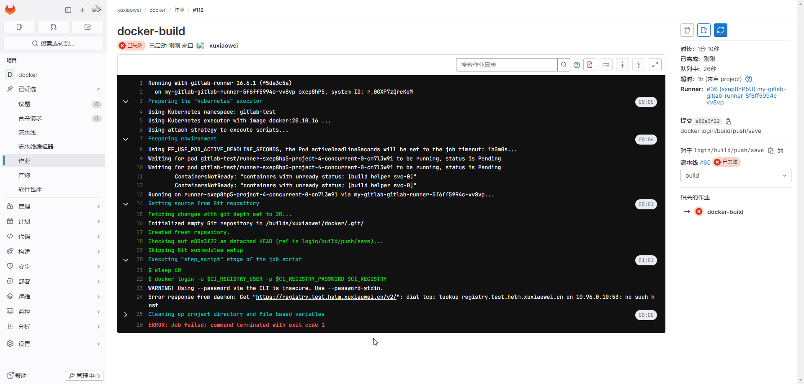
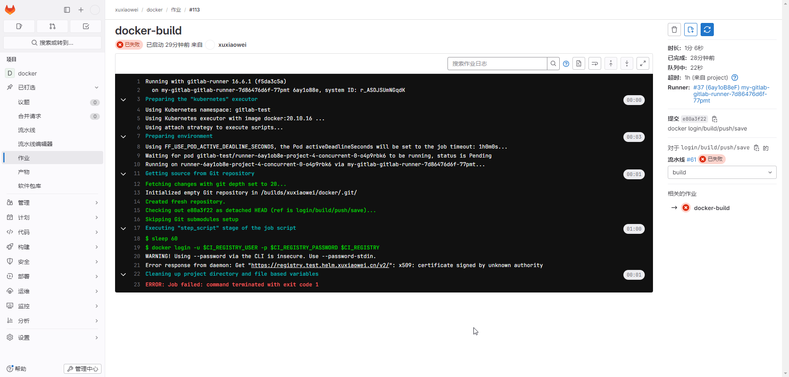
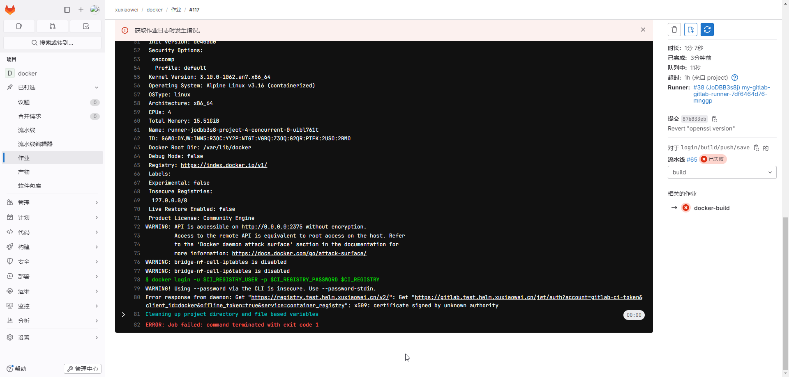
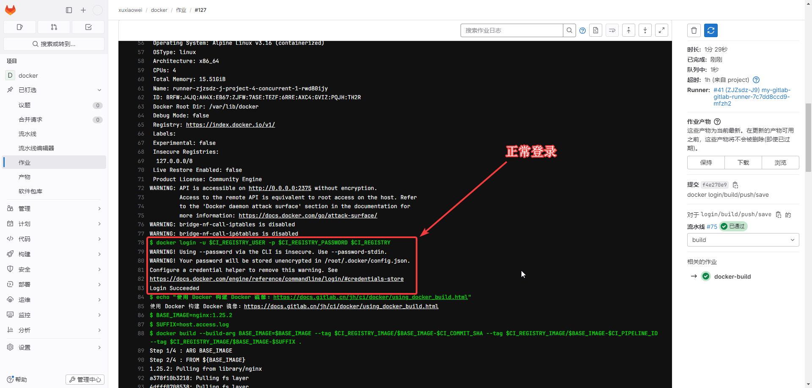
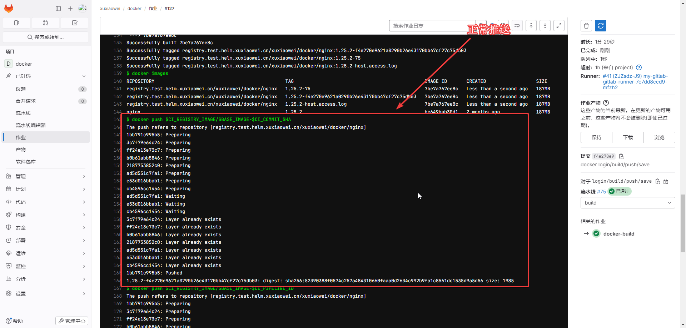
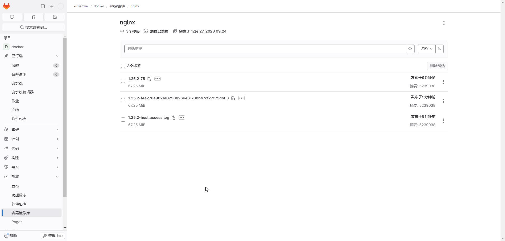

# GitLab Docker 仓库

GitLab 提供 docker 仓库功能

## 说明

1. 示例项目：https://framagit.org/xuxiaowei-com-cn/docker
2. 分支：`login/build/push/save`

## 配置

### 执行流水线异常，无法解析域名地址



### 导出 helm gitlab 配置

```shell
# 将已配置的值导出到文件中
helm -n gitlab-test get values my-gitlab > my-gitlab.yaml
```

### 查看 [gitlab runner 默认配置](https://artifacthub.io/packages/helm/gitlab/gitlab?modal=values)

```yaml
# 此处为节选，不同版本可能会存在差异，请以 https://artifacthub.io/packages/helm/gitlab/gitlab?modal=values 中的配置为准
gitlab-runner:
  runners:
    config: |
      [[runners]]
        [runners.kubernetes]
        image = "ubuntu:22.04"
        {{- if .Values.global.minio.enabled }}
        [runners.cache]
          Type = "s3"
          Path = "gitlab-runner"
          Shared = true
          [runners.cache.s3]
            ServerAddress = {{ include "gitlab-runner.cache-tpl.s3ServerAddress" . }}
            BucketName = "runner-cache"
            BucketLocation = "us-east-1"
            Insecure = false
        {{ end }}
```

### 修改配置如下

```yaml
gitlab-runner:
runners:
  config: |
    [[runners]]
      [runners.kubernetes]
      image = "ubuntu:22.04"
      [[runners.kubernetes.host_aliases]]
      ip = "172.25.25.32"
      hostnames = [ "registry.test.helm.xuxiaowei.cn" ]
      {{- if .Values.global.minio.enabled }}
      [runners.cache]
        Type = "s3"
        Path = "gitlab-runner"
        Shared = true
        [runners.cache.s3]
          ServerAddress = {{ include "gitlab-runner.cache-tpl.s3ServerAddress" . }}
          BucketName = "runner-cache"
          BucketLocation = "us-east-1"
          Insecure = false
      {{ end }}
```

### 更新配置

```shell
helm upgrade -n gitlab-test --install my-gitlab gitlab/gitlab --timeout 600s -f my-gitlab.yaml
```

### 等待所有旧 `pod` 删除完成，新 `pod` 正常运行时，重试流水线，即可正确解析到 registry（docker 仓库）的 IP

### 域名证书验证失败




### 下载证书

```shell
# 下载证书
openssl s_client -showcerts -connect registry.test.helm.xuxiaowei.cn:443 -servername registry.test.helm.xuxiaowei.cn < /dev/null 2>/dev/null | openssl x509 -outform PEM > registry.test.helm.xuxiaowei.cn.crt
openssl s_client -showcerts -connect gitlab.test.helm.xuxiaowei.cn:443   -servername gitlab.test.helm.xuxiaowei.cn   < /dev/null 2>/dev/null | openssl x509 -outform PEM > gitlab.test.helm.xuxiaowei.cn.crt
```

### 将证书导入到 k8s 中

```shell
# -n=gitlab-test：指定命名空间
# create configmap registry-certs：创建 ConfigMap 名称是 registry-certs
# --from-file=registry.test.helm.xuxiaowei.cn.crt=registry.test.helm.xuxiaowei.cn.crt：配置来自文件，文件名 registry.test.helm.xuxiaowei.cn.crt，放入 ConfigMap 中的键也是 registry.test.helm.xuxiaowei.cn.crt
kubectl -n=gitlab-test create configmap registry-certs --from-file=registry.test.helm.xuxiaowei.cn.crt=registry.test.helm.xuxiaowei.cn.crt
kubectl -n=gitlab-test create configmap gitlab-certs   --from-file=gitlab.test.helm.xuxiaowei.cn.crt=gitlab.test.helm.xuxiaowei.cn.crt

# 查看
# kubectl -n=gitlab-test get configmap registry-certs -o yaml
# kubectl -n=gitlab-test get configmap gitlab-certs -o yaml
```

### 导出 helm gitlab 配置

```shell
helm -n gitlab-test get values my-gitlab > my-gitlab.yaml
```

### 查看 [gitlab runner 默认配置](https://artifacthub.io/packages/helm/gitlab/gitlab?modal=values)

```yaml
# 此处为节选，不同版本可能会存在差异，请以 https://artifacthub.io/packages/helm/gitlab/gitlab?modal=values 中的配置为准
gitlab-runner:
  runners:
    config: |
      [[runners]]
        [runners.kubernetes]
        image = "ubuntu:22.04"
        {{- if .Values.global.minio.enabled }}
        [runners.cache]
          Type = "s3"
          Path = "gitlab-runner"
          Shared = true
          [runners.cache.s3]
            ServerAddress = {{ include "gitlab-runner.cache-tpl.s3ServerAddress" . }}
            BucketName = "runner-cache"
            BucketLocation = "us-east-1"
            Insecure = false
        {{ end }}
```

### 修改 helm gitlab 配置

- 域名证书位置

| 异常信息                                                        | 域名                              | 域名证书位置                                                                         | 作用                      |
|-------------------------------------------------------------|---------------------------------|--------------------------------------------------------------------------------|-------------------------|
| [gitlab-runner-job-15.png](static/gitlab-runner-job-15.png) | registry.test.helm.xuxiaowei.cn | /etc/docker/certs.d/registry.test.helm.xuxiaowei.cn/ca.crt                     | 用于 gitlab docker 登录地址   |
| [gitlab-runner-job-16.png](static/gitlab-runner-job-16.png) | gitlab.test.helm.xuxiaowei.cn   | /etc/ssl/certs/gitlab.test.helm.xuxiaowei.cn/gitlab.test.helm.xuxiaowei.cn.crt | 用于 gitlab docker 登录凭证验证 |

```yaml
gitlab-runner:
  runners:
    config: |
      [[runners]]
        [runners.kubernetes]
        image = "ubuntu:22.04"

        # https://docs.gitlab.cn/runner/executors/kubernetes.html#configmap-%E5%8D%B7
        # https://docs.gitlab.cn/runner/executors/kubernetes.html#%E9%85%8D%E7%BD%AE%E5%8D%B7%E7%B1%BB%E5%9E%8B
        # https://kubernetes.io/zh-cn/docs/concepts/storage/volumes/
        # https://kubernetes.io/zh-cn/docs/tasks/configure-pod-container/configure-pod-configmap/
        [[runners.kubernetes.volumes.config_map]]
          name = "registry-certs"
          mount_path = "/etc/docker/certs.d/registry.test.helm.xuxiaowei.cn/ca.crt"
          sub_path = "ca.crt"
          [runners.kubernetes.volumes.config_map.items]
            "registry.test.helm.xuxiaowei.cn.crt" = "ca.crt"
        [[runners.kubernetes.volumes.config_map]]
          name = "gitlab-certs"
          mount_path = "/etc/ssl/certs/gitlab.test.helm.xuxiaowei.cn/gitlab.test.helm.xuxiaowei.cn.crt"
          sub_path = "gitlab.test.helm.xuxiaowei.cn.crt"
          [runners.kubernetes.volumes.config_map.items]
            "gitlab.test.helm.xuxiaowei.cn.crt" = "gitlab.test.helm.xuxiaowei.cn.crt"

        {{- if .Values.global.minio.enabled }}
        [runners.cache]
          Type = "s3"
          Path = "gitlab-runner"
          Shared = true
          [runners.cache.s3]
            ServerAddress = {{ include "gitlab-runner.cache-tpl.s3ServerAddress" . }}
            BucketName = "runner-cache"
            BucketLocation = "us-east-1"
            Insecure = false
        {{ end }}
```

### 更新 helm gitlab 配置

```shell
helm upgrade -n gitlab-test --install my-gitlab gitlab/gitlab -f my-gitlab.yaml --timeout 600s
```

### 等待所有旧 `pod` 删除完成，新 `pod` 正常运行时，重试流水线，docker 即可正常 登录/推送镜像




