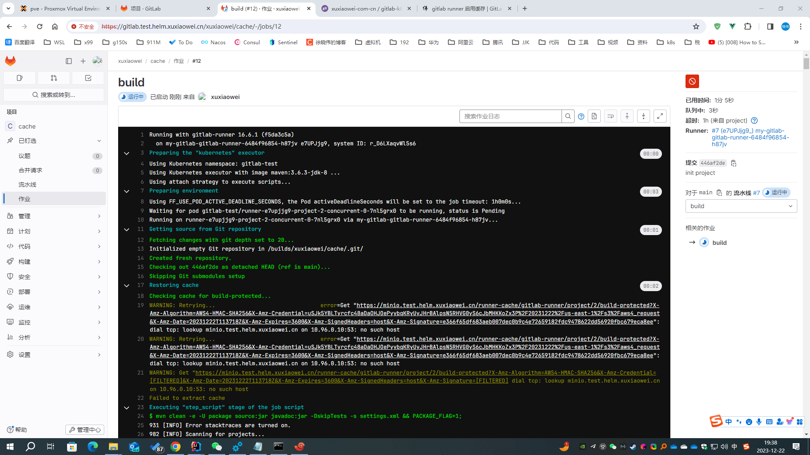
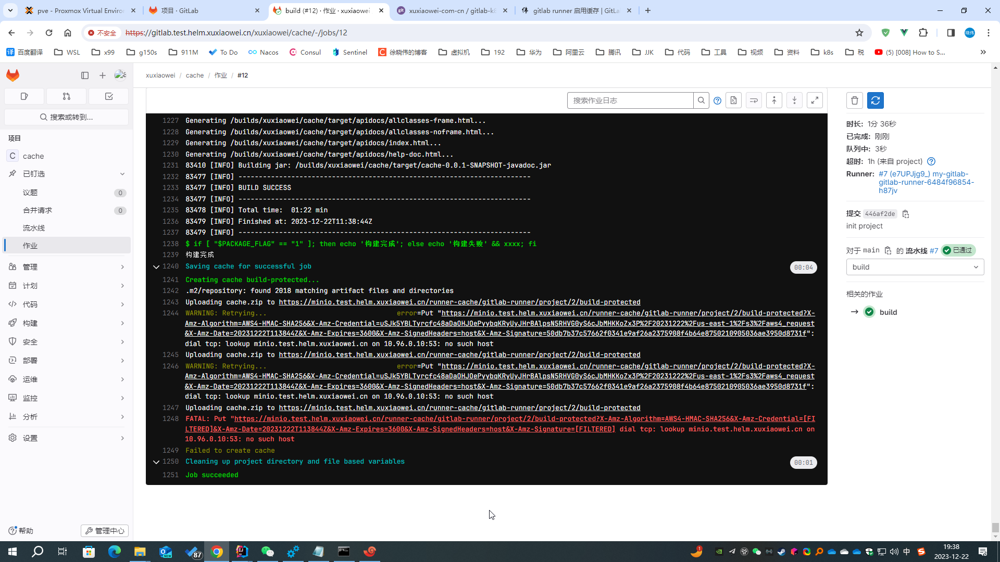
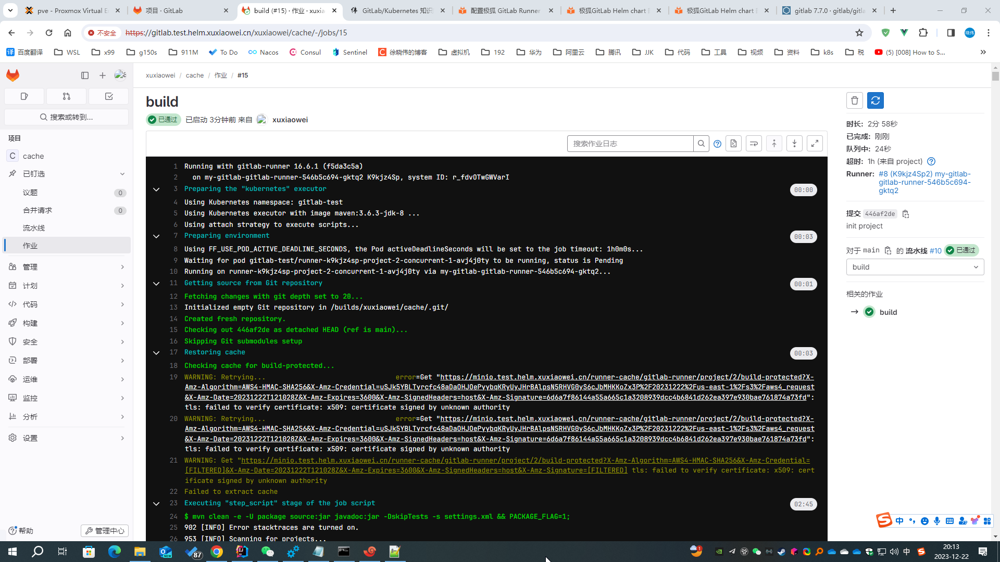
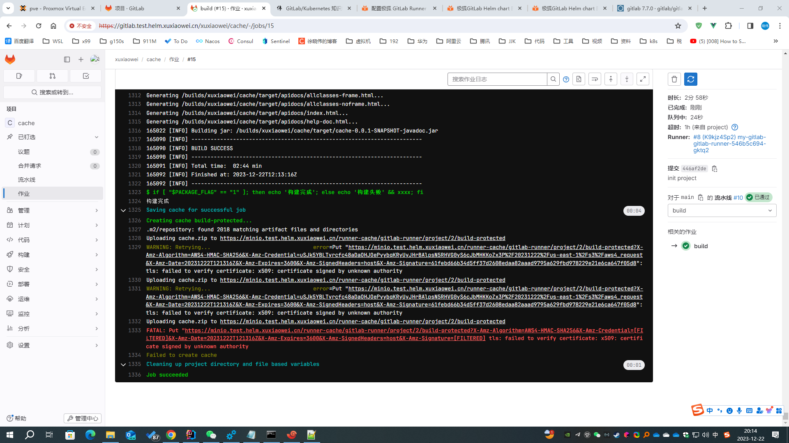

# GitLab Runner 添加 MinIO 域名 host

自定义 Gitlab Runner 使用的 MinIO 域名 host

## 问题

1. 实例项目：https://framagit.org/xuxiaowei-com-cn/cache.git ，分支：`maven`

2. 异常：

   

   

3. 分析

    1. 流水线作业运行开始，无法下载依赖，无法解析到 MinIO（缓存服务器）的 IP
    2. 流水线作业运行结束，无法上传依赖，无法解析到 MinIO（缓存服务器）的 IP

## 启用 GitLab Runner 缓存域名配置

1. 导出 helm gitlab 配置

    ```shell
    # 将已配置的值导出到文件中
    helm -n gitlab-test get values my-gitlab > my-gitlab.yaml
    ```

2. 查看 [gitlab runner 默认配置](https://artifacthub.io/packages/helm/gitlab/gitlab?modal=values)

    ```yaml
    # 此处为节选，不同版本可能会存在差异，请以 https://artifacthub.io/packages/helm/gitlab/gitlab?modal=values 中的配置为准
    gitlab-runner:
      runners:
        config: |
          [[runners]]
            [runners.kubernetes]
            image = "ubuntu:22.04"
            {{- if .Values.global.minio.enabled }}
            [runners.cache]
              Type = "s3"
              Path = "gitlab-runner"
              Shared = true
              [runners.cache.s3]
                ServerAddress = {{ include "gitlab-runner.cache-tpl.s3ServerAddress" . }}
                BucketName = "runner-cache"
                BucketLocation = "us-east-1"
                Insecure = false
            {{ end }}
    ```

3. 修改配置如下

    ```yaml
    gitlab-runner:
      runners:
        config: |
          [[runners]]
            [runners.kubernetes]
            image = "ubuntu:22.04"
            [[runners.kubernetes.host_aliases]]
            ip = "172.25.25.32"
            hostnames = [ "minio.test.helm.xuxiaowei.cn" ]
            {{- if .Values.global.minio.enabled }}
            [runners.cache]
              Type = "s3"
              Path = "gitlab-runner"
              Shared = true
              [runners.cache.s3]
                ServerAddress = {{ include "gitlab-runner.cache-tpl.s3ServerAddress" . }}
                BucketName = "runner-cache"
                BucketLocation = "us-east-1"
                Insecure = false
            {{ end }}
    ```

4. 更新配置

   ```shell
   helm upgrade -n gitlab-test --install my-gitlab gitlab/gitlab --timeout 600s -f my-gitlab.yaml
   ```

5. 等待所有 `gitlab-runner` 旧 `pod` 删除完成，新 `pod` 正常运行时，重试流水线，即可正确解析到 MinIO（缓存服务器）的 IP

   
   

6. 有上图可知，无法验证 MinIO（缓存服务器）域名证书，
   解决方案见：[gitlab runner 信任缓存域名证书配置](gitlab-runner-cache-trust-ssl.md)
