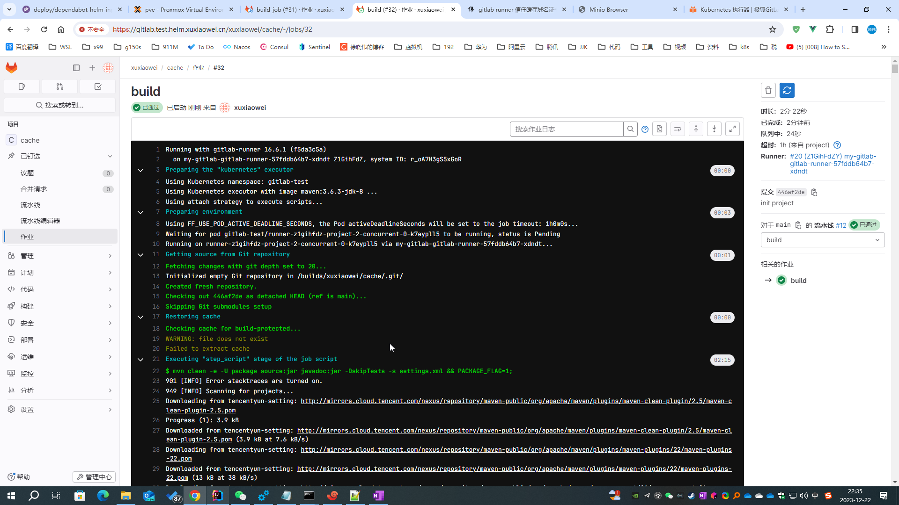
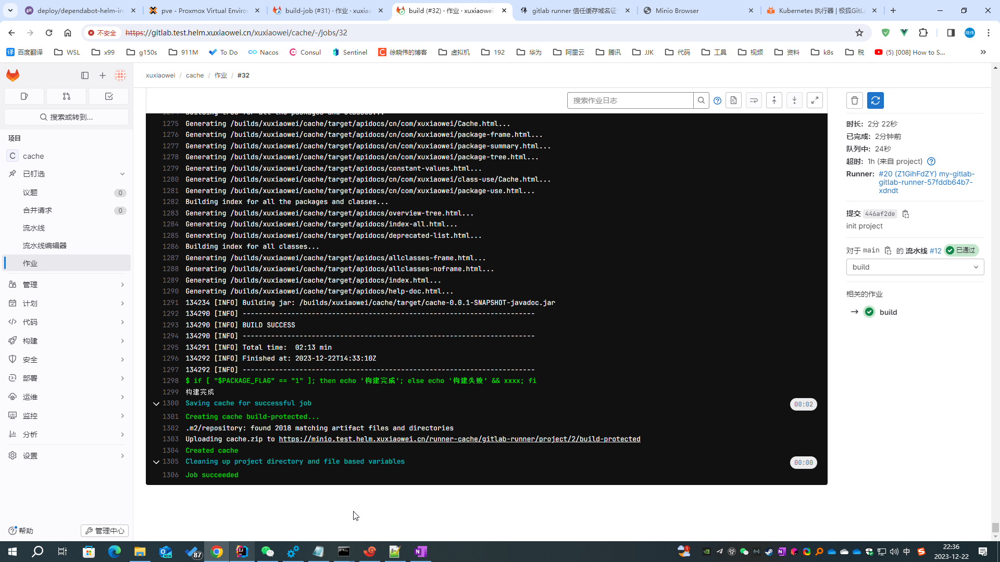
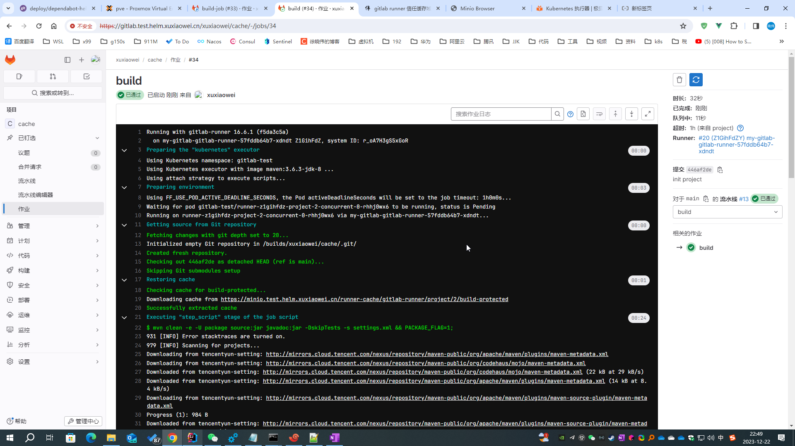

# GitLab Runner 信任缓存域名证书

Gitlab Runner 信任 MinIO 域名证书

## 问题参见：[gitlab runner 缓存域名配置](gitlab-runner-cache-host.md)

## 解决方案

### 下载证书

```shell
# 下载证书
openssl s_client -showcerts -connect minio.test.helm.xuxiaowei.cn:443 -servername minio.test.helm.xuxiaowei.cn < /dev/null 2>/dev/null | openssl x509 -outform PEM > minio.test.helm.xuxiaowei.cn.crt
```

### 将证书导入到 k8s 中

```shell
# -n=gitlab-test：指定命名空间
# create configmap minio-certs：创建 ConfigMap 名称是 minio-certs
# --from-file=minio.test.helm.xuxiaowei.cn.crt=minio.test.helm.xuxiaowei.cn.crt：配置来自文件，文件名 minio.test.helm.xuxiaowei.cn.crt，放入 ConfigMap 中的键也是 minio.test.helm.xuxiaowei.cn.crt
kubectl -n=gitlab-test create configmap minio-certs --from-file=minio.test.helm.xuxiaowei.cn.crt=minio.test.helm.xuxiaowei.cn.crt

# 查看
# kubectl -n=gitlab-test get configmap minio-certs -o yaml
```

### 导出 helm gitlab 配置

```shell
helm -n gitlab-test get values my-gitlab > my-gitlab.yaml
```

### 查看 [gitlab runner 默认配置](https://artifacthub.io/packages/helm/gitlab/gitlab?modal=values)

```yaml
# 此处为节选，不同版本可能会存在差异，请以 https://artifacthub.io/packages/helm/gitlab/gitlab?modal=values 中的配置为准
gitlab-runner:
  runners:
    config: |
      [[runners]]
        [runners.kubernetes]
        image = "ubuntu:22.04"
        {{- if .Values.global.minio.enabled }}
        [runners.cache]
          Type = "s3"
          Path = "gitlab-runner"
          Shared = true
          [runners.cache.s3]
            ServerAddress = {{ include "gitlab-runner.cache-tpl.s3ServerAddress" . }}
            BucketName = "runner-cache"
            BucketLocation = "us-east-1"
            Insecure = false
        {{ end }}
```

### 修改 helm gitlab 配置

```yaml
gitlab-runner:
  runners:
    config: |
      [[runners]]
        [runners.kubernetes]
        image = "ubuntu:22.04"

        # https://docs.gitlab.cn/runner/executors/kubernetes.html#configmap-%E5%8D%B7
        # https://docs.gitlab.cn/runner/executors/kubernetes.html#%E9%85%8D%E7%BD%AE%E5%8D%B7%E7%B1%BB%E5%9E%8B
        # https://kubernetes.io/zh-cn/docs/concepts/storage/volumes/
        # https://kubernetes.io/zh-cn/docs/tasks/configure-pod-container/configure-pod-configmap/
        [[runners.kubernetes.volumes.config_map]]
          name = "minio-certs"
          mount_path = "/etc/ssl/certs/minio.test.helm.xuxiaowei.cn.crt"
          sub_path = "minio.test.helm.xuxiaowei.cn.crt"
          [runners.kubernetes.volumes.config_map.items]
            "minio.test.helm.xuxiaowei.cn.crt" = "minio.test.helm.xuxiaowei.cn.crt"

        {{- if .Values.global.minio.enabled }}
        [runners.cache]
          Type = "s3"
          Path = "gitlab-runner"
          Shared = true
          [runners.cache.s3]
            ServerAddress = {{ include "gitlab-runner.cache-tpl.s3ServerAddress" . }}
            BucketName = "runner-cache"
            BucketLocation = "us-east-1"
            Insecure = false
        {{ end }}
```

### 更新 helm gitlab 配置

```shell
helm upgrade -n gitlab-test --install my-gitlab gitlab/gitlab -f my-gitlab.yaml --timeout 600s
```

### 查看修改结果

1. 等待所有 `gitlab-runner` 旧 `pod` 删除完成，新 `pod` 正常运行时，重试流水线，即可正确访问到 MinIO（缓存服务器）的 域名
    1. 首次运行，没有缓存服务器没有依赖，下载失败
       
    2. 首次运行成功，依赖上传至缓存服务器
       
    3. 后续运行，缓存服务器已经有依赖了，下载成功了，并且流水线时长大大缩短了
       
2. 查看配置如下

    ```shell
    [root@anolis-7-9 ~]# kubectl -n gitlab-test get pod | grep runner
    my-gitlab-gitlab-runner-57fddb64b7-xdndt             1/1     Running     0               10m
    runner-z1gihfdz-project-1-concurrent-0-k3h251j8      2/2     Running     0               20s
    [root@anolis-7-9 ~]# 
    ```

   注意，查看的是 <strong><font color="red">helper</font></strong> 容器，可以看到容器内已经有自己配置的证书了，
   所以才能信任 MinIO（缓存服务器）的 证书

    ```shell
    [root@anolis-7-9 ~]# kubectl -n gitlab-test exec -it runner-z1gihfdz-project-1-concurrent-0-k3h251j8 -c helper cat /etc/ssl/certs/minio.test.helm.xuxiaowei.cn.crt
    kubectl exec [POD] [COMMAND] is DEPRECATED and will be removed in a future version. Use kubectl exec [POD] -- [COMMAND] instead.
    -----BEGIN CERTIFICATE-----
    MIICqjCCAgugAwIBAgIQbha0RtIy+yeQHAEidwDJXzAKBggqhkjOPQQDBDAdMRsw
    GQYDVQQDExJjZXJ0LW1hbmFnZXIubG9jYWwwHhcNMjMxMjIyMDUwNTMyWhcNMjQw
    MzIxMDUwNTMyWjAVMRMwEQYDVQQFEwoxMjM0NTY3ODkwMIIBIjANBgkqhkiG9w0B
    AQEFAAOCAQ8AMIIBCgKCAQEAxoxsHstWtaaMLYDojvL5zw4C20ZkS3IJJ1u5S7Qv
    C1yiz3d6LrWnb7RSEWGO2ckZoYNRfHnDipEJnC8nY0BU2SvYfG8+sx80Fpyt1+5V
    TkMU8WSFnNtgPupojGEKsWRLEFg1lEu5mH36v1d0EO31/r7D69uO3rRbh7UpN9f6
    /BbJV/f+TpyDsAYEuZa2jqkRyR6KIDSQkQtZvVsSlpcB4Z3EQpCj31tOpufLjIxY
    qPGUrOcL9mIsc+wz+CvxQFU5n3H650F6p0AG/EzjZ6ClghPRxZrTLfY9iQP2zxnQ
    B941eW1y40nmHttmRg0whDJFU3i6VpALPE6Bv0w9X+bJtQIDAQABo2owaDAOBgNV
    HQ8BAf8EBAMCBaAwDAYDVR0TAQH/BAIwADAfBgNVHSMEGDAWgBRkqQQEnhfwEmG6
    AC+eFFOS91CTfDAnBgNVHREEIDAeghxtaW5pby50ZXN0LmhlbG0ueHV4aWFvd2Vp
    LmNuMAoGCCqGSM49BAMEA4GMADCBiAJCAaGgfzw1PYdr81UP/xpXE1tsYV+fYlDp
    oj/AJBtnUsaLonnVihknaEUe97aFstiiPkgu33C37evwUBZXneIKZ2+QAkIBchVK
    Q7ywP+X/8rSAse46rwNyx0y+svLnwUTp/sen2I/9EGVU20ESm5X1x/iyGNsmFNlb
    I8Bn2W7QLYcdpvAJ/wY=
    -----END CERTIFICATE-----
    [root@anolis-7-9 ~]# 
    ```
