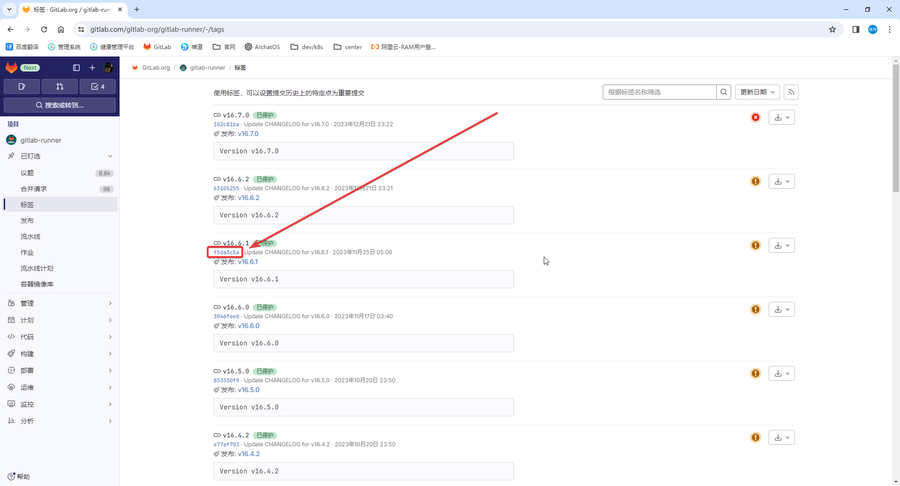

# GitLab Runner 配置帮助镜像

用于处理默认帮助镜像无法下载的问题

<strong><font color="red">如果能下载默认帮助镜像，请忽略此配置，除非默认帮助镜像无法满足你的需求。</font></strong>

## 配置

1. 查看正在运行的 job

    ```shell
    [root@anolis-7-9 ~]# kubectl -n gitlab-test get pod | grep runner
    my-gitlab-gitlab-runner-69b59f46f-h4h9s              1/1     Running     0              17m
    runner-lvpqhqhw-project-1-concurrent-0-oi5so634      2/2     Running     0              14s
    [root@anolis-7-9 ~]# 
    ```

2. 查看一个 job 的详情

    ```shell
    [root@anolis-7-9 ~]# kubectl -n gitlab-test describe pod runner-lvpqhqhw-project-1-concurrent-0-oi5so634
    Name:             runner-lvpqhqhw-project-1-concurrent-0-oi5so634
    Namespace:        gitlab-test
    Priority:         0
    Service Account:  default
    Node:             anolis-7-7/172.25.25.31
    Start Time:       Fri, 22 Dec 2023 16:48:21 +0800
    Labels:           pod=runner-lvpqhqhw-project-1-concurrent-0
    Annotations:      cni.projectcalico.org/containerID: 0c9dc8d8fcdea6d6bd725f19fdc4930031037be39913471979465bc9f3b0e7a8
    cni.projectcalico.org/podIP: 192.168.240.102/32
    cni.projectcalico.org/podIPs: 192.168.240.102/32
    job.runner.gitlab.com/before_sha: 0000000000000000000000000000000000000000
    job.runner.gitlab.com/id: 3
    job.runner.gitlab.com/name: build-job
    job.runner.gitlab.com/ref: main
    job.runner.gitlab.com/sha: 1989c02f32ea5d2a2d06630711c5a3b895e0ad1e
    job.runner.gitlab.com/url: https://gitlab.test.helm.xuxiaowei.cn/xuxiaowei/sleep/-/jobs/3
    project.runner.gitlab.com/id: 1
    Status:           Running
    IP:               192.168.240.102
    IPs:
    IP:  192.168.240.102
    Init Containers:
    init-permissions:
    Container ID:  containerd://5f54744ab81f83c2bb74e3db512eef7400a6c90c8b605d8c845c6917781355db
    Image:         registry.gitlab.com/gitlab-org/gitlab-runner/gitlab-runner-helper:x86_64-f5da3c5a
    Image ID:      registry.gitlab.com/gitlab-org/gitlab-runner/gitlab-runner-helper@sha256:8c79152aed93973ee94ff532e32dab167ef5ce34ec0aef072f07097d587821a8
    Port:          <none>
    Host Port:     <none>
    Command:
    sh
    -c
    touch /logs-1-3/output.log && (chmod 777 /logs-1-3/output.log || exit 0)
    State:          Terminated
    Reason:       Completed
    Exit Code:    0
    Started:      Fri, 22 Dec 2023 16:48:21 +0800
    Finished:     Fri, 22 Dec 2023 16:48:21 +0800
    Ready:          True
    Restart Count:  0
    Environment:    <none>
    Mounts:
    /builds from repo (rw)
    /logs-1-3 from logs (rw)
    /scripts-1-3 from scripts (rw)
    /var/run/secrets/kubernetes.io/serviceaccount from kube-api-access-5dxbx (ro)
    Containers:
    build:
    Container ID:  containerd://c0aff1274b672583a549eaa9c435c0ef92d21fb96ffe5adfea82d3b4b84dd69a
    Image:         ubuntu:22.04
    Image ID:      docker.io/library/ubuntu@sha256:6042500cf4b44023ea1894effe7890666b0c5c7871ed83a97c36c76ae560bb9b
    Port:          <none>
    Host Port:     <none>
    Command:
    sh
    -c
    if [ -x /usr/local/bin/bash ]; then
    exec /usr/local/bin/bash
    elif [ -x /usr/bin/bash ]; then
    exec /usr/bin/bash
    elif [ -x /bin/bash ]; then
    exec /bin/bash
    elif [ -x /usr/local/bin/sh ]; then
    exec /usr/local/bin/sh
    elif [ -x /usr/bin/sh ]; then
    exec /usr/bin/sh
    elif [ -x /bin/sh ]; then
    exec /bin/sh
    elif [ -x /busybox/sh ]; then
    exec /busybox/sh
    else
    echo shell not found
    exit 1
    fi
    
    
        State:          Running
          Started:      Fri, 22 Dec 2023 16:48:22 +0800
        Ready:          True
        Restart Count:  0
        Environment:
          FF_CMD_DISABLE_DELAYED_ERROR_LEVEL_EXPANSION:  false
          FF_NETWORK_PER_BUILD:                          false
          FF_USE_LEGACY_KUBERNETES_EXECUTION_STRATEGY:   false
          FF_USE_DIRECT_DOWNLOAD:                        true
          FF_SKIP_NOOP_BUILD_STAGES:                     true
          FF_USE_FASTZIP:                                false
          FF_DISABLE_UMASK_FOR_DOCKER_EXECUTOR:          false
          FF_ENABLE_BASH_EXIT_CODE_CHECK:                false
          FF_USE_WINDOWS_LEGACY_PROCESS_STRATEGY:        true
          FF_USE_NEW_BASH_EVAL_STRATEGY:                 false
          FF_USE_POWERSHELL_PATH_RESOLVER:               false
          FF_USE_DYNAMIC_TRACE_FORCE_SEND_INTERVAL:      false
          FF_SCRIPT_SECTIONS:                            false
          FF_USE_NEW_SHELL_ESCAPE:                       false
          FF_ENABLE_JOB_CLEANUP:                         false
          FF_KUBERNETES_HONOR_ENTRYPOINT:                false
          FF_POSIXLY_CORRECT_ESCAPES:                    false
          FF_USE_IMPROVED_URL_MASKING:                   false
          FF_RESOLVE_FULL_TLS_CHAIN:                     false
          FF_DISABLE_POWERSHELL_STDIN:                   false
          FF_USE_POD_ACTIVE_DEADLINE_SECONDS:            true
          FF_USE_ADVANCED_POD_SPEC_CONFIGURATION:        false
          FF_SET_PERMISSIONS_BEFORE_CLEANUP:             true
          FF_SECRET_RESOLVING_FAILS_IF_MISSING:          true
          FF_RETRIEVE_POD_WARNING_EVENTS:                false
          FF_PRINT_POD_EVENTS:                           false
          FF_USE_GIT_BUNDLE_URIS:                        true
          FF_USE_DUMB_INIT_WITH_KUBERNETES_EXECUTOR:     false
          FF_USE_INIT_WITH_DOCKER_EXECUTOR:              false
          CI_RUNNER_SHORT_TOKEN:                         LVPqHQhW
          CI_BUILDS_DIR:                                 /builds
          CI_PROJECT_DIR:                                /builds/xuxiaowei/sleep
          CI_CONCURRENT_ID:                              0
          CI_CONCURRENT_PROJECT_ID:                      0
          CI_SERVER:                                     yes
          CI_JOB_STATUS:                                 running
          CI_JOB_TIMEOUT:                                3600
          CI_SERVER_TLS_CA_FILE:                         /builds/xuxiaowei/sleep.tmp/CI_SERVER_TLS_CA_FILE
          CI_PIPELINE_ID:                                2
          CI_PIPELINE_URL:                               https://gitlab.test.helm.xuxiaowei.cn/xuxiaowei/sleep/-/pipelines/2
          CI_JOB_ID:                                     3
          CI_JOB_URL:                                    https://gitlab.test.helm.xuxiaowei.cn/xuxiaowei/sleep/-/jobs/3
          CI_JOB_STARTED_AT:                             2023-12-22T16:48:20+08:00
          CI_REGISTRY_USER:                              gitlab-ci-token
          CI_JOB_NAME:                                   build-job
          CI_JOB_NAME_SLUG:                              build-job
          CI_JOB_STAGE:                                  build
          CI_NODE_TOTAL:                                 1
          CI:                                            true
          GITLAB_CI:                                     true
          CI_SERVER_URL:                                 https://gitlab.test.helm.xuxiaowei.cn
          CI_SERVER_HOST:                                gitlab.test.helm.xuxiaowei.cn
          CI_SERVER_PORT:                                443
          CI_SERVER_PROTOCOL:                            https
          CI_SERVER_SHELL_SSH_HOST:                      gitlab.test.helm.xuxiaowei.cn
          CI_SERVER_SHELL_SSH_PORT:                      22
          CI_SERVER_NAME:                                GitLab
          CI_SERVER_VERSION:                             16.7.0-ee
          CI_SERVER_VERSION_MAJOR:                       16
          CI_SERVER_VERSION_MINOR:                       7
          CI_SERVER_VERSION_PATCH:                       0
          CI_SERVER_REVISION:                            9e7d34f7ff1
          GITLAB_FEATURES:                               
          CI_PROJECT_ID:                                 1
          CI_PROJECT_NAME:                               sleep
          CI_PROJECT_TITLE:                              sleep
          CI_PROJECT_DESCRIPTION:                        
          CI_PROJECT_PATH:                               xuxiaowei/sleep
          CI_PROJECT_PATH_SLUG:                          xuxiaowei-sleep
          CI_PROJECT_NAMESPACE:                          xuxiaowei
          CI_PROJECT_NAMESPACE_ID:                       2
          CI_PROJECT_ROOT_NAMESPACE:                     xuxiaowei
          CI_PROJECT_URL:                                https://gitlab.test.helm.xuxiaowei.cn/xuxiaowei/sleep
          CI_PROJECT_VISIBILITY:                         private
          CI_PROJECT_REPOSITORY_LANGUAGES:               
          CI_PROJECT_CLASSIFICATION_LABEL:               
          CI_DEFAULT_BRANCH:                             main
          CI_CONFIG_PATH:                                .gitlab-ci.yml
          CI_PAGES_DOMAIN:                               pages.test.helm.xuxiaowei.cn
          CI_PAGES_URL:                                  https://xuxiaowei.pages.test.helm.xuxiaowei.cn/sleep
          CI_REGISTRY:                                   registry.test.helm.xuxiaowei.cn
          CI_REGISTRY_IMAGE:                             registry.test.helm.xuxiaowei.cn/xuxiaowei/sleep
          CI_API_V4_URL:                                 https://gitlab.test.helm.xuxiaowei.cn/api/v4
          CI_API_GRAPHQL_URL:                            https://gitlab.test.helm.xuxiaowei.cn/api/graphql
          CI_TEMPLATE_REGISTRY_HOST:                     registry.gitlab.com
          CI_PIPELINE_IID:                               2
          CI_PIPELINE_SOURCE:                            web
          CI_PIPELINE_CREATED_AT:                        2023-12-22T16:47:55+08:00
          CI_PIPELINE_NAME:                              
          CI_COMMIT_SHA:                                 1989c02f32ea5d2a2d06630711c5a3b895e0ad1e
          CI_COMMIT_SHORT_SHA:                           1989c02f
          CI_COMMIT_BEFORE_SHA:                          0000000000000000000000000000000000000000
          CI_COMMIT_REF_NAME:                            main
          CI_COMMIT_REF_SLUG:                            main
          CI_COMMIT_BRANCH:                              main
          CI_COMMIT_MESSAGE:                             add .gitlab-ci.yml
          CI_COMMIT_TITLE:                               add .gitlab-ci.yml
          CI_COMMIT_DESCRIPTION:                         
          CI_COMMIT_REF_PROTECTED:                       true
          CI_COMMIT_TIMESTAMP:                           2023-12-22T08:04:07+00:00
          CI_COMMIT_AUTHOR:                              徐晓伟 <xuxiaowei@xuxiaowei.com.cn>
          CI_RUNNER_ID:                                  3
          CI_RUNNER_DESCRIPTION:                         my-gitlab-gitlab-runner-69b59f46f-h4h9s
          CI_RUNNER_TAGS:                                []
          SLEEP_TIME:                                    600
          GITLAB_USER_ID:                                2
          GITLAB_USER_EMAIL:                             xuxiaowei@xuxiaowei.com.cn
          GITLAB_USER_LOGIN:                             xuxiaowei
          GITLAB_USER_NAME:                              xuxiaowei
          CI_DISPOSABLE_ENVIRONMENT:                     true
          CI_RUNNER_VERSION:                             16.6.1
          CI_RUNNER_REVISION:                            f5da3c5a
          CI_RUNNER_EXECUTABLE_ARCH:                     linux/amd64
          RUNNER_TEMP_PROJECT_DIR:                       /builds/xuxiaowei/sleep.tmp
        Mounts:
          /builds from repo (rw)
          /logs-1-3 from logs (rw)
          /scripts-1-3 from scripts (rw)
          /var/run/secrets/kubernetes.io/serviceaccount from kube-api-access-5dxbx (ro)
    helper:
    Container ID:  containerd://caeed8435cd7cf9a2a1950f00aafcfae42c49e1c4d0e057a03e544bcfe9e4ddb
    Image:         registry.gitlab.com/gitlab-org/gitlab-runner/gitlab-runner-helper:x86_64-f5da3c5a
    Image ID:      registry.gitlab.com/gitlab-org/gitlab-runner/gitlab-runner-helper@sha256:8c79152aed93973ee94ff532e32dab167ef5ce34ec0aef072f07097d587821a8
    Port:          <none>
    Host Port:     <none>
    Command:
    sh
    -c
    if [ -x /usr/local/bin/bash ]; then
    exec /usr/local/bin/bash
    elif [ -x /usr/bin/bash ]; then
    exec /usr/bin/bash
    elif [ -x /bin/bash ]; then
    exec /bin/bash
    elif [ -x /usr/local/bin/sh ]; then
    exec /usr/local/bin/sh
    elif [ -x /usr/bin/sh ]; then
    exec /usr/bin/sh
    elif [ -x /bin/sh ]; then
    exec /bin/sh
    elif [ -x /busybox/sh ]; then
    exec /busybox/sh
    else
    echo shell not found
    exit 1
    fi
    
    
        State:          Running
          Started:      Fri, 22 Dec 2023 16:48:22 +0800
        Ready:          True
        Restart Count:  0
        Environment:    <none>
        Mounts:
          /builds from repo (rw)
          /logs-1-3 from logs (rw)
          /scripts-1-3 from scripts (rw)
          /var/run/secrets/kubernetes.io/serviceaccount from kube-api-access-5dxbx (ro)
    Conditions:
    Type              Status
    Initialized       True
    Ready             True
    ContainersReady   True
    PodScheduled      True
    Volumes:
    repo:
    Type:       EmptyDir (a temporary directory that shares a pod's lifetime)
    Medium:     
    SizeLimit:  <unset>
    scripts:
    Type:       EmptyDir (a temporary directory that shares a pod's lifetime)
    Medium:     
    SizeLimit:  <unset>
    logs:
    Type:       EmptyDir (a temporary directory that shares a pod's lifetime)
    Medium:     
    SizeLimit:  <unset>
    kube-api-access-5dxbx:
    Type:                    Projected (a volume that contains injected data from multiple sources)
    TokenExpirationSeconds:  3607
    ConfigMapName:           kube-root-ca.crt
    ConfigMapOptional:       <nil>
    DownwardAPI:             true
    QoS Class:                   BestEffort
    Node-Selectors:              <none>
    Tolerations:                 node.kubernetes.io/not-ready:NoExecute op=Exists for 300s
    node.kubernetes.io/unreachable:NoExecute op=Exists for 300s
    Events:
    Type    Reason     Age   From               Message
      ----    ------     ----  ----               -------
    Normal  Scheduled  118s  default-scheduler  Successfully assigned gitlab-test/runner-lvpqhqhw-project-1-concurrent-0-oi5so634 to anolis-7-7
    Normal  Pulled     118s  kubelet            Container image "registry.gitlab.com/gitlab-org/gitlab-runner/gitlab-runner-helper:x86_64-f5da3c5a" already present on machine
    Normal  Created    118s  kubelet            Created container init-permissions
    Normal  Started    118s  kubelet            Started container init-permissions
    Normal  Pulled     117s  kubelet            Container image "ubuntu:22.04" already present on machine
    Normal  Created    117s  kubelet            Created container build
    Normal  Started    117s  kubelet            Started container build
    Normal  Pulled     117s  kubelet            Container image "registry.gitlab.com/gitlab-org/gitlab-runner/gitlab-runner-helper:x86_64-f5da3c5a" already present on machine
    Normal  Created    117s  kubelet            Created container helper
    Normal  Started    117s  kubelet            Started container helper
    [root@anolis-7-9 ~]# 
    ```

3. 根据日志中的事件可知，
   使用的帮助镜像是 `registry.gitlab.com/gitlab-org/gitlab-runner/gitlab-runner-helper:x86_64-f5da3c5a`，
   有可能会拉取失败，可以自定义拉取镜像名称。

   如果无法访问 registry.gitlab.com 域名或拉取镜像速度较慢，可使用
   [docker hub 镜像](https://hub.docker.com/r/gitlab/gitlab-runner)、
   [作者 docker hub 镜像](https://hub.docker.com/r/xuxiaoweicomcn/gitlab-runner-helper)

   其中镜像标签 `f5da3c5a` 代表提交的 SHA 值，可通过网址 https://gitlab.com/gitlab-org/gitlab-runner/-/tags 查看语义化版本号，
   一般可直接使用与 gitlab 相近的 gitlab 帮助镜像版本

   

4. 导出 helm gitlab 配置

    ```shell
    # 将已配置的值导出到文件中
    helm -n gitlab-test get values my-gitlab > my-gitlab.yaml
    ```

5. 查看 [gitlab runner 默认配置](https://artifacthub.io/packages/helm/gitlab/gitlab?modal=values)

    ```yaml
    # 此处为节选，不同版本可能会存在差异，请以 https://artifacthub.io/packages/helm/gitlab/gitlab?modal=values 中的配置为准
    gitlab-runner:
      runners:
        config: |
          [[runners]]
            [runners.kubernetes]
            image = "ubuntu:22.04"
            {{- if .Values.global.minio.enabled }}
            [runners.cache]
              Type = "s3"
              Path = "gitlab-runner"
              Shared = true
              [runners.cache.s3]
                ServerAddress = {{ include "gitlab-runner.cache-tpl.s3ServerAddress" . }}
                BucketName = "runner-cache"
                BucketLocation = "us-east-1"
                Insecure = false
            {{ end }}
    ```

6. 自定义帮助镜像

    ```yaml
    gitlab-runner:
      runners:
        config: |
          [[runners]]
            [runners.kubernetes]
            image = "ubuntu:22.04"
            # 由上文可知
            helper_image = "gitlab/gitlab-runner:v16.6.1"
            {{- if .Values.global.minio.enabled }}
            [runners.cache]
              Type = "s3"
              Path = "gitlab-runner"
              Shared = true
              [runners.cache.s3]
                ServerAddress = {{ include "gitlab-runner.cache-tpl.s3ServerAddress" . }}
                BucketName = "runner-cache"
                BucketLocation = "us-east-1"
                Insecure = false
            {{ end }}
    ```

7. 更新 helm gitlab 配置

    ```shell
    helm upgrade -n gitlab-test --install my-gitlab gitlab/gitlab -f my-gitlab.yaml --timeout 600s
    ```

8. 等待所有 `gitlab-runner` 旧 `pod` 删除完成，新 `pod` 正常运行时，重试流水线，查看一个 job 的详情

```shell
[root@anolis-7-9 ~]# kubectl -n gitlab-test get pod | grep runner
my-gitlab-gitlab-runner-5787986c8-bqp29              1/1     Running     0              5m10s
runner-kfhsaz5h-project-1-concurrent-0-zsd6i493      2/2     Running     0              2m38s
[root@anolis-7-9 ~]# 
```

```shell
[root@anolis-7-9 ~]# kubectl -n gitlab-test describe pod runner-kfhsaz5h-project-1-concurrent-0-zsd6i493
# 节选
Events:
  Type    Reason     Age   From               Message
  ----    ------     ----  ----               -------
  Normal  Scheduled  2m7s  default-scheduler  Successfully assigned gitlab-test/runner-kfhsaz5h-project-1-concurrent-0-zsd6i493 to anolis-7-7
  Normal  Pulling    2m6s  kubelet            Pulling image "gitlab/gitlab-runner:v16.6.1"
  Normal  Pulled     76s   kubelet            Successfully pulled image "gitlab/gitlab-runner:v16.6.1" in 50.091s (50.091s including waiting)
  Normal  Created    76s   kubelet            Created container init-permissions
  Normal  Started    76s   kubelet            Started container init-permissions
  Normal  Pulled     75s   kubelet            Container image "ubuntu:22.04" already present on machine
  Normal  Created    75s   kubelet            Created container build
  Normal  Started    75s   kubelet            Started container build
  Normal  Pulled     75s   kubelet            Container image "gitlab/gitlab-runner:v16.6.1" already present on machine
  Normal  Created    75s   kubelet            Created container helper
  Normal  Started    75s   kubelet            Started container helper
[root@anolis-7-9 ~]# 
```
