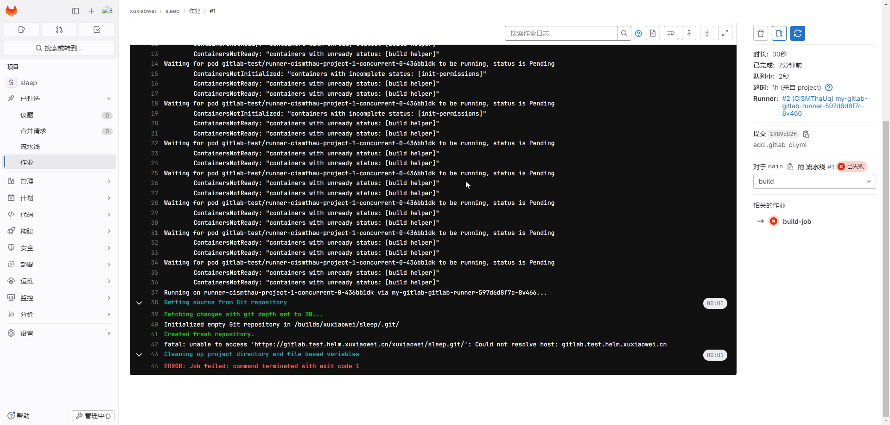
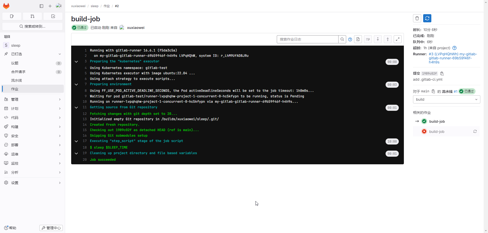

# gitlab runner job 添加 gitlab 域名 host

## 问题

1. 测试项目公开地址：https://framagit.org/xuxiaowei-com-cn/sleep ，分支：`host`
2. 流水线配置
    ```yaml
    stages:
       - build
    
    build-job:
       stage: build
       variables:
          # 环境变量
          SLEEP_TIME: 600
       script:
          # 延时一段时间，从环境变量中获取
          - sleep $SLEEP_TIME
    ```
3. 流水线执行日志如下
   
4. 问题原因：未解析 gitlab.test.helm.xuxiaowei.cn 域名

## 解决办法

1. 导出 helm gitlab 配置

    ```shell
    # 将已配置的值导出到文件中
    helm -n gitlab-test get values my-gitlab > my-gitlab.yaml
    ```

2. 查看 [gitlab runner 默认配置](https://artifacthub.io/packages/helm/gitlab/gitlab?modal=values)

    ```yaml
    # 此处为节选，不同版本可能会存在差异，请以 https://artifacthub.io/packages/helm/gitlab/gitlab?modal=values 中的配置为准
    gitlab-runner:
      runners:
        config: |
          [[runners]]
            [runners.kubernetes]
            image = "ubuntu:22.04"
            {{- if .Values.global.minio.enabled }}
            [runners.cache]
              Type = "s3"
              Path = "gitlab-runner"
              Shared = true
              [runners.cache.s3]
                ServerAddress = {{ include "gitlab-runner.cache-tpl.s3ServerAddress" . }}
                BucketName = "runner-cache"
                BucketLocation = "us-east-1"
                Insecure = false
            {{ end }}
    ```

3. 修改配置如下

    ```yaml
    gitlab-runner:
      runners:
        config: |
          [[runners]]
            [runners.kubernetes]
            image = "ubuntu:22.04"
            [[runners.kubernetes.host_aliases]]
            ip = "172.25.25.32"
            hostnames = [ "gitlab.test.helm.xuxiaowei.cn" ]
            {{- if .Values.global.minio.enabled }}
            [runners.cache]
              Type = "s3"
              Path = "gitlab-runner"
              Shared = true
              [runners.cache.s3]
                ServerAddress = {{ include "gitlab-runner.cache-tpl.s3ServerAddress" . }}
                BucketName = "runner-cache"
                BucketLocation = "us-east-1"
                Insecure = false
            {{ end }}
    ```

4. 更新配置

   ```shell
   helm upgrade -n gitlab-test --install my-gitlab gitlab/gitlab --timeout 600s -f my-gitlab.yaml
   ```

5. 等待所有 `gitlab-runner` 旧 `pod` 删除完成，新 `pod` 正常运行时，重试流水线，即可正常检查代码
   

6. 说明

检出代码与当前 `.gitlab-ci.yml` 使用的什么镜像无关（比如说：在 `.gitlab-ci.yml` 中使用的镜像中无 `git`，也可以正常运行）
