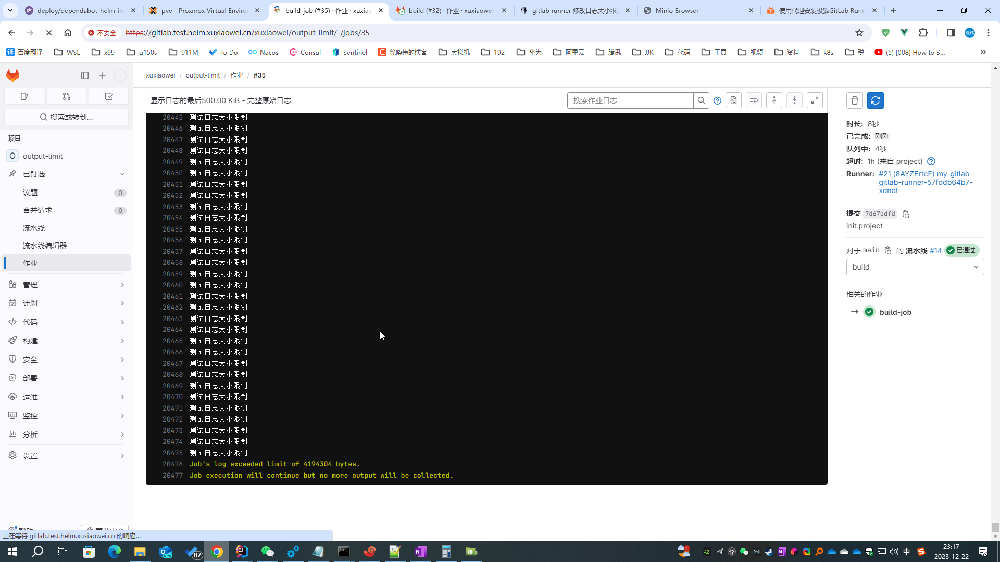
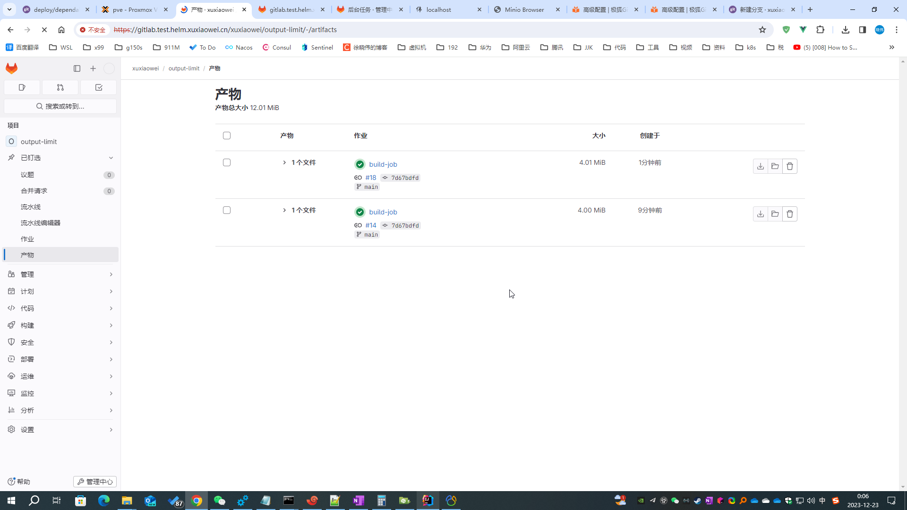

# GitLab Runner 修改日志大小限制

调整 Gitlab Runner 日志大小限制

## 问题

1. 测试项目：https://framagit.org/xuxiaowei-com-cn/output-limit ，分支：`count-168000`

2. 作业异常

   

3. 说明
    1. 根据文档 [GitLab Runner 高级配置](https://docs.gitlab.cn/runner/configuration/advanced-configuration.html) 的
       output_limit 属性可知，日志默认最大大小是 4M
    2. 直接下载原始日志，日志大小也是 4M

## 解决方案

### 导出 helm gitlab 配置

```shell
helm -n gitlab-test get values my-gitlab > my-gitlab.yaml
```

### 查看 [gitlab runner 默认配置](https://artifacthub.io/packages/helm/gitlab/gitlab?modal=values)

```yaml
# 此处为节选，不同版本可能会存在差异，请以 https://artifacthub.io/packages/helm/gitlab/gitlab?modal=values 中的配置为准
gitlab-runner:
  runners:
    config: |
      [[runners]]
        [runners.kubernetes]
        image = "ubuntu:22.04"
        {{- if .Values.global.minio.enabled }}
        [runners.cache]
          Type = "s3"
          Path = "gitlab-runner"
          Shared = true
          [runners.cache.s3]
            ServerAddress = {{ include "gitlab-runner.cache-tpl.s3ServerAddress" . }}
            BucketName = "runner-cache"
            BucketLocation = "us-east-1"
            Insecure = false
        {{ end }}
```

### 修改 helm gitlab 配置

```yaml
gitlab-runner:
  runners:
    config: |
      [[runners]]
        
        output_limit = 41943040
        
        [runners.kubernetes]
        image = "ubuntu:22.04"
        {{- if .Values.global.minio.enabled }}
        [runners.cache]
          Type = "s3"
          Path = "gitlab-runner"
          Shared = true
          [runners.cache.s3]
            ServerAddress = {{ include "gitlab-runner.cache-tpl.s3ServerAddress" . }}
            BucketName = "runner-cache"
            BucketLocation = "us-east-1"
            Insecure = false
        {{ end }}
```

### 更新 helm gitlab 配置

```shell
helm upgrade -n gitlab-test --install my-gitlab gitlab/gitlab -f my-gitlab.yaml --timeout 600s
```

### 查看修改结果

1. 等待所有 `gitlab-runner` 旧 `pod` 删除完成，新 `pod` 正常运行时，重试流水线，看到没有触发流水线日志大小的限制了
2. 下载日志，可以看到日志大小为 4104 KB，已经超过了 4M
3. 查看产物，可以看到日志大小超过 4M
    
