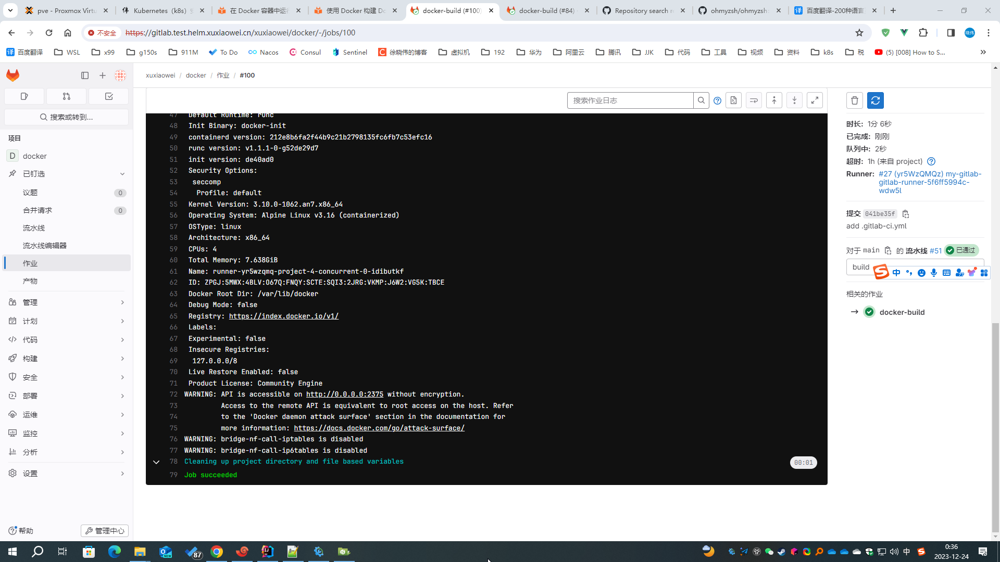

# GitLab Runner 特权身份运行

Gitlab Runner 使用特权身份运行

## 问题

1. 安装/升级时，提示内容一下：`docker in docker` 需要 `特权身份` 运行，
   如果已经设置了特权身份运行，则不会提示下方 GitLab Runner 警告，但是还是无法使用 `docker in docker`，会出现下一步的错误

    ```shell
    [root@anolis-7-9 ~]# helm upgrade -n gitlab-test --install my-gitlab gitlab/gitlab -f my-gitlab.yaml --timeout 600s
    Release "my-gitlab" has been upgraded. Happy Helming!
    NAME: my-gitlab
    LAST DEPLOYED: Sat Dec 23 21:20:46 2023
    NAMESPACE: gitlab-test
    STATUS: deployed
    REVISION: 28
    NOTES:
    === CRITICAL
    The following charts are included for evaluation purposes only. They will not be supported by GitLab Support
    for production workloads. Use Cloud Native Hybrid deployments for production. For more information visit
    https://docs.gitlab.com/charts/installation/index.html#use-the-reference-architectures.
    - PostgreSQL
    - Redis
    - Gitaly
    - MinIO
    
    === NOTICE
    The minimum required version of PostgreSQL is now 13. See https://gitlab.com/gitlab-org/charts/gitlab/-/blob/master/doc/installation/upgrade.md for more details.
    
    === NOTICE
    You've installed GitLab Runner without the ability to use 'docker in docker'.
    The GitLab Runner chart (gitlab/gitlab-runner) is deployed without the `privileged` flag by default for security purposes. This can be changed by setting `gitlab-runner.runners.privileged` to `true`. Before doing so, please read the GitLab Runner chart's documentation on why we
    chose not to enable this by default. See https://docs.gitlab.com/runner/install/kubernetes.html#running-docker-in-docker-containers-with-gitlab-runners
    [root@anolis-7-9 ~]#
    ```

2. 如果没有设置 `特权身份` 运行，可能会遇见下方异常

   ```shell
   [root@anolis-7-9 ~]# kubectl -n gitlab-test get pod | grep runner
   my-gitlab-gitlab-runner-6bf49f49db-7jn8w 1/1 Running 4 (53m ago)    22h
   runner-q5jcztox-project-4-concurrent-0-ltmz9a7f 2/3 Error 0 37s
   [root@anolis-7-9 ~]#
   ```

   ```shell
   [root@anolis-7-9 ~]# kubectl -n gitlab-test logs -f runner-q5jcztox-project-4-concurrent-0-ltmz9a7f svc-0
   Certificate request self-signature ok
   subject=CN = docker:dind server
   /certs/server/cert.pem: OK
   Certificate request self-signature ok
   subject=CN = docker:dind client
   /certs/client/cert.pem: OK
   ip: can't find device 'nf_tables'
   nf_tables 74274 0
   nfnetlink 14519 4 ip_set,nf_tables,nf_conntrack_netlink
   modprobe: can't change directory to '/lib/modules': No such file or directory
   ip: can't find device 'ip_tables'
   ip_tables 27126 4 iptable_raw,iptable_mangle,iptable_nat,iptable_filter
   modprobe: can't change directory to '/lib/modules': No such file or directory
   mount: permission denied (are you root?)
   Could not mount /sys/kernel/security.
   AppArmor detection and --privileged mode might break.
   mount: permission denied (are you root?)
   [root@anolis-7-9 ~]# 
   ```

## 解决办法

1. 导出 helm gitlab 配置

    ```shell
    # 将已配置的值导出到文件中
    helm -n gitlab-test get values my-gitlab > my-gitlab.yaml
    ```

2. 查看 [gitlab runner 默认配置](https://artifacthub.io/packages/helm/gitlab/gitlab?modal=values)

    ```yaml
    # 此处为节选，不同版本可能会存在差异，请以 https://artifacthub.io/packages/helm/gitlab/gitlab?modal=values 中的配置为准
    gitlab-runner:
      runners:
        config: |
          [[runners]]
            [runners.kubernetes]
            image = "ubuntu:22.04"
            {{- if .Values.global.minio.enabled }}
            [runners.cache]
              Type = "s3"
              Path = "gitlab-runner"
              Shared = true
              [runners.cache.s3]
                ServerAddress = {{ include "gitlab-runner.cache-tpl.s3ServerAddress" . }}
                BucketName = "runner-cache"
                BucketLocation = "us-east-1"
                Insecure = false
            {{ end }}
    ```

3. 修改配置如下

    ```yaml
    gitlab-runner:
      runners:
        config: |
          [[runners]]
            [runners.kubernetes]
            
            # pod 使用特权身份运行
            privileged = true
            
            image = "ubuntu:22.04"
            {{- if .Values.global.minio.enabled }}
            [runners.cache]
              Type = "s3"
              Path = "gitlab-runner"
              Shared = true
              [runners.cache.s3]
                ServerAddress = {{ include "gitlab-runner.cache-tpl.s3ServerAddress" . }}
                BucketName = "runner-cache"
                BucketLocation = "us-east-1"
                Insecure = false
            {{ end }}
    ```

4. 更新配置

   ```shell
   # GitLab Runner 使用特权身份运行
   helm upgrade -n gitlab-test --install my-gitlab gitlab/gitlab --timeout 600s -f my-gitlab.yaml --set gitlab-runner.runners.privileged=true
   ```

5. 等待所有 `gitlab-runner` 旧 `pod` 删除完成，新 `pod` 正常运行时，重试流水线，即可使用 `docker in docker`

   ```shell
   [root@anolis-7-9 ~]# kubectl -n gitlab-test get pod | grep runner
   my-gitlab-gitlab-runner-5f6ff5994c-wdw5l             1/1     Running     0                115m
   runner-yr5wzqmq-project-4-concurrent-0-idibutkf      3/3     Running     0                4s
   [root@anolis-7-9 ~]#
   ```

   注意此处查看的是 <strong><font color="red">svc-0</font></strong> 的日志，即：services docker 的日志，
   多个 services 时按顺序排序

   ```shell
   [root@anolis-7-9 ~]# kubectl -n gitlab-test logs -f runner-yr5wzqmq-project-4-concurrent-0-idibutkf svc-0 
   time="2023-12-23T16:34:27.467258283Z" level=info msg="Starting up"
   time="2023-12-23T16:34:27.469102439Z" level=warning msg="could not change group /var/run/docker.sock to docker: group docker not found"
   time="2023-12-23T16:34:27.469335776Z" level=warning msg="Binding to IP address without --tlsverify is insecure and gives root access on this machine to everyone who has access to your network." host="tcp://0.0.0.0:2375"
   time="2023-12-23T16:34:27.469359429Z" level=warning msg="Binding to an IP address, even on localhost, can also give access to scripts run in a browser. Be safe out there!" host="tcp://0.0.0.0:2375"
   time="2023-12-23T16:34:28.469505651Z" level=warning msg="Binding to an IP address without --tlsverify is deprecated. Startup is intentionally being slowed down to show this message" host="tcp://0.0.0.0:2375"
   time="2023-12-23T16:34:28.469545042Z" level=warning msg="Please consider generating tls certificates with client validation to prevent exposing unauthenticated root access to your network" host="tcp://0.0.0.0:2375"
   time="2023-12-23T16:34:28.469555494Z" level=warning msg="You can override this by explicitly specifying '--tls=false' or '--tlsverify=false'" host="tcp://0.0.0.0:2375"
   time="2023-12-23T16:34:28.469568946Z" level=warning msg="Support for listening on TCP without authentication or explicit intent to run without authentication will be removed in the next release" host="tcp://0.0.0.0:2375"
   time="2023-12-23T16:34:43.473007148Z" level=info msg="libcontainerd: started new containerd process" pid=33
   time="2023-12-23T16:34:43.473101488Z" level=info msg="parsed scheme: \"unix\"" module=grpc
   time="2023-12-23T16:34:43.473114333Z" level=info msg="scheme \"unix\" not registered, fallback to default scheme" module=grpc
   time="2023-12-23T16:34:43.473147363Z" level=info msg="ccResolverWrapper: sending update to cc: {[{unix:///var/run/docker/containerd/containerd.sock  <nil> 0 <nil>}] <nil> <nil>}" module=grpc
   time="2023-12-23T16:34:43.473181211Z" level=info msg="ClientConn switching balancer to \"pick_first\"" module=grpc
   time="2023-12-23T16:34:43Z" level=warning msg="deprecated version : `1`, please switch to version `2`"
   time="2023-12-23T16:34:43.515744080Z" level=info msg="starting containerd" revision=212e8b6fa2f44b9c21b2798135fc6fb7c53efc16 version=v1.6.4
   time="2023-12-23T16:34:43.531630020Z" level=info msg="loading plugin \"io.containerd.content.v1.content\"..." type=io.containerd.content.v1
   time="2023-12-23T16:34:43.531804565Z" level=info msg="loading plugin \"io.containerd.snapshotter.v1.aufs\"..." type=io.containerd.snapshotter.v1
   time="2023-12-23T16:34:43.538312017Z" level=info msg="skip loading plugin \"io.containerd.snapshotter.v1.aufs\"..." error="aufs is not supported (modprobe aufs failed: exit status 1 \"ip: can't find device 'aufs'\\nmodprobe: can't change directory to '/lib/modules': No such file or directory\\n\"): skip plugin" type=io.containerd.snapshotter.v1
   time="2023-12-23T16:34:43.538412286Z" level=info msg="loading plugin \"io.containerd.snapshotter.v1.btrfs\"..." type=io.containerd.snapshotter.v1
   time="2023-12-23T16:34:43.538731958Z" level=info msg="skip loading plugin \"io.containerd.snapshotter.v1.btrfs\"..." error="path /var/lib/docker/containerd/daemon/io.containerd.snapshotter.v1.btrfs (xfs) must be a btrfs filesystem to be used with the btrfs snapshotter: skip plugin" type=io.containerd.snapshotter.v1
   time="2023-12-23T16:34:43.538767621Z" level=info msg="loading plugin \"io.containerd.snapshotter.v1.devmapper\"..." type=io.containerd.snapshotter.v1
   time="2023-12-23T16:34:43.538782676Z" level=warning msg="failed to load plugin io.containerd.snapshotter.v1.devmapper" error="devmapper not configured"
   time="2023-12-23T16:34:43.538792101Z" level=info msg="loading plugin \"io.containerd.snapshotter.v1.native\"..." type=io.containerd.snapshotter.v1
   time="2023-12-23T16:34:43.538972652Z" level=info msg="loading plugin \"io.containerd.snapshotter.v1.overlayfs\"..." type=io.containerd.snapshotter.v1
   time="2023-12-23T16:34:43.539265161Z" level=info msg="loading plugin \"io.containerd.snapshotter.v1.zfs\"..." type=io.containerd.snapshotter.v1
   time="2023-12-23T16:34:43.539441863Z" level=info msg="skip loading plugin \"io.containerd.snapshotter.v1.zfs\"..." error="path /var/lib/docker/containerd/daemon/io.containerd.snapshotter.v1.zfs must be a zfs filesystem to be used with the zfs snapshotter: skip plugin" type=io.containerd.snapshotter.v1
   time="2023-12-23T16:34:43.539459872Z" level=info msg="loading plugin \"io.containerd.metadata.v1.bolt\"..." type=io.containerd.metadata.v1
   time="2023-12-23T16:34:43.539554275Z" level=warning msg="could not use snapshotter devmapper in metadata plugin" error="devmapper not configured"
   time="2023-12-23T16:34:43.539571921Z" level=info msg="metadata content store policy set" policy=shared
   time="2023-12-23T16:34:43.541205021Z" level=info msg="loading plugin \"io.containerd.differ.v1.walking\"..." type=io.containerd.differ.v1
   time="2023-12-23T16:34:43.541252637Z" level=info msg="loading plugin \"io.containerd.event.v1.exchange\"..." type=io.containerd.event.v1
   time="2023-12-23T16:34:43.541272679Z" level=info msg="loading plugin \"io.containerd.gc.v1.scheduler\"..." type=io.containerd.gc.v1
   time="2023-12-23T16:34:43.541407221Z" level=info msg="loading plugin \"io.containerd.service.v1.introspection-service\"..." type=io.containerd.service.v1
   time="2023-12-23T16:34:43.541450967Z" level=info msg="loading plugin \"io.containerd.service.v1.containers-service\"..." type=io.containerd.service.v1
   time="2023-12-23T16:34:43.541468124Z" level=info msg="loading plugin \"io.containerd.service.v1.content-service\"..." type=io.containerd.service.v1
   time="2023-12-23T16:34:43.541488780Z" level=info msg="loading plugin \"io.containerd.service.v1.diff-service\"..." type=io.containerd.service.v1
   time="2023-12-23T16:34:43.541510847Z" level=info msg="loading plugin \"io.containerd.service.v1.images-service\"..." type=io.containerd.service.v1
   time="2023-12-23T16:34:43.543022895Z" level=info msg="loading plugin \"io.containerd.service.v1.leases-service\"..." type=io.containerd.service.v1
   time="2023-12-23T16:34:43.543105358Z" level=info msg="loading plugin \"io.containerd.service.v1.namespaces-service\"..." type=io.containerd.service.v1
   time="2023-12-23T16:34:43.543146490Z" level=info msg="loading plugin \"io.containerd.service.v1.snapshots-service\"..." type=io.containerd.service.v1
   time="2023-12-23T16:34:43.543314215Z" level=info msg="loading plugin \"io.containerd.runtime.v1.linux\"..." type=io.containerd.runtime.v1
   time="2023-12-23T16:34:43.543713683Z" level=info msg="loading plugin \"io.containerd.runtime.v2.task\"..." type=io.containerd.runtime.v2
   time="2023-12-23T16:34:43.543917845Z" level=info msg="loading plugin \"io.containerd.monitor.v1.cgroups\"..." type=io.containerd.monitor.v1
   time="2023-12-23T16:34:43.544701904Z" level=info msg="loading plugin \"io.containerd.service.v1.tasks-service\"..." type=io.containerd.service.v1
   time="2023-12-23T16:34:43.544758132Z" level=info msg="loading plugin \"io.containerd.grpc.v1.introspection\"..." type=io.containerd.grpc.v1
   time="2023-12-23T16:34:43.544778482Z" level=info msg="loading plugin \"io.containerd.internal.v1.restart\"..." type=io.containerd.internal.v1
   time="2023-12-23T16:34:43.544870050Z" level=info msg="loading plugin \"io.containerd.grpc.v1.containers\"..." type=io.containerd.grpc.v1
   time="2023-12-23T16:34:43.544905675Z" level=info msg="loading plugin \"io.containerd.grpc.v1.content\"..." type=io.containerd.grpc.v1
   time="2023-12-23T16:34:43.544964281Z" level=info msg="loading plugin \"io.containerd.grpc.v1.diff\"..." type=io.containerd.grpc.v1
   time="2023-12-23T16:34:43.544992194Z" level=info msg="loading plugin \"io.containerd.grpc.v1.events\"..." type=io.containerd.grpc.v1
   time="2023-12-23T16:34:43.545007550Z" level=info msg="loading plugin \"io.containerd.grpc.v1.healthcheck\"..." type=io.containerd.grpc.v1
   time="2023-12-23T16:34:43.545027513Z" level=info msg="loading plugin \"io.containerd.grpc.v1.images\"..." type=io.containerd.grpc.v1
   time="2023-12-23T16:34:43.545056889Z" level=info msg="loading plugin \"io.containerd.grpc.v1.leases\"..." type=io.containerd.grpc.v1
   time="2023-12-23T16:34:43.545075653Z" level=info msg="loading plugin \"io.containerd.grpc.v1.namespaces\"..." type=io.containerd.grpc.v1
   time="2023-12-23T16:34:43.545095993Z" level=info msg="loading plugin \"io.containerd.internal.v1.opt\"..." type=io.containerd.internal.v1
   time="2023-12-23T16:34:43.545466830Z" level=info msg="loading plugin \"io.containerd.grpc.v1.snapshots\"..." type=io.containerd.grpc.v1
   time="2023-12-23T16:34:43.545564033Z" level=info msg="loading plugin \"io.containerd.grpc.v1.tasks\"..." type=io.containerd.grpc.v1
   time="2023-12-23T16:34:43.545604555Z" level=info msg="loading plugin \"io.containerd.grpc.v1.version\"..." type=io.containerd.grpc.v1
   time="2023-12-23T16:34:43.545630506Z" level=info msg="loading plugin \"io.containerd.tracing.processor.v1.otlp\"..." type=io.containerd.tracing.processor.v1
   time="2023-12-23T16:34:43.545670690Z" level=info msg="skip loading plugin \"io.containerd.tracing.processor.v1.otlp\"..." error="no OpenTelemetry endpoint: skip plugin" type=io.containerd.tracing.processor.v1
   time="2023-12-23T16:34:43.545688192Z" level=info msg="loading plugin \"io.containerd.internal.v1.tracing\"..." type=io.containerd.internal.v1
   time="2023-12-23T16:34:43.545726357Z" level=error msg="failed to initialize a tracing processor \"otlp\"" error="no OpenTelemetry endpoint: skip plugin"
   time="2023-12-23T16:34:43.546085654Z" level=info msg=serving... address=/var/run/docker/containerd/containerd-debug.sock
   time="2023-12-23T16:34:43.546185861Z" level=info msg=serving... address=/var/run/docker/containerd/containerd.sock.ttrpc
   time="2023-12-23T16:34:43.546250880Z" level=info msg=serving... address=/var/run/docker/containerd/containerd.sock
   time="2023-12-23T16:34:43.546308828Z" level=info msg="containerd successfully booted in 0.031780s"
   time="2023-12-23T16:34:43.553104238Z" level=info msg="parsed scheme: \"unix\"" module=grpc
   time="2023-12-23T16:34:43.553132141Z" level=info msg="scheme \"unix\" not registered, fallback to default scheme" module=grpc
   time="2023-12-23T16:34:43.553169135Z" level=info msg="ccResolverWrapper: sending update to cc: {[{unix:///var/run/docker/containerd/containerd.sock  <nil> 0 <nil>}] <nil> <nil>}" module=grpc
   time="2023-12-23T16:34:43.553189870Z" level=info msg="ClientConn switching balancer to \"pick_first\"" module=grpc
   time="2023-12-23T16:34:43.555532743Z" level=info msg="parsed scheme: \"unix\"" module=grpc
   time="2023-12-23T16:34:43.555571303Z" level=info msg="scheme \"unix\" not registered, fallback to default scheme" module=grpc
   time="2023-12-23T16:34:43.555596960Z" level=info msg="ccResolverWrapper: sending update to cc: {[{unix:///var/run/docker/containerd/containerd.sock  <nil> 0 <nil>}] <nil> <nil>}" module=grpc
   time="2023-12-23T16:34:43.555618644Z" level=info msg="ClientConn switching balancer to \"pick_first\"" module=grpc
   time="2023-12-23T16:34:43.574453031Z" level=info msg="Loading containers: start."
   time="2023-12-23T16:34:43.584406471Z" level=warning msg="Running modprobe bridge br_netfilter failed with message: ip: can't find device 'bridge'\nbridge                151336  1 br_netfilter\nstp                    12976  1 bridge\nllc                    14552  2 bridge,stp\nip: can't find device 'br_netfilter'\nbr_netfilter           22256  0 \nbridge                151336  1 br_netfilter\nmodprobe: can't change directory to '/lib/modules': No such file or directory\n, error: exit status 1"
   time="2023-12-23T16:34:43.631967390Z" level=info msg="Default bridge (docker0) is assigned with an IP address 172.17.0.0/16. Daemon option --bip can be used to set a preferred IP address"
   time="2023-12-23T16:34:43.662502145Z" level=info msg="Loading containers: done."
   time="2023-12-23T16:34:43.688080250Z" level=info msg="Docker daemon" commit=f756502 graphdriver(s)=overlay2 version=20.10.16
   time="2023-12-23T16:34:43.689334788Z" level=info msg="Daemon has completed initialization"
   time="2023-12-23T16:34:43.707018978Z" level=info msg="API listen on /var/run/docker.sock"
   time="2023-12-23T16:34:43.711636430Z" level=info msg="API listen on [::]:2375"
   ^C
   [root@anolis-7-9 ~]# 
   ```

6. 流水线也能正常运行

   
