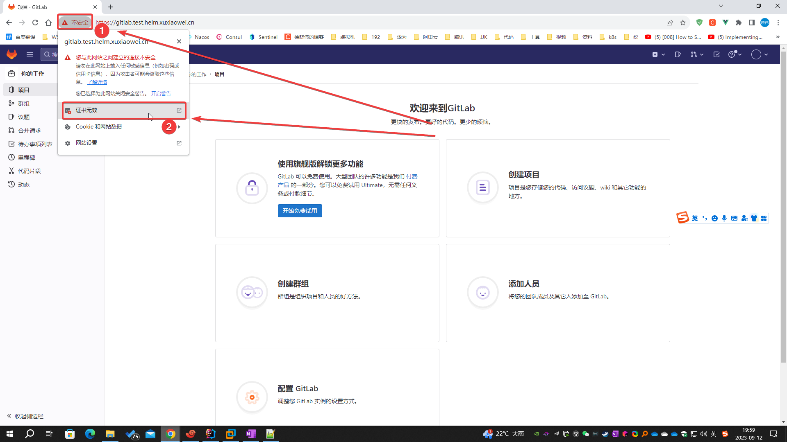
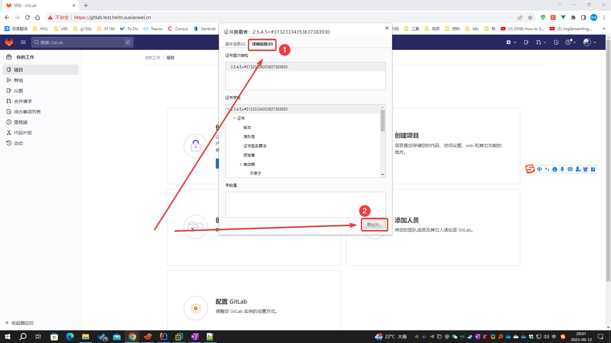
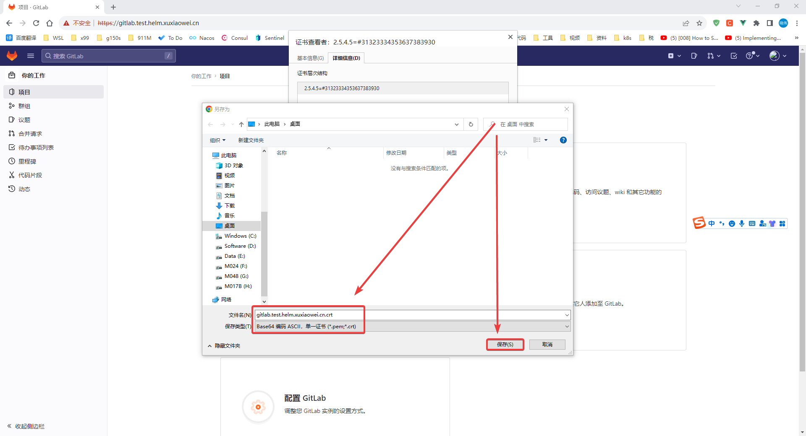
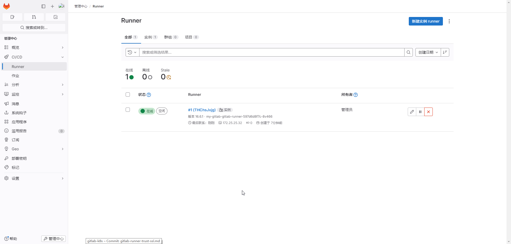

# GitLab Runner 信任域名证书

Gitlab Runner 信任实例域名证书，用于注册注册 GitLab Runner。

## 问题

参见 [gitlab-runner-host.md](gitlab-runner-host.md)

## 说明

- 解决方案是使用颁发给域名 gitlab.test.helm.xuxiaowei.cn 的证书，可以使用自己的域名去各大云厂商免费申请，或者使用自己根据域名
  gitlab.test.helm.xuxiaowei.cn 生成的证书
    1. [阿里云SSL(https)证书免费申请](https://yundun.console.aliyun.com/?p=cas#/certExtend/buy)
    2. [腾讯云SSL(https)证书免费申请](https://console.cloud.tencent.com/ssl)
    3. [华为云SSL(https)证书免费申请](https://console.huaweicloud.com/console/#/ccm/scs/certList)
    4. [百度云SSL(https)证书免费申请](https://console.bce.baidu.com/cas/#/cas/purchased/common/list)

## 域名证书解决方案

### 方案1：重新配置 gitlab，自动生成对应证书并自动配置，然后在 gitlab runner 中信任证书

1. 问题1：`tls: failed to verify certificate: x509: certificate signed by unknown authority`
    1. 文档
        1. [runners 部分](https://docs.gitlab.cn/runner/configuration/advanced-configuration.html#runners-%E9%83%A8%E5%88%86)
        2. [自签名证书或自定义证书颁发机构](https://docs.gitlab.cn/runner/configuration/tls-self-signed.html)
        3. [ConfigMap](https://kubernetes.io/zh-cn/docs/concepts/configuration/configmap/)
        4. [配置 Pod 使用 ConfigMap](https://kubernetes.io/zh-cn/docs/tasks/configure-pod-container/configure-pod-configmap/)
    2. 根据上述文档可知，有三种方式可以解决证书信任问题：
        1. 在 gitlab runner 注册时配置 `--tls-ca-file` 参数并指向证书文件
        2. 在配置文件中增加 `tls-ca-file` 并指向配置文件，<strong><font color="red">
           此方式本文不做介绍，可参考 </font></strong>
           [gitlab-runner-kubernetes-host.md](gitlab-runner-kubernetes-host.md)
           ，<strong><font color="red">原理相同</font></strong>
        3. 将证书放在 `/etc/gitlab-runner/certs/` 文件夹下，使用域名命名证书，证书后缀名是 `.crt`，
           <strong><font color="red">由于篇幅限制，这里只介绍这一种方式</font></strong>
    3. 由于 k8s 的 pod 可能随时会被删除（故障转移、主动删除等），所以直接在 pod 内部配置不是上策
    4. k8s 中的 ConfigMap 可以挂载到 pod 内部，所以可以考虑在 ConfigMap 中配置证书，然后 pod 内部使用 ConfigMap 中的证书
    5. 下载证书
        1. 方式1
            1. 浏览器访问域名 https://gitlab.test.helm.xuxiaowei.cn
            2. 按照图中操作，下载证书，上传之服务器，用于后期操作
               
               
               
        2. 方式2
            ```shell
            # 下载证书
            openssl s_client -showcerts -connect gitlab.test.helm.xuxiaowei.cn:443 -servername gitlab.test.helm.xuxiaowei.cn < /dev/null 2>/dev/null | openssl x509 -outform PEM > gitlab.test.helm.xuxiaowei.cn.crt
            ```
    6. 将证书导入到 k8s 中
        ```shell
        # -n=gitlab-test：指定命名空间
        # create configmap etc-gitlab-runner-certs：创建 ConfigMap 名称是 etc-gitlab-runner-certs
        # --from-file=gitlab.test.helm.xuxiaowei.cn.crt=gitlab.test.helm.xuxiaowei.cn.crt：配置来自文件，文件名 gitlab.test.helm.xuxiaowei.cn.crt，放入 ConfigMap 中的键也是 gitlab.test.helm.xuxiaowei.cn.crt
        kubectl -n=gitlab-test create configmap etc-gitlab-runner-certs --from-file=gitlab.test.helm.xuxiaowei.cn.crt=gitlab.test.helm.xuxiaowei.cn.crt
        
        # 查看
        # kubectl -n=gitlab-test get configmap etc-gitlab-runner-certs -o yaml
        ```
    7. 导出 helm gitlab 配置

        ```shell
        helm -n gitlab-test get values my-gitlab > my-gitlab.yaml
        ```

    8. 修改 helm gitlab 配置

        ```shell
        gitlab-runner:
          # 挂载卷名称
          volumeMounts:
            # 挂载到 pod 路径（文件/文件夹）
            # 此处是在容器内运行的 gitlab runner，由于权限限制等原因，
            # 所以 配置文件不是在 /etc/gitlab-runner/ 目录下，而是 /home/gitlab-runner/.gitlab-runner/
            - mountPath: /home/gitlab-runner/.gitlab-runner/certs
              name: etc-gitlab-runner-certs-volumes
          # 卷
          volumes:
            # 卷类型
            - configMap:
                items:
                # configMap 中的键
                - key: gitlab.test.helm.xuxiaowei.cn.crt
                  # 挂载的路径
                  path: gitlab.test.helm.xuxiaowei.cn.crt
                name: etc-gitlab-runner-certs
              # 配置 ConfigMap 名称
              name: etc-gitlab-runner-certs-volumes
        ```

    9. 更新 helm gitlab 配置

        ```shell
        helm upgrade -n gitlab-test --install my-gitlab gitlab/gitlab -f my-gitlab.yaml --timeout 600s
        ```

    10. 查看修改结果

        ```shell
        kubectl -n gitlab-test get deployments.apps my-gitlab-gitlab-runner -o yaml
        ```

        ```yaml
        apiVersion: apps/v1
        kind: Deployment
        metadata:
          annotations:
            deployment.kubernetes.io/revision: "5"
            meta.helm.sh/release-name: my-gitlab
            meta.helm.sh/release-namespace: gitlab-test
          creationTimestamp: "2023-12-22T05:03:46Z"
          generation: 7
          labels:
            app: my-gitlab-gitlab-runner
            app.kubernetes.io/managed-by: Helm
            chart: gitlab-runner-0.59.2
            heritage: Helm
            release: my-gitlab
          name: my-gitlab-gitlab-runner
          namespace: gitlab-test
          resourceVersion: "30086"
          uid: 8c46c44a-5b67-44ae-90d0-008daa3fa388
        spec:
          progressDeadlineSeconds: 600
          replicas: 1
          revisionHistoryLimit: 10
          selector:
            matchLabels:
              app: my-gitlab-gitlab-runner
          strategy:
            rollingUpdate:
              maxSurge: 25%
              maxUnavailable: 25%
            type: RollingUpdate
          template:
            metadata:
              annotations:
                checksum/configmap: f35865354f043583d0903b0a8350830a486eb0e289d18271cf3f533e7d89c5f7
                checksum/secrets: e3b0c44298fc1c149afbf4c8996fb92427ae41e4649b934ca495991b7852b855
                gitlab.com/prometheus_port: "9252"
                gitlab.com/prometheus_scrape: "true"
              creationTimestamp: null
              labels:
                app: my-gitlab-gitlab-runner
                chart: gitlab-runner-0.59.2
                heritage: Helm
                release: my-gitlab
            spec:
              containers:
                - command:
                    - /usr/bin/dumb-init
                    - --
                    - /bin/bash
                    - /configmaps/entrypoint
                  env:
                    - name: CI_SERVER_URL
                      value: https://gitlab.test.helm.xuxiaowei.cn
                    - name: RUNNER_EXECUTOR
                      value: kubernetes
                    - name: REGISTER_LOCKED
                      value: "false"
                    - name: RUNNER_TAG_LIST
                    - name: KUBERNETES_NAMESPACE
                      value: gitlab-test
                  image: registry.gitlab.com/gitlab-org/gitlab-runner:alpine-v16.6.1
                  imagePullPolicy: IfNotPresent
                  livenessProbe:
                    exec:
                      command:
                        - /bin/bash
                        - /configmaps/check-live
                    failureThreshold: 3
                    initialDelaySeconds: 60
                    periodSeconds: 10
                    successThreshold: 1
                    timeoutSeconds: 3
                  name: my-gitlab-gitlab-runner
                  ports:
                    - containerPort: 9252
                      name: metrics
                      protocol: TCP
                  readinessProbe:
                    exec:
                      command:
                        - /usr/bin/pgrep
                        - gitlab.*runner
                    failureThreshold: 3
                    initialDelaySeconds: 10
                    periodSeconds: 10
                    successThreshold: 1
                    timeoutSeconds: 3
                  resources: {}
                  securityContext:
                    allowPrivilegeEscalation: false
                    capabilities:
                      drop:
                        - ALL
                    privileged: false
                    readOnlyRootFilesystem: false
                    runAsNonRoot: true
                  terminationMessagePath: /dev/termination-log
                  terminationMessagePolicy: File
                  volumeMounts:
                    - mountPath: /secrets
                      name: projected-secrets
                    - mountPath: /home/gitlab-runner/.gitlab-runner
                      name: etc-gitlab-runner
                    - mountPath: /configmaps
                      name: configmaps
                    - mountPath: /home/gitlab-runner/.gitlab-runner/certs
                      name: etc-gitlab-runner-certs-volumes
              dnsPolicy: ClusterFirst
              hostAliases:
                - hostnames:
                    - gitlab.test.helm.xuxiaowei.cn
                  ip: 172.25.25.32
              restartPolicy: Always
              schedulerName: default-scheduler
              securityContext:
                fsGroup: 65533
                runAsUser: 100
              serviceAccount: my-gitlab-gitlab-runner
              serviceAccountName: my-gitlab-gitlab-runner
              terminationGracePeriodSeconds: 3600
              volumes:
                - emptyDir:
                    medium: Memory
                  name: runner-secrets
                - emptyDir:
                    medium: Memory
                  name: etc-gitlab-runner
                - name: projected-secrets
                  projected:
                    defaultMode: 420
                    sources:
                      - secret:
                          name: my-gitlab-minio-secret
                      - secret:
                          items:
                            - key: runner-registration-token
                              path: runner-registration-token
                            - key: runner-token
                              path: runner-token
                          name: my-gitlab-gitlab-runner-secret
                - configMap:
                    defaultMode: 420
                    name: my-gitlab-gitlab-runner
                  name: configmaps
                - configMap:
                    defaultMode: 420
                    items:
                      - key: gitlab.test.helm.xuxiaowei.cn.crt
                        path: gitlab.test.helm.xuxiaowei.cn.crt
                    name: etc-gitlab-runner-certs
                  name: etc-gitlab-runner-certs-volumes
        status:
          availableReplicas: 1
          conditions:
            - lastTransitionTime: "2023-12-22T07:43:25Z"
              lastUpdateTime: "2023-12-22T07:43:25Z"
              message: Deployment has minimum availability.
              reason: MinimumReplicasAvailable
              status: "True"
              type: Available
            - lastTransitionTime: "2023-12-22T05:03:46Z"
              lastUpdateTime: "2023-12-22T07:43:25Z"
              message: ReplicaSet "my-gitlab-gitlab-runner-597d6d8f7c" has successfully progressed.
              reason: NewReplicaSetAvailable
              status: "True"
              type: Progressing
          observedGeneration: 7
          readyReplicas: 1
          replicas: 1
          updatedReplicas: 1
        ```

    11. 查看 gitlab runner 日志

        ```shell
        [root@anolis-7-9 ~]# kubectl -n gitlab-test get pod | grep gitlab-runner
        my-gitlab-gitlab-runner-597d6d8f7c-8v466             1/1     Running     0              5m52s
        [root@anolis-7-9 ~]#
        ```

        根据日志判断，已经注册成功了

        ```shell
        [root@anolis-7-9 ~]# kubectl -n gitlab-test logs -f my-gitlab-gitlab-runner-597d6d8f7c-8v466
        Registration attempt 1 of 30
        Runtime platform                                    arch=amd64 os=linux pid=16 revision=f5da3c5a version=16.6.1
        WARNING: Running in user-mode.                     
        WARNING: The user-mode requires you to manually start builds processing:
        WARNING: $ gitlab-runner run                       
        WARNING: Use sudo for system-mode:                 
        WARNING: $ sudo gitlab-runner...
        
        Created missing unique system ID                    system_id=r_3WsywNzJqRud
        Merging configuration from template file "/configmaps/config.template.toml"
        WARNING: Support for registration tokens and runner parameters in the 'register' command has been deprecated in GitLab Runner 15.6 and will be replaced with support for authentication tokens. For more information, see https://docs.gitlab.com/ee/ci/runners/new_creation_workflow
        Registering runner... succeeded                     runner=BtGwLEwc
        Runner registered successfully. Feel free to start it, but if it's running already the config should be automatically reloaded!
        
        Configuration (with the authentication token) was saved in "/home/gitlab-runner/.gitlab-runner/config.toml"
        Runtime platform                                    arch=amd64 os=linux pid=7 revision=f5da3c5a version=16.6.1
        Starting multi-runner from /home/gitlab-runner/.gitlab-runner/config.toml...  builds=0 max_builds=0
        WARNING: Running in user-mode.                     
        WARNING: Use sudo for system-mode:                 
        WARNING: $ sudo gitlab-runner...
        
        There might be a problem with your config based on jsonschema annotations in common/config.go (experimental feature):
        jsonschema: '/runners/0/kubernetes/pull_policy' does not validate with https://gitlab.com/gitlab-org/gitlab-runner/common/config#/$ref/properties/runners/items/$ref/properties/kubernetes/$ref/properties/pull_policy/$ref/type: expected array, but got null
        
        Configuration loaded                                builds=0 max_builds=10
        listen_address not defined, metrics & debug endpoints disabled  builds=0 max_builds=10
        [session_server].listen_address not defined, session endpoints disabled  builds=0 max_builds=10
        Initializing executor providers                     builds=0 max_builds=10
        ^C
        [root@anolis-7-9 ~]#
        ```

    12. 管理员访问 https://gitlab.test.helm.xuxiaowei.cn/admin/runners 可以看到
        pod `my-gitlab-gitlab-runner-597d6d8f7c-8v466` 已经注册成了

        1. 如果存在 gitlab runner pod 被删除（故障转译、手动删除等等），这里可能会存在不可用的 runner

        

2. 问题2：
   `tls: failed to verify certificate: x509: certificate is valid for ingress.local, not gitlab.test.helm.xuxiaowei.cn`

    1. 访问的域名与使用的证书补匹配，可通过更换证书、域名来解决此问题（一般情况是更换证书）
    2. 如果要更换证书：
        1. 证书属于正规机构颁发的（如：上述各大云厂商的证书），请看下方`方案2`
        2. 如果是自己生成的证书（不受信任），请看下方`方案2`，并结合上方`问题1`来解决此问题

### 方案2：配置正规机构颁发的证书（如：上述各大云厂商的证书），一般无需在 gitlab 配置信任证书，即可正常使用

1. 正常情况

    1. 要求证书与域名对应
    2. 将证书上传至服务器，解压，使用证书文件创建 k8s TLS Secret
    3. 修改 gitlab 配置，使用 上述步骤创建的 k8s TLS Secret

2. 异常情况：正规机构颁发的证书，在 gitlab runner 中依然无法正常使用，但是在浏览器中可以正常使用
    1. 原因是颁发机构的根证书不在 gitlab runner 的信任列表中，需要手动添加信任（例如：常见的 Windows
       较低版本运行一些软件时，也是无法执行，显示证书无法识别，需要在 Windows 导入软件签名所使用的证书链）
