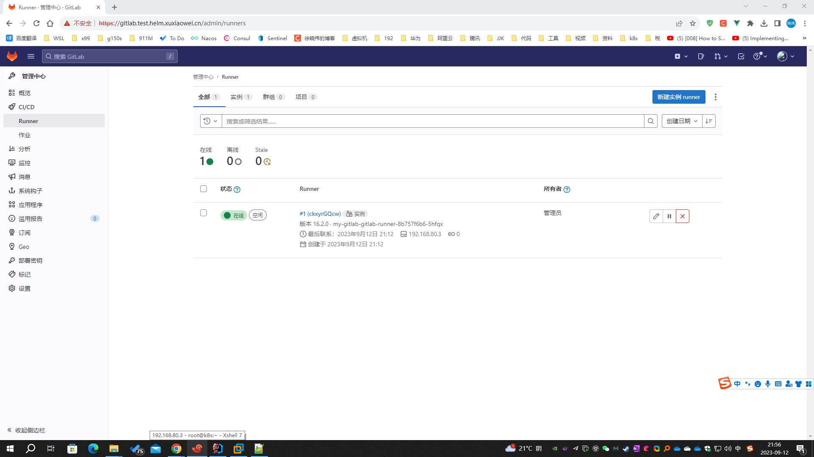

# gitlab runner 信任域名证书（未完成）

## 问题

参见 [gitlab-runner-host.md](gitlab-runner-host.md)

## 说明

- 解决方案是使用颁发给域名 gitlab.test.helm.xuxiaowei.cn 的证书，可以使用自己的域名去各大云厂商免费申请，或者使用自己根据域名
  gitlab.test.helm.xuxiaowei.cn 生成的证书
    1. [阿里云SSL(https)证书免费申请](https://yundun.console.aliyun.com/?p=cas#/certExtend/buy)
    2. [腾讯云SSL(https)证书免费申请](https://console.cloud.tencent.com/ssl)
    3. [华为云SSL(https)证书免费申请](https://console.huaweicloud.com/console/#/ccm/scs/certList)
    4. [百度云SSL(https)证书免费申请](https://console.bce.baidu.com/cas/#/cas/purchased/common/list)

## 域名证书解决方案

### 方案1：重新配置 gitlab，自动生成对应证书并自动配置，然后在 gitlab runner 中信任证书

1. 问题：`tls: failed to verify certificate: x509: certificate signed by unknown authority`
    1. 文档
        1. [runners 部分](https://docs.gitlab.cn/runner/configuration/advanced-configuration.html#runners-%E9%83%A8%E5%88%86)
        2. [自签名证书或自定义证书颁发机构](https://docs.gitlab.cn/runner/configuration/tls-self-signed.html)
        3. [ConfigMap](https://kubernetes.io/zh-cn/docs/concepts/configuration/configmap/)
        4. [配置 Pod 使用 ConfigMap](https://kubernetes.io/zh-cn/docs/tasks/configure-pod-container/configure-pod-configmap/)
    2. 根据上述文档可知，有三种方式可以解决证书信任问题：
        1. 在 gitlab runner 注册时配置 `--tls-ca-file` 参数并指向证书文件
        2. 在配置文件中增加 `tls-ca-file` 并指向配置文件，<strong><font color="red">
           此方式本文不做介绍，可参考 </font></strong>
           [gitlab-runner-kubernetes-host.md](gitlab-runner-kubernetes-host.md)
           ，<strong><font color="red">原理相同</font></strong>
        3. 将证书放在 `/etc/gitlab-runner/certs/` 文件夹下，使用域名命名证书，证书后缀名是 `.crt`，
           <strong><font color="red">由于篇幅限制，这里只介绍这一种方式</font></strong>
    3. 由于 k8s 的 pod 可能随时会被删除（故障转移、主动删除等），所以直接在 pod 内部配置不是上策
    4. k8s 中的 ConfigMap 可以挂载到 pod 内部，所以可以考虑在 ConfigMap 中配置证书，然后 pod 内部使用 ConfigMap 中的证书
    5. 下载证书
        1. 方式1
            1. 浏览器访问域名 https://gitlab.test.helm.xuxiaowei.cn
            2. 按照图中操作，下载证书，上传之服务器，用于后期操作
               
               
               
        2. 方式2
            ```shell
            # 下载证书
            openssl s_client -showcerts -connect gitlab.test.helm.xuxiaowei.cn:443 -servername gitlab.test.helm.xuxiaowei.cn < /dev/null 2>/dev/null | openssl x509 -outform PEM > gitlab.test.helm.xuxiaowei.cn.crt
            ```
    6. 将证书导入到 k8s 中
        ```shell
        # -n=gitlab-test：指定命名空间
        # create configmap etc-gitlab-runner-certs：创建 ConfigMap 名称是 etc-gitlab-runner-certs
        # --from-file=gitlab.test.helm.xuxiaowei.cn.crt=gitlab.test.helm.xuxiaowei.cn.crt：配置来自文件，文件名 gitlab.test.helm.xuxiaowei.cn.crt，放入 ConfigMap 中的键也是 gitlab.test.helm.xuxiaowei.cn.crt
        kubectl -n=gitlab-test create configmap etc-gitlab-runner-certs --from-file=gitlab.test.helm.xuxiaowei.cn.crt=gitlab.test.helm.xuxiaowei.cn.crt
        
        # 查看
        # kubectl -n=gitlab-test get configmap etc-gitlab-runner-certs -o yaml
        ```
    7. 修改 gitlab runner Deployment

        ```shell
        # 查看 Deployment 名称
        [root@k8s ~]# kubectl -n=gitlab-test get deployment | grep gitlab-runner
        my-gitlab-gitlab-runner              0/1     1            0           133m
        [root@k8s ~]#
        ```

        ```shell
        # 编辑 Deployment
        kubectl -n=gitlab-test edit deployment my-gitlab-gitlab-runner
        ```

        ```yaml
        volumeMounts:
        # 挂载卷名称
        - name: etc-gitlab-runner-certs-volumes
          # 挂载到 pod 路径（文件/文件夹）
          # 此处是在容器内运行的 gitlab runner，由于权限限制等原因，
          # 所以 配置文件不是在 /etc/gitlab-runner/ 目录下，而是 /home/gitlab-runner/.gitlab-runner/
          mountPath: /home/gitlab-runner/.gitlab-runner/certs
        ```

        ```yaml
        volumes:
        # 新增配置，格式如下：
        # 卷名称
        - name: etc-gitlab-runner-certs-volumes
          # 卷类型
          configMap:
            # 配置 ConfigMap 名称
            name: etc-gitlab-runner-certs
            items:
              # configMap 中的键
              - key: gitlab.test.helm.xuxiaowei.cn.crt
                # 挂载的路径
                path: gitlab.test.helm.xuxiaowei.cn.crt
        ```

       结果示例如下

        ```yaml
        apiVersion: apps/v1
        kind: Deployment
        metadata:
          annotations:
            deployment.kubernetes.io/revision: "3"
            meta.helm.sh/release-name: my-gitlab
            meta.helm.sh/release-namespace: gitlab-test
          creationTimestamp: "2023-09-12T10:32:03Z"
          generation: 3
          labels:
            app: my-gitlab-gitlab-runner
            app.kubernetes.io/managed-by: Helm
            chart: gitlab-runner-0.55.0
            heritage: Helm
            release: my-gitlab
          name: my-gitlab-gitlab-runner
          namespace: gitlab-test
          resourceVersion: "26315"
          uid: 32151659-ac92-4b98-94fe-136df078a8f4
        spec:
          progressDeadlineSeconds: 600
          replicas: 1
          revisionHistoryLimit: 10
          selector:
            matchLabels:
              app: my-gitlab-gitlab-runner
          strategy:
            rollingUpdate:
              maxSurge: 25%
              maxUnavailable: 25%
            type: RollingUpdate
          template:
            metadata:
              annotations:
                checksum/configmap: baafa40d18ee910f46e2649abc752b6f9bd7c1daeefbcc91503f264a9f2bed81
                checksum/secrets: e3b0c44298fc1c149afbf4c8996fb92427ae41e4649b934ca495991b7852b855
                gitlab.com/prometheus_port: "9252"
                gitlab.com/prometheus_scrape: "true"
              creationTimestamp: null
              labels:
                app: my-gitlab-gitlab-runner
                chart: gitlab-runner-0.55.0
                heritage: Helm
                release: my-gitlab
            spec:
              containers:
                - command:
                    - /usr/bin/dumb-init
                    - --
                    - /bin/bash
                    - /configmaps/entrypoint
                  env:
                    - name: CI_SERVER_URL
                      value: https://gitlab.test.helm.xuxiaowei.cn
                    - name: RUNNER_EXECUTOR
                      value: kubernetes
                    - name: REGISTER_LOCKED
                      value: "false"
                    - name: RUNNER_TAG_LIST
                    - name: KUBERNETES_NAMESPACE
                      value: gitlab-test
                  image: registry.gitlab.com/gitlab-org/gitlab-runner:alpine-v16.2.0
                  imagePullPolicy: IfNotPresent
                  livenessProbe:
                    exec:
                      command:
                        - /bin/bash
                        - /configmaps/check-live
                    failureThreshold: 3
                    initialDelaySeconds: 60
                    periodSeconds: 10
                    successThreshold: 1
                    timeoutSeconds: 1
                  name: my-gitlab-gitlab-runner
                  ports:
                    - containerPort: 9252
                      name: metrics
                      protocol: TCP
                  readinessProbe:
                    exec:
                      command:
                        - /usr/bin/pgrep
                        - gitlab.*runner
                    failureThreshold: 3
                    initialDelaySeconds: 10
                    periodSeconds: 10
                    successThreshold: 1
                    timeoutSeconds: 1
                  resources: {}
                  securityContext:
                    allowPrivilegeEscalation: false
                    capabilities:
                      drop:
                        - ALL
                    privileged: false
                    readOnlyRootFilesystem: false
                    runAsNonRoot: true
                  terminationMessagePath: /dev/termination-log
                  terminationMessagePolicy: File
                  volumeMounts:
                    - mountPath: /secrets
                      name: projected-secrets
                    - mountPath: /home/gitlab-runner/.gitlab-runner
                      name: etc-gitlab-runner
                    - mountPath: /configmaps
                      name: configmaps
                    - mountPath: /home/gitlab-runner/.gitlab-runner/certs
                      name: etc-gitlab-runner-certs-volumes
              dnsPolicy: ClusterFirst
              hostAliases:
                - hostnames:
                    - gitlab.test.helm.xuxiaowei.cn
                  ip: 192.168.80.3
              restartPolicy: Always
              schedulerName: default-scheduler
              securityContext:
                fsGroup: 65533
                runAsUser: 100
              serviceAccount: my-gitlab-gitlab-runner
              serviceAccountName: my-gitlab-gitlab-runner
              terminationGracePeriodSeconds: 3600
              volumes:
                - configMap:
                    defaultMode: 420
                    items:
                      - key: gitlab.test.helm.xuxiaowei.cn.crt
                        path: gitlab.test.helm.xuxiaowei.cn.crt
                    name: etc-gitlab-runner-certs
                  name: etc-gitlab-runner-certs-volumes
                - emptyDir:
                    medium: Memory
                  name: runner-secrets
                - emptyDir:
                    medium: Memory
                  name: etc-gitlab-runner
                - name: projected-secrets
                  projected:
                    defaultMode: 420
                    sources:
                      - secret:
                          name: my-gitlab-minio-secret
                      - secret:
                          items:
                            - key: runner-registration-token
                              path: runner-registration-token
                            - key: runner-token
                              path: runner-token
                          name: my-gitlab-gitlab-runner-secret
                - configMap:
                    defaultMode: 420
                    name: my-gitlab-gitlab-runner
                  name: configmaps
        status:
          conditions:
            - lastTransitionTime: "2023-09-12T12:42:33Z"
              lastUpdateTime: "2023-09-12T12:42:33Z"
              message: Deployment does not have minimum availability.
              reason: MinimumReplicasUnavailable
              status: "False"
              type: Available
            - lastTransitionTime: "2023-09-12T10:32:04Z"
              lastUpdateTime: "2023-09-12T13:12:13Z"
              message: ReplicaSet "my-gitlab-gitlab-runner-8b757f6b6" is progressing.
              reason: ReplicaSetUpdated
              status: "True"
              type: Progressing
          observedGeneration: 3
          replicas: 2
          unavailableReplicas: 2
          updatedReplicas: 1
        ```

    8. 查看 gitlab runner 中是否存在此配置

        ```shell
        [root@k8s ~]# kubectl -n=gitlab-test get pod | grep gitlab-runner
        my-gitlab-gitlab-runner-8b757f6b6-5hfqx              1/1     Running     0               3m37s
        [root@k8s ~]#
        ```

        ```shell
        [root@k8s ~]# kubectl -n=gitlab-test exec -it my-gitlab-gitlab-runner-8b757f6b6-5hfqx ls /home/gitlab-runner/.gitlab-runner/certs
        kubectl exec [POD] [COMMAND] is DEPRECATED and will be removed in a future version. Use kubectl exec [POD] -- [COMMAND] instead.
        gitlab.test.helm.xuxiaowei.cn.crt
        [root@k8s ~]# kubectl -n=gitlab-test exec -it my-gitlab-gitlab-runner-8b757f6b6-5hfqx cat /home/gitlab-runner/.gitlab-runner/certs/gitlab.test.helm.xuxiaowei.cn.crt
        kubectl exec [POD] [COMMAND] is DEPRECATED and will be removed in a future version. Use kubectl exec [POD] -- [COMMAND] instead.
        -----BEGIN CERTIFICATE-----
        MIICrDCCAg2gAwIBAgIRAN+EprdEppin7IiLXdJg4RMwCgYIKoZIzj0EAwQwHTEb
        MBkGA1UEAxMSY2VydC1tYW5hZ2VyLmxvY2FsMB4XDTIzMDkxMjEwMzIyMFoXDTIz
        MTIxMTEwMzIyMFowFTETMBEGA1UEBRMKMTIzNDU2Nzg5MDCCASIwDQYJKoZIhvcN
        AQEBBQADggEPADCCAQoCggEBAMiQZtaDm7lyjFJ8/tZZA/NKW6+JTO4Yo8QZZ3Kh
        vZKR6NiY4gt/gyEGwRGxXtKLfOagytnVpuzpVlNr00TGImkmfDWMSD6sm/A1LwJQ
        HfmASB4emfvqlmacA6fKesRBpP2NF61LhBu/8LBx05fT/rMaBKHcE1iliEYGl5oS
        p5hG1fbQ0I2ZblBmkWp/hE4m8/FMvLqgnEfEjE5Ktp3fh8+u5bGbHyJMGs+Wobjy
        ONi7825XQUBTDtmse78ZVPTbYvDe3SwwV2aQoekL40t1cDNSMuT32JKwKEcbJFgw
        SI+/Um9VQ3ZCIROKNfifEQtmJlLEaQ8xaVLmDFhcejLaRo8CAwEAAaNrMGkwDgYD
        VR0PAQH/BAQDAgWgMAwGA1UdEwEB/wQCMAAwHwYDVR0jBBgwFoAUodF9JlXZPmOp
        Fwf8CgkpPoredtowKAYDVR0RBCEwH4IdZ2l0bGFiLnRlc3QuaGVsbS54dXhpYW93
        ZWkuY24wCgYIKoZIzj0EAwQDgYwAMIGIAkIB7gTlmXrRkmjyDazJ62Kn6q4G2vYK
        XQwrZlxGuuMBHhSw7KFR/FWefUFlhTU9k9ipTJCE2dI/WGpY8fzaf0xqXPACQgFm
        kv7CeLxXmT8Mg1+7JyrjjWFAcOlwvFC/plxHRiqJbAYx3eRTyxIM8TeI9ofgJTyu
        K+PmYMn6WWr8L3gDF0kr1w==
        -----END CERTIFICATE-----
        [root@k8s ~]# 
        ```

    9. 此时查看 gitlab-runner 日志可知，已经完成注册了
        ```shell
        [root@k8s ~]# kubectl -n=gitlab-test get pod | grep gitlab-runner
        my-gitlab-gitlab-runner-8b757f6b6-5hfqx              1/1     Running     0               3m37s
        [root@k8s ~]#
        ```

       如果出现多个，根据时间选择，查看最新的 pod

        ```shell
        [root@k8s ~]# kubectl -n gitlab-test logs -f my-gitlab-gitlab-runner-8b757f6b6-5hfqx
        Registration attempt 1 of 30
        Runtime platform                                    arch=amd64 os=linux pid=17 revision=782e15da version=16.2.0
        WARNING: Running in user-mode.                     
        WARNING: The user-mode requires you to manually start builds processing:
        WARNING: $ gitlab-runner run                       
        WARNING: Use sudo for system-mode:                 
        WARNING: $ sudo gitlab-runner...
        
        Created missing unique system ID                    system_id=r_NjCjmicJjktS
        Merging configuration from template file "/configmaps/config.template.toml"
        WARNING: Support for registration tokens and runner parameters in the 'register' command has been deprecated in GitLab Runner 15.6 and will be replaced with support for authentication tokens. For more information, see https://gitlab.com/gitlab-org/gitlab/-/issues/380872
        Registering runner... succeeded                     runner=wgpCYf05
        Runner registered successfully. Feel free to start it, but if it's running already the config should be automatically reloaded!
        
        Configuration (with the authentication token) was saved in "/home/gitlab-runner/.gitlab-runner/config.toml"
        Runtime platform                                    arch=amd64 os=linux pid=8 revision=782e15da version=16.2.0
        Starting multi-runner from /home/gitlab-runner/.gitlab-runner/config.toml...  builds=0 max_builds=0
        WARNING: Running in user-mode.                     
        WARNING: Use sudo for system-mode:                 
        WARNING: $ sudo gitlab-runner...
        
        There might be a problem with your config based on jsonschema annotations in common/config.go (experimental feature):
        jsonschema: '/runners/0/kubernetes/pull_policy' does not validate with https://gitlab.com/gitlab-org/gitlab-runner/common/config#/$ref/properties/runners/items/$ref/properties/kubernetes/$ref/properties/pull_policy/$ref/type: expected array, but got null
        
        Configuration loaded                                builds=0 max_builds=10
        listen_address not defined, metrics & debug endpoints disabled  builds=0 max_builds=10
        [session_server].listen_address not defined, session endpoints disabled  builds=0 max_builds=10
        Initializing executor providers                     builds=0 max_builds=10
        ```

    10. 管理员访问 https://gitlab.test.helm.xuxiaowei.cn/admin/runners 可以看到
        pod `my-gitlab-gitlab-runner-8b757f6b6-5hfqx` 已经注册成了

        1. 如果存在 gitlab runner pod 被删除（故障转译、手动删除等等），这里可能会存在不可用的 runner

        

### 方案2：配置正规机构颁发的证书（如：上述各大云厂商的证书），一般无需在 gitlab 配置信任证书，即可正常使用

- 正规机构颁发的证书，在 gitlab runner 中依然无法正常使用的解决办法
