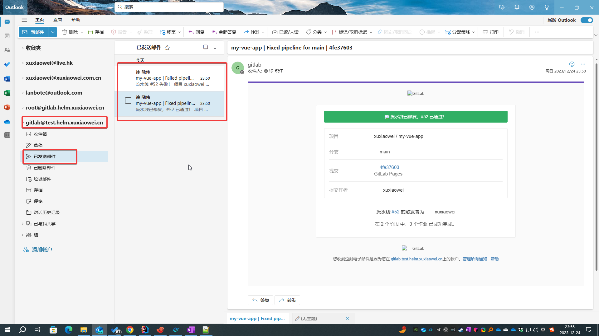

# GitLab 配置 邮件功能

用于用户找回密码、流水线失败等需要提醒时发送邮件

## 说明

### 启用前查看后台任务，查看已停滞历史邮件

- 如果不进行干预，当邮件配置生效后，可以重试历史邮件
  
- 如果不想发送大量历史电子邮件，可删除未发送的电子邮件
  

## 文档

1. [电子邮件](https://docs.gitlab.cn/jh/administration/incoming_email.html)
2. [电子邮件配置](https://docs.gitlab.cn/charts/installation/command-line-options.html#%E5%A4%96%E5%8F%91%E7%94%B5%E5%AD%90%E9%82%AE%E4%BB%B6%E9%85%8D%E7%BD%AE)

## 配置

1. 以下配置使用 Microsoft Office 365 IMAP 配置，其他配置雷同，参见：
   [电子邮件](https://docs.gitlab.cn/jh/administration/incoming_email.html)

2. 创建 Microsoft Office 365 IMAP 密码 secret

    ```shell
    kubectl -n gitlab-test create secret generic smtp-password --from-literal=password=你的密码
    ```

3. 导出 helm gitlab 配置

    ```shell
    helm -n gitlab-test get values my-gitlab > my-gitlab.yaml
    ```

4. 修改 helm gitlab 配置

    ```yaml
    global:
      smtp:
        address: smtp.office365.com
        authentication: login
        domain: test.helm.xuxiaowei.cn
        enabled: true
        openssl_verify_mode: peer
        password:
          key: password
          secret: smtp-password
        port: 587
        starttls_auto: true
        user_name: gitlab@test.helm.xuxiaowei.cn
    ```

5. 更新 helm gitlab 配置

    ```shell
    helm upgrade -n gitlab-test --install my-gitlab gitlab/gitlab -f my-gitlab.yaml --timeout 600s --version 7.7.0
    ```

6. 等待所有 pod 更新完成

    ```shell
    [root@anolis-7-9 ~]# kubectl -n gitlab-test get pod -o wide
    NAME                                                 READY   STATUS      RESTARTS       AGE     IP                NODE         NOMINATED NODE   READINESS GATES
    cm-acme-http-solver-2ldtp                            1/1     Running     14 (24m ago)   2d10h   192.168.210.255   anolis-7-9   <none>           <none>
    cm-acme-http-solver-94dv5                            1/1     Running     14 (24m ago)   2d10h   192.168.210.194   anolis-7-9   <none>           <none>
    cm-acme-http-solver-klkpz                            1/1     Running     14 (24m ago)   2d10h   192.168.210.253   anolis-7-9   <none>           <none>
    my-gitlab-certmanager-8457bfdc8-w858k                1/1     Running     14 (24m ago)   2d10h   192.168.240.118   anolis-7-7   <none>           <none>
    my-gitlab-certmanager-cainjector-74df787cf4-j7cfc    1/1     Running     14 (24m ago)   2d10h   192.168.240.66    anolis-7-7   <none>           <none>
    my-gitlab-certmanager-webhook-7b86db4c96-dhcxl       1/1     Running     14 (24m ago)   2d10h   192.168.240.98    anolis-7-7   <none>           <none>
    my-gitlab-gitaly-0                                   1/1     Running     14 (24m ago)   2d10h   192.168.210.196   anolis-7-9   <none>           <none>
    my-gitlab-gitlab-exporter-55dcfcb595-gl6nm           1/1     Running     14 (24m ago)   2d10h   192.168.210.230   anolis-7-9   <none>           <none>
    my-gitlab-gitlab-pages-f65879869-c9kxd               1/1     Running     1 (24m ago)    21h     192.168.210.236   anolis-7-9   <none>           <none>
    my-gitlab-gitlab-runner-5f6ff5994c-wdw5l             1/1     Running     4 (19m ago)    25h     192.168.210.216   anolis-7-9   <none>           <none>
    my-gitlab-gitlab-shell-55fdc9cb9f-52gnr              1/1     Running     14 (21h ago)   2d10h   192.168.240.125   anolis-7-7   <none>           <none>
    my-gitlab-gitlab-shell-55fdc9cb9f-cfhsh              1/1     Running     14 (24m ago)   2d10h   192.168.210.219   anolis-7-9   <none>           <none>
    my-gitlab-issuer-38-h4pdv                            0/1     Completed   0              8m41s   192.168.240.114   anolis-7-7   <none>           <none>
    my-gitlab-kas-688dc97ddd-28gr7                       1/1     Running     38 (24m ago)   2d10h   192.168.240.95    anolis-7-7   <none>           <none>
    my-gitlab-kas-688dc97ddd-tvkvd                       1/1     Running     45 (18m ago)   2d10h   192.168.210.243   anolis-7-9   <none>           <none>
    my-gitlab-migrations-38-8fnqg                        0/1     Completed   0              8m41s   192.168.240.81    anolis-7-7   <none>           <none>
    my-gitlab-minio-66f584f746-t6qwb                     1/1     Running     7 (19m ago)    2d2h    192.168.210.237   anolis-7-9   <none>           <none>
    my-gitlab-minio-create-buckets-38-nfs8t              0/1     Completed   0              8m41s   192.168.240.78    anolis-7-7   <none>           <none>
    my-gitlab-nginx-ingress-controller-6bdd56c45-ch57n   1/1     Running     14 (24m ago)   2d10h   192.168.240.124   anolis-7-7   <none>           <none>
    my-gitlab-nginx-ingress-controller-6bdd56c45-cm2lz   1/1     Running     15 (19m ago)   2d10h   192.168.210.193   anolis-7-9   <none>           <none>
    my-gitlab-postgresql-0                               2/2     Running     30 (19m ago)   2d10h   192.168.210.250   anolis-7-9   <none>           <none>
    my-gitlab-prometheus-server-646489c599-8mgc9         2/2     Running     30 (19m ago)   2d10h   192.168.210.248   anolis-7-9   <none>           <none>
    my-gitlab-redis-master-0                             2/2     Running     30 (19m ago)   2d10h   192.168.210.252   anolis-7-9   <none>           <none>
    my-gitlab-registry-78fc549f8d-d2zjv                  1/1     Running     14 (24m ago)   2d10h   192.168.240.67    anolis-7-7   <none>           <none>
    my-gitlab-registry-78fc549f8d-xbkvh                  1/1     Running     14 (24m ago)   2d10h   192.168.210.247   anolis-7-9   <none>           <none>
    my-gitlab-sidekiq-all-in-1-v2-7b6d5575fb-kwvtf       1/1     Running     0              8m41s   192.168.240.77    anolis-7-7   <none>           <none>
    my-gitlab-toolbox-658f8894ff-tzlct                   1/1     Running     0              8m40s   192.168.240.79    anolis-7-7   <none>           <none>
    my-gitlab-webservice-default-fd8948f47-jkm44         2/2     Running     0              7m45s   192.168.240.73    anolis-7-7   <none>           <none>
    my-gitlab-webservice-default-fd8948f47-mxjz6         2/2     Running     0              8m41s   192.168.210.195   anolis-7-9   <none>           <none>
    [root@anolis-7-9 ~]#
    ```

7. 重试一个历史任务或者重试一个异常流水线，即可发送邮件
    1. 发送邮件
       
    2. 接收邮件
       
