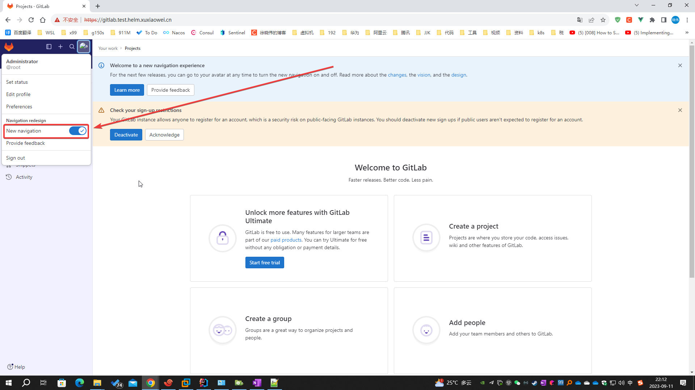

# 使用 Helm 安装 GitLab

使用 Helm 简便快捷的部署与管理 GitLab

## 前提条件

- k8s 完成 helm 的配置
- k8s 完成 ingress 的配置
- <strong><font color="red">内存至少 10G</font></strong>

    - 演示环境是 龙蜥 Anolis 8.4（即：CentOS 8.4）最小化安装
    - k8s 版本 1.28.2
    - calico 版本 3.26.1
    - nginx ingress 版本 1.8.0
    - gitlab 版本 v16.7.0，对应的 helm 版本是 7.7.0
    - 无其他运行的软件，总内存使用 <strong><font color="red">7.4G</font></strong> 左右，考虑到故障转移、更新配置、升级等等因素，估算需要内存为
      10G

## 说明

- gitlab-ce（社区版）、gitlab-ee（企业版）、gitlab-jh（极狐版）的区别：[GitLab 导读](/docs/guide/gitlab.md)
- 本文以 helm gitlab 7.7.0 为例（即：gitlab v16.7.0）
- 演示环境使用 k8s 为两个工作节点，每个工作节点 4 核、8G，数据使用 local PV 储存
- 演示环境的 IP 是 172.25.25.32
- 使用 helm 安装/配置 gitlab 的域名信息如下，如果特别说明，则使用下表中的值

| 域名                              | 作用              | 说明                  |
|---------------------------------|-----------------|---------------------|
| test.helm.xuxiaowei.cn          | 将用于所有对外暴露服务的域名  | 默认情况下，其他域名在此域名前拼接得到 |
| gitlab.test.helm.xuxiaowei.cn   | 外部访问gitlab实例的域名 |                     |
| minio.test.helm.xuxiaowei.cn    | 对象储存域名          |                     |
| registry.test.helm.xuxiaowei.cn | 容器镜像仓库域名        |                     |
| kas.test.helm.xuxiaowei.cn      |                 |                     |

## 文档

- [TLS 配置](https://docs.gitlab.cn/charts/installation/command-line-options.html#tls-%E9%85%8D%E7%BD%AE)
    - certmanager-issuer.email：Let’s Encrypt 账号的电子邮件地址
    - global.ingress.configureCertmanager：配置 cert-manager 以从 Let’s Encrypt 获取证书，默认值：true
- [基本配置](https://docs.gitlab.cn/charts/installation/command-line-options.html#%E5%9F%BA%E6%9C%AC%E9%85%8D%E7%BD%AE)
    - global.hosts.domain：将用于所有对外暴露服务的域名
    - global.edition：要安装的版本标识，默认值：ee
    - global.time_zone：全局时区，默认值：UTC
- [Deploy the Community Edition](https://docs.gitlab.com/charts/installation/deployment.html#deploy-the-community-edition)
    - global.edition：要安装的版本标识，默认值：ee
- [cert-manager Helm](https://cert-manager.io/docs/installation/helm/)

## 添加 helm gitlab 仓库

|                  | ArtifactHub 网址                                        | 仓库地址                     | 版本        |
|------------------|-------------------------------------------------------|--------------------------|-----------|
| gitlab/gitlab    | https://artifacthub.io/packages/helm/gitlab/gitlab    | http://charts.gitlab.io  | 社区版、企业版   |
| gitlab-jh/gitlab | https://artifacthub.io/packages/helm/gitlab-jh/gitlab | https://charts.gitlab.cn | 企业版（中国特供） |

### 国外用户推荐使用 gitlab/gitlab 仓库

```shell
helm repo add gitlab https://charts.gitlab.io
```

### 国内用户推荐使用 gitlab-jh/gitlab 仓库

```shell
helm repo add gitlab-jh https://charts.gitlab.cn
```

## 更新仓库

```shell
helm repo update
```

## 查看仓库中可用的版本

```shell
helm search repo gitlab
helm search repo gitlab --versions
```

- gitlab、gitlab-jh 仓库中可用的部分版本如下

| CHART VERSION | APP VERSION |
|---------------|-------------|
| 7.7.0         | v16.7.0     |
| 7.6.2         | v16.6.2     |
| 7.5.4         | v16.5.4     |
| 7.4.4         | v16.4.4     |
| 7.3.6         | v16.3.6     |
| 7.2.8         | v16.2.8     |
| 7.1.5         | v16.1.5     |
| 7.0.8         | v16.0.8     |

## helm 安装 gitlab

### <strong><font color="red">定义环境变量（重要，后续命令基本都需要此环境变量）</font></strong>

| 环境变量名称           | 环境变量值       | 含义             | 说明 |
|------------------|-------------|----------------|----|
| GITLAB_HELM_NS   | gitlab-test | GitLab 安装的命名空间 |    |
| GITLAB_HELM_NAME | my-gitlab   | GitLab 安装名称    |    |

```shell
echo "export GITLAB_HELM_NS=gitlab-test" >> /etc/profile
echo "export GITLAB_HELM_NAME=my-gitlab" >> /etc/profile
cat /etc/profile
source /etc/profile
echo $GITLAB_HELM_NS
echo $GITLAB_HELM_NAME
```

### 创建命令空间

```shell
kubectl create namespace $GITLAB_HELM_NS
```

### 生成证书说明

1. `global.ingress.configureCertmanager=true`
    1. `global.ingress.configureCertmanager` 默认值为 `true`
    2. cert-manager 会从 Let’s Encrypt 申请证书，默认验证方式 `HTTP-01`，所以 `certmanager-issuer.email` 参数是必须的，否则将报错，
       如果你的 k8s 有公网IP，并且可以将域名解析到 k8s，推荐此方式
       （如果使用 `DNS01`，则需要满足 [DNS01 配置](https://cert-manager.io/docs/configuration/acme/dns01/)）
    3. [证书信息](static/configureCertmanager-true.crt)
        ```shell
        [root@k8s ~]# openssl x509 -in configureCertmanager-true.crt -noout -text
        Certificate:
        Data:
        Version: 3 (0x2)
        Serial Number:
        df:84:a6:b7:44:a6:98:a7:ec:88:8b:5d:d2:60:e1:13
        Signature Algorithm: ecdsa-with-SHA512
        Issuer: CN = cert-manager.local
        Validity
        Not Before: Sep 12 10:32:20 2023 GMT
        Not After : Dec 11 10:32:20 2023 GMT
        Subject: serialNumber = 1234567890
        Subject Public Key Info:
        Public Key Algorithm: rsaEncryption
        RSA Public-Key: (2048 bit)
        Modulus:
        00:c8:90:66:d6:83:9b:b9:72:8c:52:7c:fe:d6:59:
        03:f3:4a:5b:af:89:4c:ee:18:a3:c4:19:67:72:a1:
        bd:92:91:e8:d8:98:e2:0b:7f:83:21:06:c1:11:b1:
        5e:d2:8b:7c:e6:a0:ca:d9:d5:a6:ec:e9:56:53:6b:
        d3:44:c6:22:69:26:7c:35:8c:48:3e:ac:9b:f0:35:
        2f:02:50:1d:f9:80:48:1e:1e:99:fb:ea:96:66:9c:
        03:a7:ca:7a:c4:41:a4:fd:8d:17:ad:4b:84:1b:bf:
        f0:b0:71:d3:97:d3:fe:b3:1a:04:a1:dc:13:58:a5:
        88:46:06:97:9a:12:a7:98:46:d5:f6:d0:d0:8d:99:
        6e:50:66:91:6a:7f:84:4e:26:f3:f1:4c:bc:ba:a0:
        9c:47:c4:8c:4e:4a:b6:9d:df:87:cf:ae:e5:b1:9b:
        1f:22:4c:1a:cf:96:a1:b8:f2:38:d8:bb:f3:6e:57:
        41:40:53:0e:d9:ac:7b:bf:19:54:f4:db:62:f0:de:
        dd:2c:30:57:66:90:a1:e9:0b:e3:4b:75:70:33:52:
        32:e4:f7:d8:92:b0:28:47:1b:24:58:30:48:8f:bf:
        52:6f:55:43:76:42:21:13:8a:35:f8:9f:11:0b:66:
        26:52:c4:69:0f:31:69:52:e6:0c:58:5c:7a:32:da:
        46:8f
        Exponent: 65537 (0x10001)
        X509v3 extensions:
        X509v3 Key Usage: critical
        Digital Signature, Key Encipherment
        X509v3 Basic Constraints: critical
        CA:FALSE
        X509v3 Authority Key Identifier:
        keyid:A1:D1:7D:26:55:D9:3E:63:A9:17:07:FC:0A:09:29:3E:8A:DE:76:DA
        
                    X509v3 Subject Alternative Name: 
                        DNS:gitlab.test.helm.xuxiaowei.cn
            Signature Algorithm: ecdsa-with-SHA512
                 30:81:88:02:42:01:ee:04:e5:99:7a:d1:92:68:f2:0d:ac:c9:
                 eb:62:a7:ea:ae:06:da:f6:0a:5d:0c:2b:66:5c:46:ba:e3:01:
                 1e:14:b0:ec:a1:51:fc:55:9e:7d:41:65:85:35:3d:93:d8:a9:
                 4c:90:84:d9:d2:3f:58:6a:58:f1:fc:da:7f:4c:6a:5c:f0:02:
                 42:01:66:92:fe:c2:78:bc:57:99:3f:0c:83:5f:bb:27:2a:e3:
                 8d:61:40:70:e9:70:bc:50:bf:a6:5c:47:46:2a:89:6c:06:31:
                 dd:e4:53:cb:12:0c:f1:37:88:f6:87:e0:25:3c:ae:2b:e3:e6:
                 60:c9:fa:59:6a:fc:2f:78:03:17:49:2b:d7
        [root@k8s ~]#

        ```
    4. 验证完成后，会使用 Let’s Encrypt 申请的证书
2. `global.ingress.configureCertmanager=false`
    1. 不会从 Let’s Encrypt 申请证书，不用设置 `certmanager-issuer.email` 参数
    2. [证书信息](static/configureCertmanager-false.crt)
        ```shell
        [root@k8s ~]# openssl x509 -in configureCertmanager-false.crt -noout -text
        Certificate:
        Data:
        Version: 3 (0x2)
        Serial Number:
        07:0a:fe:dd:4b:6e:86:2a:fa:ff:91:8d:1c:e0:e0:c1:9b:50:a5:d2
        Signature Algorithm: sha512WithRSAEncryption
        Issuer: O = gitlab-test, OU = my-gitlab, CN = GitLab Helm Chart
        Validity
        Not Before: Sep 12 14:45:00 2023 GMT
        Not After : Sep 11 14:45:00 2024 GMT
        Subject: CN = test.helm.xuxiaowei.cn
        Subject Public Key Info:
        Public Key Algorithm: rsaEncryption
        RSA Public-Key: (4096 bit)
        Modulus:
        00:90:b1:3c:85:51:87:a0:91:93:22:a4:5b:99:21:
        d4:97:c6:f6:64:3b:d8:c0:6d:a6:39:08:31:26:89:
        aa:6e:52:45:2d:cb:a7:41:dc:bc:ff:9d:61:57:21:
        ea:c3:52:ef:b3:37:0b:7b:17:13:5b:44:f3:68:40:
        e4:af:eb:01:4f:d3:4a:ec:22:3b:22:e6:c2:78:b9:
        6d:0b:fc:0f:54:0f:bc:b8:60:4c:a5:e1:70:89:1f:
        cf:36:f3:a2:af:ea:ed:c0:5a:f0:3b:b1:8d:d8:87:
        cc:34:f7:84:d6:3c:6d:cf:fb:69:c0:de:7c:b9:ab:
        3f:ff:52:3d:ee:18:8e:69:b8:cf:ba:67:c4:eb:ed:
        7c:b9:91:b8:1b:19:9d:3f:56:3f:5c:55:2c:d7:54:
        55:e1:fa:18:69:24:05:28:f9:f6:a8:41:5f:74:d6:
        73:73:28:d9:d4:da:a2:f3:bc:07:ab:44:7d:e2:46:
        52:80:5c:8c:29:74:b3:11:03:d8:02:fa:42:e7:dc:
        67:22:1d:e4:64:79:ef:be:b8:5a:8c:37:81:88:46:
        3b:08:3c:5d:9f:25:21:21:5e:1c:1a:55:bd:1f:03:
        18:bb:f0:7f:51:7c:2e:6e:71:37:77:23:ee:84:45:
        a4:6b:24:c3:0c:6f:e7:b1:7f:09:1f:eb:4f:df:ee:
        cd:e8:47:b9:f8:ad:80:4c:ea:74:17:65:cb:6c:dd:
        26:15:42:2f:f7:7c:66:de:a2:15:4d:8e:8c:f9:48:
        78:78:cc:b8:8c:0c:94:aa:74:69:e9:dd:ce:a0:e8:
        86:f4:93:ba:1c:e4:9a:ae:6c:d3:c7:62:00:1e:a7:
        33:db:cf:9d:a1:9e:6a:53:35:79:03:d0:76:99:9d:
        ef:e5:11:9f:25:1c:f4:0d:d1:e6:c2:75:e4:ef:74:
        12:b6:9d:0c:a5:79:ce:84:d1:e3:1a:a9:04:49:26:
        e3:4d:26:28:8b:1c:b5:b5:c5:5e:29:58:b4:aa:d3:
        f5:8e:3d:e3:9a:51:20:97:d3:9b:60:6a:36:c2:39:
        20:cf:3c:01:76:04:02:60:5d:ad:cd:27:cb:63:99:
        52:80:36:9a:3e:71:da:85:bf:cb:54:bf:44:6b:e9:
        73:43:df:f7:8b:36:4f:4a:65:1f:ea:db:6f:23:f3:
        8e:54:f4:9d:bd:18:31:f2:0c:21:e0:c1:42:4c:52:
        f4:88:80:c4:3c:e8:af:1d:e3:a2:a0:5b:d4:dd:ef:
        88:f9:63:2e:b3:5d:38:b2:56:e5:9d:c3:02:c6:36:
        f9:ea:87:a7:ff:34:ca:2d:85:65:12:f6:ef:d7:4c:
        e0:1c:18:19:79:c2:81:7b:db:a2:26:af:de:5c:f4:
        b8:5a:85
        Exponent: 65537 (0x10001)
        X509v3 extensions:
        X509v3 Key Usage: critical
        Digital Signature, Key Encipherment, Certificate Sign
        X509v3 Extended Key Usage:
        TLS Web Server Authentication
        X509v3 Basic Constraints: critical
        CA:FALSE
        X509v3 Subject Key Identifier:
        BA:C4:D0:7E:F5:2A:47:E0:1D:94:58:12:23:2E:C0:89:5E:5E:98:5A
        X509v3 Authority Key Identifier:
        keyid:E3:5B:EE:60:6C:C2:1A:46:CB:8D:F7:7C:AF:CC:99:59:37:6F:74:B7
        
                    X509v3 Subject Alternative Name: 
                        DNS:test.helm.xuxiaowei.cn, DNS:*.test.helm.xuxiaowei.cn
            Signature Algorithm: sha512WithRSAEncryption
                 15:fe:40:19:5d:1b:d5:da:5f:a1:3f:c1:a8:87:ec:1c:09:f9:
                 df:24:07:1a:45:63:d4:2b:5e:47:01:5c:61:62:68:b7:40:cb:
                 da:ef:01:d9:19:29:78:36:53:00:1f:5f:7d:38:23:1b:ad:44:
                 6b:a4:db:ee:e3:04:18:63:34:ee:04:71:95:60:44:fc:4f:16:
                 33:67:04:e0:33:1f:c6:61:47:28:c5:73:cc:f1:89:c1:0a:d0:
                 4a:ee:45:65:9f:12:4a:d7:cc:57:f9:ce:95:ba:17:3a:f2:00:
                 a5:b0:34:8b:89:79:6d:92:db:d9:af:0b:71:f5:3a:74:4b:87:
                 b2:c5:a6:59:1a:46:3b:45:c8:07:15:1d:da:e7:01:b2:e9:f9:
                 00:49:b3:ac:72:d4:ff:3f:e5:46:38:b6:fd:a2:04:2d:99:96:
                 67:5d:59:da:58:7b:1b:dc:38:5b:65:c6:bb:9c:6e:ba:d2:88:
                 49:d8:ba:5d:09:dd:aa:60:83:83:98:00:4b:a7:65:48:63:c6:
                 d1:6d:90:10:86:16:f0:66:3d:74:25:62:63:76:fc:f2:83:d9:
                 5c:a3:42:56:72:f0:cc:97:de:12:d1:e0:03:42:fb:53:d0:b9:
                 9f:37:b2:c6:df:7f:93:a4:20:6b:dd:fb:f3:6d:ae:3e:51:d4:
                 93:f6:d6:56:50:13:fa:f3:77:3b:ac:33:fe:ce:ee:56:07:e9:
                 bb:52:d8:4d:c9:9b:fb:7d:1a:36:f1:2f:de:17:ce:65:18:c1:
                 b8:92:6f:c3:34:8a:e9:28:0f:e4:fc:f0:3c:95:fe:0a:c4:0f:
                 4a:ae:c6:a0:97:c8:0a:6c:f7:09:39:f2:0e:ce:29:a0:5e:0b:
                 10:82:26:63:61:4f:3a:49:f5:e3:32:84:78:c0:de:fe:c4:78:
                 ee:52:01:6f:45:bf:ff:19:82:eb:45:31:b7:94:87:fa:f9:b6:
                 f0:ef:16:39:1f:52:21:93:97:1b:59:82:36:05:d4:b4:4f:a3:
                 78:d1:44:03:42:d7:dc:cd:6f:3e:be:8e:78:03:63:e3:55:ea:
                 c6:0b:06:af:25:7a:21:16:b5:b7:18:4e:d2:87:53:72:c9:88:
                 bf:9c:aa:95:e0:be:a3:3d:ac:d2:d7:05:31:72:4e:fb:0f:a6:
                 82:f0:0b:c1:1f:08:2e:2e:66:22:73:dd:a6:70:9b:a0:c1:8e:
                 40:67:e2:c4:ae:18:ae:d2:78:a9:20:a3:9c:48:72:ac:a7:b4:
                 1b:43:f3:04:2b:d7:44:59:76:c0:fe:dc:02:24:08:a1:94:18:
                 e7:fd:f1:bc:ba:8e:a1:6b:33:9d:90:80:e8:c8:21:20:45:73:
                 b3:fd:f0:8e:5e:03:e3:05
       [root@k8s ~]#
       ```

### 执行安装命令

```shell
# 其中 my-gitlab 是安装到本地的 helm gitlab 的名称
# 其中 gitlab/gitlab 是需要安装的软件名称，gitlab-jh 使用 gitlab-jh/gitlab
# 其中 gitlab/gitlab 默认为企业版，如果要使用社区版，请增加参数 --set global.edition=ce
# 其中 7.7.0 是 gitlab 版本，可自行选择
# 其中 certmanager-issuer.email 是 Let’s Encrypt 账号的电子邮件地址，填写一个自己的邮件地址即可，用于证书到期前提醒
# 其中 --timeout 600s 表示超时时间为 600s

# Helm v3
helm -n $GITLAB_HELM_NS install $GITLAB_HELM_NAME gitlab/gitlab --version 7.7.0 \
  --set certmanager-issuer.email=your@email.com \
  --set global.time_zone=Asia/Shanghai \
  --set global.hosts.domain=test.helm.xuxiaowei.cn \
  --timeout 600s

# Helm v2
#helm -n $GITLAB_HELM_NS install --name $GITLAB_HELM_NAME gitlab/gitlab --version 7.7.0 \
#  --set certmanager-issuer.email=your@email.com \
#  --set global.time_zone=Asia/Shanghai \
#  --set global.hosts.domain=test.helm.xuxiaowei.cn \
#  --timeout 600s
```

### 导出 helm gitlab 配置

```shell
# 将已配置的值导出到文件中
helm -n $GITLAB_HELM_NS get values $GITLAB_HELM_NAME > $GITLAB_HELM_NAME.yaml
```

```shell
[root@anolis-7-9 ~]# cat $GITLAB_HELM_NAME.yaml
USER-SUPPLIED VALUES:
certmanager-issuer:
  email: your@email.com
global:
  hosts:
    domain: test.helm.xuxiaowei.cn
  time_zone: Asia/Shanghai
[root@anolis-7-9 ~]# 
```

### 更新 helm gitlab 配置

```shell
# 如果需要修改 gitlab 配置，可修改配置文件后，执行下列命令进行更新
helm upgrade -n $GITLAB_HELM_NS --install $GITLAB_HELM_NAME gitlab/gitlab --timeout 600s -f $GITLAB_HELM_NAME.yaml

# 或者直接使用 --set 设置新配置，使用 --version 设置新版本号
# helm upgrade -n $GITLAB_HELM_NS --install $GITLAB_HELM_NAME gitlab/gitlab \
#   --set 你需要设置的配置 \
#   --version 新版本号 \
#   -f $GITLAB_HELM_NAME.yaml \
#   --timeout 600s
```

## 创建 PV、绑定 PVC

#### 查看 PVC

```shell
[root@anolis-7-9 ~]# kubectl -n $GITLAB_HELM_NS get pvc
NAME                                  STATUS    VOLUME   CAPACITY   ACCESS MODES   STORAGECLASS   AGE
data-my-gitlab-postgresql-0           Pending                                                     2m49s
my-gitlab-minio                       Pending                                                     2m50s
my-gitlab-prometheus-server           Pending                                                     2m50s
redis-data-my-gitlab-redis-master-0   Pending                                                     2m49s
repo-data-my-gitlab-gitaly-0          Pending                                                     2m49s
[root@anolis-7-9 ~]# 
```

#### 创建 PVC

- 演示环境使用 k8s 单机器群测试，数据使用 local PV 储存
- 由于使用 local PV，local PV 需要指定节点调度，所以需要给节点打标签
- 下面操作是给节点 k8s 增加一个标签，标签名是 `gitlab-test`，标签值是 `local-pv`
    - 演示环境使用 k8s 单机器群测试，只有一个接节点，名称就是 k8s
    - 此处的 标签名、标签值 与 下面 PV 配置文件中的 标签名、标签值 对应
- 使用 local PV 储存的节点名称是 anolis-7-9

```shell
# 演示环境
[root@anolis-7-9 ~]# kubectl get node --show-labels
NAME         STATUS   ROLES           AGE     VERSION   LABELS
anolis-7-7   Ready    <none>          3h4m    v1.28.2   beta.kubernetes.io/arch=amd64,beta.kubernetes.io/os=linux,kubernetes.io/arch=amd64,kubernetes.io/hostname=anolis-7-7,kubernetes.io/os=linux
anolis-7-9   Ready    control-plane   3h14m   v1.28.2   beta.kubernetes.io/arch=amd64,beta.kubernetes.io/os=linux,kubernetes.io/arch=amd64,kubernetes.io/hostname=anolis-7-9,kubernetes.io/os=linux,node-role.kubernetes.io/control-plane=,node.kubernetes.io/exclude-from-external-load-balancers=
[root@anolis-7-9 ~]# kubectl label nodes anolis-7-9 $GITLAB_HELM_NS=local-pv
node/anolis-7-9 labeled
[root@anolis-7-9 ~]# kubectl get node --show-labels
NAME         STATUS   ROLES           AGE     VERSION   LABELS
anolis-7-7   Ready    <none>          3h4m    v1.28.2   beta.kubernetes.io/arch=amd64,beta.kubernetes.io/os=linux,kubernetes.io/arch=amd64,kubernetes.io/hostname=anolis-7-7,kubernetes.io/os=linux
anolis-7-9   Ready    control-plane   3h14m   v1.28.2   beta.kubernetes.io/arch=amd64,beta.kubernetes.io/os=linux,gitlab-test=local-pv,kubernetes.io/arch=amd64,kubernetes.io/hostname=anolis-7-9,kubernetes.io/os=linux,node-role.kubernetes.io/control-plane=,node.kubernetes.io/exclude-from-external-load-balancers=
[root@anolis-7-9 ~]# 
```

- 创建 PV 文件夹

```shell
# PV 数据储存在 /gitlab-test 文件夹
mkdir -p /$GITLAB_HELM_NS/data-$GITLAB_HELM_NAME-postgresql-0-pv
mkdir -p /$GITLAB_HELM_NS/$GITLAB_HELM_NAME-minio-pv
mkdir -p /$GITLAB_HELM_NS/$GITLAB_HELM_NAME-prometheus-server-pv
mkdir -p /$GITLAB_HELM_NS/redis-data-$GITLAB_HELM_NAME-redis-master-0-pv
mkdir -p /$GITLAB_HELM_NS/repo-data-$GITLAB_HELM_NAME-gitaly-0-pv
```

如果需要清空数据请执行

```shell
rm /$GITLAB_HELM_NS/data-$GITLAB_HELM_NAME-postgresql-0-pv/* -rf
rm /$GITLAB_HELM_NS/$GITLAB_HELM_NAME-minio-pv/* -rf
rm /$GITLAB_HELM_NS/$GITLAB_HELM_NAME-prometheus-server-pv/* -rf
rm /$GITLAB_HELM_NS/redis-data-$GITLAB_HELM_NAME-redis-master-0-pv/* -rf
rm /$GITLAB_HELM_NS/repo-data-$GITLAB_HELM_NAME-gitaly-0-pv/* -rf
```

- 创建 PV、绑定 PVC

```shell
cat <<EOF > $GITLAB_HELM_NS-pv.yaml
apiVersion: v1
kind: PersistentVolume
metadata:
  name: data-$GITLAB_HELM_NAME-postgresql-0-pv
spec:
  accessModes:
    - ReadWriteOnce
  capacity:
    storage: 8Gi
  claimRef:
    apiVersion: v1
    kind: PersistentVolumeClaim
    name: data-$GITLAB_HELM_NAME-postgresql-0
    namespace: $GITLAB_HELM_NS
  local:
    path: /$GITLAB_HELM_NS/data-$GITLAB_HELM_NAME-postgresql-0-pv
  nodeAffinity:
    required:
      nodeSelectorTerms:
        - matchExpressions:
            - key: $GITLAB_HELM_NS
              operator: In
              values:
                - local-pv
  persistentVolumeReclaimPolicy: Retain
  volumeMode: Filesystem

---

apiVersion: v1
kind: PersistentVolume
metadata:
  name: $GITLAB_HELM_NAME-minio-pv
spec:
  accessModes:
    - ReadWriteOnce
  capacity:
    storage: 10Gi
  claimRef:
    apiVersion: v1
    kind: PersistentVolumeClaim
    name: $GITLAB_HELM_NAME-minio
    namespace: $GITLAB_HELM_NS
  local:
    path: /$GITLAB_HELM_NS/$GITLAB_HELM_NAME-minio-pv
  nodeAffinity:
    required:
      nodeSelectorTerms:
        - matchExpressions:
            - key: $GITLAB_HELM_NS
              operator: In
              values:
                - local-pv
  persistentVolumeReclaimPolicy: Retain
  volumeMode: Filesystem

---

apiVersion: v1
kind: PersistentVolume
metadata:
  name: $GITLAB_HELM_NAME-prometheus-server-pv
spec:
  accessModes:
    - ReadWriteOnce
  capacity:
    storage: 8Gi
  claimRef:
    apiVersion: v1
    kind: PersistentVolumeClaim
    name: $GITLAB_HELM_NAME-prometheus-server
    namespace: $GITLAB_HELM_NS
  local:
    path: /$GITLAB_HELM_NS/$GITLAB_HELM_NAME-prometheus-server-pv
  nodeAffinity:
    required:
      nodeSelectorTerms:
        - matchExpressions:
            - key: $GITLAB_HELM_NS
              operator: In
              values:
                - local-pv
  persistentVolumeReclaimPolicy: Retain
  volumeMode: Filesystem

---

apiVersion: v1
kind: PersistentVolume
metadata:
  name: redis-data-$GITLAB_HELM_NAME-redis-master-0-pv
spec:
  accessModes:
    - ReadWriteOnce
  capacity:
    storage: 8Gi
  claimRef:
    apiVersion: v1
    kind: PersistentVolumeClaim
    name: redis-data-$GITLAB_HELM_NAME-redis-master-0
    namespace: $GITLAB_HELM_NS
  local:
    path: /$GITLAB_HELM_NS/redis-data-$GITLAB_HELM_NAME-redis-master-0-pv
  nodeAffinity:
    required:
      nodeSelectorTerms:
        - matchExpressions:
            - key: $GITLAB_HELM_NS
              operator: In
              values:
                - local-pv
  persistentVolumeReclaimPolicy: Retain
  volumeMode: Filesystem

---

apiVersion: v1
kind: PersistentVolume
metadata:
  name: repo-data-$GITLAB_HELM_NAME-gitaly-0-pv
spec:
  accessModes:
    - ReadWriteOnce
  capacity:
    storage: 50Gi
  claimRef:
    apiVersion: v1
    kind: PersistentVolumeClaim
    name: repo-data-$GITLAB_HELM_NAME-gitaly-0
    namespace: $GITLAB_HELM_NS
  local:
    path: /$GITLAB_HELM_NS/repo-data-$GITLAB_HELM_NAME-gitaly-0-pv
  nodeAffinity:
    required:
      nodeSelectorTerms:
        - matchExpressions:
            - key: $GITLAB_HELM_NS
              operator: In
              values:
                - local-pv
  persistentVolumeReclaimPolicy: Retain
  volumeMode: Filesystem

EOF
```

```shell
# 查看
cat $GITLAB_HELM_NS-pv.yaml
```

```shell
# 应用
kubectl apply -f $GITLAB_HELM_NS-pv.yaml
```

```shell
# 查看结果
[root@anolis-7-9 ~]# kubectl get pv
NAME                                     CAPACITY   ACCESS MODES   RECLAIM POLICY   STATUS   CLAIM                                             STORAGECLASS   REASON   AGE
data-my-gitlab-postgresql-0-pv           8Gi        RWO            Retain           Bound    gitlab-test/data-my-gitlab-postgresql-0                                   33s
my-gitlab-minio-pv                       10Gi       RWO            Retain           Bound    gitlab-test/my-gitlab-minio                                               33s
my-gitlab-prometheus-server-pv           8Gi        RWO            Retain           Bound    gitlab-test/my-gitlab-prometheus-server                                   33s
redis-data-my-gitlab-redis-master-0-pv   8Gi        RWO            Retain           Bound    gitlab-test/redis-data-my-gitlab-redis-master-0                           33s
repo-data-my-gitlab-gitaly-0-pv          50Gi       RWO            Retain           Bound    gitlab-test/repo-data-my-gitlab-gitaly-0                                  33s
[root@anolis-7-9 ~]# kubectl -n $GITLAB_HELM_NS get pvc
NAME                                  STATUS   VOLUME                                   CAPACITY   ACCESS MODES   STORAGECLASS   AGE
data-my-gitlab-postgresql-0           Bound    data-my-gitlab-postgresql-0-pv           8Gi        RWO                           11m
my-gitlab-minio                       Bound    my-gitlab-minio-pv                       10Gi       RWO                           11m
my-gitlab-prometheus-server           Bound    my-gitlab-prometheus-server-pv           8Gi        RWO                           11m
redis-data-my-gitlab-redis-master-0   Bound    redis-data-my-gitlab-redis-master-0-pv   8Gi        RWO                           11m
repo-data-my-gitlab-gitaly-0          Bound    repo-data-my-gitlab-gitaly-0-pv          50Gi       RWO                           11m
[root@anolis-7-9 ~]# 
```

## 查看 helm gitlab pod 状态

```shell
[root@anolis-7-9 ~]# kubectl -n $GITLAB_HELM_NS get pod
NAME                                                 READY   STATUS              RESTARTS      AGE
cm-acme-http-solver-2ldtp                            1/1     Running             0             11m
cm-acme-http-solver-94dv5                            1/1     Running             0             11m
cm-acme-http-solver-klkpz                            1/1     Running             0             11m
cm-acme-http-solver-szbks                            1/1     Running             0             11m
my-gitlab-certmanager-8457bfdc8-w858k                1/1     Running             0             12m
my-gitlab-certmanager-cainjector-74df787cf4-j7cfc    1/1     Running             0             12m
my-gitlab-certmanager-webhook-7b86db4c96-dhcxl       1/1     Running             0             12m
my-gitlab-gitaly-0                                   0/1     Pending             0             12m
my-gitlab-gitlab-exporter-55dcfcb595-gl6nm           1/1     Running             0             12m
my-gitlab-gitlab-runner-6fb4bf7468-nmnkp             1/1     Running             4 (99s ago)   12m
my-gitlab-gitlab-shell-55fdc9cb9f-cfhsh              1/1     Running             0             12m
my-gitlab-gitlab-shell-55fdc9cb9f-x9r5m              0/1     Init:0/2            0             12m
my-gitlab-issuer-1-wg4b9                             0/1     Completed           0             12m
my-gitlab-kas-688dc97ddd-nvmnt                       0/1     Init:0/1            0             12m
my-gitlab-kas-688dc97ddd-tvkvd                       0/1     CrashLoopBackOff    7 (32s ago)   12m
my-gitlab-migrations-1-zctfx                         0/1     Init:1/2            0             12m
my-gitlab-minio-66f584f746-wl85b                     0/1     Pending             0             12m
my-gitlab-minio-create-buckets-1-hhwhq               0/1     Terminating         0             12m
my-gitlab-nginx-ingress-controller-6bdd56c45-ch57n   1/1     Running             0             12m
my-gitlab-nginx-ingress-controller-6bdd56c45-cm2lz   1/1     Running             0             12m
my-gitlab-postgresql-0                               0/2     Pending             0             12m
my-gitlab-prometheus-server-646489c599-hhvb7         0/2     ContainerCreating   0             12m
my-gitlab-redis-master-0                             0/2     ContainerCreating   0             12m
my-gitlab-registry-78fc549f8d-xbkvh                  1/1     Running             0             12m
my-gitlab-registry-78fc549f8d-zktzn                  0/1     Init:0/2            0             12m
my-gitlab-sidekiq-all-in-1-v2-7f45ccbddd-rcksr       0/1     Init:1/3            0             12m
my-gitlab-toolbox-795884b958-bvfx8                   1/1     Running             0             12m
my-gitlab-webservice-default-689f5fcbd8-sv9g4        0/2     Pending             0             12m
my-gitlab-webservice-default-689f5fcbd8-t25nk        0/2     Init:2/3            1 (16s ago)   12m
[root@anolis-7-9 ~]# 
```

## 删除没有正常运行的pod，主动触发进行下一步故障恢复，节省时间

```shell
# 删除示例如下：
[root@anolis-7-9 ~]# kubectl -n $GITLAB_HELM_NS delete pod --field-selector 'status.phase!=Running'
pod "my-gitlab-gitaly-0" deleted
pod "my-gitlab-gitlab-shell-55fdc9cb9f-x9r5m" deleted
pod "my-gitlab-issuer-1-wg4b9" deleted
pod "my-gitlab-kas-688dc97ddd-nvmnt" deleted
pod "my-gitlab-migrations-1-zctfx" deleted
pod "my-gitlab-minio-66f584f746-wl85b" deleted
pod "my-gitlab-minio-create-buckets-1-hhwhq" deleted
pod "my-gitlab-postgresql-0" deleted
pod "my-gitlab-prometheus-server-646489c599-hhvb7" deleted
pod "my-gitlab-redis-master-0" deleted
pod "my-gitlab-registry-78fc549f8d-zktzn" deleted
pod "my-gitlab-sidekiq-all-in-1-v2-7f45ccbddd-rcksr" deleted
pod "my-gitlab-webservice-default-689f5fcbd8-sv9g4" deleted
pod "my-gitlab-webservice-default-689f5fcbd8-t25nk" deleted
```

## 等待所有 pod 都处于 Running 状态

- pod 名称包含 `gitlab-runner` 的除外
    - `gitlab-runner` pod 使用域名和 https 协议注册到 GitLab，由于 DNS 和证书均为配置，所以 gitlab-runner
      无法正常工作，这是正常现象，如果你不使用 GitLab Runner CI/CD 流水线，可不用理会，或者将 GitLab Runner 副本数修改为 0
      `kubectl -n $GITLAB_HELM_NS scale deployment.apps/$GITLAB_HELM_NAME-gitlab-runner --replicas=0`

```shell
[root@anolis-7-9 ~]# kubectl -n $GITLAB_HELM_NS get pod
NAME                                                 READY   STATUS    RESTARTS         AGE
cm-acme-http-solver-2ldtp                            1/1     Running   2 (6m49s ago)    59m
cm-acme-http-solver-94dv5                            1/1     Running   2 (6m49s ago)    59m
cm-acme-http-solver-klkpz                            1/1     Running   2 (6m49s ago)    59m
cm-acme-http-solver-szbks                            1/1     Running   2 (6m49s ago)    59m
my-gitlab-certmanager-8457bfdc8-w858k                1/1     Running   2 (7m46s ago)    61m
my-gitlab-certmanager-cainjector-74df787cf4-j7cfc    1/1     Running   2 (7m46s ago)    61m
my-gitlab-certmanager-webhook-7b86db4c96-dhcxl       1/1     Running   2 (7m46s ago)    61m
my-gitlab-gitaly-0                                   1/1     Running   2 (6m49s ago)    47m
my-gitlab-gitlab-exporter-55dcfcb595-gl6nm           1/1     Running   2 (6m49s ago)    61m
my-gitlab-gitlab-runner-6fb4bf7468-nmnkp             0/1     Error     17 (66s ago)     61m
my-gitlab-gitlab-shell-55fdc9cb9f-52gnr              1/1     Running   2 (7m46s ago)    47m
my-gitlab-gitlab-shell-55fdc9cb9f-cfhsh              1/1     Running   2 (6m49s ago)    61m
my-gitlab-kas-688dc97ddd-28gr7                       1/1     Running   9 (5m44s ago)    47m
my-gitlab-kas-688dc97ddd-tvkvd                       1/1     Running   18 (5m56s ago)   61m
my-gitlab-minio-66f584f746-md7rm                     1/1     Running   1 (6m49s ago)    16m
my-gitlab-nginx-ingress-controller-6bdd56c45-ch57n   1/1     Running   2 (6m46s ago)    61m
my-gitlab-nginx-ingress-controller-6bdd56c45-cm2lz   1/1     Running   2 (6m49s ago)    61m
my-gitlab-postgresql-0                               2/2     Running   4 (6m49s ago)    47m
my-gitlab-prometheus-server-646489c599-8mgc9         2/2     Running   4 (6m49s ago)    47m
my-gitlab-redis-master-0                             2/2     Running   4 (6m49s ago)    21m
my-gitlab-registry-78fc549f8d-d2zjv                  1/1     Running   2 (7m46s ago)    47m
my-gitlab-registry-78fc549f8d-xbkvh                  1/1     Running   2 (6m49s ago)    61m
my-gitlab-sidekiq-all-in-1-v2-7f45ccbddd-spg9w       1/1     Running   2 (6m46s ago)    47m
my-gitlab-toolbox-795884b958-bvfx8                   1/1     Running   2 (6m49s ago)    61m
my-gitlab-webservice-default-689f5fcbd8-5pqnh        2/2     Running   0                47m
my-gitlab-webservice-default-689f5fcbd8-qphjd        2/2     Running   0                87s
[root@anolis-7-9 ~]# 
```

## 修改 DNS，访问 gitlab

- 演示环境：Windows 修改 `C:\Windows\System32\drivers\etc\hosts`

```shell
172.25.25.32    gitlab.test.helm.xuxiaowei.cn
172.25.25.32    minio.test.helm.xuxiaowei.cn

# 不使用 GitLab 提供的 镜像库 可忽略 registry 域名
172.25.25.32    registry.test.helm.xuxiaowei.cn

# Pages 页面 域名
# 不使用 Pages 功能可忽略 Pages 域名
172.25.25.32    pages.test.helm.xuxiaowei.cn

# 此处演示仅增加两个 pages 子域名，如果要使用 Pages 功能，请使用通配符将 *.pages.test.helm.xuxiaowei.cn 解析到服务器IP

# 用户 Pages 页面 域名，其中用户名为 root
172.25.25.32    root.pages.test.helm.xuxiaowei.cn
# 用户 Pages 页面 域名，其中用户名为 xuxiaowei
172.25.25.32    xuxiaowei.pages.test.helm.xuxiaowei.cn
```

## 登陆 GitLab

### 访问 [https://gitlab.test.helm.xuxiaowei.cn](https://gitlab.test.helm.xuxiaowei.cn) ，浏览器提示：


### 点击 `继续前往gitlab.test.helm.xuxiaowei.cn（不安全）` ，可选择 `中文`


### 获取管理员 `root` 用户的初始化密码

```shell
kubectl -n $GITLAB_HELM_NS get secrets $GITLAB_HELM_NAME-gitlab-initial-root-password -ojsonpath='{.data.password}' | base64 --decode ; echo
```

### 登陆之后的结果


### 关闭新导航栏（可选，较高版本只能使用新导航栏，无法使用旧导航栏）



### 进入偏好设置，修改为中文菜单（可选）

1. 偏好设置网址：https://gitlab.test.helm.xuxiaowei.cn/-/profile/preferences

2. 新版导航栏
   
   

3. 旧版导航栏
   
   

## 本地化配置（可选）

设置未登录用户的默认语言为中文

1. 进入管理员页面

   

2. 进入偏好设置

   

3. 设置未登录用户的默认语言为中文

   

## 禁用注册功能（可选）


