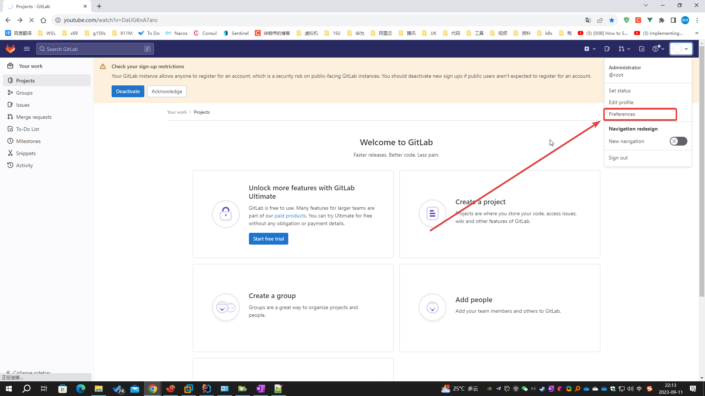

# 使用 helm 安装 gitlab

## 前提条件

- k8s 完成 helm 的配置
- k8s 完成 ingress 的配置

## 说明

- gitlab-ce（社区版）、gitlab-ee（企业版）、gitlab-jh（极狐版）的区别：[GitLab 导读](/docs/guide/gitlab.md)
- 本文以 helm gitlab 7.3.2 为例（即：gitlab v16.3.2）
- 演示环境使用 k8s 单机器群测试，数据使用 local PV 储存
- 使用 helm 安装/配置 gitlab 的域名信息如下，如果特别说明，则使用下表中的值

| 域名                              | 作用              | 说明                  |
|---------------------------------|-----------------|---------------------|
| test.helm.xuxiaowei.cn          | 将用于所有对外暴露服务的域名  | 默认情况下，其他域名在此域名前拼接得到 |
| gitlab.test.helm.xuxiaowei.cn   | 外部访问gitlab实例的域名 |                     |
| minio.test.helm.xuxiaowei.cn    | 对象储存域名          |                     |
| registry.test.helm.xuxiaowei.cn | 容器镜像仓库域名        |                     |

## 文档

- [TLS 配置](https://docs.gitlab.cn/charts/installation/command-line-options.html#tls-%E9%85%8D%E7%BD%AE)
    - certmanager-issuer.email
- [基本配置](https://docs.gitlab.cn/charts/installation/command-line-options.html#%E5%9F%BA%E6%9C%AC%E9%85%8D%E7%BD%AE)
    - global.hosts.domain
    - global.edition
- [Deploy the Community Edition](https://docs.gitlab.com/charts/installation/deployment.html#deploy-the-community-edition)
    - global.edition

## 添加 helm gitlab 仓库

|                  | ArtifactHub 网址                                        | 仓库地址                     | 版本        |
|------------------|-------------------------------------------------------|--------------------------|-----------|
| gitlab/gitlab    | https://artifacthub.io/packages/helm/gitlab/gitlab    | http://charts.gitlab.io  | 社区版、企业版   |
| gitlab-jh/gitlab | https://artifacthub.io/packages/helm/gitlab-jh/gitlab | https://charts.gitlab.cn | 企业版（中国特供） |

### 国外用户推荐使用 gitlab/gitlab 仓库

```shell
helm repo add gitlab https://charts.gitlab.io
```

### 国内用户推荐使用 gitlab-jh/gitlab 仓库

```shell
helm repo add gitlab-jh https://charts.gitlab.cn
```

## 更新仓库

```shell
helm repo update
```

## 查看仓库中可用的版本

```shell
helm search repo gitlab
helm search repo gitlab --versions
```

- gitlab、gitlab-jh 仓库中可用的部分版本如下

| CHART VERSION | APP VERSION |
|---------------|-------------|
| 7.3.2         | v16.3.2     |
| 7.2.5         | v16.2.5     |
| 7.1.5         | v16.1.5     |
| 7.0.8         | v16.0.8     |

## helm 安装 gitlab

```shell
# 创建命令空间，可选，强烈建议使用独立命名空间安装 helm gitlab
kubectl create namespace gitlab-test
```

```shell
# 其中 my-gitlab 是安装到本地的 helm gitlab 的名称
# 其中 gitlab/gitlab 是需要安装的软件名称，gitlab-jh 使用 gitlab-jh/gitlab
# 其中 gitlab/gitlab 默认为企业版，如果要使用社区版，请增加参数 --set global.edition=ce
# 其中 7.3.2 是 gitlab 版本，可自行选择
# 其中 certmanager-issuer.email 是 Let’s Encrypt 账号的电子邮件地址，填写一个自己的邮件地址即可，用于证书到期前提醒
# 其中 --timeout 600s 表示超时时间为 600s

# Helm v3
helm -n gitlab-test install my-gitlab gitlab/gitlab --version 7.3.2 \
  --set certmanager-issuer.email=your@email.com \
  --set global.hosts.domain=test.helm.xuxiaowei.cn \
  --timeout 600s

# Helm v2
#helm -n gitlab-test install --name my-gitlab gitlab/gitlab --version 7.3.2 \
#  --set certmanager-issuer.email=your@email.com \
#  --set global.hosts.domain=test.helm.xuxiaowei.cn \
#  --timeout 600s
```

## 导出 helm gitlab 配置

```Shell
# 将已配置的值导出到文件中
helm -n gitlab-test get values my-gitlab > my-gitlab.yaml
```

```Shell
[root@k8s ~]# cat my-gitlab.yaml
USER-SUPPLIED VALUES:
USER-SUPPLIED VALUES: null
certmanager-issuer:
  email: your@email.com
global:
  hosts:
    domain: test.helm.xuxiaowei.cn
[root@k8s ~]# 
```

## 创建 PV、绑定 PVC

#### 查看 PVC

```shell
[root@k8s ~]# kubectl -n gitlab-test get pvc
NAME                                  STATUS    VOLUME   CAPACITY   ACCESS MODES   STORAGECLASS   AGE
data-my-gitlab-postgresql-0           Pending                                                     2m49s
my-gitlab-minio                       Pending                                                     2m50s
my-gitlab-prometheus-server           Pending                                                     2m50s
redis-data-my-gitlab-redis-master-0   Pending                                                     2m49s
repo-data-my-gitlab-gitaly-0          Pending                                                     2m49s
[root@k8s ~]#
```

#### 创建 PVC

- 演示环境使用 k8s 单机器群测试，数据使用 local PV 储存
- 由于使用 local PV，local PV 需要指定节点调度，所以需要给节点打标签

```shell
# 演示环境
[root@k8s ~]# kubectl get node --show-labels
NAME   STATUS   ROLES           AGE   VERSION   LABELS
k8s    Ready    control-plane   93m   v1.28.1   beta.kubernetes.io/arch=amd64,beta.kubernetes.io/os=linux,kubernetes.io/arch=amd64,kubernetes.io/hostname=k8s,kubernetes.io/os=linux,node-role.kubernetes.io/control-plane=,node.kubernetes.io/exclude-from-external-load-balancers=
[root@k8s ~]# kubectl label nodes k8s gitlab-test=local-pv
node/k8s labeled
[root@k8s ~]# kubectl get node --show-labels
NAME   STATUS   ROLES           AGE   VERSION   LABELS
k8s    Ready    control-plane   93m   v1.28.1   beta.kubernetes.io/arch=amd64,beta.kubernetes.io/os=linux,gitlab-test=local-pv,kubernetes.io/arch=amd64,kubernetes.io/hostname=k8s,kubernetes.io/os=linux,node-role.kubernetes.io/control-plane=,node.kubernetes.io/exclude-from-external-load-balancers=
[root@k8s ~]# 
```

- 创建 PV 文件夹

```shell
# PV 数据储存在 /gitlab-test 文件夹
mkdir -p /gitlab-test/data-my-gitlab-postgresql-0-pv
mkdir -p /gitlab-test/my-gitlab-minio-pv
mkdir -p /gitlab-test/my-gitlab-prometheus-server-pv
mkdir -p /gitlab-test/redis-data-my-gitlab-redis-master-0-pv
mkdir -p /gitlab-test/repo-data-my-gitlab-gitaly-0-pv
```

如果需要情况数据请执行

```shell
rm /gitlab-test/data-my-gitlab-postgresql-0-pv/* -rf
rm /gitlab-test/my-gitlab-minio-pv/* -rf
rm /gitlab-test/my-gitlab-prometheus-server-pv/* -rf
rm /gitlab-test/redis-data-my-gitlab-redis-master-0-pv/* -rf
rm /gitlab-test/repo-data-my-gitlab-gitaly-0-pv/* -rf
```

- 创建 PV、绑定 PVC

```shell
# 编辑文件
vim gitlab-test-pv.yaml
```

```yaml
apiVersion: v1
kind: PersistentVolume
metadata:
  name: data-my-gitlab-postgresql-0-pv
spec:
  accessModes:
    - ReadWriteOnce
  capacity:
    storage: 8Gi
  claimRef:
    apiVersion: v1
    kind: PersistentVolumeClaim
    name: data-my-gitlab-postgresql-0
    namespace: gitlab-test
  local:
    path: /gitlab-test/data-my-gitlab-postgresql-0-pv
  nodeAffinity:
    required:
      nodeSelectorTerms:
        - matchExpressions:
            - key: gitlab-test
              operator: In
              values:
                - local-pv
  persistentVolumeReclaimPolicy: Retain
  volumeMode: Filesystem

---

apiVersion: v1
kind: PersistentVolume
metadata:
  name: my-gitlab-minio-pv
spec:
  accessModes:
    - ReadWriteOnce
  capacity:
    storage: 10Gi
  claimRef:
    apiVersion: v1
    kind: PersistentVolumeClaim
    name: my-gitlab-minio
    namespace: gitlab-test
  local:
    path: /gitlab-test/my-gitlab-minio-pv
  nodeAffinity:
    required:
      nodeSelectorTerms:
        - matchExpressions:
            - key: gitlab-test
              operator: In
              values:
                - local-pv
  persistentVolumeReclaimPolicy: Retain
  volumeMode: Filesystem

---

apiVersion: v1
kind: PersistentVolume
metadata:
  name: my-gitlab-prometheus-server-pv
spec:
  accessModes:
    - ReadWriteOnce
  capacity:
    storage: 8Gi
  claimRef:
    apiVersion: v1
    kind: PersistentVolumeClaim
    name: my-gitlab-prometheus-server
    namespace: gitlab-test
  local:
    path: /gitlab-test/my-gitlab-prometheus-server-pv
  nodeAffinity:
    required:
      nodeSelectorTerms:
        - matchExpressions:
            - key: gitlab-test
              operator: In
              values:
                - local-pv
  persistentVolumeReclaimPolicy: Retain
  volumeMode: Filesystem

---

apiVersion: v1
kind: PersistentVolume
metadata:
  name: redis-data-my-gitlab-redis-master-0-pv
spec:
  accessModes:
    - ReadWriteOnce
  capacity:
    storage: 8Gi
  claimRef:
    apiVersion: v1
    kind: PersistentVolumeClaim
    name: redis-data-my-gitlab-redis-master-0
    namespace: gitlab-test
  local:
    path: /gitlab-test/redis-data-my-gitlab-redis-master-0-pv
  nodeAffinity:
    required:
      nodeSelectorTerms:
        - matchExpressions:
            - key: gitlab-test
              operator: In
              values:
                - local-pv
  persistentVolumeReclaimPolicy: Retain
  volumeMode: Filesystem

---

apiVersion: v1
kind: PersistentVolume
metadata:
  name: repo-data-my-gitlab-gitaly-0-pv
spec:
  accessModes:
    - ReadWriteOnce
  capacity:
    storage: 50Gi
  claimRef:
    apiVersion: v1
    kind: PersistentVolumeClaim
    name: repo-data-my-gitlab-gitaly-0
    namespace: gitlab-test
  local:
    path: /gitlab-test/repo-data-my-gitlab-gitaly-0-pv
  nodeAffinity:
    required:
      nodeSelectorTerms:
        - matchExpressions:
            - key: gitlab-test
              operator: In
              values:
                - local-pv
  persistentVolumeReclaimPolicy: Retain
  volumeMode: Filesystem
```

```shell
# 应用
kubectl apply -f gitlab-test-pv.yaml
```

```shell
# 查看结果
[root@k8s ~]# kubectl get pv
NAME                                     CAPACITY   ACCESS MODES   RECLAIM POLICY   STATUS   CLAIM                                             STORAGECLASS   REASON   AGE
data-my-gitlab-postgresql-0-pv           8Gi        RWO            Retain           Bound    gitlab-test/data-my-gitlab-postgresql-0                                   20s
my-gitlab-minio-pv                       10Gi       RWO            Retain           Bound    gitlab-test/my-gitlab-minio                                               20s
my-gitlab-prometheus-server-pv           8Gi        RWO            Retain           Bound    gitlab-test/my-gitlab-prometheus-server                                   20s
redis-data-my-gitlab-redis-master-0-pv   8Gi        RWO            Retain           Bound    gitlab-test/redis-data-my-gitlab-redis-master-0                           20s
repo-data-my-gitlab-gitaly-0-pv          50Gi       RWO            Retain           Bound    gitlab-test/repo-data-my-gitlab-gitaly-0                                  20s
[root@k8s ~]# kubectl -n gitlab-test get pvc
NAME                                  STATUS   VOLUME                                   CAPACITY   ACCESS MODES   STORAGECLASS   AGE
data-my-gitlab-postgresql-0           Bound    data-my-gitlab-postgresql-0-pv           8Gi        RWO                           24m
my-gitlab-minio                       Bound    my-gitlab-minio-pv                       10Gi       RWO                           24m
my-gitlab-prometheus-server           Bound    my-gitlab-prometheus-server-pv           8Gi        RWO                           24m
redis-data-my-gitlab-redis-master-0   Bound    redis-data-my-gitlab-redis-master-0-pv   8Gi        RWO                           24m
repo-data-my-gitlab-gitaly-0          Bound    repo-data-my-gitlab-gitaly-0-pv          50Gi       RWO                           24m
[root@k8s ~]# 
```

## 查看 helm gitlab pod 状态

```shell
[root@k8s ~]# kubectl -n gitlab-test get pod
NAME                                                 READY   STATUS                  RESTARTS        AGE
my-gitlab-certmanager-757b99868c-7sqxb               1/1     Running                 0               63s
my-gitlab-certmanager-cainjector-598b8d5d8b-c2k79    1/1     Running                 0               63s
my-gitlab-certmanager-webhook-7bb5fc7d5b-8lv48       1/1     Running                 0               63s
my-gitlab-gitaly-0                                   0/1     Pending                 0               30m
my-gitlab-gitlab-exporter-79d7d5df5c-rl6w7           1/1     Running                 0               62s
my-gitlab-gitlab-runner-698c5649bf-sjlvw             0/1     Running                 0               62s
my-gitlab-gitlab-shell-5bcb8cdc46-9dbq7              1/1     Running                 0               62s
my-gitlab-gitlab-shell-5bcb8cdc46-z96tn              1/1     Running                 0               62s
my-gitlab-issuer-1-z6w7x                             0/1     Completed               0               30m
my-gitlab-kas-c96d777f8-4gmv9                        0/1     CrashLoopBackOff        2 (28s ago)     62s
my-gitlab-kas-c96d777f8-gq7xp                        0/1     CrashLoopBackOff        2 (27s ago)     62s
my-gitlab-minio-7989684dd8-8d8cb                     0/1     Pending                 0               30m
my-gitlab-nginx-ingress-controller-6bdd56c45-g4gnh   1/1     Running                 0               62s
my-gitlab-nginx-ingress-controller-6bdd56c45-vm24j   1/1     Running                 0               62s
my-gitlab-postgresql-0                               2/2     Running                 0               57s
my-gitlab-prometheus-server-646489c599-hgkwk         0/2     Pending                 0               30m
my-gitlab-redis-master-0                             0/2     Pending                 0               30m
my-gitlab-registry-c65988947-4zxkq                   1/1     Running                 0               62s
my-gitlab-registry-c65988947-s4t6s                   1/1     Running                 0               61s
my-gitlab-sidekiq-all-in-1-v2-557754944b-fj786       0/1     Init:CrashLoopBackOff   6 (2m13s ago)   30m
my-gitlab-toolbox-85c66fcfc9-7z7q2                   1/1     Running                 0               62s
my-gitlab-webservice-default-7b574d9fc-vr7s9         0/2     Init:CrashLoopBackOff   6 (112s ago)    30m
my-gitlab-webservice-default-7b574d9fc-wvl59         0/2     Init:CrashLoopBackOff   6 (65s ago)     30m
[root@k8s ~]# 
```

## 删除没有正常运行的pod，主动触发进行下一步故障恢复，节省时间

```shell
[root@k8s ~]# kubectl -n gitlab-test delete pod --field-selector 'status.phase!=Running'
pod "my-gitlab-gitaly-0" deleted
pod "my-gitlab-issuer-1-z6w7x" deleted
pod "my-gitlab-minio-7989684dd8-8d8cb" deleted
pod "my-gitlab-prometheus-server-646489c599-hgkwk" deleted
pod "my-gitlab-redis-master-0" deleted
pod "my-gitlab-sidekiq-all-in-1-v2-557754944b-fj786" deleted
pod "my-gitlab-webservice-default-7b574d9fc-vr7s9" deleted
pod "my-gitlab-webservice-default-7b574d9fc-wvl59" deleted
[root@k8s ~]# 
```

```shell
# 或者删除所有 pod
[root@k8s ~]# kubectl -n gitlab-test delete pod --all
pod "my-gitlab-certmanager-757b99868c-2gtd6" deleted
pod "my-gitlab-certmanager-cainjector-598b8d5d8b-6nmkp" deleted
pod "my-gitlab-certmanager-webhook-7bb5fc7d5b-dgjjp" deleted
pod "my-gitlab-gitaly-0" deleted
pod "my-gitlab-gitlab-exporter-79d7d5df5c-rltr7" deleted
pod "my-gitlab-gitlab-runner-698c5649bf-jwskd" deleted
pod "my-gitlab-gitlab-shell-5bcb8cdc46-gnssx" deleted
pod "my-gitlab-gitlab-shell-5bcb8cdc46-zzmfd" deleted
pod "my-gitlab-issuer-1-kj5d6" deleted
pod "my-gitlab-kas-c96d777f8-9h4ph" deleted
pod "my-gitlab-kas-c96d777f8-jz2bz" deleted
pod "my-gitlab-migrations-1-pt7vh" deleted
pod "my-gitlab-minio-7989684dd8-fppbg" deleted
pod "my-gitlab-minio-create-buckets-1-qgchw" deleted
pod "my-gitlab-nginx-ingress-controller-6bdd56c45-jlx4j" deleted
pod "my-gitlab-nginx-ingress-controller-6bdd56c45-lmxdb" deleted
pod "my-gitlab-postgresql-0" deleted
pod "my-gitlab-prometheus-server-646489c599-2kbmp" deleted
pod "my-gitlab-redis-master-0" deleted
pod "my-gitlab-registry-c65988947-jd8zq" deleted
pod "my-gitlab-registry-c65988947-ltlvm" deleted
pod "my-gitlab-sidekiq-all-in-1-v2-557754944b-rpsq8" deleted
pod "my-gitlab-toolbox-85c66fcfc9-kc6wp" deleted
pod "my-gitlab-webservice-default-7b574d9fc-997vx" deleted
pod "my-gitlab-webservice-default-7b574d9fc-pb7ts" deleted
[root@k8s ~]# 
```

## 等待所有 pod 都处于 Running 状态

- pod 名称包含 `gitlab-runner` 的除外
    - `gitlab-runner` pod 使用域名和 https 协议注册到 GitLab，由于 DNS 和证书均为配置，所以 gitlab-runner
      无法正常工作，这是正常现象，如果你不使用 GitLab Runner CI/CD 流水线，可不用理会

```shell
[root@k8s ~]# kubectl -n gitlab-test get pod
NAME                                                 READY   STATUS             RESTARTS      AGE
my-gitlab-certmanager-757b99868c-sb9xg               1/1     Running            0             11m
my-gitlab-certmanager-cainjector-598b8d5d8b-x7b7h    1/1     Running            0             11m
my-gitlab-certmanager-webhook-7bb5fc7d5b-zm9n6       1/1     Running            0             11m
my-gitlab-gitaly-0                                   1/1     Running            0             11m
my-gitlab-gitlab-exporter-79d7d5df5c-96wgn           1/1     Running            0             11m
my-gitlab-gitlab-runner-698c5649bf-w8jpg             0/1     CrashLoopBackOff   3 (23s ago)   11m
my-gitlab-gitlab-shell-5bcb8cdc46-sz2sj              1/1     Running            0             11m
my-gitlab-gitlab-shell-5bcb8cdc46-zd8dw              1/1     Running            0             11m
my-gitlab-kas-c96d777f8-ms7zj                        1/1     Running            3             11m
my-gitlab-kas-c96d777f8-tmcch                        1/1     Running            3 (10m ago)   11m
my-gitlab-minio-7989684dd8-7pjf7                     1/1     Running            0             11m
my-gitlab-nginx-ingress-controller-6bdd56c45-7nchb   1/1     Running            0             11m
my-gitlab-nginx-ingress-controller-6bdd56c45-xdlnt   1/1     Running            0             11m
my-gitlab-postgresql-0                               2/2     Running            0             10m
my-gitlab-prometheus-server-646489c599-cx8b6         2/2     Running            0             11m
my-gitlab-redis-master-0                             2/2     Running            0             11m
my-gitlab-registry-c65988947-h65d5                   1/1     Running            0             11m
my-gitlab-registry-c65988947-p9w8n                   1/1     Running            0             11m
my-gitlab-sidekiq-all-in-1-v2-557754944b-zfhzg       1/1     Running            0             11m
my-gitlab-toolbox-85c66fcfc9-hrkrc                   1/1     Running            0             11m
my-gitlab-webservice-default-7b574d9fc-q6w8h         2/2     Running            0             11m
my-gitlab-webservice-default-7b574d9fc-qmb4g         2/2     Running            0             11m
[root@k8s ~]# 
```

## 修改 DNS，访问 gitlab

- 演示环境：Windows 修改 `C:\Windows\System32\drivers\etc\hosts`

```Shell
192.168.80.3    gitlab.test.helm.xuxiaowei.cn
192.168.80.3    minio.test.helm.xuxiaowei.cn

# 不使用 GitLab 提供的 镜像库 可忽略 registry 域名
192.168.80.3    registry.test.helm.xuxiaowei.cn

# Pages 页面 域名
# 不使用 Pages 功能可忽略 Pages 域名
192.168.80.3    pages.test.helm.xuxiaowei.cn

# 此处演示仅增加两个 pages 子域名，如果要使用 Pages 功能，请使用通配符将 *.pages.test.helm.xuxiaowei.cn 解析到服务器IP

# 用户 Pages 页面 域名，其中用户名为 root
192.168.80.3    root.pages.test.helm.xuxiaowei.cn
# 用户 Pages 页面 域名，其中用户名为 xuxiaowei
192.168.80.3    xuxiaowei.pages.test.helm.xuxiaowei.cn
```

## 修改已安装的 helm gitlab 配置

```Shell
# 将已配置的值导出到文件中

helm -n gitlab-test get values my-gitlab > my-gitlab.yaml

# 更新配置
helm upgrade -n gitlab-test --install my-gitlab gitlab/gitlab \
  --set 你需要设置的配置 \
  --version 7.3.2 \
  -f my-gitlab.yaml \
  --timeout 600s
```

## 登陆 GitLab

### 访问 [https://gitlab.test.helm.xuxiaowei.cn](https://gitlab.test.helm.xuxiaowei.cn) ，浏览器提示：


### 点击 `继续前往gitlab.test.helm.xuxiaowei.cn（不安全）` ，可选择 `中文`


### 获取管理员 `root` 用户的初始化密码

```Shell
kubectl -n gitlab-test get secrets my-gitlab-gitlab-initial-root-password -ojsonpath='{.data.password}' | base64 --decode ; echo
```

### 登陆之后的结果


### 关闭新导航栏（可选）


### 进入偏好设置，修改为中文菜单（可选）

1. 偏好设置网址：https://gitlab.test.helm.xuxiaowei.cn/-/profile/preferences

2. 新版导航栏
   
   

3. 旧版导航栏
   
   

## 本地化配置（可选）

设置未登录用户的默认语言为中文

1. 进入管理员页面

   

2. 进入偏好设置

   

3. 设置未登录用户的默认语言为中文

   
