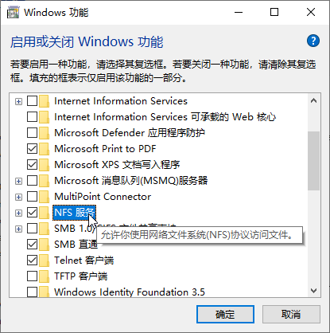
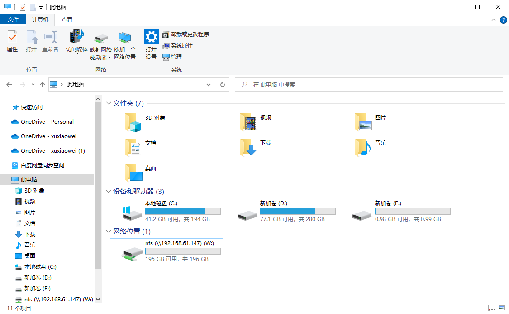

# CentOS 7 中安装 NFS

## 说明

1. NFS（Network File System）网络文件系统
2. NFS 仅推荐在测试环境使用

## 视频演示

<iframe src="//player.bilibili.com/player.html?aid=610560153&bvid=BV1584y1P7sg&cid=1042154424&page=1" scrolling="no" border="0" frameborder="no" framespacing="0" allowfullscreen="true"></iframe>

## 配置

1. 安装 NFS

    ```shell
    yum -y install rpcbind nfs-utils
    ```

2. 创建用于储存 NFS 的文件夹

    ```shell
    mkdir -p /nfs
    ```

3. 配置 NFS

    ```shell
    # -bash: vim: command not found
    # yum -y install vim
    vim /etc/exports
    ```

    ```shell
    /nfs *(rw,sync,all_squash,anonuid=0,anongid=0)
    
    # rw：
    # sync：
    # all_squash：
    # anonuid：
    # anongid：
    ```

4. 启动 rpcbind

    ```shell
    # 查看状态
    systemctl status rpcbind.service
    
    # 查看开机自启状态
    systemctl list-unit-files | grep rpcbind.service
    
    # 启动
    systemctl start rpcbind.service
    
    # 设置开机自启
    systemctl enable rpcbind.service
    ```

    ```shell
    # 停止
    systemctl stop rpcbind.service
    
    # 关闭开机自启
    systemctl disable rpcbind.service
    ```

5. 启动 nfs **或者是 nfs-server**

    ```shell
    # 查看状态
    systemctl status nfs.service
    
    # 查看开机自启状态
    systemctl list-unit-files | grep nfs.service
    
    # 启动
    systemctl start nfs.service
    
    # 设置开机自启
    systemctl enable nfs.service
    ```

    ```shell
    # 停止
    systemctl stop nfs.service
    
    # 关闭开机自启
    systemctl disable nfs.service
    ```

6. 检查端口与进程

    ```shell
    rpcinfo -p 127.0.0.1
    ```

    ```shell
    [root@localhost ~]# rpcinfo -p 127.0.0.1
       program vers proto   port  service
        100000    4   tcp    111  portmapper
        100000    3   tcp    111  portmapper
        100000    2   tcp    111  portmapper
        100000    4   udp    111  portmapper
        100000    3   udp    111  portmapper
        100000    2   udp    111  portmapper
        100024    1   udp  52921  status
        100024    1   tcp  53664  status
        100005    1   udp  20048  mountd
        100005    1   tcp  20048  mountd
        100005    2   udp  20048  mountd
        100005    2   tcp  20048  mountd
        100005    3   udp  20048  mountd
        100005    3   tcp  20048  mountd
        100003    3   tcp   2049  nfs
        100003    4   tcp   2049  nfs
        100227    3   tcp   2049  nfs_acl
        100003    3   udp   2049  nfs
        100003    4   udp   2049  nfs
        100227    3   udp   2049  nfs_acl
        100021    1   udp  40687  nlockmgr
        100021    3   udp  40687  nlockmgr
        100021    4   udp  40687  nlockmgr
        100021    1   tcp  37193  nlockmgr
        100021    3   tcp  37193  nlockmgr
        100021    4   tcp  37193  nlockmgr
    [root@localhost ~]# 
    ```

7. 查看NFS

    ```shell
    showmount -e 127.0.0.1
    ```

    ```shell
    [root@localhost ~]# showmount -e 127.0.0.1
    Export list for 127.0.0.1:
    /nfs *
    [root@localhost ~]# 
    ```

8. 将NFS客户IP添加到信任区

    ```shell
    # 将NFS客户端IP添加到信任区
    firewall-cmd --zone=trusted --add-source=192.168.0.8 --permanent
    # 重载防火墙
    firewall-cmd --reload
    # 查看信任区的配置
    firewall-cmd --list-all --zone=trusted
    ```

9. 测试
    1. Linux 挂载 NFS
        1. 挂载（本机挂载，仅用于测试，其他Linux客户端挂载同理，客户端与服务端安装相同的软件）

            ```shell
            mkdir -p /test/nfs
            mount -t nfs 127.0.0.1:/nfs /test/nfs
            
            # 永久挂载
            # vim /etc/fstab
            # 127.0.0.1:/nfs  /test/nfs       nfs     defaults,_netdev 0 0
            ```

            ```shell
            [root@localhost ~]# mkdir /test/nfs
            [root@localhost ~]# mount -t nfs 127.0.0.1:/nfs /test/nfs
            [root@localhost ~]#
            ```

            ```shell
            [root@localhost ~]# df -h
            Filesystem           Size  Used Avail Use% Mounted on
            devtmpfs             897M     0  897M   0% /dev
            tmpfs                910M     0  910M   0% /dev/shm
            tmpfs                910M  9.6M  901M   2% /run
            tmpfs                910M     0  910M   0% /sys/fs/cgroup
            /dev/mapper/ao-root  197G  1.6G  196G   1% /
            /dev/sda1           1014M  155M  860M  16% /boot
            127.0.0.1:/nfs       197G  1.6G  196G   1% /test/nfs
            tmpfs                182M     0  182M   0% /run/user/0
            [root@localhost ~]# 
            ```

    2. Windows 挂载 NFS
        1. 挂载（需要 Windows 中打开此功能）

           

            ```shell
            mount \\192.168.61.147\nfs W:\
            ```

            ```shell
            C:\Users\xuxiaowei>mount \\192.168.61.147\nfs W:\
            W: 现已成功连接到 \\192.168.61.147\nfs
                    
            命令已成功完成。
                    
            C:\Users\xuxiaowei>
            ```

        2. 查看

           
