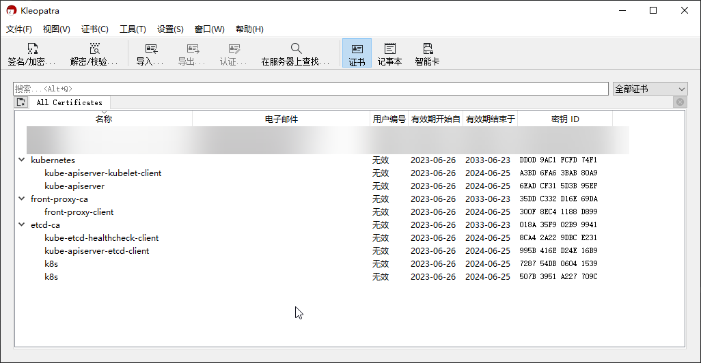

# 使用 openssl 生成 Kubernetes（k8s） 新证书

使用 openssl 生成 Kubernetes（k8s） 新证书（未完成）

## 文档

1. [PKI 证书和要求](https://kubernetes.io/zh-cn/docs/setup/best-practices/certificates/)

## 说明

1. 不推荐使用此方式，此方式要求对 `openssl` 命令比较了解
2. 不推荐使用此方式，此方式要求对 k8s 配置文件比较了解
3. 此方式仅用学习 `openssl` 相关命令
4. k8s ca 原始文件、k8s 配置文件
   1. <a target="_blank" href="/ca/manifests/kube-apiserver.yaml">/etc/kubernetes/manifests/kube-apiserver.yaml</a>
   2. <a target="_blank" href="/ca/manifests/kube-controller-manager.yaml">/etc/kubernetes/manifests/kube-controller-manager.yaml</a>
   3. <a target="_blank" href="/ca/manifests/kube-scheduler.yaml">/etc/kubernetes/manifests/kube-scheduler.yaml</a>
   4. <a target="_blank" href="/ca/manifests/etcd.yaml">/etc/kubernetes/manifests/etcd.yaml</a>
   5. <a target="_blank" href="/ca/pki/etcd/ca.key">/etc/kubernetes/pki/etcd/ca.key</a>
   6. <a target="_blank" href="/ca/pki/etcd/ca.crt">/etc/kubernetes/pki/etcd/ca.crt</a>
   7. <a target="_blank" href="/ca/pki/etcd/server.key">/etc/kubernetes/pki/etcd/server.key</a>
   8. <a target="_blank" href="/ca/pki/etcd/server.crt">/etc/kubernetes/pki/etcd/server.crt</a>
   9. <a target="_blank" href="/ca/pki/etcd/peer.key">/etc/kubernetes/pki/etcd/peer.key</a>
   10. <a target="_blank" href="/ca/pki/etcd/peer.crt">/etc/kubernetes/pki/etcd/peer.crt</a>
   11. <a target="_blank" href="/ca/pki/etcd/healthcheck-client.key">/etc/kubernetes/pki/etcd/healthcheck-client.key</a>
   12. <a target="_blank" href="/ca/pki/etcd/healthcheck-client.crt">/etc/kubernetes/pki/etcd/healthcheck-client.crt</a>
   13. <a target="_blank" href="/ca/pki/ca.key">/etc/kubernetes/pki/ca.key</a>
   14. <a target="_blank" href="/ca/pki/ca.crt">/etc/kubernetes/pki/ca.crt</a>
   15. <a target="_blank" href="/ca/pki/apiserver.key">/etc/kubernetes/pki/apiserver.key</a>
   16. <a target="_blank" href="/ca/pki/apiserver.crt">/etc/kubernetes/pki/apiserver.crt</a>
   17. <a target="_blank" href="/ca/pki/apiserver-kubelet-client.key">/etc/kubernetes/pki/apiserver-kubelet-client.key</a>
   18. <a target="_blank" href="/ca/pki/apiserver-kubelet-client.crt">/etc/kubernetes/pki/apiserver-kubelet-client.crt</a>
   19. <a target="_blank" href="/ca/pki/front-proxy-ca.key">/etc/kubernetes/pki/front-proxy-ca.key</a>
   20. <a target="_blank" href="/ca/pki/front-proxy-ca.crt">/etc/kubernetes/pki/front-proxy-ca.crt</a>
   21. <a target="_blank" href="/ca/pki/front-proxy-client.key">/etc/kubernetes/pki/front-proxy-client.key</a>
   22. <a target="_blank" href="/ca/pki/front-proxy-client.crt">/etc/kubernetes/pki/front-proxy-client.crt</a>
   23. <a target="_blank" href="/ca/pki/apiserver-etcd-client.key">/etc/kubernetes/pki/apiserver-etcd-client.key</a>
   24. <a target="_blank" href="/ca/pki/apiserver-etcd-client.crt">/etc/kubernetes/pki/apiserver-etcd-client.crt</a>
   25. <a target="_blank" href="/ca/pki/sa.key">/etc/kubernetes/pki/sa.key</a>
   26. <a target="_blank" href="/ca/pki/sa.pub">/etc/kubernetes/pki/sa.pub</a>
   27. <a target="_blank" href="/ca/admin.conf">/etc/kubernetes/admin.conf</a>
   28. <a target="_blank" href="/ca/kubelet.conf">/etc/kubernetes/kubelet.conf</a>
   29. <a target="_blank" href="/ca/controller-manager.conf">/etc/kubernetes/controller-manager.conf</a>
   30. <a target="_blank" href="/ca/scheduler.conf">/etc/kubernetes/scheduler.conf</a>
5. 证书之间的关系
   
6. k8s 配置文件说明
    1. [/etc/kubernetes/admin.conf](/ca/admin.conf)
        - clusters.cluster.certificate-authority-data
            1. <a target="_blank" href="/ca/pki/ca.crt">/etc/kubernetes/pki/ca.crt</a> 文件内容计算 Base64 可得
                ```shell
                cat /etc/kubernetes/pki/etcd/ca.crt | base64 -w 0
                ```
        - users.user.client-certificate-data
            1. 颁发者 CN：kubernetes
            2. 颁发给、使用者 CN：kubernetes-admin
            3. O：system:masters
        - users.user.client-key-data
            1. users.user.client-certificate-data 的秘钥
    2. [/etc/kubernetes/kubelet.conf](/ca/kubelet.conf)
        - clusters.cluster.certificate-authority-data
            1. <a target="_blank" href="/ca/pki/ca.crt">/etc/kubernetes/pki/ca.crt</a> 文件内容计算 Base64 可得
                ```shell
                cat /etc/kubernetes/pki/etcd/ca.crt | base64 -w 0
                ```
        - users.user.client-certificate-data
            1. 颁发者 CN：kubernetes
            2. 颁发给、使用者 CN：system:kube-controller-manager
        - users.user.client-key-data
            1. users.user.client-certificate-data 的秘钥
    3. [/etc/kubernetes/controller-manager.conf](/ca/controller-manager.conf)
        - clusters.cluster.certificate-authority-data
            1. <a target="_blank" href="/ca/pki/ca.crt">/etc/kubernetes/pki/ca.crt</a> 文件内容计算 Base64 可得
                ```shell
                cat /etc/kubernetes/pki/etcd/ca.crt | base64 -w 0
                ```
    4. [/etc/kubernetes/scheduler.conf](/ca/scheduler.conf)
        - clusters.cluster.certificate-authority-data
            1. <a target="_blank" href="/ca/pki/ca.crt">/etc/kubernetes/pki/ca.crt</a> 文件内容计算 Base64 可得
                ```shell
                cat /etc/kubernetes/pki/etcd/ca.crt | base64 -w 0
                ```
        - users.user.client-certificate-data
            1. 颁发者 CN：kubernetes
            2. 颁发给、使用者 CN：system:kube-scheduler
        - users.user.client-key-data
            1. users.user.client-certificate-data 的秘钥

## 配置

```shell
# 颁发者（颁发 ca.crt）
CN=kubernetes
# 使用者可选名称 DNS Name
CA_DNS=kubernetes

# 使用者、颁发给（使用 ca.key 颁发 apiserver.crt）
APISERVER_CN=kube-apiserver

# 集群名称，主机名
CLUSTER_NAME=k8s
# 集群内部IP
CLUSTER_IP=10.96.0.1
# 集群服务器IP，apiserver 使用的 IP
CLUSTER_SERVER_IP=192.168.80.201

# 使用者、颁发给（使用 ca.key 颁发 apiserver-kubelet-client.crt）
APISERVER_KUBELET_CLIENT_CN=kube-apiserver-kubelet-client

# 颁发者（颁发 front-proxy-ca.crt）
FRONT_PROXY_CA_CN=front-proxy-ca
FRONT_PROXY_CA_DNS=front-proxy-ca

# 使用者、颁发给（使用 front-proxy-ca.key 颁发 front-proxy-client.crt）
FRONT_PROXY_CLIENT_CN=front-proxy-client

# 颁发者（颁发 etcd 的 ca.crt）
ETCD_CA_CN=etcd-ca
ETCD_CA_DNS=etcd-ca

# 使用者、颁发给（使用 etcd/ca.key 颁发 healthcheck-client.crt）
KUBE_ETCD_HEALTHCHECK_CLIENT_CN=kube-etcd-healthcheck-client

# 使用者、颁发给（使用 ca.key 颁发 apiserver-etcd-client.crt）
KUBE_APISERVER_ETCD_CLIENT_CN=kube-apiserver-etcd-client

```

```shell
cat > ca-openssl.cnf << EOF
[req]
req_extensions = v3_req
distinguished_name = req_distinguished_name

[v3_req]
subjectAltName = @alt_names

[alt_names]
DNS.1 = $CA_DNS

EOF

cat ca-openssl.cnf
```

```shell
cat > apiserver-openssl.cnf << EOF
[req]
req_extensions = v3_req
distinguished_name = req_distinguished_name

[v3_req]
subjectAltName = @alt_names

[alt_names]
DNS.1 = $CLUSTER_NAME
DNS.2 = $CA_DNS
DNS.3 = kubernetes.default
DNS.4 = kubernetes.default.svc
DNS.5 = kubernetes.default.svc.cluster.local
IP.1 = $CLUSTER_IP
IP.2 = $CLUSTER_SERVER_IP

EOF

cat apiserver-openssl.cnf
```

```shell
cat > front-proxy-ca-openssl.cnf << EOF
[req]
req_extensions = v3_req
distinguished_name = req_distinguished_name

[v3_req]
subjectAltName = @alt_names

[alt_names]
DNS.1 = $FRONT_PROXY_CA_DNS

EOF

cat front-proxy-ca-openssl.cnf
```

```shell
mkdir -p etcd
cat > etcd/ca-openssl.cnf << EOF
[req]
req_extensions = v3_req
distinguished_name = req_distinguished_name

[v3_req]
subjectAltName = @alt_names

[alt_names]
DNS.1 = $ETCD_CA_DNS

EOF

cat etcd/ca-openssl.cnf
```

```shell
cat > etcd/server-openssl.cnf << EOF
[req]
req_extensions = v3_req
distinguished_name = req_distinguished_name

[v3_req]
subjectAltName = @alt_names

[alt_names]
DNS.1 = $CLUSTER_NAME
DNS.2 = localhost
IP.1 = $CLUSTER_SERVER_IP
IP.2 = 127.0.0.1
IP.3 = 0000:0000:0000:0000:0000:0000:0000:0001

EOF

cat etcd/server-openssl.cnf
```

```shell
cat > etcd/peer-openssl.cnf << EOF
[req]
req_extensions = v3_req
distinguished_name = req_distinguished_name

[v3_req]
subjectAltName = @alt_names

[alt_names]
DNS.1 = $CLUSTER_NAME
DNS.2 = localhost
IP.1 = $CLUSTER_SERVER_IP
IP.2 = 127.0.0.1
IP.3 = 0000:0000:0000:0000:0000:0000:0000:0001

EOF

cat etcd/peer-openssl.cnf
```

```shell
# 生成根证书（CA）和密钥对：
openssl genrsa -out ca.key 2048
openssl req -new -key ca.key -out ca.csr -subj "/CN=$CN"
openssl x509 -req -days 36500 -in ca.csr -signkey ca.key -out ca.crt -extensions v3_req -extfile ca-openssl.cnf


# 生成 API Server 相关的证书和密钥对：
openssl genrsa -out apiserver.key 2048
openssl req -new -key apiserver.key -out apiserver.csr -subj "/CN=$APISERVER_CN"
openssl x509 -req -days 36500 -CA ca.crt -CAkey ca.key -CAcreateserial -in apiserver.csr -out apiserver.crt -extensions v3_req -extfile apiserver-openssl.cnf


# 生成 API Server-Kubelet 客户端相关的证书和密钥对：
openssl genrsa -out apiserver-kubelet-client.key 2048
openssl req -new -key apiserver-kubelet-client.key -out apiserver-kubelet-client.csr -subj "/CN=$APISERVER_KUBELET_CLIENT_CN/O=system:masters"
openssl x509 -req -days 36500 -CA ca.crt -CAkey ca.key -CAcreateserial -in apiserver-kubelet-client.csr -out apiserver-kubelet-client.crt


# 生成前置代理（front-proxy）相关的证书和密钥对：
openssl genrsa -out front-proxy-ca.key 2048
openssl req -new -key front-proxy-ca.key -out front-proxy-ca.csr -subj "/CN=$FRONT_PROXY_CA_CN"
openssl x509 -req -days 36500 -in front-proxy-ca.csr -signkey front-proxy-ca.key -out front-proxy-ca.crt -extensions v3_req -extfile front-proxy-ca-openssl.cnf

openssl genrsa -out front-proxy-client.key 2048
openssl req -new -key front-proxy-client.key -out front-proxy-client.csr -subj "/CN=$FRONT_PROXY_CLIENT_CN"
openssl x509 -req -days 36500 -CA front-proxy-ca.crt -CAkey front-proxy-ca.key -CAcreateserial -in front-proxy-client.csr -out front-proxy-client.crt


# 生成 etcd 相关的证书和密钥对：
mkdir -p etcd
openssl genrsa -out etcd/ca.key 2048
openssl req -new -key etcd/ca.key -out etcd/ca.csr -subj "/CN=$ETCD_CA_CN"
openssl x509 -req -days 36500 -in etcd/ca.csr -signkey etcd/ca.key -out etcd/ca.crt -extensions v3_req -extfile etcd/ca-openssl.cnf

openssl genrsa -out etcd/server.key 2048
openssl req -new -key etcd/server.key -out etcd/server.csr -subj "/CN=$CLUSTER_NAME"
openssl x509 -req -days 36500 -CA etcd/ca.crt -CAkey etcd/ca.key -CAcreateserial -in etcd/server.csr -out etcd/server.crt -extensions v3_req -extfile etcd/server-openssl.cnf

openssl genrsa -out etcd/peer.key 2048
openssl req -new -key etcd/peer.key -out etcd/peer.csr -subj "/CN=$CLUSTER_NAME"
openssl x509 -req -days 36500 -CA etcd/ca.crt -CAkey etcd/ca.key -CAcreateserial -in etcd/peer.csr -out etcd/peer.crt -extensions v3_req -extfile etcd/peer-openssl.cnf

openssl genrsa -out etcd/healthcheck-client.key 2048
openssl req -new -key etcd/healthcheck-client.key -out etcd/healthcheck-client.csr -subj "/CN=$KUBE_ETCD_HEALTHCHECK_CLIENT_CN/O=system:masters"
openssl x509 -req -days 36500 -CA etcd/ca.crt -CAkey etcd/ca.key -CAcreateserial -in etcd/healthcheck-client.csr -out etcd/healthcheck-client.crt


# 生成 API Server-Etcd 客户端相关的证书和密钥对：
openssl genrsa -out apiserver-etcd-client.key 2048
openssl req -new -key apiserver-etcd-client.key -out apiserver-etcd-client.csr -subj "/CN=$KUBE_APISERVER_ETCD_CLIENT_CN/O=system:masters"
openssl x509 -req -days 36500 -CA etcd/ca.crt -CAkey etcd/ca.key -CAcreateserial -in apiserver-etcd-client.csr -out apiserver-etcd-client.crt


# 生成 Service Account 密钥对：
openssl genpkey -algorithm RSA -out sa.key
openssl rsa -pubout -in sa.key -out sa.pub
```
