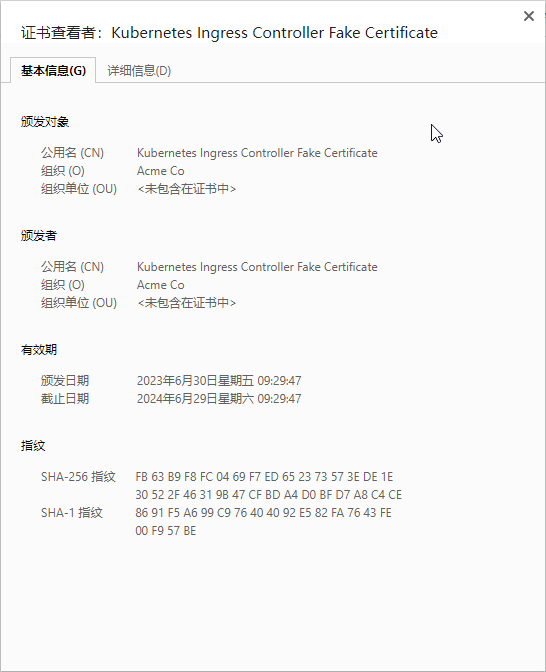
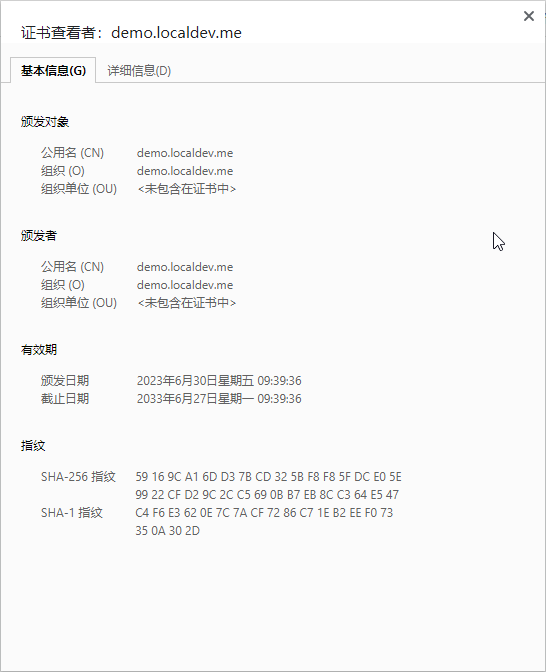

# Ingress 安装

基于域名进行反向代理，支持配置 SSL（https）

## 说明

1. [Ingress](https://kubernetes.io/zh-cn/docs/concepts/services-networking/ingress/)
    1. 是对集群中服务的外部访问进行管理的 API 对象，典型的访问方式是 HTTP
    2. 可以提供负载均衡、SSL 终端和基于名称的虚拟主机托管
    3. **根据不同的`域名`、`path`，转发到不同的 `Service` 中**
2. ingress-nginx 仓库
    1. [GitHub](https://github.com/kubernetes/ingress-nginx/)
    2. [作者镜像仓库](https://framagit.org/mirrors-github/kubernetes/ingress-nginx)
        1. 注意主分支应该是 `main`
        2. 安装指南
            1. [GitHub](https://github.com/kubernetes/ingress-nginx/blob/main/docs/deploy/index.md)
            2. [作者镜像仓库](https://framagit.org/mirrors-github/kubernetes/ingress-nginx/-/blob/main/docs/deploy/index.md)
        3. 版本支持
            1. [GitHub](https://github.com/kubernetes/ingress-nginx/blob/main/ingress-nginx.yaml)
            2. [作者镜像仓库](https://framagit.org/mirrors-github/kubernetes/ingress-nginx/-/blob/main/ingress-nginx.yaml)
3. [ingress-nginx 文档](https://kubernetes.github.io/ingress-nginx/)
    1. [TLS/HTTPS](https://kubernetes.github.io/ingress-nginx/user-guide/tls/)
    2. [stream-snippet](https://kubernetes.github.io/ingress-nginx/user-guide/nginx-configuration/annotations/#stream-snippet)
    3. [configuration-snippet](https://kubernetes.github.io/ingress-nginx/user-guide/nginx-configuration/annotations/#configuration-snippet)
4. 本文以 k8s 1.26.2 为例
5. 本文以 ingress-nginx 的 controller-v1.8.0 标签 为例
6. 镜像使用说明

| 版本/标签             | k8s 版本              | registry.k8s.io/ingress-nginx/kube-webhook-certgen 镜像版本 | registry.k8s.io/ingress-nginx/controller 镜像版本 |
|-------------------|---------------------|---------------------------------------------------------|-----------------------------------------------|
| controller-v1.9.5 | 1.28,1.27,1.26,1.25 | v20231011-8b53cabe0                                     | v1.9.5                                        |
| controller-v1.9.4 | 1.28,1.27,1.26,1.25 | v20231011-8b53cabe0                                     | v1.9.4                                        |
| controller-v1.9.3 | 1.28,1.27,1.26,1.25 | v20231011-8b53cabe0                                     | v1.9.3                                        |
| controller-v1.9.1 | 1.28,1.27,1.26,1.25 | v20230407                                               | v1.9.1                                        |
| controller-v1.9.0 | 1.28,1.27,1.26,1.25 | v20230407                                               | v1.9.0                                        |
| controller-v1.8.4 | 1.27,1.26,1.25,1.24 | v20231011-8b53cabe0                                     | v1.8.4                                        |
| controller-v1.8.2 | 1.27,1.26,1.25,1.24 | v20230407                                               | v1.8.2                                        |
| controller-v1.8.1 | 1.27,1.26,1.25,1.24 | v20230407                                               | v1.8.1                                        |
| controller-v1.8.0 | 1.27,1.26,1.25,1.24 | v20230407                                               | v1.8.0                                        |

| 官方镜像                                                                   | 作者 docker hub 镜像（支持 amd64、arm/v7、arm64、s390x 镜像）                      |
|------------------------------------------------------------------------|-----------------------------------------------------------------------|
| registry.k8s.io/ingress-nginx/controller:v1.9.5                        | xuxiaoweicomcn/ingress-nginx-controller:v1.9.5                        |
| registry.k8s.io/ingress-nginx/controller:v1.9.4                        | xuxiaoweicomcn/ingress-nginx-controller:v1.9.4                        |
| registry.k8s.io/ingress-nginx/controller:v1.9.3                        | xuxiaoweicomcn/ingress-nginx-controller:v1.9.3                        |
| registry.k8s.io/ingress-nginx/controller:v1.9.1                        | xuxiaoweicomcn/ingress-nginx-controller:v1.9.1                        |
| registry.k8s.io/ingress-nginx/controller:v1.9.0                        | xuxiaoweicomcn/ingress-nginx-controller:v1.9.0                        |
| registry.k8s.io/ingress-nginx/controller:v1.8.4                        | xuxiaoweicomcn/ingress-nginx-controller:v1.8.4                        |
| registry.k8s.io/ingress-nginx/controller:v1.8.2                        | xuxiaoweicomcn/ingress-nginx-controller:v1.8.2                        |
| registry.k8s.io/ingress-nginx/controller:v1.8.1                        | xuxiaoweicomcn/ingress-nginx-controller:v1.8.1                        |
| registry.k8s.io/ingress-nginx/controller:v1.8.0                        | xuxiaoweicomcn/ingress-nginx-controller:v1.8.0                        |
| registry.k8s.io/ingress-nginx/kube-webhook-certgen:v20231011-8b53cabe0 | xuxiaoweicomcn/ingress-nginx-kube-webhook-certgen:v20231011-8b53cabe0 |
| registry.k8s.io/ingress-nginx/kube-webhook-certgen:v20230407           | xuxiaoweicomcn/ingress-nginx-kube-webhook-certgen:v20230407           |

## 配置

1. 下载配置 ingress-nginx 文件

    ```shell
    INGRESS_NGINX_VERSION=1.8.0
    
    # 使用 LoadBalancer
    # 适合于没有 Helm 的环境，或者是倾向于使用 YAML 配置
    # wget https://raw.githubusercontent.com/kubernetes/ingress-nginx/controller-v$INGRESS_NGINX_VERSION/deploy/static/provider/cloud/deploy.yaml
    wget --no-check-certificate https://framagit.org/mirrors-github/kubernetes/ingress-nginx/-/raw/controller-v$INGRESS_NGINX_VERSION/deploy/static/provider/cloud/deploy.yaml
    
    # 或者
    # 使用 NodePort
    # 适合于裸机服务器的 Kubernetes 集群，以及 Kubernetes 是手动安装的，支持通用的 Linux 发行版（如：CentOS、Ubuntu 等）
    # wget https://raw.githubusercontent.com/kubernetes/ingress-nginx/controller-v$INGRESS_NGINX_VERSION/deploy/static/provider/baremetal/deploy.yaml
    # wget --no-check-certificate https://framagit.org/mirrors-github/kubernetes/ingress-nginx/-/raw/controller-v$INGRESS_NGINX_VERSION/deploy/static/provider/baremetal/deploy.yaml
    
    # 其他云厂商的k8s，请参见文档：
    # https://github.com/kubernetes/ingress-nginx/blob/main/docs/deploy/index.md
    # https://framagit.org/mirrors-github/kubernetes/ingress-nginx/-/blob/main/docs/deploy/index.md
    ```

2. 修改为国内可以访问的镜像（国内可能无法访问 registry.k8s.io 域名）

   使用 作者 docker hub 镜像（支持 amd64、arm/v7、arm64、s390x 镜像）

    ```shell
    # 删除 @ 后面的内容
    sed -i 's/@.*$//' deploy.yaml
    sed -i 's/registry.k8s.io\/ingress-nginx\/controller/xuxiaoweicomcn\/ingress-nginx-controller/g' deploy.yaml
    sed -i 's/registry.k8s.io\/ingress-nginx\/kube-webhook-certgen/xuxiaoweicomcn\/ingress-nginx-kube-webhook-certgen/g' deploy.yaml
    ```

3. k8s 配置 ingress-nginx
    ```shell
    kubectl apply -f deploy.yaml
    
    kubectl get pod --all-namespaces
    #  kubectl get pod --all-namespaces -w
    
    kubectl get svc --all-namespaces
    ```

4. 简单测试
    1. 使用 httpd 创建 deployment（这里使用作者个人镜像，加快镜像下载速度）
        1. 方式1：使用命令创建 deployment

            ```shell
            # 使用 -n 指定创建时的命名空间，不指定时默认 default
            kubectl create deployment demo --image=registry.cn-qingdao.aliyuncs.com/xuxiaoweicomcn/httpd:2.4.57 --port=80
            
            kubectl get deployment
            kubectl get pod
            ```

        2. 方式2：使用 YAML

            ```shell
            cat > demo-deployment.yaml << EOF
            apiVersion: apps/v1
            kind: Deployment
            metadata:
              name: demo
              # 此处可使用 namespace 指定命名空间，一旦这里指定了命名空间，下面的 Service 与此命名空间相同
              # 不指定时默认 default
            spec:
              replicas: 1
              selector:
                matchLabels:
                  app: demo
              template:
                metadata:
                  labels:
                    app: demo
                spec:
                  containers:
                    - name: demo
                      image: registry.cn-qingdao.aliyuncs.com/xuxiaoweicomcn/httpd:2.4.57
                      ports:
                        - containerPort: 80
                
            EOF
                
            cat demo-deployment.yaml
                
            kubectl apply -f demo-deployment.yaml
                
            kubectl get deployment
            kubectl get pod
            ```

    2. 创建 Service 绑定 deployment
        1. 方式1：使用命令创建 Service

             ```shell
             # 使用 -n 指定创建时的命名空间，不指定时默认 default
             kubectl expose deployment demo
             
             kubectl get service
             ```

        2. 方式2：使用 YAML

            ```shell
            cat > demo-service.yaml << EOF
            apiVersion: v1
            kind: Service
            metadata:
              name: demo
              # 此处可使用 namespace 指定命名空间，一旦这里指定了命名空间，下面的 Service 与此命名空间相同
              # 不指定时默认 default
            spec:
              selector:
                app: demo
              ports:
                - protocol: TCP
                  port: 80
                  targetPort: 80
            
            EOF
            
            cat demo-service.yaml
            
            kubectl apply -f demo-service.yaml
            
            kubectl get service
            ```

        3. 创建 ingress
            1. 方式1：使用命令创建 ingress

                ```shell
                # 使用 -n 指定创建时的命名空间，不指定时默认 default
                # demo 代表 Service 名称，与指定的命名空间相同
                # 80 代表 Service 内部端口，不是外部暴露的端口
                kubectl create ingress demo-localhost --class=nginx --rule="demo.localdev.me/*=demo:80"
                
                kubectl get ingress
                ```

            2. 方式2：使用 YAML

                ```shell
                cat > demo-localhost-ingress.yaml << EOF
                apiVersion: networking.k8s.io/v1
                kind: Ingress
                metadata:
                  name: demo-localhost
                  # 此处可使用 namespace 指定命名空间，一旦这里指定了命名空间，下面的 Service 与此命名空间相同
                  # 不指定时默认 default
                  annotations:
                    kubernetes.io/ingress.class: nginx
                spec:
                  rules:
                    - host: demo.localdev.me
                      http:
                        paths:
                          - pathType: Prefix
                            path: /
                            backend:
                              service:
                                # Service 名称，与上方指定的命名空间相同
                                name: demo
                                port:
                                  # 80 代表 Service 内部端口，不是外部暴露的端口
                                  number: 80
        
                EOF
        
                cat demo-localhost-ingress.yaml
        
                kubectl apply -f demo-localhost-ingress.yaml
        
                kubectl get ingress
                ```

        4. 查看 ingress-nginx-controller 端口

            ```shell
            # 使用 -n 指定创建时的命名空间，不指定时默认 default
            kubectl get service ingress-nginx-controller --namespace=ingress-nginx
            ```

           输出结果如下：
           80:30913：ingress-nginx 80 端口映射为 30913（k8s Service 默认端口范围是 30000-32767，并且需要是一个连续的端口范围）
           443:31664：ingress-nginx 443 端口映射为 31664（k8s Service 默认端口范围是 30000-32767，并且需要是一个连续的端口范围）

            ```shell
            [root@k8s ~]# kubectl get service ingress-nginx-controller --namespace=ingress-nginx
            NAME                       TYPE           CLUSTER-IP      EXTERNAL-IP   PORT(S)                      AGE
            ingress-nginx-controller   LoadBalancer   10.104.23.240   <pending>     80:30913/TCP,443:31664/TCP   108s
            [root@k8s ~]# 
            ```

           访问 http://k8s宿主机IP:30913 页面返回 404
           将 demo.localdev.me 域名指向 k8s 宿主机IP，访问 http://demo.localdev.me:30913（**如果你的 VPN
           正在运行，请关闭，原因是：demo.localdev.me 域名是真实的，存在DNS解析，挂上 VPN 是能访问的，由于官方示例是这个域名，所以本文章没有做更改
           **），页面响应 `It works!`（httpd 的首页显示的就是 `It works!`），说明已通过简单测试

5. 使用主机网络（使用宿主机 `80`、`443` 端口）
    1. 方式1（容器、宿主机端口相同）：
        1. 文档
            1. [GitHub](https://github.com/kubernetes/ingress-nginx/blob/main/docs/deploy/baremetal.md#via-the-host-network)
            2. [作者镜像仓库](https://framagit.org/mirrors-github/kubernetes/ingress-nginx/-/blob/main/docs/deploy/baremetal.md#via-the-host-network)
        2. 修改配置
            1. 方法1：
               ```shell
               kubectl -n ingress-nginx patch deployment ingress-nginx-controller --patch '{"spec": {"template": {"spec": {"hostNetwork": true}}}}'
               ```
            2. 方法2：执行 `kubectl -n ingress-nginx edit deployments.apps ingress-nginx-controller`，修改为：
                ```yaml
                    template:
                      spec:
                        # 注意：宿主机如果已占用 80、443 会出现端口冲突
                        hostNetwork: true
                ```

    2. 方式2（可自定义宿主机端口）：
        1. 如果想直接使用宿主机 `80`
           端口，可以执行 `kubectl -n ingress-nginx edit deployments.apps ingress-nginx-controller`
           在 `containerPort: 80` 下面增加 `hostPort: 80`
        2. 使用宿主机 `443` 端口同理
        3. 注意：宿主机如果已占用 80、443 会出现端口冲突

6. 配置域名 demo.localdev.me SSL（https）证书
    1. 参考资料：[TLS/HTTPS](https://kubernetes.github.io/ingress-nginx/user-guide/tls/)
    2. **注意：如果域名和证书不匹配，可能无法生效**
    3. 默认是存在证书，证书信息

       
    4. 配置证书前的准备

        ```shell
        # 证书路径
        KEY_FILE=demo.localdev.me.key
        # 证书路径
        CERT_FILE=demo.localdev.me.cert
        # 域名
        HOST=demo.localdev.me
        # k8s 中 SSL/https 证书 的 secret 名称
        CERT_NAME=demo-localdev-me
        ```

    5. 这里使用命令生成 demo.localdev.me 证书（如果已有证书，直接进行下一步即可）

        ```shell
        # 命令不存在时，在 CentOS 安装 openssl-devel（内涵 openssl）：yum -y install openssl-devel
     
        openssl req -x509 -nodes -days 3650 -newkey rsa:2048 -keyout ${KEY_FILE} -out ${CERT_FILE} -subj "/CN=${HOST}/O=${HOST}"
     
        # 可以得到两个文件：demo.localdev.me.key、demo.localdev.me.cert
        ```

    6. 配置证书：使用证书创建 `Secret`

        ```shell
        # 使用 -n 指定创建时的命名空间，不指定时默认 default
        kubectl create secret tls ${CERT_NAME} --key ${KEY_FILE} --cert ${CERT_FILE}
        ```

    7. 配置证书：使用 `Secret`

        ```shell
        # 使用 -n 指定创建时的命名空间，不指定时默认 default
        kubectl edit ingress demo-localhost
        ```

        ```yaml
        apiVersion: networking.k8s.io/v1
        kind: Ingress
        metadata:
          name: demo-localhost
          # 此处可使用 namespace 指定命名空间，一旦这里指定了命名空间，下面的 Service 与此命名空间相同
          # 不指定时默认 default
          annotations:
            kubernetes.io/ingress.class: nginx
        spec:
          # 配置 SSL 证书
          tls:
            # 证书名
            - secretName: demo-localdev-me
              hosts:
                # 证书域名
                - demo.localdev.me
          rules:
            - host: demo.localdev.me
              http:
                paths:
                  - pathType: Prefix
                    path: /
                    backend:
                      service:
                        # Service 名称，与上方指定的命名空间相同
                        name: demo
                        port:
                          # 80 代表 Service 内部端口，不是外部暴露的端口
                          number: 80
        ```

    8. 访问效果

       

7. 使用 `nginx.ingress.kubernetes.io/stream-snippet`、`nginx.ingress.kubernetes.io/configuration-snippet` 等注释说明

   从 ingress nginx 1.9.0 开始，默认禁用了 `stream-snippet`、`configuration-snippet` 等功能，文档：
   [stream-snippet](https://kubernetes.github.io/ingress-nginx/user-guide/nginx-configuration/annotations/#stream-snippet)、
   [configuration-snippet](https://kubernetes.github.io/ingress-nginx/user-guide/nginx-configuration/annotations/#configuration-snippet)。

   在多租户集群中启用它可能很危险，因为它可能导致权限有限的人能够检索集群上的所有机密。

   有关更多信息，请参阅 CVE-2021-25742 和 [github 上的相关问题](https://github.com/kubernetes/ingress-nginx/issues/7837)。

    ```shell
    kubectl -n ingress-nginx patch configmap ingress-nginx-controller --type merge -p '{"data":{"allow-snippet-annotations":"true"}}'
    ```

8. 相关命令
    1. 获取所有的 ingress

        ```shell
        # 使用 -n 指定创建时的命名空间，不指定时默认 default
        kubectl get ingress
        ```

    2. 查看详细信息

        ```shell
        # 使用 -n 指定创建时的命名空间，不指定时默认 default
        kubectl describe ingress demo-localhost
        ```

    3. 编辑

        ```shell
        # 使用 -n 指定创建时的命名空间，不指定时默认 default
        kubectl edit ingress demo-localhost
        ```
