# Kube Prometheus 普罗米修斯 安装

用于监控 namespace/pod 等资源使用情况，及时做出告警

## 说明

1. kube-prometheus
    1. [github 仓库](https://github.com/prometheus-operator/kube-prometheus)
        1. [版本支持](https://github.com/prometheus-operator/kube-prometheus#compatibility)
        2. [快速开始](https://github.com/prometheus-operator/kube-prometheus#quickstart)
        3. [UI](https://github.com/prometheus-operator/kube-prometheus/blob/main/docs/access-ui.md)
            1. 本文已配置远程访问，此文档不重要
    2. [GitCode 仓库](https://gitcode.net/mirrors/prometheus-operator/kube-prometheus)
        1. [版本支持](https://gitcode.net/mirrors/prometheus-operator/kube-prometheus#compatibility)
        2. [快速开始](https://gitcode.net/mirrors/prometheus-operator/kube-prometheus#quickstart)
        3. [UI](https://gitcode.net/mirrors/prometheus-operator/kube-prometheus/blob/main/docs/access-ui.md)
            1. 本文已配置远程访问，此文档不重要

2. Kube Prometheus 包含的部分功能：
    1. Alertmanager 是一个开源的告警管理系统，它与 Prometheus 搭配使用，主要负责处理由 Prometheus 生成的告警信息。当
       Prometheus 监测到某个指标的值超出了预设的阈值或者其他条件时，它会生成一个告警信息并发送给 Alertmanager，然后由
       Alertmanager 对这些告警信息进行分组、去重和通知等操作。Alertmanager 的主要特点包括：
        1. 支持多种通知方式，包括电子邮件、Slack、PagerDuty 等；
        2. 具有灵活的告警路由规则，可以根据不同的告警源、严重程度、时间等条件来控制告警的发送方式；
        3. 提供丰富的告警模板，可以根据用户的需求自定义告警内容的格式；
        4. 具备高可用性，支持集群模式部署，保证告警服务的稳定可靠性。

       Alertmanager 在云原生领域的监控、日志、业务指标等场景中广泛应用。

    2. alertmanager-main 是 Alertmanager 的主要配置文件，它包含了 Alertmanager 的全局配置信息、路由规则、通知配置等内容。
       alertmanager-main 配置文件中的一些常见配置项包括：
        1. global 配置项：用于定义全局配置信息，如邮件服务器、安全设置等；
        2. route 配置项：用于定义告警路由规则，可以根据告警标签、匹配表达式等条件来控制告警发送的方式；
        3. receivers 配置项：用于定义通知接收者（receiver），可以通过电子邮件、Slack、PagerDuty 等多种方式发送告警通知；
        4. inhibit_rules 配置项：用于定义告警抑制规则，可以防止多个相似的告警同时发送。

       alertmanager-main 配置文件是使用 YAML 格式编写的，用户可以根据自己的需求对其进行自定义配置。在修改配置文件后，需要重新启动
       Alertmanager 才能生效。

    3. alertmanager-operated 是 Alertmanager Operator 生成的用于部署和管理 Alertmanager 的 Kubernetes 资源，它包含了
       Alertmanager 的一些配置信息，如路由规则、通知接收者等。
       与 alertmanager-main 配置文件不同，alertmanager-operated 文件是由 Prometheus Operator 自动生成的，并且它的内容是动态生成的。当用户对相应的
       Kubernetes 资源进行修改时，Prometheus Operator 将会重新生成 alertmanager-operated 文件以更新 Alertmanager 的配置。
       alertmanager-operated 文件的主要配置项包括：
        1. podMetadata 配置项：用于定义 Alertmanager Pod 的元数据信息；
        2. replicas 配置项：用于定义 Alertmanager 实例数量；
        3. version 配置项：用于定义 Alertmanager 版本号；
        4. logLevel 配置项：用于定义 Alertmanager 日志级别；
        5. configSecret 配置项：用于定义 Alertmanager 配置文件的 Secret 对象名称；
        6. serviceAccountName 配置项：用于定义 Alertmanager 所属的 ServiceAccount 名称。

       alertmanager-operated 文件是 Prometheus Operator 管理 Alertmanager 的重要工具之一，通过对其进行修改，可以快速配置和管理
       Alertmanager 的运行模式和相关参数。

    4. Blackbox Exporter 是一个基于 Prometheus 的监控工具，用于对网络应用进行探测和监控。它主要通过各种 Probe
       容器来检查运行服务的状态，并将结果返回给 Prometheus 进行进一步处理。Blackbox Exporter 支持的 Probe 类型包括：
        1. ICMP Probe：用于检查 ICMP 是否可达；
        2. TCP Probe：用于检查 TCP 服务是否可用；
        3. HTTP Probe：用于检查 HTTP/HTTPS 服务是否可用，并可以做到模拟请求、验证响应等功能；
        4. DNS Probe：用于检查 DNS 查询是否可用，并可以检查响应中所包含的 IP 地址列表；
        5. SMTP Probe：用于检查 SMTP 服务是否可用，并可以检查邮件服务器的响应时间、TLS 连接等信息。

       Blackbox Exporter 可以以多种形式运行，如作为 Docker 容器运行、作为 systemd 服务运行等。并且它还支持多种输出格式，如纯文本、JSON、CSV
       等，方便用户进行二次开发和扩展。

    5. Grafana 是一个用于展示和分析指标数据的开源数据可视化工具。它支持多种数据源，包括 Prometheus、Elasticsearch、InfluxDB
       等，可以帮助用户以图形化的方式更好地理解监控数据、日志数据等。
       Grafana 的主要特点包括：
        1. 支持多种数据源，用户可以方便地将不同的数据源整合在一起进行展示和分析；
        2. 提供丰富的可视化功能，包括各种图表类型、仪表盘、报表等；
        3. 具备灵活的告警功能，可以根据用户的需求自定义告警规则；
        4. 支持多种插件扩展，用户可以根据自己的需要添加适合自己的插件。

       Grafana 广泛应用于云原生领域的监控、日志、业务指标等场景中。

    6. kube-state-metrics 是 Kubernetes 的一种监控工具，用于监控 Kubernetes 集群的各种状态信息。它主要通过从 Kubernetes
       API
       服务器获取资源对象的指标信息来实现监控。
       kube-state-metrics 支持的资源对象包括：
        1. Node：节点资源对象，包含了该节点的 CPU、内存、存储等指标信息；
        2. Pod：Pod 资源对象，包含了该 Pod 的 CPU 使用率、内存使用率、网络流量等指标信息；
        3. Deployment：部署资源对象，包含了该部署的副本数、可用性等指标信息；
        4. Service：服务资源对象，包含了该服务的连接数、请求延迟、流量量等指标信息；
        5. ReplicaSet、StatefulSet、DaemonSet 等其他资源对象。

       kube-state-metrics 暴露了一个 HTTP API，可以通过 Prometheus 进行采集和监控，并将数据聚合到 Prometheus
       的时序数据库中。通过kube-state-metrics，管理员可以及时发现 Kubernetes 集群中的异常情况，对系统健康状态进行全面监控和管理。

    7. node-exporter 是一款 Prometheus 的 Exporter，用于监控 Linux/Unix
       主机的操作系统指标信息。它主要通过在目标节点上运行一个守护进程，收集各种主机指标数据，并将这些数据暴露给
       Prometheus 进行采集和监控。
       node-exporter 监控的主机指标包括：
        1. CPU、内存、磁盘使用率等基本系统指标信息；
        2. 网络流量、传输速度等网络相关指标信息；
        3. 文件系统、磁盘 I/O、负载均衡等系统性能指标信息；
        4. 温度、电压、风扇转速等硬件相关指标信息等。

       node-exporter 可以以多种形式运行，如作为二进制文件、Docker 容器、systemd 服务等，同时也支持多种输出格式，如纯文本、JSON、Prometheus
       格式等。此外，node-exporter 也可以通过配置文件进行定制化设置，以满足不同场景下的需求。
       通过 node-exporter，管理员可以及时了解目标节点的运行状态，优化和调整系统资源分配，以确保容器应用程序和 Kubernetes
       集群的顺畅运行。

    8. Prometheus 是一个开源的系统监控和告警工具，由于其强大的查询语言 PromQL
       和灵活的数据模型而备受欢迎。它主要用于收集、存储和查询各种类型的指标数据，包括应用程序指标、系统指标、网络指标等。
       Prometheus 的主要特点包括：
        1. 支持多种数据源，可以方便地接入各种数据来源，如 Kubernetes、Consul、etcd、Redis 等；
        2. 具有高效的数据存储和查询功能，支持时间序列数据库，查询语言 PromQL 可以很方便地进行过滤、聚合、计算等操作；
        3. 提供丰富的可视化功能，可以通过 Grafana 等工具将指标数据以直观的方式展示出来；
        4. 具备灵活的告警功能，可以根据不同的阈值、时间、规则等条件自定义告警规则。

       Prometheus 在云原生领域的监控、日志、业务指标等场景中广泛应用。

    9. Prometheus-adapter 是一个用于将 Prometheus 的指标适配为 Kubernetes API 资源指标的组件。它主要通过将 Prometheus
       的查询结果转换为 Kubernetes API 资源指标，并将其合并到 Kubernetes API 服务器中，以便于在 HPA（Horizontal Pod
       Autoscaler）等 Kubernetes 内部组件中使用。
       Prometheus-adapter 支持的资源对象包括：
        1. Deployment：用于自动扩展部署中的容器副本数量；
        2. StatefulSet：用于自动扩展 StatefulSet 中的容器副本数量；
        3. DaemonSet：用于自动扩展 DaemonSet 中的节点数量。

       例如，当使用 Prometheus-adapter 和 HPA 结合时，可以根据 Prometheus 中特定指标的值自动调整容器副本的数量，以满足应用程序的负载变化。
       同时，在 Prometheus-adapter 中也支持提供多个不同的 Kubernetes API 资源指标对象定义，以便于管理员根据不同的场景需求进行自定义设置和使用。
       通过 Prometheus-adapter，管理员可以轻松地将 Prometheus 监控指标集成到 Kubernetes 中，为 Kubernetes
       应用程序提供全面的自动扩展和监控能力，提高系统的弹性和可靠性。

    10. Prometheus-k8s 是一个用于在 Kubernetes 环境中部署和运行 Prometheus 的一款组件，它基于 Kubernetes 的 API
        资源对象进行配置，并以容器化的方式运行 Prometheus Server 和 Prometheus Alertmanager。Prometheus-k8s 主要提供以下特性：
        1. 部署管理：通过使用 Kubernetes 配置文件和 Helm Chart 部署和管理 Prometheus Server、Prometheus Alertmanager
           和其他相关组件；
        2. 自动服务发现：通过 Prometheus Operator 进行自动服务发现，并将配置信息与 Kubernetes API 资源对象同步；
        3. 指标采集：支持多种指标采集方式，如 Prometheus PushGateway、Kubernetes ServiceDiscovery、Prometheus Node Exporter
           等；
        4. 监控告警：通过 Prometheus Alertmanager 实现告警管理和通知，并支持多种通知方式，如邮件、Slack 等；
        5. 多租户支持：通过 Prometheus Tenant Manager 进行多租户的安全隔离和管理；
        6. 可扩展性：支持联邦集群、Horizonal Pod Autoscaler（HPA）等功能，保证了系统的可扩展性和高可用性。

        通过 Prometheus-k8s，管理员可以轻松地在 Kubernetes 环境中构建和部署 Prometheus 监控系统，并实现全面的自动化监控和可视化告警通知。
        同时，使用 Prometheus-k8s 也可以降低操作复杂性、提高系统稳定性，从而更好地支持容器化应用程序的管理和运营。

    11. Prometheus Operator 是一种 Kubernetes 原生的监控解决方案，它基于 Prometheus 和 Kubernetes
        进行深度集成，并提供了自动化的配置和管理方式，使得用户可以更加方便地在 Kubernetes 集群中使用 Prometheus 进行监控。
        Prometheus Operator 的主要特点包括：
        1. 支持自动发现和配置：Prometheus Operator 可以根据 Kubernetes 资源定义自动发现和配置 Prometheus 监控目标；
        2. 支持自动缩放：Prometheus Operator 可以自动根据负载情况调整 Prometheus 实例数量；
        3. 具有高可用性：Prometheus Operator 支持集群模式部署，保证了监控服务的高可用性；
        4. 提供多种资源类型：Prometheus Operator 提供多种 Kubernetes 资源类型，如 ServiceMonitor、Prometheus、Alertmanager
           等，便于用户进行监控配置和管理。
        5. 通过 Prometheus Operator，用户可以将 Prometheus 与 Kubernetes 紧密地结合起来，快速构建稳定、可靠的监控系统。
        6. 最小配合要求：
            1. 方案1：1个处理器，4个内核
            2. 方案2：2个处理器，每个处理器2个内核

## 配置

1. 下载、解压、进入 kube-prometheus 文件夹

    ```shell
    KUBE_PROMETHEUS_VERSION=0.13.0
    wget --content-disposition https://github.com/prometheus-operator/kube-prometheus/archive/refs/tags/v$KUBE_PROMETHEUS_VERSION.tar.gz
    tar -zxvf kube-prometheus-$KUBE_PROMETHEUS_VERSION.tar.gz
    cd kube-prometheus-$KUBE_PROMETHEUS_VERSION/
    ll
    pwd
    ```

2. 替换镜像名

    ```shell
    # 由于 kubeStateMetrics-deployment.yaml、prometheusAdapter-deployment.yaml 使用的是 registry.k8s.io 域名下的镜像，国内访问困难
    # 本人已将 registry.k8s.io/kube-state-metrics/kube-state-metrics 中所有镜像上传至 https://hub.docker.com/r/xuxiaoweicomcn/kube-state-metrics
    # 本人已将 registry.k8s.io/prometheus-adapter/prometheus-adapter 中所有镜像上传至 https://hub.docker.com/r/xuxiaoweicomcn/prometheus-adapter
    # 使用 gitlab 流水线下载后上传
    # 代码：https://gitlab.com/xuxiaowei-com-cn/kube-state-metrics 、 https://gitlab.com/xuxiaowei-com-cn/prometheus-adapter
    # 北京时间，每周日20点执行 auto 分支，获取最新5个标签对应的镜像并推送
    # 如果你需要的镜像版本在 https://hub.docker.com/r/xuxiaoweicomcn/kube-state-metrics 、 https://hub.docker.com/r/xuxiaoweicomcn/prometheus-adapter 中不存在，
    # 可以在 gitlab 项目中留言，或者等到过了周日20点后在查看
    
    sed -i 's#registry.k8s.io/kube-state-metrics/kube-state-metrics#docker.io/xuxiaoweicomcn/kube-state-metrics#g' manifests/kubeStateMetrics-deployment.yaml
    sed -i 's#registry.k8s.io/prometheus-adapter/prometheus-adapter#docker.io/xuxiaoweicomcn/prometheus-adapter#g' manifests/prometheusAdapter-deployment.yaml
    ```

3. 开启远程访问

    ```shell
    sudo cat manifests/alertmanager-networkPolicy.yaml
    sudo sed -i 's/  - from:/  - from: \[\]/' manifests/alertmanager-networkPolicy.yaml
    sudo sed -i 's/    - podSelector:/#&/' manifests/alertmanager-networkPolicy.yaml
    sudo sed -i 's/        matchLabels:/#&/' manifests/alertmanager-networkPolicy.yaml
    sudo sed -i 's/          app.kubernetes\.io\/name: prometheus/#&/' manifests/alertmanager-networkPolicy.yaml
    sudo sed -i 's/          app.kubernetes\.io\/name: alertmanager/#&/' manifests/alertmanager-networkPolicy.yaml
    sudo cat manifests/alertmanager-networkPolicy.yaml
    
    sudo cat manifests/grafana-networkPolicy.yaml
    sudo sed -i 's/  - from:/  - from: \[\]/' manifests/grafana-networkPolicy.yaml
    sudo sed -i 's/    - podSelector:/#&/' manifests/grafana-networkPolicy.yaml
    sudo sed -i 's/        matchLabels:/#&/' manifests/grafana-networkPolicy.yaml
    sudo sed -i 's/          app.kubernetes\.io\/name: prometheus/#&/' manifests/grafana-networkPolicy.yaml
    sudo cat manifests/grafana-networkPolicy.yaml
    
    sudo cat manifests/prometheus-networkPolicy.yaml
    sudo sed -i 's/  - from:/  - from: \[\]/' manifests/prometheus-networkPolicy.yaml
    sudo sed -i 's/    - podSelector:/#&/' manifests/prometheus-networkPolicy.yaml
    sudo sed -i 's/        matchLabels:/#&/' manifests/prometheus-networkPolicy.yaml
    sudo sed -i 's/          app.kubernetes\.io\/name: prometheus/#&/' manifests/prometheus-networkPolicy.yaml
    sudo sed -i 's/          app.kubernetes\.io\/name: grafana/#&/' manifests/prometheus-networkPolicy.yaml
    sudo cat manifests/prometheus-networkPolicy.yaml
    ```

4. 端口暴露

    ```shell
    sudo cat manifests/alertmanager-service.yaml
    sed -i '/spec/a \  type: NodePort' manifests/alertmanager-service.yaml
    sudo cat manifests/alertmanager-service.yaml
    
    sudo cat manifests/prometheus-service.yaml
    sed -i '/spec/a \  type: NodePort' manifests/prometheus-service.yaml
    sudo cat manifests/prometheus-service.yaml
    
    sudo cat manifests/grafana-service.yaml
    sed -i '/spec/a \  type: NodePort' manifests/grafana-service.yaml
    sudo cat manifests/grafana-service.yaml
    ```

5. 初始化

   安装

    ```shell
    # https://github.com/prometheus-operator/kube-prometheus#quickstart
    
    kubectl apply --server-side -f manifests/setup
    kubectl wait --for condition=Established --all CustomResourceDefinition --namespace=monitoring
    kubectl apply -f manifests/
    kubectl get pod,svc --all-namespaces
    kubectl get prometheuses -n monitoring
    ```

   卸载

    ```shell
    # https://github.com/prometheus-operator/kube-prometheus#quickstart
    
    kubectl delete --ignore-not-found=true -f manifests/ -f manifests/setup
    ```

6. 实时查看 pod 状态

    ```shell
    kubectl -n monitoring get pod -w
    ```

   如果 alertmanager-main、prometheus-k8s 存在长时间的 Pending 状态，请查看 pod
   状态，如：`kubectl -n monitoring describe pod prometheus-k8s-0`，如果日志显示下方内容，说明 CPU
   资源不够，经过测试，需要1个处理器，4个内核；或者是2个处理器，每个处理器2个内核。

    ```shell
      Warning  FailedScheduling  110s  default-scheduler  0/1 nodes are available: 1 Insufficient cpu. preemption: 0/1 nodes are available: 1 No preemption victims found for incoming pod..
    ```

7. 查看 Service 端口

    ```shell
    kubectl -n monitoring get svc
    ```

   查看结果：

    ```shell
    [root@k8s-1 kube-prometheus-0.13.0]# kubectl -n monitoring get svc
    NAME                    TYPE        CLUSTER-IP       EXTERNAL-IP   PORT(S)                         AGE
    alertmanager-main       NodePort    10.110.118.164   <none>        9093:32386/TCP,8080:30608/TCP   3m45s
    alertmanager-operated   ClusterIP   None             <none>        9093/TCP,9094/TCP,9094/UDP      2m13s
    blackbox-exporter       ClusterIP   10.101.197.69    <none>        9115/TCP,19115/TCP              3m45s
    grafana                 NodePort    10.102.160.144   <none>        3000:30823/TCP                  3m44s
    kube-state-metrics      ClusterIP   None             <none>        8443/TCP,9443/TCP               3m44s
    node-exporter           ClusterIP   None             <none>        9100/TCP                        3m44s
    prometheus-adapter      ClusterIP   10.108.100.171   <none>        443/TCP                         3m44s
    prometheus-k8s          NodePort    10.105.199.185   <none>        9090:32505/TCP,8080:31273/TCP   3m44s
    prometheus-operated     ClusterIP   None             <none>        9090/TCP                        2m11s
    prometheus-operator     ClusterIP   None             <none>        8443/TCP                        3m43s
    [root@k8s-1 kube-prometheus-0.13.0]# 
    ```

8. <strong><font color="red">由上面的 Service 结果（Service 端口是动态生成的，一旦创建，就固定下来了，重启 k8s
   也不会变）可知：</font></strong>

   alertmanager-main 端口：32386

   grafana 端口：30823，默认用户名：admin，默认密码：admin，首次登录需要修改密码。访问 http://IP:30823/profile，可设置语言为中文

   prometheus-k8s 端口：32505

9. 开启匿名访问、设置时区、允许 iframe 被嵌套、默认语言

    1. 访问 http://IP:30823/admin/settings 可以查看到默认配置

    2. 获取当前 grafana 配置

         ```shell
         # 配置已使用 base64 加密，此处为解密查看
         kubectl -n monitoring get secrets grafana-config -ojsonpath='{.data.grafana\.ini}' | base64 --decode ; echo
         ```

         ```shell
         [root@k8s-1 kube-prometheus-0.13.0]# kubectl -n monitoring get secrets grafana-config -ojsonpath='{.data.grafana\.ini}' | base64 --decode ; echo
         [date_formats]
         default_timezone = UTC
         
         [root@k8s-1 kube-prometheus-0.13.0]# 
         ```

    3. 编写未加密配置文件

        ```shell
        cat <<EOF > grafana.ini
        [date_formats]
        # 时区：亚洲上海
        default_timezone = Asia/Shanghai
        
        [auth.anonymous]
        # 匿名访问：开启
        enabled = true
        
        [security]
        # 允许 iframe 被嵌套
        allow_embedding = true
        
        [users]
        # 默认语言：中文
        default_language = zh-Hans
        
        EOF
        
        cat grafana.ini
        ```

    4. 使用 base64 加密配置文件

        ```shell
        cat grafana.ini | base64
        ```

        ```shell
        [root@k8s-1 kube-prometheus-0.13.0]# cat grafana.ini | base64
        W2RhdGVfZm9ybWF0c10KIyDml7bljLrvvJrkuprmtLLkuIrmtbcKZGVmYXVsdF90aW1lem9uZSA9
        IEFzaWEvU2hhbmdoYWkKClthdXRoLmFub255bW91c10KIyDljL/lkI3orr/pl67vvJrlvIDlkK8K
        ZW5hYmxlZCA9IHRydWUKCltzZWN1cml0eV0KIyDlhYHorrggaWZyYW1lIOiiq+W1jOWllwphbGxv
        d19lbWJlZGRpbmcgPSB0cnVlCgpbdXNlcnNdCmRlZmF1bHRfbGFuZ3VhZ2UgPSB6aC1IYW5zCgo=
        [root@k8s-1 kube-prometheus-0.13.0]#
        ```

    5. 修改 grafana 配置

        ```shell
        kubectl -n monitoring edit secrets grafana-config
        ```

        ```yaml
        apiVersion: v1
        data:
          grafana.ini: |
            W2RhdGVfZm9ybWF0c10KIyDml7bljLrvvJrkuprmtLLkuIrmtbcKZGVmYXVsdF90aW1lem9uZSA9
            IEFzaWEvU2hhbmdoYWkKClthdXRoLmFub255bW91c10KIyDljL/lkI3orr/pl67vvJrlvIDlkK8K
            ZW5hYmxlZCA9IHRydWUKCltzZWN1cml0eV0KIyDlhYHorrggaWZyYW1lIOiiq+W1jOWllwphbGxv
            d19lbWJlZGRpbmcgPSB0cnVlCgpbdXNlcnNdCmRlZmF1bHRfbGFuZ3VhZ2UgPSB6aC1IYW5zCgo=
        kind: Secret
        metadata:
          annotations:
            kubectl.kubernetes.io/last-applied-configuration: |
              {"apiVersion":"v1","kind":"Secret","metadata":{"annotations":{},"labels":{"app.kubernetes.io/component":"grafana","app.kubernetes.io/name":"grafana","app.kubernetes.io/part-of":"kube-prometheus","app.kubernetes.io/version":"9.5.3"},"name":"grafana-config","namespace":"monitoring"},"stringData":{"grafana.ini":"[date_formats]\ndefault_timezone = UTC\n"},"type":"Opaque"}
          creationTimestamp: "2023-09-19T02:15:20Z"
          labels:
            app.kubernetes.io/component: grafana
            app.kubernetes.io/name: grafana
            app.kubernetes.io/part-of: kube-prometheus
            app.kubernetes.io/version: 9.5.3
          name: grafana-config
          namespace: monitoring
          resourceVersion: "16010348"
          uid: 48bbeea9-abb1-453a-85f8-fdd22db6f56f
        type: Opaque
        ```

    6. 重启 grafana 即可

        ```shell
        kubectl -n monitoring rollout restart deployment grafana
        ```

10. 列举 grafana 中的一些控制面板
    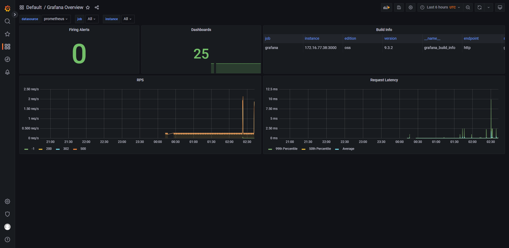
    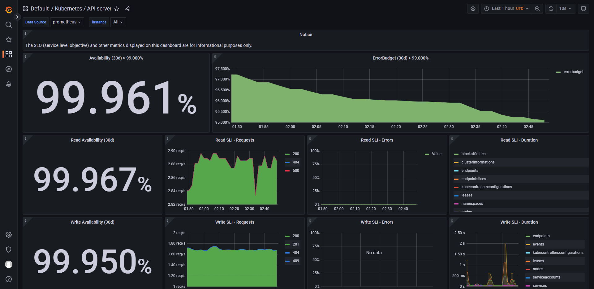
    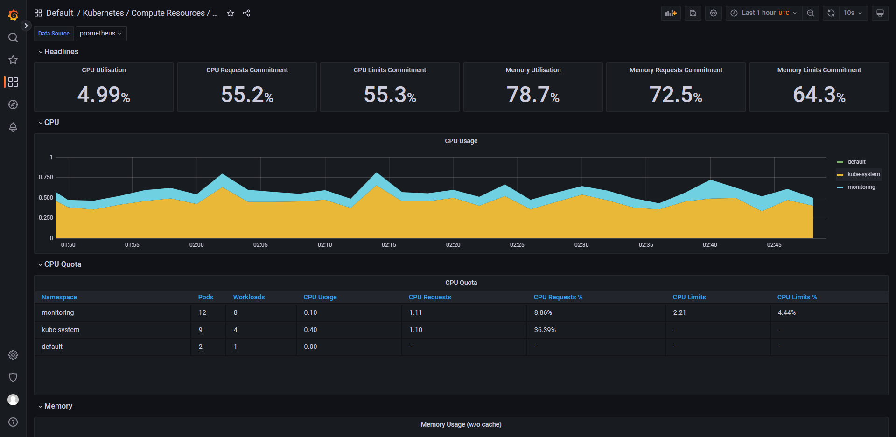
    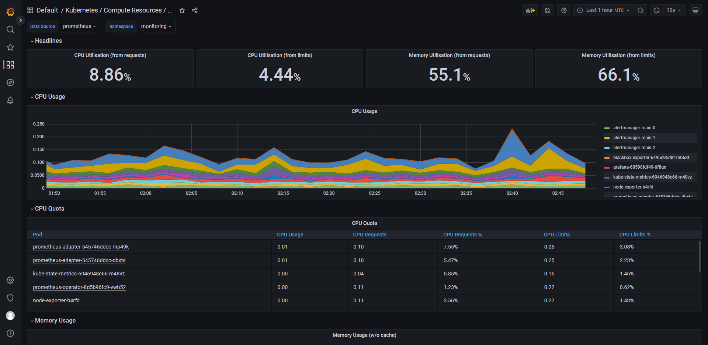
    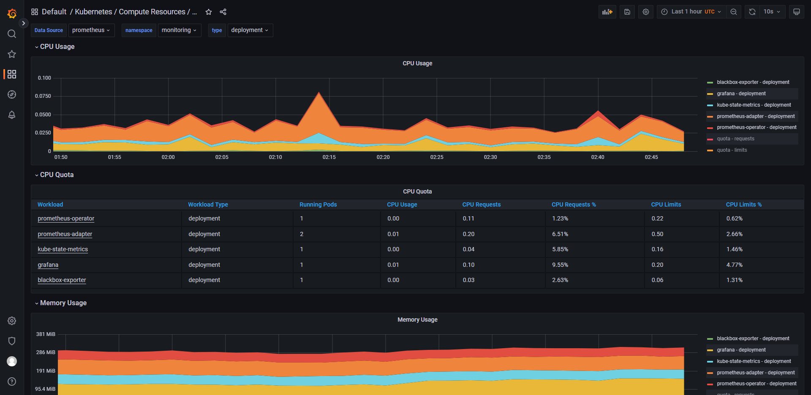
    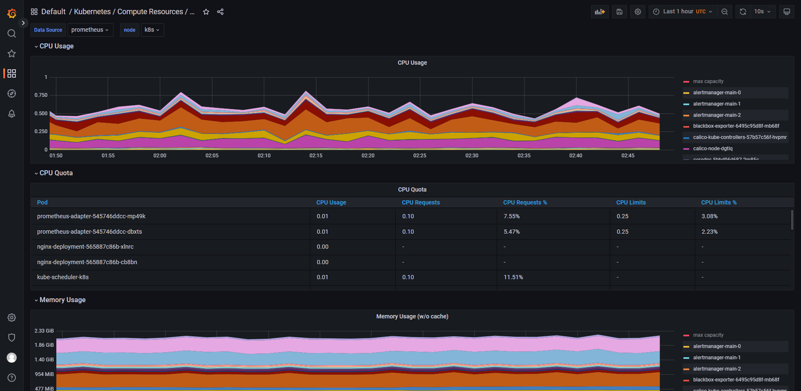
    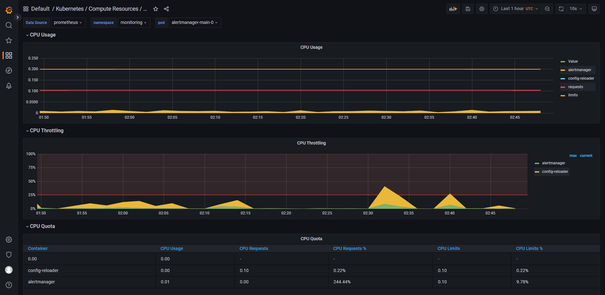
    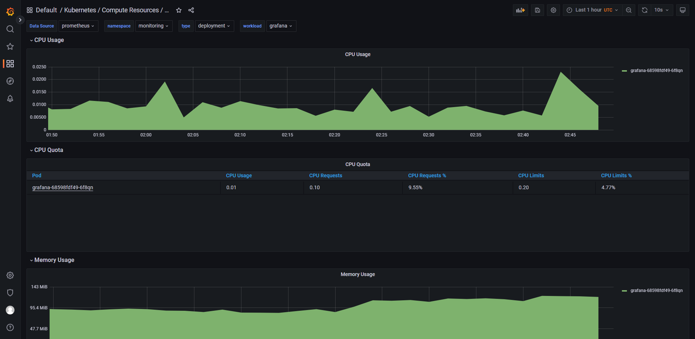
    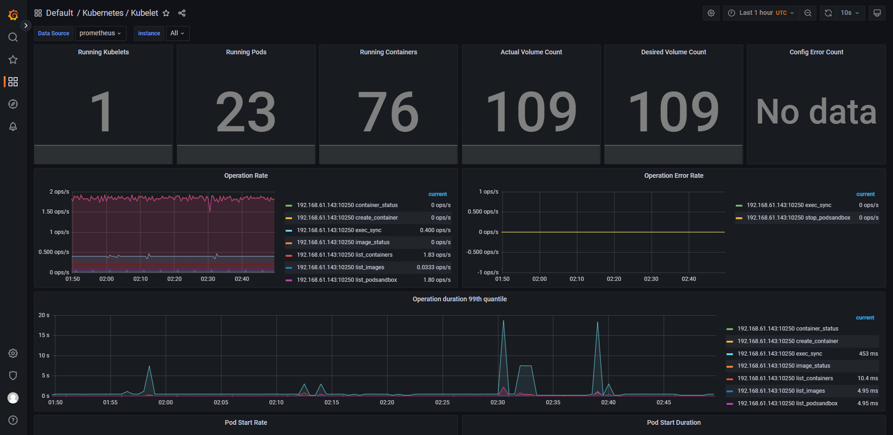
    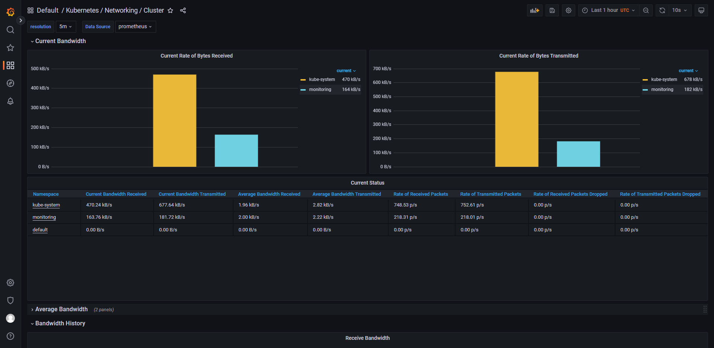
    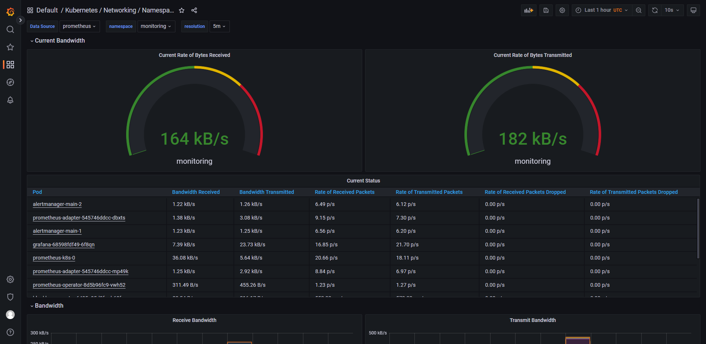
    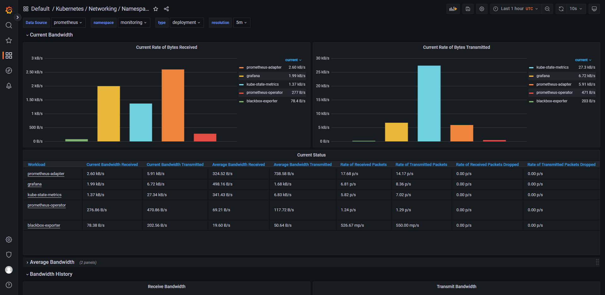
    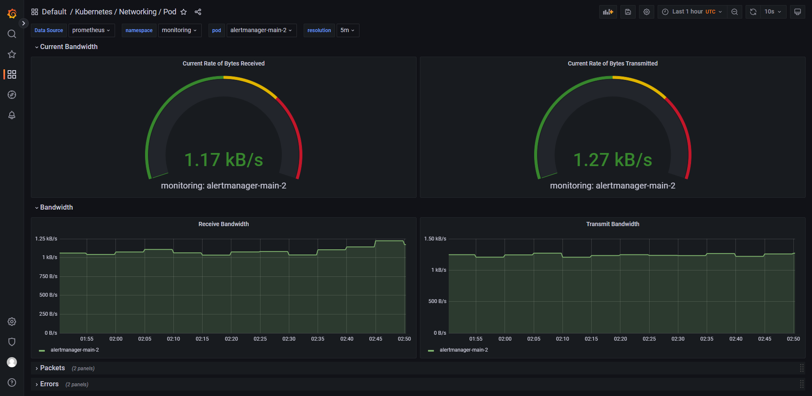
    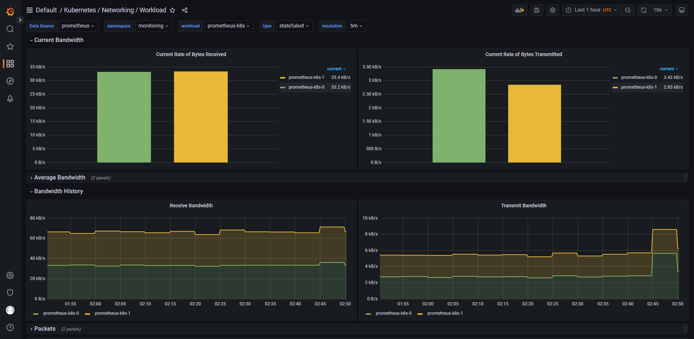
    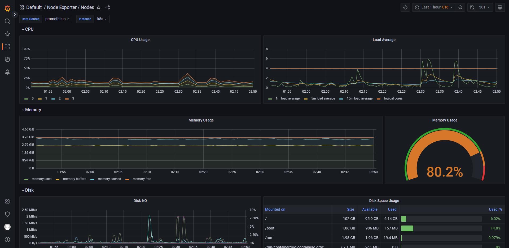
    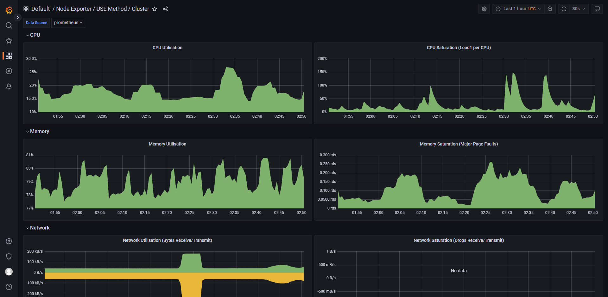
    
    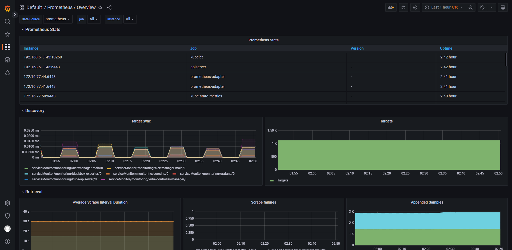
    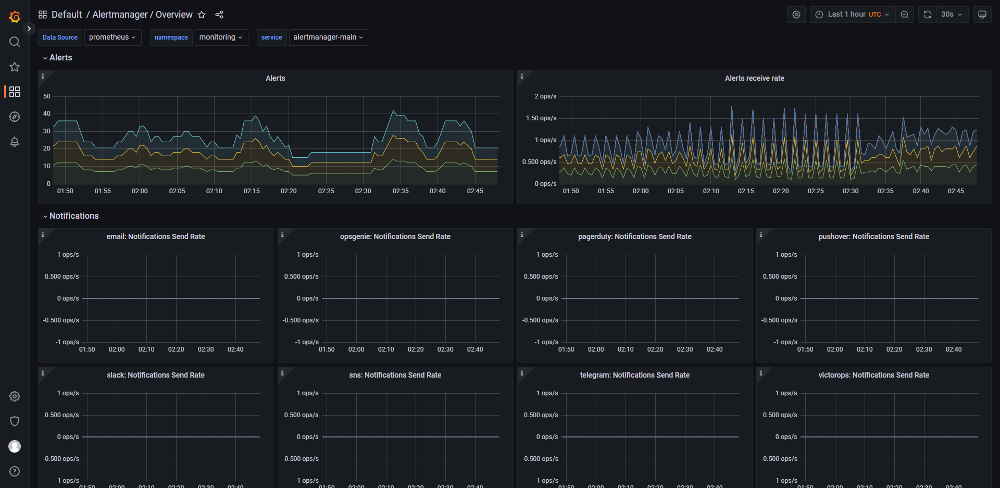
