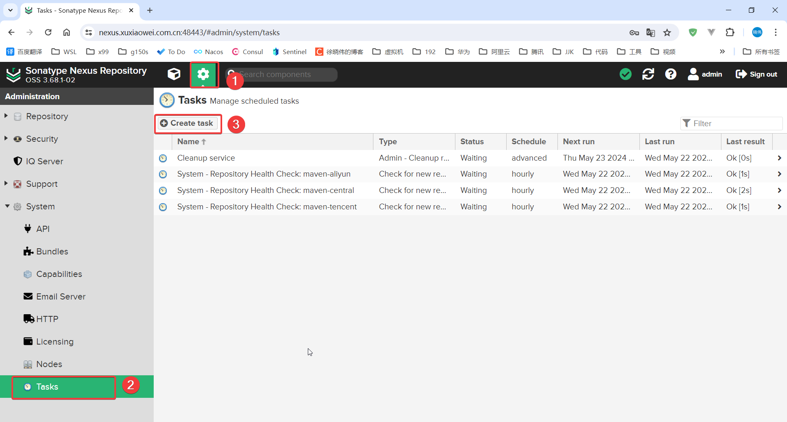
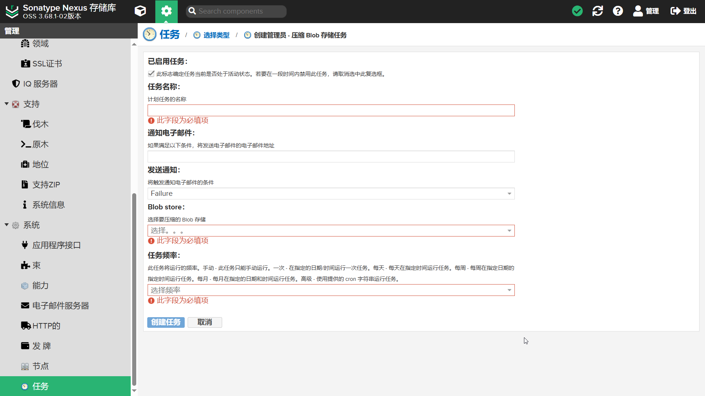

# 压缩 Blob 存储区

- 在使用 Nexus 私库时，如果将 Nexus 中的文件删除了，但是磁盘空间占用不会减少
- 如果要清理磁盘中的文件，需要创建 tasks

## 创建 tasks

### 登录 Nexus


### 点击 Create task

- 创建任务



### 点击 Create Admin - Compact blob store Task

- 创建管理任务，压缩 Blob 存储区


### 按照需求填写 tasks

- 英文


- 中文



- 实例


## 运行 tasks

### 选择 tasks


### 点击 Run


## 查看磁盘占用是否减少

- 运行 tasks 之前：blobs 占用 3.8G

```shell
root@g150s:/srv/nexus/nexus-data# du -h --max-depth=1
4.0K	./orient
8.0K	./instances
3.8G	./blobs
20K	./keystores
164M	./db
69M	./cache
2.0M	./log
4.0K	./restore-from-backup
76K	./javaprefs
36K	./etc
17M ./elasticsearch
792K	./tmp
4.0K	./generated-bundles
4.0G	.
root@g150s:
```

- 运行 tasks 之后：blobs 占用 从 3.8G 减少至 1.3G

```shell
root@g150s:/srv/nexus/nexus-data# du -h --max-depth=1
4.0K	./orient
8.0K	./instances
1.3G	./blobs
20K	./keystores
164M	./db
69M	./cache
2.0M	./log
4.0K	./restore-from-backup
76K	./javaprefs
36K	./etc
17M	./elasticsearch
792K	./tmp
4.0K	./generated-bundles
1.5G	.
root@g150s:
```
