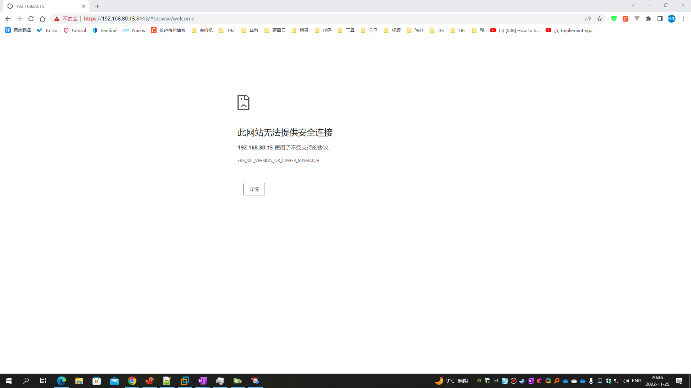

# Docker 容器 Nexus 配置 SSL/https

## 文档

1. [SSL证书指南](https://support.sonatype.com/hc/en-us/articles/213465768-SSL-Certificate-Guide)
2. [windows/keytool](https://docs.oracle.com/javase/8/docs/technotes/tools/windows/keytool.html)
3. [unix/keytool](https://docs.oracle.com/javase/8/docs/technotes/tools/unix/keytool.html)
4. [配置SSL](https://help.sonatype.com/repomanager3/nexus-repository-administration/configuring-ssl)
5. 免费证书申请：
    1. [阿里云SSL(https)证书免费申请](https://yundun.console.aliyun.com/?p=cas#/certExtend/buy)
    2. [腾讯云SSL(https)证书免费申请](https://console.cloud.tencent.com/ssl)
    3. [华为云SSL(https)证书免费申请](https://console.huaweicloud.com/console/#/ccm/scs/certList)
    4. [百度云SSL(https)证书免费申请](https://console.bce.baidu.com/cas/#/cas/purchased/common/list)
6. [使用证书验证存储库客户端](https://docs.docker.com/engine/security/certificates/)

## 配置

1. 配置前的说明
    1. **/some/dir/nexus-data/** 为 Nexus 储存数据的目录
    2. 如果是使用阿里云等平台申请的证书，请下载 `JKS`类型的证书
    3. 如果要自己生成证书，可运行下列命令：

        ```shell
        # 密码为 password
        # keytool 命令不存在时，可安装 java
        # -alias：为别名
        
        # 如果 keytool 不能使用，请配置 JDK 或安装 java：yum -y install java-1.8.0-openjdk
        
        # 颁布证书给域名
        keytool -genkeypair -keystore keystore.jks -storepass password -alias example.com \
         -keyalg RSA -keysize 2048 -validity 5000 -keypass password \
         -dname 'CN=*.example.com, OU=Sonatype, O=Sonatype, L=Unspecified, ST=Unspecified, C=US' \
         -ext 'SAN=DNS:nexus.example.com,DNS:clm.example.com,DNS:repo.example.com,DNS:www.example.com'
        
        # 颁布证书给IP
        #keytool -genkeypair -keystore keystore.jks -storepass password -alias 192.168.80.15 \
        # -keyalg RSA -keysize 2048 -validity 5000 -keypass password \
        # -dname 'CN=192.168.80.15, OU=Sonatype, O=Sonatype, L=Unspecified, ST=Unspecified, C=US' \
        # -ext 'SAN=IP:192.168.80.15'
        ```

        ```shell
        # 转换证书，可选
        # 密码设置为：password
        keytool -importkeystore -srckeystore keystore.jks -destkeystore keystore.jks -deststoretype pkcs12
        ```

    4. 请在创建 nexus 时，映射 nexus 的 https 端口，如：8443
    5. 本文的 nexus 容器名也是 nexus

2. 将 .jks 证书放在 **/some/dir/nexus-data**/etc/ssl 文件夹中，推荐命名为：keystore.jks
   其中 **/some/dir/nexus-data** 为 Nexus 储存数据的目录

   ```shell
   [root@centos-7-9 ssl]# pwd
   /some/dir/nexus-data/etc/ssl
   [root@centos-7-9 ssl]# ll
   total 4
   -rw-r--r--. 1 root root 2713 Nov 25 11:34 keystore.jks
   [root@centos-7-9 ssl]# 
   ```

3. 修改配置文件，开启 SSL

   ```shell
   # https://help.sonatype.com/repomanager3/nexus-repository-administration/configuring-ssl#ConfiguringSSL-ServingSSLDirectlyhttps://help.sonatype.com/repomanager3/nexus-repository-administration/configuring-ssl#ConfiguringSSL-ServingSSLDirectly
   vim /some/dir/nexus-data/etc/nexus.properties
   ```

   ```shell
   # https://help.sonatype.com/repomanager3/nexus-repository-administration/configuring-ssl#ConfiguringSSL-ServingSSLDirectlyhttps://help.sonatype.com/repomanager3/nexus-repository-administration/configuring-ssl#ConfiguringSSL-ServingSSLDirectly
   # 修改结果如下：
   
   # 配置 https 的端口
   application-port-ssl=8443
   
   # 设置 Nexus 启动参数的配置文件
   # 其中 ${jetty.etc}/jetty-https.xml 为新增
   nexus-args=${jetty.etc}/jetty.xml,${jetty.etc}/jetty-http.xml,${jetty.etc}/jetty-https.xml,${jetty.etc}/jetty-requestlog.xml
   
   # 设置证书的位置
   ssl.etc=${karaf.data}/etc/ssl
   ```

4. 修改配置文件，填写 SSL 证书的文件名与秘钥
   如果证书放在 **/some/dir/nexus-data**/etc/ssl 中，文件名为 **keystore.jks** 就不需要更改证书的配置了。
   如果证书的密码为 **password**，也不用修改了。
   如果修改了 docker nexus 镜像的版本，需要重新设置一下密码。

   ```shell
   # 设置你的nexus容器的名字
   nexus_container_name=nexus
   
   # 修改上述指定容器内部的 /opt/sonatype/nexus/etc/jetty/jetty-https.xml 文件
   vim $(docker inspect $(docker ps -a|grep $nexus_container_name |awk '{print $1}') |  sed 's/,/\n/g' | grep "MergedDir" | sed 's/:/\n/g' | sed '1d' | sed 's/"//g')/opt/sonatype/nexus/etc/jetty/jetty-https.xml
   ```

   将 keystore.jks 修改为你的证书名称
   将 password 修改为你的证书密码
   **虽然官方推荐设置别名 <Set name="certAlias">jetty</Set>，但是由于设置错误会导致无法正常访问 https
   端口，浏览器可能显示的错误内容如下图，如果不清楚别名，可以不设置，不设置不会出现下列错误。**
   

5. 重启 nexus 容器

   ```shell
   docker restart nexus
   ```

6. 访问：https://IP:8443
7. 虽然现在未配置docker私库，但是可以先测试证书是否被docker信任

   ```shell
   # 注意，此处的 8443 仅为 nexus 的端口
   docker pull nexus.example.com:8443/library/maven:3.6.3-jdk-8
   ```

   出现下列内容说明证书未被信任

   ```shell
   [root@x99 ~]# docker pull nexus.example.com:8443/library/maven:3.6.3-jdk-8
   Error response from daemon: Get "https://nexus.example.com:8443/v2/": x509: certificate signed by unknown authority
   [root@x99 ~]# 
   ```

8. 如果需要在Linux上执行Docker时信任证书，请运行下列命令
    1. 说明：
        1. **证书颁布时，要正确颁布给指定的域名或IP才行，访问时，使用指定的域名或IP，否则在Docker拉取Nexus镜像时，会出现域名、IP
           无法验证的情况**
        2. **如果使用Nginx代理Nexus，在配置Nginx中SSL时，需要 .crt、.key 证书**
        3. **如果使用配置Nexus中SSL时，需要 .jks 证书**
        4. [GitLab https 配置](/docs/gitlab/https-configuration.md) 中的证书申请
           （内涵颁布给域名、IP，证书类型为：**.crt、.key**）
        5. 本文上方的生成域名的类型为：**.jks**

    ```shell
    # 如果出现 -bash: openssl: command not found，请安装 openssl：yum -y install openssl
    
    # 填写你的域名，要求Linux系统能访问该域名
    domain_name=nexus.example.com
    # 填写你配置Docker私库的域名使用的端口，该端口现在可能还无法访问，给docker私库准备的
    docker_port=8000
    # Nexus https 端口
    port=8443
    
    mkdir -p /etc/docker/certs.d/$domain_name:$port
    cd /etc/docker/certs.d/$domain_name:$port
    pwd
    
    # 下载证书到指定文件夹进行信任
    openssl s_client -showcerts -connect $domain_name:$port -servername $domain_name < /dev/null 2>/dev/null | openssl x509 -outform PEM > /etc/docker/certs.d/$domain_name:$port/ca.crt
    # 验证
    echo | openssl s_client -CAfile /etc/docker/certs.d/$domain_name:$port/ca.crt -connect $domain_name:$port -servername $domain_name
    
    # docker 信任Docker私库的证书
    # 注意，如果是 443 端口，需要省略，如：cp -r /etc/docker/certs.d/$domain_name:$port /etc/docker/certs.d/$domain_name
    cp -r /etc/docker/certs.d/$domain_name:$port /etc/docker/certs.d/$domain_name:$docker_port
    ```

    ```shell
    # 重启 docker
    systemctl restart docker
    ```

9. 虽然现在未配置docker私库，但是可以先测试证书是否被docker信任

    ```shell
    # 注意，此处的 8443 仅为 nexus 的端口
    docker pull nexus.example.com:8443/library/maven:3.6.3-jdk-8
    ```

   出现下列内容说明证书已被信任

    ```shell
    [root@x99 nexus.example.com:8443]# docker pull nexus.example.com:8443/library/maven:3.6.3-jdk-8
    Error response from daemon: error parsing HTTP 404 response body: invalid character '<' looking for beginning of value: "\n<!DOCTYPE html>\n<html lang=\"en\">\n<head>\n  <title>404 - Nexus Repository Manager</title>\n  <meta http-equiv=\"Content-Type\" content=\"text/html; charset=UTF-8\"/>\n\n\n  <!--[if lt IE 9]>\n  <script>(new Image).src=\"../../../../favicon.ico?3.37.3-02\"</script>\n  <![endif]-->\n  <link rel=\"icon\" type=\"image/png\" href=\"../../../../favicon-32x32.png?3.37.3-02\" sizes=\"32x32\">\n  <link rel=\"mask-icon\" href=\"../../../../safari-pinned-tab.svg?3.37.3-02\" color=\"#5bbad5\">\n  <link rel=\"icon\" type=\"image/png\" href=\"../../../../favicon-16x16.png?3.37.3-02\" sizes=\"16x16\">\n  <link rel=\"shortcut icon\" href=\"../../../../favicon.ico?3.37.3-02\">\n  <meta name=\"msapplication-TileImage\" content=\"../../../../mstile-144x144.png?3.37.3-02\">\n  <meta name=\"msapplication-TileColor\" content=\"#00a300\">\n\n  <link rel=\"stylesheet\" type=\"text/css\" href=\"../../../../static/css/nexus-content.css?3.37.3-02\"/>\n</head>\n<body>\n<div class=\"nexus-header\">\n  <a href=\"../../../..\">\n    <div class=\"product-logo\">\n      \n    </div>\n    <div class=\"product-id\">\n      <div class=\"product-id__line-1\">\n        <span class=\"product-name\">Nexus Repository Manager</span>\n      </div>\n      <div class=\"product-id__line-2\">\n        <span class=\"product-spec\">OSS 3.37.3-02</span>\n      </div>\n    </div>\n  </a>\n</div>\n\n<div class=\"nexus-body\">\n  <div class=\"content-header\">\n    \n    <span class=\"title\">Error 404</span>\n    <span class=\"description\">Not Found</span>\n  </div>\n  <div class=\"content-body\">\n    <div class=\"content-section\">\n      Not Found\n    </div>\n  </div>\n</div>\n</body>\n</html>\n\n"
    [root@x99 nexus.example.com:8443]# ll
    ```
