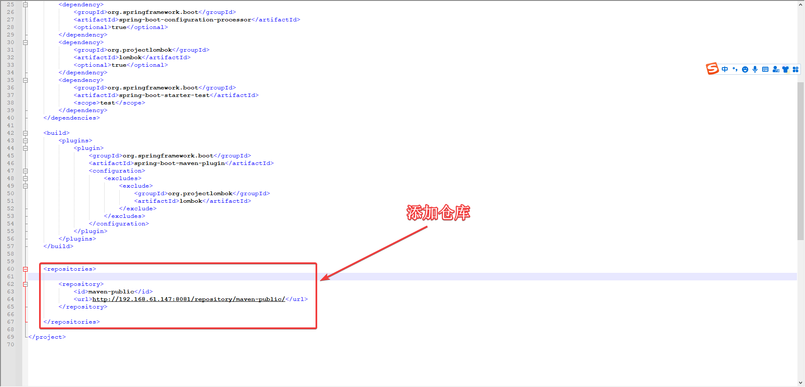

# 使用 Maven 私库

## 配置

1. Nexus 默认仓库有 4 个 Maven 仓库：

   

2. 查看代理仓库：

   

3. 查看分组仓库：

   

4. 查看分组仓库内的依赖：

   

   

5. 复制仓库地址：

   

6. 访问 [https://start.spring.io](https://start.spring.io) 创建一个项目：

   

   

7. 下载后修改项目仓库配置并下载依赖：

    1. 解压：

       
    2. 添加仓库：

       

       也可以在 Maven 的 Setting.xml 文件中修改：
       分组仓库中包含代理仓库的地址有 [https://repo1.maven.org/maven2/](https://repo1.maven.org/maven2/) ，而该代理仓库的名称为
       central，故在此配置 mirrorOf 为
       central，其他仓库地址及名称参见 [阿里云云效 Maven](https://developer.aliyun.com/mvn/guide)

       

    3. 运行 mvn clean package（需要电脑支持 mvn 命令），或者运行 mvnw clean package（需要电脑配置好环境变量 JAVA_HOME）

       

    4. 下载依赖的过程

       

    5. 已下载的依赖

       

8. 上述内容为Nexus默认Maven仓库，如满足不了配置或想自定义，请参考原有仓库的配置及阿里云
   [阿里云云效 Maven](https://developer.aliyun.com/mvn/guide) 中的链接：

   

   或者参考腾讯云 [使用腾讯云镜像源加速maven](https://mirrors.cloud.tencent.com/help/maven.html)

   
