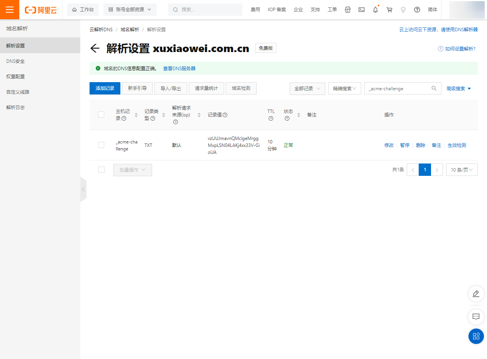

# 使用 acme.sh 生成证书

## 说明

1. [GitHub 原始仓库](https://github.com/acmesh-official/acme.sh)
2. [作者镜像仓库](https://framagit.org/xuxiaowei-com-cn/acme.sh)

## 安装 acme.sh

1. 以下是使用 `root` 用户执行
2. 安装（使用镜像仓库）

    ```bash
    yum -y install git
    yum -y install socat
    yum -y install openssl
    ```

    ```bash
    git clone https://framagit.org/xuxiaowei-com-cn/acme.sh.git
    cd acme.sh
    ./acme.sh --install -m my@example.com
    ```

   执行结果如下，从日志中可以看到：

   安装文件夹：`/root/.acme.sh`

   可执行文件：`/root/.acme.sh/acme.sh`

   刷新环境变量：`source /root/.bashrc` 后可直接执行 `acme.sh` 命令，或者使用绝对路径执行：`/root/.acme.sh/acme.sh`

    ```bash
    [Sat Aug 12 14:08:10 CST 2023] Installing to /root/.acme.sh
    [Sat Aug 12 14:08:10 CST 2023] Installed to /root/.acme.sh/acme.sh
    [Sat Aug 12 14:08:11 CST 2023] Installing alias to '/root/.bashrc'
    [Sat Aug 12 14:08:11 CST 2023] OK, Close and reopen your terminal to start using acme.sh
    [Sat Aug 12 14:08:11 CST 2023] Installing alias to '/root/.cshrc'
    [Sat Aug 12 14:08:11 CST 2023] Installing alias to '/root/.tcshrc'
    [Sat Aug 12 14:08:11 CST 2023] Installing cron job
    no crontab for root
    no crontab for root
    [Sat Aug 12 14:08:11 CST 2023] Good, bash is found, so change the shebang to use bash as preferred.
    [Sat Aug 12 14:08:12 CST 2023] OK
    ```

3. 使用 自定义 DNS 记录，配置（泛）域名

    ```bash
    # --yes-I-know-dns-manual-mode-enough-go-ahead-please：
    # 手动 dns 方式, 手动在域名上添加一条 txt 解析记录, 验证域名所有权
    # 好处是，你不需要任何服务器, 不需要任何公网 ip, 只需要 dns 的解析记录即可完成验证. 
    # 坏处是，如果不同时配置 Automatic DNS API，使用这种方式 acme.sh 将无法自动更新证书，每次都需要手动再次重新解析验证域名所有权。
    /root/.acme.sh/acme.sh --issue --dns -d "*.xuxiaowei.com.cn" --yes-I-know-dns-manual-mode-enough-go-ahead-please
    ```

   结果如下，根据结果可知：

   需要添加一个 DNS TXT 记录

   记录的名是：`_acme-challenge.xuxiaowei.com.cn`

   记录的值是：`vzUUJmavnQMclgeMrggMxpLSN04LAKj4xx33V-GioUA`

    ```bash
    [Sat Aug 12 15:01:22 CST 2023] Using CA: https://acme.zerossl.com/v2/DV90
    [Sat Aug 12 15:01:23 CST 2023] Create account key ok.
    [Sat Aug 12 15:01:23 CST 2023] No EAB credentials found for ZeroSSL, let's get one
    [Sat Aug 12 15:01:25 CST 2023] Registering account: https://acme.zerossl.com/v2/DV90
    [Sat Aug 12 15:01:34 CST 2023] Registered
    [Sat Aug 12 15:01:34 CST 2023] ACCOUNT_THUMBPRINT='aXGt48vUv6fR8OoXR2rhaDJWI6pWZZkGjedrJa3xQXg'
    [Sat Aug 12 15:01:34 CST 2023] Creating domain key
    [Sat Aug 12 15:01:34 CST 2023] The domain key is here: /root/.acme.sh/*.xuxiaowei.com.cn_ecc/*.xuxiaowei.com.cn.key
    [Sat Aug 12 15:01:34 CST 2023] Single domain='*.xuxiaowei.com.cn'
    [Sat Aug 12 15:01:34 CST 2023] Getting domain auth token for each domain
    [Sat Aug 12 15:01:46 CST 2023] Getting webroot for domain='*.xuxiaowei.com.cn'
    [Sat Aug 12 15:01:46 CST 2023] Add the following TXT record:
    [Sat Aug 12 15:01:46 CST 2023] Domain: '_acme-challenge.xuxiaowei.com.cn'
    [Sat Aug 12 15:01:46 CST 2023] TXT value: 'vzUUJmavnQMclgeMrggMxpLSN04LAKj4xx33V-GioUA'
    [Sat Aug 12 15:01:46 CST 2023] Please be aware that you prepend _acme-challenge. before your domain
    [Sat Aug 12 15:01:46 CST 2023] so the resulting subdomain will be: _acme-challenge.xuxiaowei.com.cn
    [Sat Aug 12 15:01:46 CST 2023] Please add the TXT records to the domains, and re-run with --renew.
    [Sat Aug 12 15:01:46 CST 2023] Please add '--debug' or '--log' to check more details.
    [Sat Aug 12 15:01:46 CST 2023] See: https://github.com/acmesh-official/acme.sh/wiki/How-to-debug-acme.sh
    ```

4. 添加 DNS 记录

   

5. 检查 自定义 DNS 记录，生成（泛）域名

    ```bash
    acme.sh --renew -d "*.xuxiaowei.com.cn" --yes-I-know-dns-manual-mode-enough-go-ahead-please
    ```

   结果如下，根据结果可知：

   证书类型：ECC

   cert 证书：`/root/.acme.sh/*.xuxiaowei.com.cn_ecc/*.xuxiaowei.com.cn.cer`

   cert 证书 key：`/root/.acme.sh/*.xuxiaowei.com.cn_ecc/*.xuxiaowei.com.cn.key`

   中间 CA 证书：`/root/.acme.sh/*.xuxiaowei.com.cn_ecc/ca.cer`

   完整证书链：`/root/.acme.sh/*.xuxiaowei.com.cn_ecc/fullchain.cer`

    ```bash
    [Sat Aug 12 15:11:13 CST 2023] The domain '*.xuxiaowei.com.cn' seems to have a ECC cert already, lets use ecc cert.
    [Sat Aug 12 15:11:13 CST 2023] Renew: '*.xuxiaowei.com.cn'
    [Sat Aug 12 15:11:13 CST 2023] Renew to Le_API=https://acme.zerossl.com/v2/DV90
    [Sat Aug 12 15:11:17 CST 2023] Using CA: https://acme.zerossl.com/v2/DV90
    [Sat Aug 12 15:11:17 CST 2023] Single domain='*.xuxiaowei.com.cn'
    [Sat Aug 12 15:11:17 CST 2023] Getting domain auth token for each domain
    [Sat Aug 12 15:11:17 CST 2023] Verifying: *.xuxiaowei.com.cn
    [Sat Aug 12 15:11:28 CST 2023] Processing, The CA is processing your order, please just wait. (1/30)
    [Sat Aug 12 15:11:36 CST 2023] Success
    [Sat Aug 12 15:11:36 CST 2023] Verify finished, start to sign.
    [Sat Aug 12 15:11:36 CST 2023] Lets finalize the order.
    [Sat Aug 12 15:11:36 CST 2023] Le_OrderFinalize='https://acme.zerossl.com/v2/DV90/order/H5PvrCLib2EKmPpqKnIzBQ/finalize'
    [Sat Aug 12 15:11:41 CST 2023] Order status is processing, lets sleep and retry.
    [Sat Aug 12 15:11:41 CST 2023] Retry after: 15
    [Sat Aug 12 15:11:57 CST 2023] Polling order status: https://acme.zerossl.com/v2/DV90/order/H5PvrCLib2EKmPpqKnIzBQ
    [Sat Aug 12 15:12:03 CST 2023] Downloading cert.
    [Sat Aug 12 15:12:03 CST 2023] Le_LinkCert='https://acme.zerossl.com/v2/DV90/cert/hDGX_hduhhJH7WYpIhLMDw'
    [Sat Aug 12 15:12:08 CST 2023] Cert success.
    -----BEGIN CERTIFICATE-----
    MIIECDCCA46gAwIBAgIRAJ+qmFj9VcbxgzjdUgfmw6wwCgYIKoZIzj0EAwMwSzEL
    xxx
    xxx
    xxx
    +ojD0Ju836A4JUp+A3eFru75MXBCv4N/xxrIYQ==
    -----END CERTIFICATE-----
    [Sat Aug 12 15:12:08 CST 2023] Your cert is in: /root/.acme.sh/*.xuxiaowei.com.cn_ecc/*.xuxiaowei.com.cn.cer
    [Sat Aug 12 15:12:08 CST 2023] Your cert key is in: /root/.acme.sh/*.xuxiaowei.com.cn_ecc/*.xuxiaowei.com.cn.key
    [Sat Aug 12 15:12:08 CST 2023] The intermediate CA cert is in: /root/.acme.sh/*.xuxiaowei.com.cn_ecc/ca.cer
    [Sat Aug 12 15:12:08 CST 2023] And the full chain certs is there: /root/.acme.sh/*.xuxiaowei.com.cn_ecc/fullchain.cer
    [root@localhost acme.sh]#
    ```

6. 查看证书

    ```bash
    /root/.acme.sh/acme.sh --info -d '*.xuxiaowei.com.cn'
    ```

    ```bash
    DOMAIN_CONF=/root/.acme.sh/*.xuxiaowei.com.cn_ecc/*.xuxiaowei.com.cn.conf
    Le_Domain=*.xuxiaowei.com.cn
    Le_Alt=no
    Le_Webroot=dns
    Le_PreHook=
    Le_PostHook=
    Le_RenewHook=
    Le_API=https://acme.zerossl.com/v2/DV90
    Le_Keylength=ec-256
    Le_OrderFinalize=https://acme.zerossl.com/v2/DV90/order/H5PvrCLib2EKmPpqKnIzBQ/finalize
    Le_LinkOrder=https://acme.zerossl.com/v2/DV90/order/H5PvrCLib2EKmPpqKnIzBQ
    Le_LinkCert=https://acme.zerossl.com/v2/DV90/cert/hDGX_hduhhJH7WYpIhLMDw
    Le_CertCreateTime=1691824328
    Le_CertCreateTimeStr=2023-08-12T07:12:08Z
    Le_NextRenewTimeStr=2023-10-10T07:12:08Z
    Le_NextRenewTime=1696921928
    ```

7. 如果需要，可以生成其他类型的证书

   其他 `--keylength` 参数

    ```bash
    ec-256 (prime256v1, "ECDSA P-256", which is the default key type)
    ec-384 (secp384r1,  "ECDSA P-384")
    ec-521 (secp521r1,  "ECDSA P-521", which is not supported by Let's Encrypt yet.)
    2048   (RSA2048)
    3072   (RSA3072)
    4096   (RSA4096)
    ```

    ```bash
    /root/.acme.sh/acme.sh --issue --dns -d "*.xuxiaowei.com.cn" --yes-I-know-dns-manual-mode-enough-go-ahead-please --keylength 2048
    ```

   执行结果

    ```bash
    [Sat Aug 12 15:27:58 CST 2023] Using CA: https://acme.zerossl.com/v2/DV90
    [Sat Aug 12 15:27:58 CST 2023] Creating domain key
    [Sat Aug 12 15:27:58 CST 2023] The domain key is here: /root/.acme.sh/*.xuxiaowei.com.cn/*.xuxiaowei.com.cn.key
    [Sat Aug 12 15:27:58 CST 2023] Single domain='*.xuxiaowei.com.cn'
    [Sat Aug 12 15:27:58 CST 2023] Getting domain auth token for each domain
    [Sat Aug 12 15:28:20 CST 2023] Getting webroot for domain='*.xuxiaowei.com.cn'
    [Sat Aug 12 15:28:21 CST 2023] Add the following TXT record:
    [Sat Aug 12 15:28:21 CST 2023] Domain: '_acme-challenge.xuxiaowei.com.cn'
    [Sat Aug 12 15:28:21 CST 2023] TXT value: 'C1AelafADUtq9UdJWBow8RjxCMiDwXIDpVdM8tM1GSY'
    [Sat Aug 12 15:28:21 CST 2023] Please be aware that you prepend _acme-challenge. before your domain
    [Sat Aug 12 15:28:21 CST 2023] so the resulting subdomain will be: _acme-challenge.xuxiaowei.com.cn
    [Sat Aug 12 15:28:21 CST 2023] Please add the TXT records to the domains, and re-run with --renew.
    [Sat Aug 12 15:28:21 CST 2023] Please add '--debug' or '--log' to check more details.
    [Sat Aug 12 15:28:21 CST 2023] See: https://github.com/acmesh-official/acme.sh/wiki/How-to-debug-acme.sh
    ```

   再次解析 DNS TXT 记录

   然后生成证书

    ```shell
    /root/.acme.sh/acme.sh --renew -d "*.xuxiaowei.com.cn" --yes-I-know-dns-manual-mode-enough-go-ahead-please
    ```

   生成结果

    ```shell
    [Sat Aug 12 15:32:37 CST 2023] Renew: '*.xuxiaowei.com.cn'
    [Sat Aug 12 15:32:37 CST 2023] Renew to Le_API=https://acme.zerossl.com/v2/DV90
    [Sat Aug 12 15:32:54 CST 2023] Using CA: https://acme.zerossl.com/v2/DV90
    [Sat Aug 12 15:32:54 CST 2023] Single domain='*.xuxiaowei.com.cn'
    [Sat Aug 12 15:32:54 CST 2023] Getting domain auth token for each domain
    [Sat Aug 12 15:32:54 CST 2023] Verifying: *.xuxiaowei.com.cn
    [Sat Aug 12 15:33:14 CST 2023] Processing, The CA is processing your order, please just wait. (1/30)
    [Sat Aug 12 15:33:26 CST 2023] Success
    [Sat Aug 12 15:33:26 CST 2023] Verify finished, start to sign.
    [Sat Aug 12 15:33:26 CST 2023] Lets finalize the order.
    [Sat Aug 12 15:33:26 CST 2023] Le_OrderFinalize='https://acme.zerossl.com/v2/DV90/order/J6MUeyQ3eODkQGhflbf07A/finalize'
    [Sat Aug 12 15:33:30 CST 2023] Order status is processing, lets sleep and retry.
    [Sat Aug 12 15:33:30 CST 2023] Retry after: 15
    [Sat Aug 12 15:33:46 CST 2023] Polling order status: https://acme.zerossl.com/v2/DV90/order/J6MUeyQ3eODkQGhflbf07A
    [Sat Aug 12 15:33:49 CST 2023] Downloading cert.
    [Sat Aug 12 15:33:49 CST 2023] Le_LinkCert='https://acme.zerossl.com/v2/DV90/cert/lztCdntfeM-5P-8OPrGkkw'
    [Sat Aug 12 15:33:55 CST 2023] Cert success.
    -----BEGIN CERTIFICATE-----
    MIIGczCCBFugAwIBAgIRAKqjdAOhAf1m8wWxdN0SZHowDQYJKoZIhvcNAQEMBQAw
    xxx
    xxx
    xxx
    1yvFHv0cwQywcyDlhtRhgutRspUAECU=
    -----END CERTIFICATE-----
    [Sat Aug 12 15:33:55 CST 2023] Your cert is in: /root/.acme.sh/*.xuxiaowei.com.cn/*.xuxiaowei.com.cn.cer
    [Sat Aug 12 15:33:55 CST 2023] Your cert key is in: /root/.acme.sh/*.xuxiaowei.com.cn/*.xuxiaowei.com.cn.key
    [Sat Aug 12 15:33:55 CST 2023] The intermediate CA cert is in: /root/.acme.sh/*.xuxiaowei.com.cn/ca.cer
    [Sat Aug 12 15:33:55 CST 2023] And the full chain certs is there: /root/.acme.sh/*.xuxiaowei.com.cn/fullchain.cer
    ``` 

   查看证书

    ```bash
    /root/.acme.sh/acme.sh --info -d '*.xuxiaowei.com.cn'
    ```

    ```bash
    DOMAIN_CONF=/root/.acme.sh/*.xuxiaowei.com.cn/*.xuxiaowei.com.cn.conf
    Le_Domain=*.xuxiaowei.com.cn
    Le_Alt=no
    Le_Webroot=dns
    Le_PreHook=
    Le_PostHook=
    Le_RenewHook=
    Le_API=https://acme.zerossl.com/v2/DV90
    Le_Keylength=2048
    Le_OrderFinalize=https://acme.zerossl.com/v2/DV90/order/J6MUeyQ3eODkQGhflbf07A/finalize
    Le_LinkOrder=https://acme.zerossl.com/v2/DV90/order/J6MUeyQ3eODkQGhflbf07A
    Le_LinkCert=https://acme.zerossl.com/v2/DV90/cert/lztCdntfeM-5P-8OPrGkkw
    Le_CertCreateTime=1691825635
    Le_CertCreateTimeStr=2023-08-12T07:33:55Z
    Le_NextRenewTimeStr=2023-10-10T07:33:55Z
    Le_NextRenewTime=1696923235
    ```
