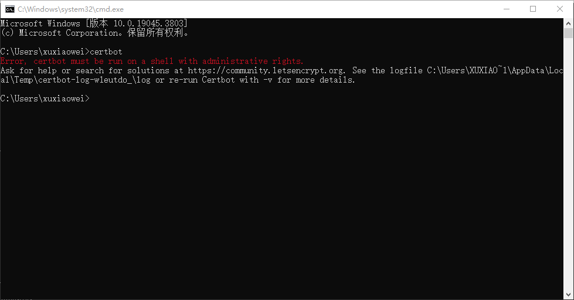
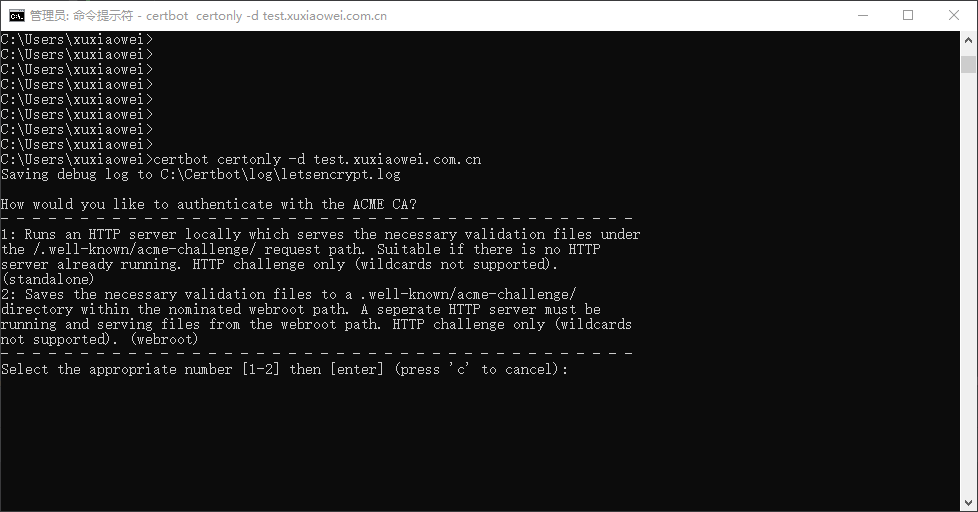

# 使用 certbot 生成证书（未完成）

## 文档

1. [github](https://github.com/certbot/certbot)
2. [用户指南](https://eff-certbot.readthedocs.io/en/latest/using.html)
3. [安装](https://eff-certbot.readthedocs.io/en/latest/install.html#installation)
    1. [安装指导](https://certbot.eff.org/instructions)
    2. [替代方式 1: Docker](https://eff-certbot.readthedocs.io/en/latest/install.html#alternative-1-docker)
    3. [替代方式 2: Pip](https://eff-certbot.readthedocs.io/en/latest/install.html#alternative-2-pip)

## Windows 方式

### 下载安装

1. [GitHub 下载地址](https://github.com/certbot/certbot/releases)
2. [作者 OneDrive 下载地址](https://xuxiaowei-my.sharepoint.com/:f:/g/personal/xuxiaowei_xuxiaowei_com_cn/EkEQCEKlhaNCptxjNE1y6ZEBsp8n2mQWns9-4_uqKJWHyQ)
3. 安装 certbot

### 申请单域名证书

1. 需要管理员权限运行 certbot 命令，否则将会出现以下异常

   

2. 申请单域名证书，如：test.xuxiaowei.com.cn

    1. 使用 HTTP 方式验证，需要域名 A 记录解析到公网 IP

        ```shell
        certbot certonly -d test.xuxiaowei.com.cn
        ```

       提示验证方式，默认 HTTP 方式

        ```shell
        C:\Users\xuxiaowei>certbot certonly -d test.xuxiaowei.com.cn
        Saving debug log to C:\Certbot\log\letsencrypt.log
        
        How would you like to authenticate with the ACME CA?
        - - - - - - - - - - - - - - - - - - - - - - - - - - - - - - - - - - - - - - - -
        1: Runs an HTTP server locally which serves the necessary validation files under
        the /.well-known/acme-challenge/ request path. Suitable if there is no HTTP
        server already running. HTTP challenge only (wildcards not supported).
        (standalone)
        2: Saves the necessary validation files to a .well-known/acme-challenge/
        directory within the nominated webroot path. A seperate HTTP server must be
        running and serving files from the webroot path. HTTP challenge only (wildcards
        not supported). (webroot)
        - - - - - - - - - - - - - - - - - - - - - - - - - - - - - - - - - - - - - - - -
        Select the appropriate number [1-2] then [enter] (press 'c' to cancel):
        ```
        ```shell
        C:\Users\xuxiaowei>certbot certonly -d test.xuxiaowei.com.cn
        正在将调试日志保存到C:\Certbot\log\letsencrypt.log
        您希望如何向ACME CA进行身份验证？
        - - - - - - - - - - - - - - - - - - - - - - - - - - - - - - - - - - - - - - - -
        1:在本地运行HTTP服务器，该服务器在下提供必要的验证文件
        /.well-known/acme-challenge/ 请求路径。适用于没有HTTP的情况
        服务器已在运行。仅HTTP质询（不支持通配符）。
        （独立）
        2：将必要的验证文件保存到 .well-known/acme-challenge/
        指定的webroot路径中的目录。必须有一个单独的HTTP服务器
        从webroot路径运行和提供文件。仅HTTP质询（通配符
        不支持）。（webroot）
        - - - - - - - - - - - - - - - - - - - - - - - - - - - - - - - - - - - - - - - -
        选择适当的数字[1-2]，然后[输入]（按“c”取消）：
        ```
       

    2. 使用 DNS 验证，域名 TXT 记录解析下面提示内容

        ```shell
        # 填写电子邮件，用于证书到期前提醒
        certbot certonly -d test.xuxiaowei.com.cn -m 你的电子邮件 --manual --preferred-challenges dns
        ```
        ```shell
        # 不填写电子邮件，无法在证书到期前提醒
        certbot certonly -d test.xuxiaowei.com.cn --register-unsafely-without-email --manual --preferred-challenges dns
        ```

## Docker 方式

## CentOS 方式

## Ubuntu 方式
