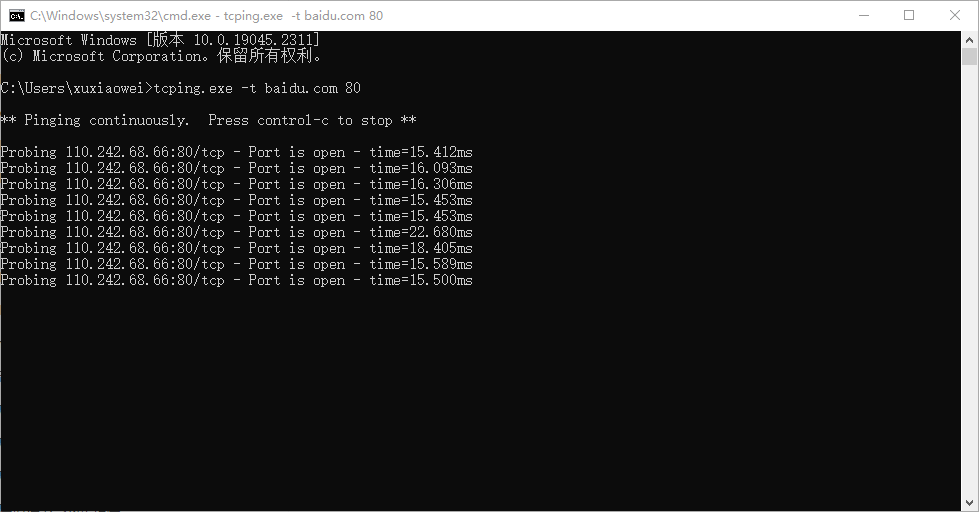

# 小工具：Windows tcping.exe

## 说明

- tcping.exe 是一个控制台应用程序，其操作类似于“ping”，但它在tcp端口上工作。
- 在 Windows 上要查看指定 IP、端口 是否连通，通常要使用 telnet，但是 telnet 需要安装，有时安装过程中有时还要重启。
- 使用 `tcping -t IP 端口` 即可测试端口，`-t` 代表连续测试，需要放在 tcping.ext 与 IP 之间
- 如果信任该应用的话，可以将其放入到 C:\Windows\ 文件夹中，方便随时调用

## 下载

- [官网](https://elifulkerson.com/projects/tcping.php)
- 镜像
    - [tcping.exe](static/tcping.exe)
    - [tcping64.exe](static/tcping64.exe)
