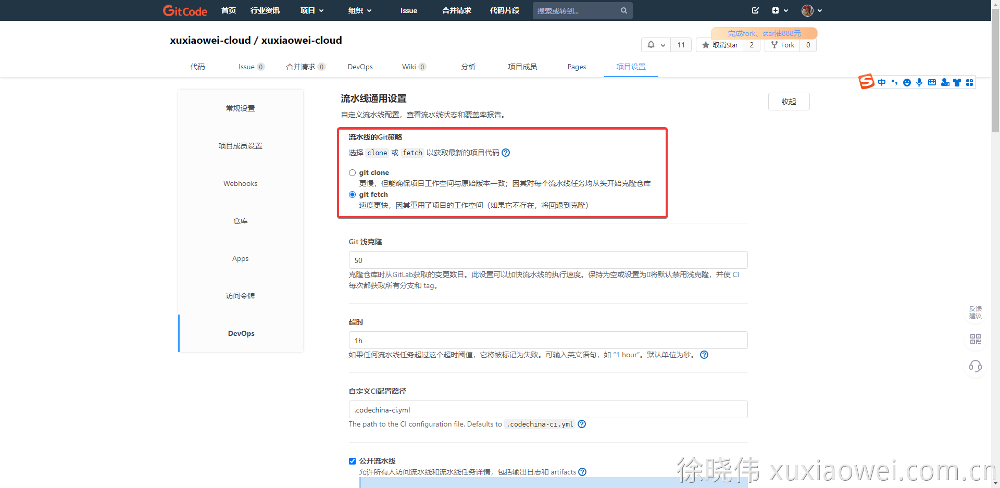
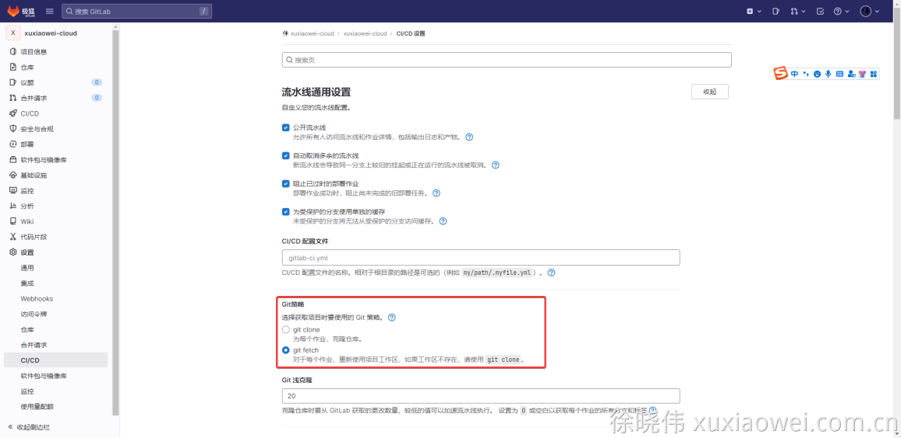
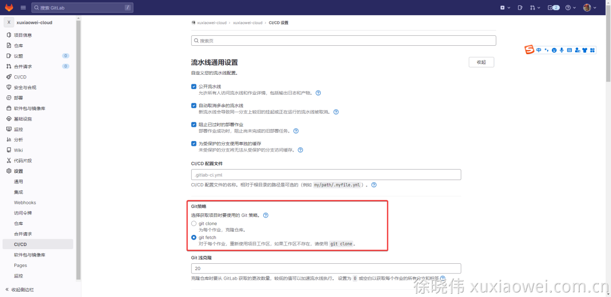

# 疑难解答：GitLab Runner CI/CD 在 CentOS/Anolis 中使用 shell 执行器时，出现：fatal: git fetch-pack: expected shallow list

## 说明

- [gitcode](https://gitcode.net/) 是从 gitlab-ce v13.7 更改来的
- [jihulab](https://jihulab.com/) 是中国版 gitlab

## 分析解决

1. 问题示例
   [https://gitcode.net/xuxiaowei-cloud/xuxiaowei-cloud/-/jobs/12406](https://gitcode.net/xuxiaowei-cloud/xuxiaowei-cloud/-/jobs/12406)

    ```shell
    fatal: git fetch-pack: expected shallow list
    fatal: The remote end hung up unexpectedly
    ```

2. 出现问题的原因：
    1. 某台机器上某个项目首次执行时，没有问题，在第二次执行时出现此问题，第二次执行时，使用了某些命令，如：`git fetch`。
    2. GitLab Runner 在 CentOS/Anolis 中安装时，会自动安装 git，而 CentOS/Anolis 中的 git 版本过低，不支持某些命令。
    3. gitcode 默认配置：
       
    4. jihulab 默认配置
       
    5. gitlab 默认配置
       
3. 解决办法（任选一种）：
    1. 在 gitlab 中将 `git fetch` 修改为 `git clone`，重新运行即可
    2. 备份 `/usr/bin/git`，手动编译较高版本的 `git`，保证 `git fetch` 命令有效，将新安装的 git 软链接到 `/usr/bin/git`
       ，重新运行即可
