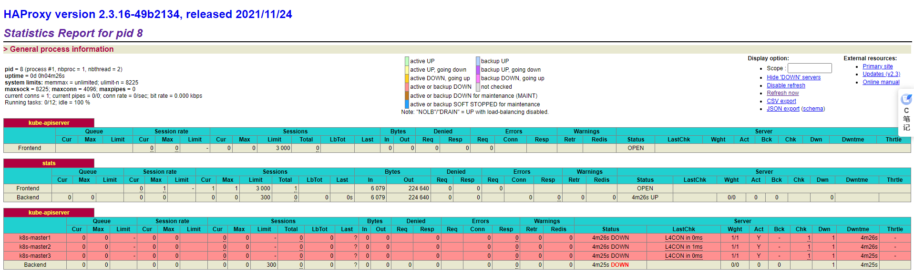
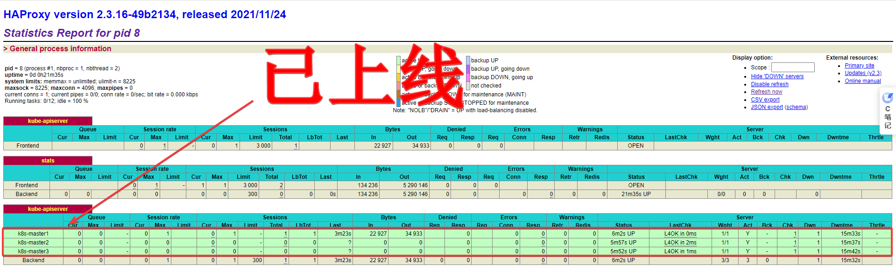

# kubernetes（k8s）高可用集群3：VIP：HAProxy、keepalived

## 为何要使用负载均衡器VIP（HAProxy、keepalived）

1. k8s Master 初始化配置时，使用负载均衡器，可以将 apiserver 的请求转发到不同的机器上，避免一台服务器宕机，造成所有节点不可使用。
2. 如果不使用负载均衡器，先创建一个 k8s Master，然后再加入其他的 k8s Master，当第一台 k8s Master 宕机时，后面加入的 k8s
   Master 将无法使用（因为请求是发送给第一台 k8s Master 的 apiserver）
3. 有了 keepalived 为何还需要 HAProxy，keepalived 不是直接可以创建 VIP（虚拟IP）吗？如果 keepalived 与 k8s
   所在的机器是同一台，则可以这样做（每台机器必须同时存在
   k8s、keepalived），并且虚拟IP在哪台机器上，最终调用的就是哪台机器，有可能会出现虚拟IP所在的机器正常，但是k8s不能使用的情况。实际情况可能是会有单独的负载均衡服务器VIP（不与
   k8s在同一台机器上）。
4. 为何不使用 k8s Service 的 IP？因为 k8s Service 的 IP 可能在外部机器无法访问，并且 Service 的IP是随机的，每个 Service
   不同。所以对外提供服务时，使用的是 VIP（Virtual IP Address 虚拟IP）

## 安装配置

1. **安装配置 HAProxy（三台服务器均需要执行）**

   ```shell
   mkdir -p /etc/kubernetes/
   
   cat > /etc/kubernetes/haproxy.cfg << EOF
   global
       log         127.0.0.1 local2
       chroot      /var/lib/haproxy
       pidfile     /var/run/haproxy.pid
       maxconn     4096
       user        haproxy
       group       haproxy
       daemon
       stats socket /var/lib/haproxy/stats
   
   defaults
       mode                    http
       log                     global
       option                  httplog
       option                  dontlognull
       option                  http-server-close
       option                  forwardfor    except 127.0.0.0/8
       option                  redispatch
       retries                 3
       timeout http-request    10s
       timeout queue           1m
       timeout connect         10s
       timeout client          1m
       timeout server          1m
       timeout http-keep-alive 10s
       timeout check           10s
       maxconn                 3000
   
   frontend  kube-apiserver
       mode                 tcp
       bind                 *:9443
       option               tcplog
       default_backend      kube-apiserver
   
   listen stats
       mode                 http
       bind                 *:8888
       stats auth           admin:password
       stats refresh        5s
       stats realm          HAProxy\ Statistics
       stats uri            /stats
       log                  127.0.0.1 local3 err
   
   backend kube-apiserver
       mode        tcp
       balance     roundrobin
       server  k8s-master1 $MASTER_1_IP:6443 check
       server  k8s-master2 $MASTER_2_IP:6443 check
       server  k8s-master3 $MASTER_3_IP:6443 check
   
   EOF
   
   cat /etc/kubernetes/haproxy.cfg
   
   
   docker run \
     -d \
     --name k8s-haproxy \
     --net=host \
     --restart=always \
     -v /etc/kubernetes/haproxy.cfg:/usr/local/etc/haproxy/haproxy.cfg:ro \
     haproxytech/haproxy-debian:2.3
   ```

2. 安装配置 keepalived（第一台机器：192.168.80.81）

   ```shell
   cat > /etc/kubernetes/keepalived.conf << EOF
   ! Configuration File for keepalived
   
   global_defs {
      router_id LVS_1
   }
   
   vrrp_script checkhaproxy
   {
       script "/usr/bin/check-haproxy.sh"
       interval 2
       weight -30
   }
   
   vrrp_instance VI_1 {
       state MASTER
       interface $INTERFACE_NAME
       virtual_router_id 51
       priority 100
       advert_int 1
   
       virtual_ipaddress {
           $VIP_IP/24 dev $INTERFACE_NAME
       }
   
       authentication {
           auth_type PASS
           auth_pass password
       }
   
       track_script {
           checkhaproxy
       }
   }
   
   EOF
   
   cat > /etc/kubernetes/check-haproxy.sh << EOF
   #!/bin/bash
   
   count=\`netstat -apn | grep 9443 | wc -l\`
   
   if [ $count -gt 0 ]; then
       exit 0
   else
       exit 1
   fi
   
   EOF
   
   
   cat /etc/kubernetes/keepalived.conf
   cat /etc/kubernetes/check-haproxy.sh
   
   docker run \
     -d \
     --name k8s-keepalived \
     --restart=always \
     --net=host \
     --cap-add=NET_ADMIN \
     --cap-add=NET_BROADCAST \
     --cap-add=NET_RAW \
     -v /etc/kubernetes/keepalived.conf:/container/service/keepalived/assets/keepalived.conf \
     -v /etc/kubernetes/check-haproxy.sh:/usr/bin/check-haproxy.sh \
     osixia/keepalived:2.0.20 \
     --copy-service
   
   mkdir -p /root/.ssh/
   ```

3. 安装配置 keepalived（第**二**台机器：192.168.80.82）

   ```shell
   # 一路回车
   ssh-keygen -t rsa
   ```

   ```shell
   scp -P 22 /root/.ssh/id_rsa.pub root@$MASTER_1_IP:/root/.ssh/authorized_keys
   ```

   ```shell
   scp -P 22 root@$MASTER_1_IP:/etc/kubernetes/keepalived.conf /etc/kubernetes/
   scp -P 22 root@$MASTER_1_IP:/etc/kubernetes/check-haproxy.sh /etc/kubernetes/
   
   sudo sed -i "s#router_id LVS_1#router_id LVS_2#g" /etc/kubernetes/keepalived.conf
   sudo sed -i "s#state MASTER#state BACKUP#g" /etc/kubernetes/keepalived.conf
   
   docker run \
     -d \
     --name k8s-keepalived \
     --restart=always \
     --net=host \
     --cap-add=NET_ADMIN \
     --cap-add=NET_BROADCAST \
     --cap-add=NET_RAW \
     -v /etc/kubernetes/keepalived.conf:/container/service/keepalived/assets/keepalived.conf \
     -v /etc/kubernetes/check-haproxy.sh:/usr/bin/check-haproxy.sh \
     osixia/keepalived:2.0.20 \
     --copy-service
   ```

4. 安装配置 keepalived（第**三**台机器：192.168.80.83）

   ```shell
   # 一路回车
   ssh-keygen -t rsa
   ```

   ```shell
   scp -P 22 /root/.ssh/id_rsa.pub root@$MASTER_1_IP:/root/.ssh/authorized_keys
   ```

   ```shell
   scp -P 22 root@$MASTER_1_IP:/etc/kubernetes/keepalived.conf /etc/kubernetes/
   scp -P 22 root@$MASTER_1_IP:/etc/kubernetes/check-haproxy.sh /etc/kubernetes/
   
   sudo sed -i "s#router_id LVS_1#router_id LVS_3#g" /etc/kubernetes/keepalived.conf
   sudo sed -i "s#state MASTER#state BACKUP#g" /etc/kubernetes/keepalived.conf
   
   docker run \
     -d \
     --name k8s-keepalived \
     --restart=always \
     --net=host \
     --cap-add=NET_ADMIN \
     --cap-add=NET_BROADCAST \
     --cap-add=NET_RAW \
     -v /etc/kubernetes/keepalived.conf:/container/service/keepalived/assets/keepalived.conf \
     -v /etc/kubernetes/check-haproxy.sh:/usr/bin/check-haproxy.sh \
     osixia/keepalived:2.0.20 \
     --copy-service
   ```

5. 访问以下地址，用户名：admin，密码：password
   [http://192.168.80.81:8888/stats](http://192.168.80.81:8888/stats)

   [http://192.168.80.82:8888/stats](http://192.168.80.82:8888/stats)

   [http://192.168.80.83:8888/stats](http://192.168.80.83:8888/stats)

   [http://192.168.80.100:8888/stats](http://192.168.80.100:8888/stats)

   

6. 测试VIP（在三台机器上安装不同版本的 Nginx，用于测试，方便查看效果，测试完成将删除）
    1. 安装 Nginx 1.23.__1__（第一台机器：192.168.80.81）

       ```shell
       docker run \
       --restart=always \
       -itd \
       --privileged=true \
       -p 6443:80 \
       -v /etc/localtime:/etc/localtime \
       --name nginx nginx:1.23.1
       ```

    2. 安装 Nginx 1.23.__2__（第二台机器：192.168.80.82）

        ```shell
        docker run \
        --restart=always \
        -itd \
        --privileged=true \
        -p 6443:80 \
        -v /etc/localtime:/etc/localtime \
        --name nginx nginx:1.23.2
        ```

    3. 安装 Nginx 1.23.__3__（第三台机器：192.168.80.83）

        ```shell
        docker run \
        --restart=always \
        -itd \
        --privileged=true \
        -p 6443:80 \
        -v /etc/localtime:/etc/localtime \
        --name nginx nginx:1.23.3
        ```

    4. 访问任意一个地址，均能看见使用 nginx 替代的 k8s-master1，k8s-master2，k8s-master3 已上线
        1. [http://192.168.80.81:8888/stats](http://192.168.80.81:8888/stats)
        2. [http://192.168.80.82:8888/stats](http://192.168.80.82:8888/stats)
        3. [http://192.168.80.83:8888/stats](http://192.168.80.83:8888/stats)
        4. [http://192.168.80.100:8888/stats](http://192.168.80.100:8888/stats)

       

    5. 访问下列地址，能看到三台机器使用了不同的 Nginx 版本
        1. [http://192.168.80.81:6443/xuxiaowei](http://192.168.80.81:6443/xuxiaowei)
        2. [http://192.168.80.82:6443/xuxiaowei](http://192.168.80.82:6443/xuxiaowei)
        3. [http://192.168.80.83:6443/xuxiaowei](http://192.168.80.83:6443/xuxiaowei)

    6. 访问 [http://192.168.80.100:9443/xuxiaowei](http://192.168.80.100:9443/xuxiaowei)，可以看到 nginx 版本为
       1.23.<strong><font color="red">3</font></strong>，**访问的是第三台机器**
       

    7. 将第三台机器 192.168.80.83
       关机后访问 [http://192.168.80.100:9443/xuxiaowei](http://192.168.80.100:9443/xuxiaowei)
       ，可以看到 nginx 版本为 1.23.<strong><font color="red">1</font></strong>，**访问的是第一台机器**
       

    8. 将第一台机器 192.168.80.81
       关机后访问 [http://192.168.80.100:9443/xuxiaowei](http://192.168.80.100:9443/xuxiaowei)
       ，可以看到 nginx 版本为 1.23.<strong><font color="red">2</font></strong>，**访问的是第二台机器**
       

    9. **<font color="red">将创建的nginx容器关闭并删除（三台服务器均需要执行，否则后面无法执行 k8s 初始化）</font>**

        ```shell
        docker stop nginx
        docker rm nginx
        ```
