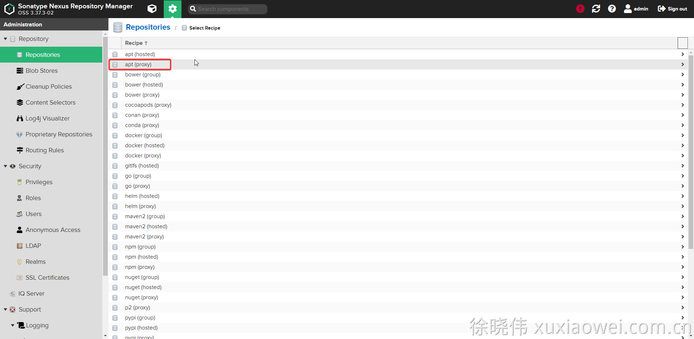
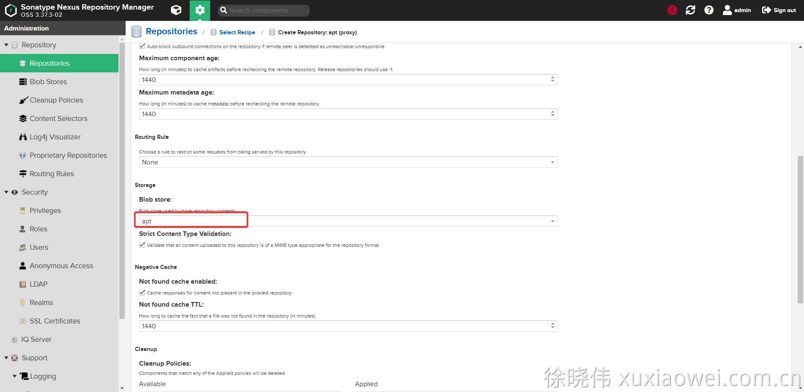

# 私库搭建8：apt 私库 自定义配置

## 配置

1. 点击创建私库：

   

2. 选择 apt 代理仓库

   

3. [http://mirrors.163.com/](http://mirrors.163.com/)

   [https://developer.aliyun.com/mirror/ubuntu](https://developer.aliyun.com/mirror/ubuntu)

   [https://mirrors.aliyun.com/ubuntu/](https://mirrors.aliyun.com/ubuntu/)

   

4.
