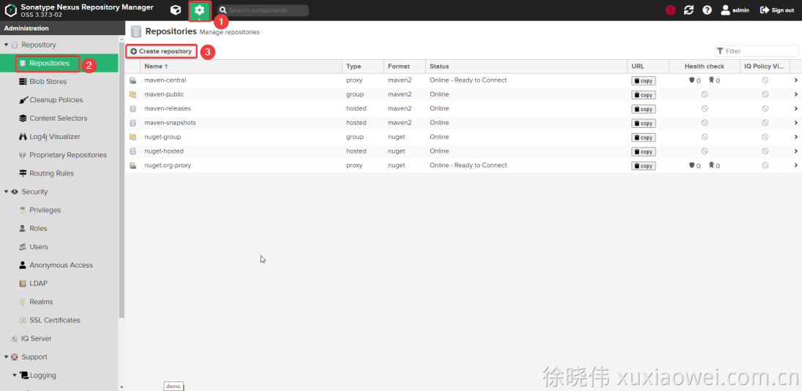
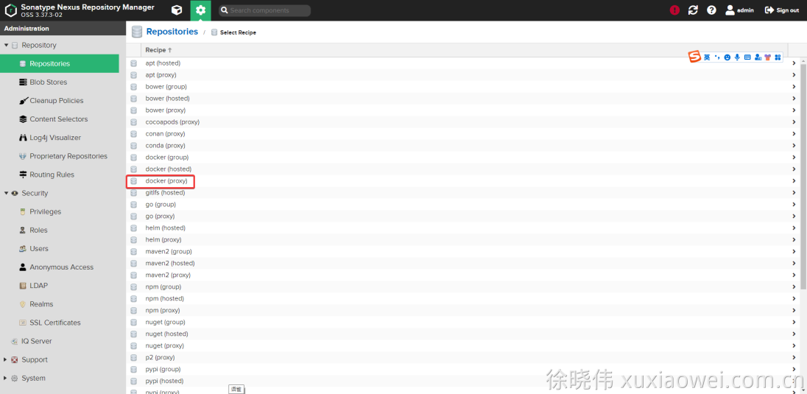
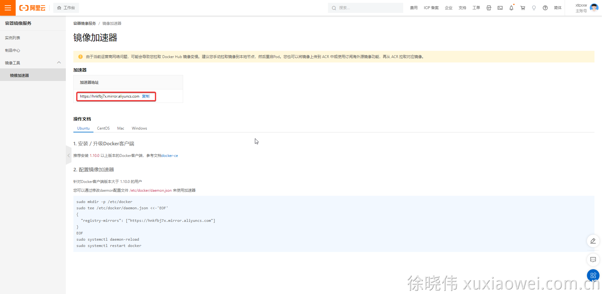
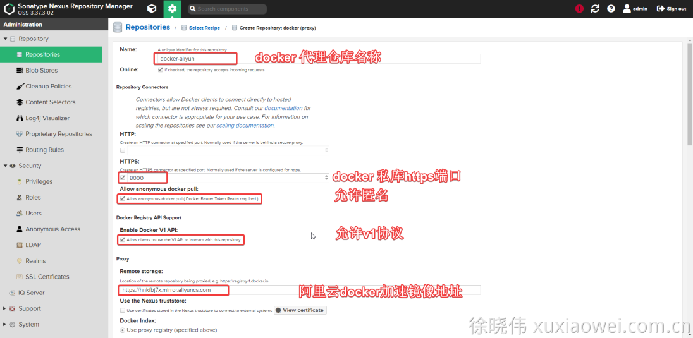
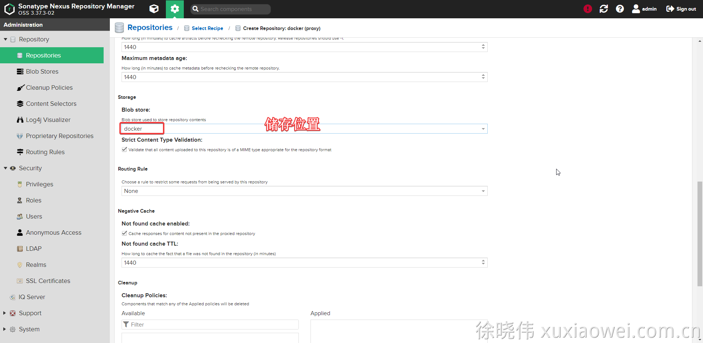
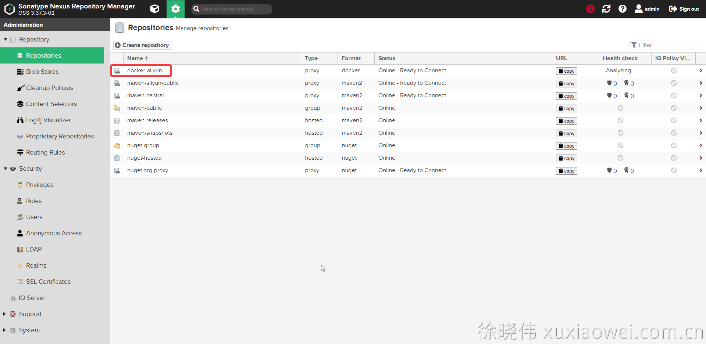
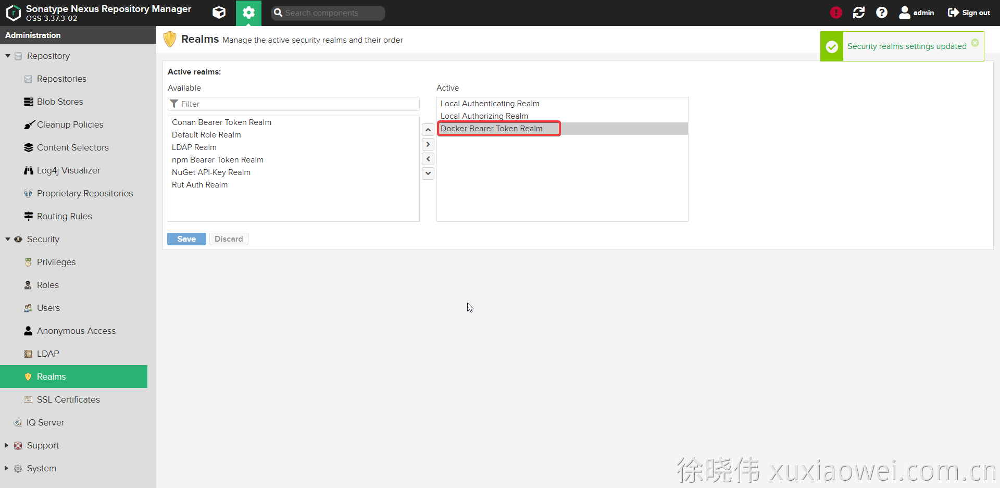
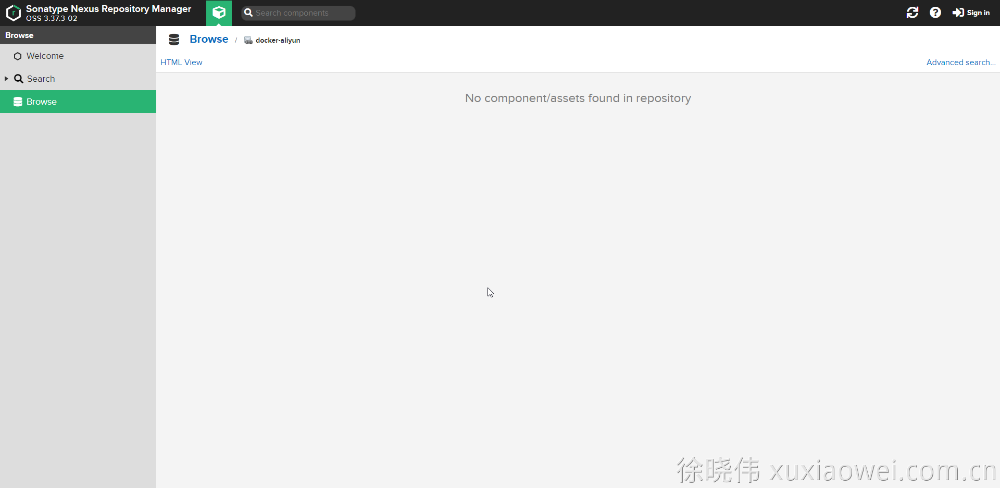
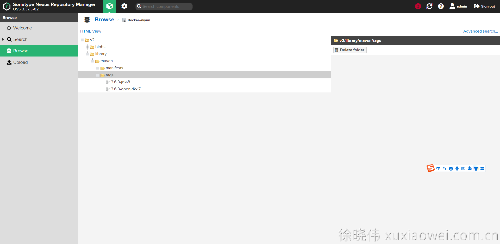

# 私库搭建6：Docker 私库 自定义配置

## 说明

1. Docker 私库必须是 https，并且只能使用 协议://域名或IP:端口，不能携带具体路径

## 配置

1. 点击创建私库：

   

2. 选择 Docker 代理仓库：

   

3. 访问 [阿里云-容器镜像服务](https://cr.console.aliyun.com)
   ，查看镜像加速地址：[https://hnkfbj7x.mirror.aliyuncs.com](https://hnkfbj7x.mirror.aliyuncs.com)

   

4. 填写配置

   8000端口为Nexus创建时开放的

   

   

   

5. Docker 匿名配置，否则在拉取镜像时，会提示：Error response from daemon: unauthorized: authentication required

   

6. 查看私库文件

   

7. 拉取镜像（使用域名）
   如果出现 Error response from daemon:
   Get "[https://nexus.example.com:8000/v2/":](https://nexus.example.com:8000/v2/":) x509: certificate signed by unknown
   authority，请参考 [私库搭建2：Nexus 配置 Docker 版 https](https://www.yuque.com/xuxiaowei-com-cn/gitlab-k8s/nexus-docker-ssl)
   进行证书信任

   ```shell
   docker pull nexus.example.com:8000/library/maven:3.6.3-jdk-8
   ```

   ```shell
   [root@x99 ~]# docker pull nexus.example.com:8000/library/maven:3.6.3-jdk-8
   3.6.3-jdk-8: Pulling from library/maven
   004f1eed87df: Pull complete 
   5d6f1e8117db: Pull complete 
   48c2faf66abe: Pull complete 
   234b70d0479d: Pull complete 
   d7eb6c022a4e: Pull complete 
   347c03cf94f8: Pull complete 
   914dd506c750: Pull complete 
   d7d7fe135d55: Pull complete 
   71a3a5508994: Pull complete 
   73dccb1622e9: Pull complete 
   Digest: sha256:ac624d39dd0b7bed827d4b0d1bbaeb457012e0cba0fb6c53ce34b00bed16ec08
   Status: Downloaded newer image for nexus.example.com:8000/library/maven:3.6.3-jdk-8
   nexus.example.com:8000/library/maven:3.6.3-jdk-8
   [root@x99 ~]#
   ```

8. 修改 /etc/docker/daemon.json 后重启 dockeer

   ```shell
   vim /etc/docker/daemon.json
   ```

   ```shell
   {
     "registry-mirrors": ["https://nexus.example.com:8000"],
       "exec-opts": ["native.cgroupdriver=systemd"]
   }
   ```

   ```shell
   systemctl restart docker
   ```

9. 拉取镜像（不使用域名）

   ```shell
   docker pull maven:3.6.3-openjdk-17
   ```

   ```shell
   [root@x99 ~]# docker pull maven:3.6.3-openjdk-17
   3.6.3-openjdk-17: Pulling from library/maven
   50c2d151af49: Pull complete 
   a26bc0351d04: Pull complete 
   30d412185a64: Pull complete 
   fe8c02e6857c: Pull complete 
   33b6850db630: Pull complete 
   a035352303c6: Pull complete 
   4380b7de0aa4: Pull complete 
   Digest: sha256:7f46feaf907771cd14e38d0b901d6372e50e68bf4e2197b0f181eb16f051081b
   Status: Downloaded newer image for maven:3.6.3-openjdk-17
   docker.io/library/maven:3.6.3-openjdk-17
   [root@x99 ~]# 
   ```

10. 查看已下载的镜像

    
