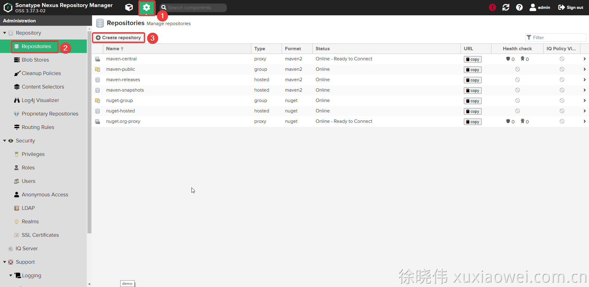
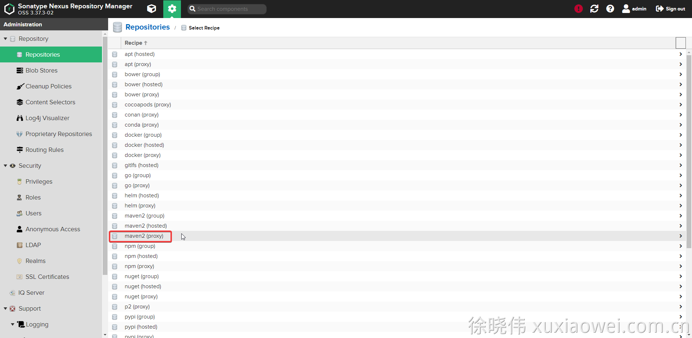
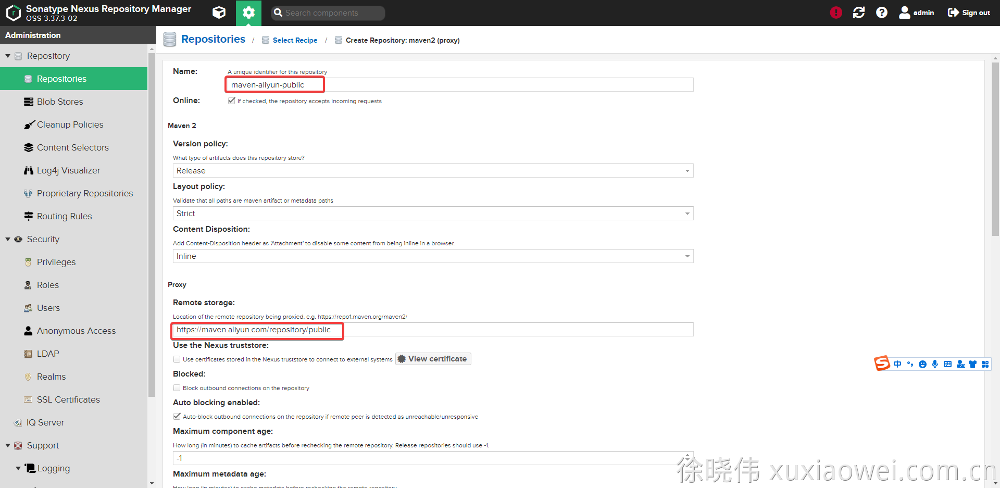
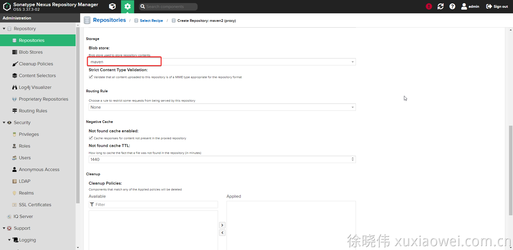
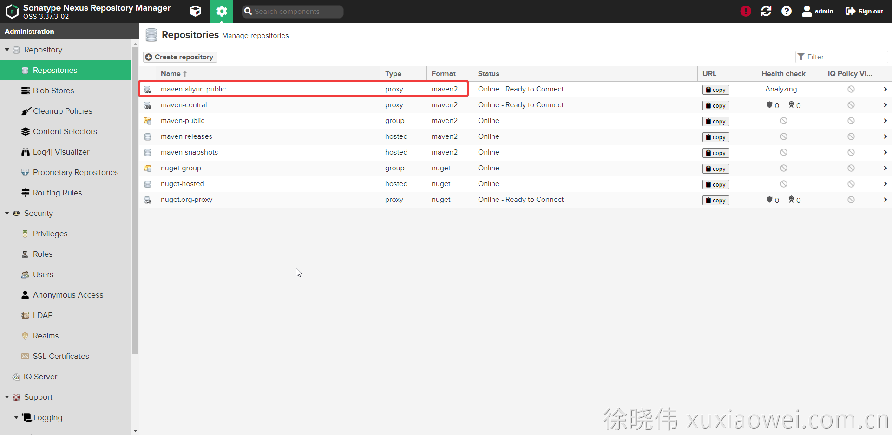
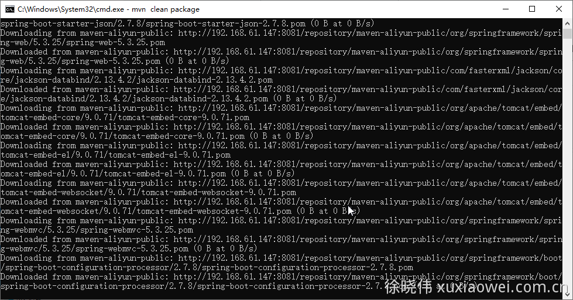
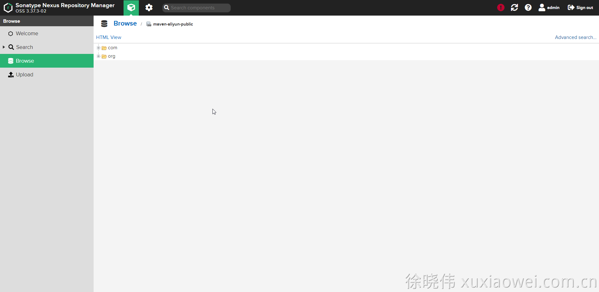
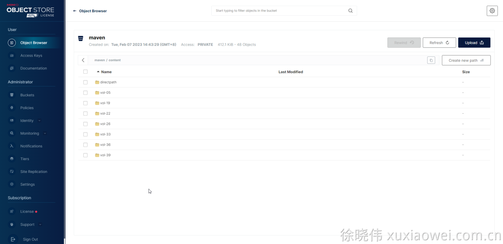

# 私库搭建5：Maven 私库 自定义配置

## 配置

1. 点击创建私库：

   

2. 选择 Maven 代理仓库：

   

3. 输入仓库名称、代理仓库地址：[https://maven.aliyun.com/repository/public](https://maven.aliyun.com/repository/public)

   

4. 选择储存位置

   

5. 创建完成

   

6. 使用代理仓库下载依赖

   使用方式参见：[私库搭建3：Maven 私库](use-maven-repository.md)

   

7. 仓库依赖查看

   

8. S3 储存文件查看

   
