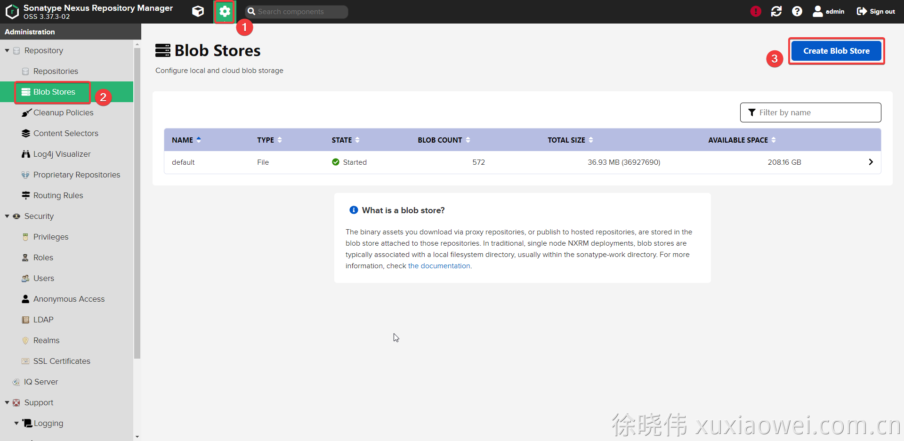
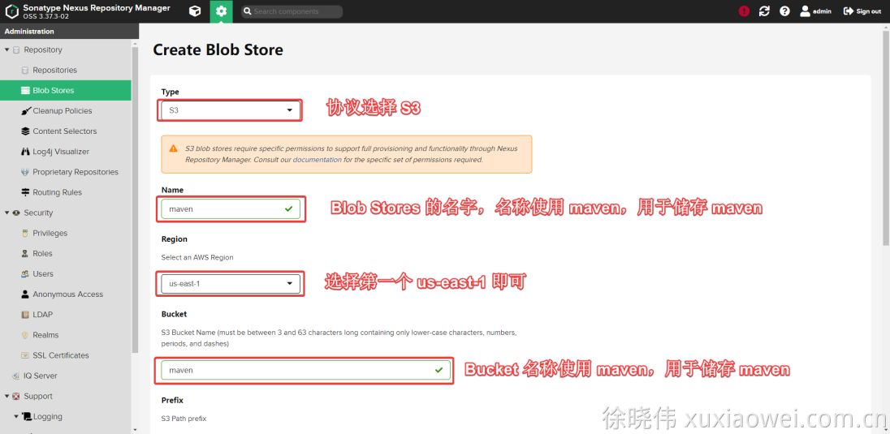
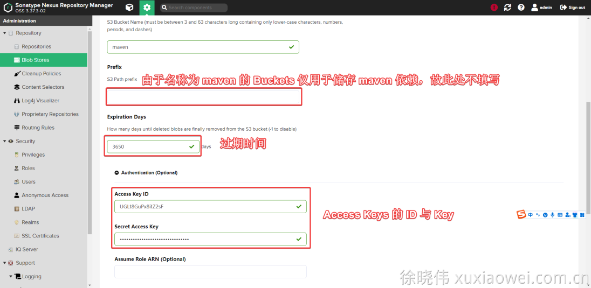
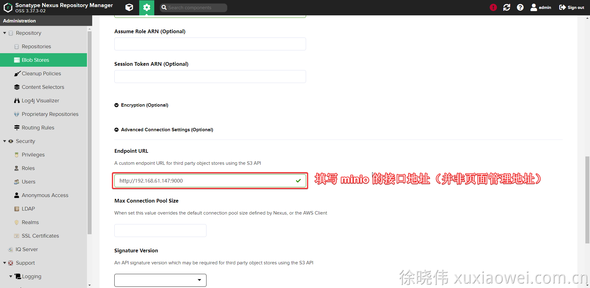
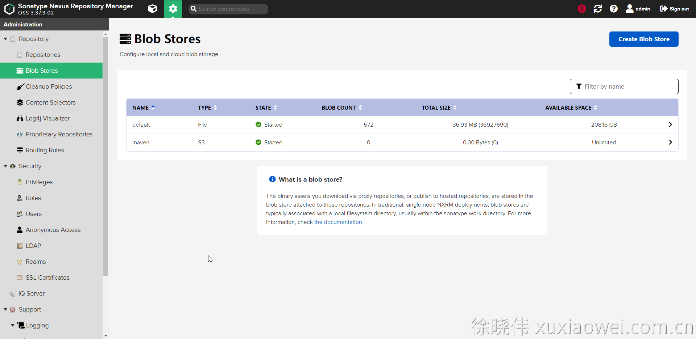
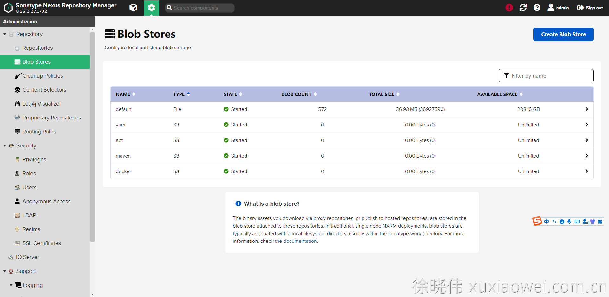
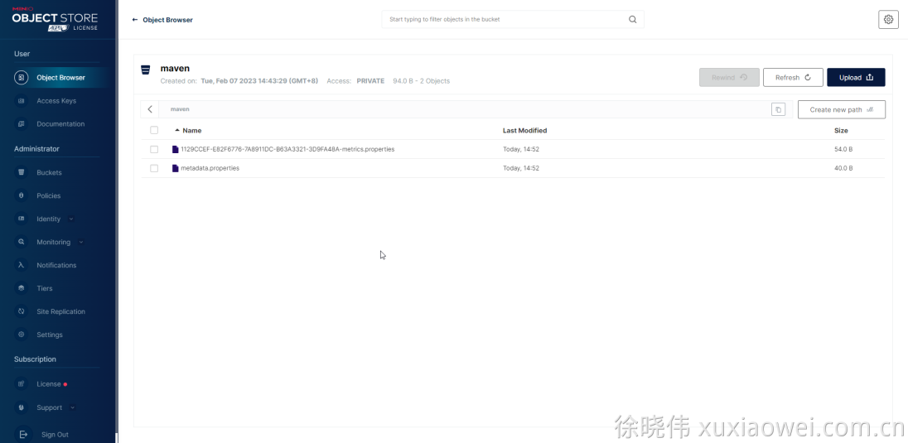

# 私库搭建4：S3 Blob Stores 配置

## 说明

1. [GitLab Runner Cache 配置 S3（minio）](https://www.yuque.com/xuxiaowei-com-cn/gitlab-k8s/gitlab-runner-cache-s3-minio)
2. 并不是非要使用 S3 来配置 Blob Stores 才行，学习时可以直接使用 File。S3 储存的好处在于方便迁移、容灾、备份等等。阿里、腾讯等对象存储均支持
   S3 协议，故可将 Nexus 与云厂商的对象存储或自己搭建S3结合使用，提高数据可靠性、安全性。
3. 阿里云 OSS 对象储存作者未能完成配置（2023-06-29）
4. 天翼云 OOS 对象储存作者未能完成配置（2023-06-29）
    1. 使用的是：经典版对象存储（经典版）-经典Ⅰ型

## 配置

1. 在 minio 上创建四个 Buckets，名称分别为：maven、docker、yum、apt，用于储存对应的私库文件。
2. 在 minio 上创建一个 Access Keys，用于在 Nexus 配置 Blob Stores。
3. 登录 Nexus，创建 Blob Stores

   

   根据图中说明，填写相关信息

   

   

   

   保存结果：

   

   根据上述方法，创建其他 Blob Stores：

   

4. 打开 Buckets 即可看到已创建了相关的配置文件了，这说明配置的没有问题：

   
       
