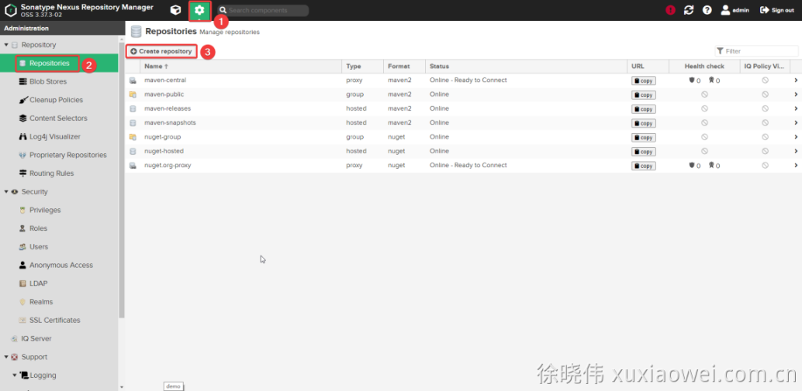
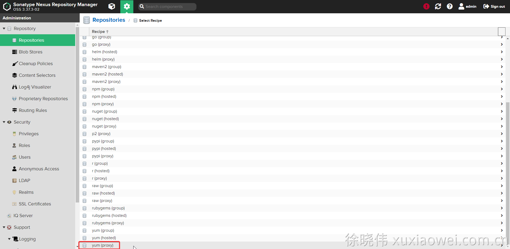
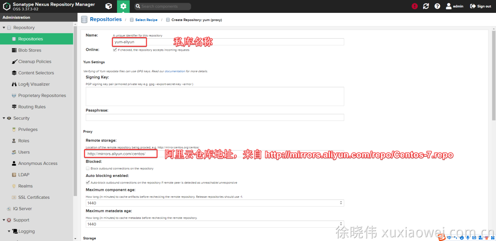
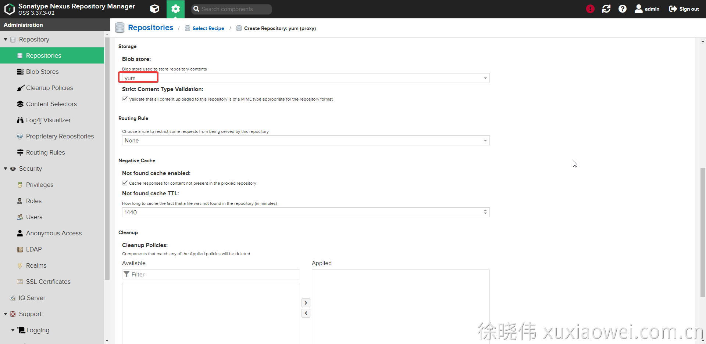
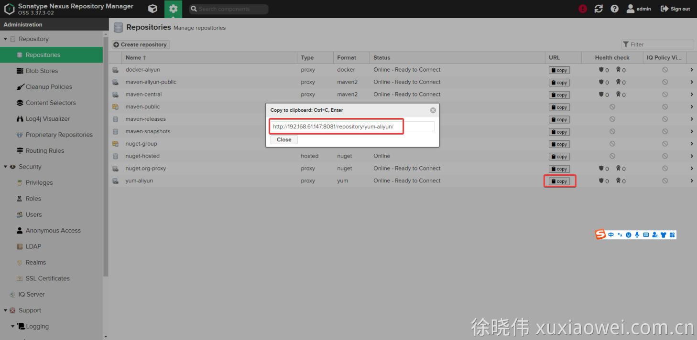
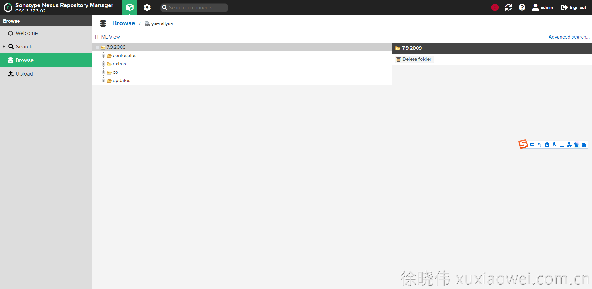
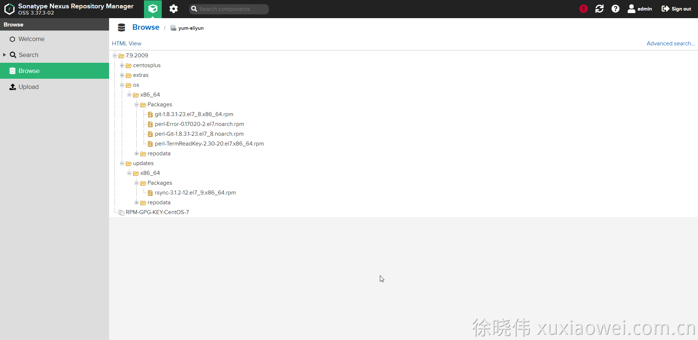

# 私库搭建7：yum 私库 自定义配置

1. 点击创建私库：

   

2. 选择 yum 代理仓库

   

3. 输入仓库名、代理地址

   

4. 选择储存位置

   

5. 查看仓库地址

   

6. 备份原有yum源，yum 源文件夹为 /etc/yum.repos.d
   CentOS 系统默认yum源的文件名为 CentOS-*.repo

    ```shell
    cd /etc/yum.repos.d/
    ll
    
    # 备份 CentOS 系统默认yum源
    rename '.repo' '.repo.bak' CentOS*.repo
    
    ll
    ```

7. 添加yum源

    ```shell
    vim /etc/yum.repos.d/yum-aliyun.repo
    ```

    ```shell
    [os]
    name=yum-aliyun os
    # 此处的 7.9.2009 是根据当前系统的版本与网址 http://mirrors.aliyun.com/centos/ 中的文件夹进行确定的
    baseurl=http://192.168.61.147:8081/repository/yum-aliyun/7.9.2009/os/$basearch/
    enabled=1
    gpgcheck=1
    gpgkey=http://192.168.61.147:8081/repository/yum-aliyun/RPM-GPG-KEY-CentOS-7
    
    [updates]
    name=yum-aliyun updates
    # 此处的 7.9.2009 是根据当前系统的版本与网址 http://mirrors.aliyun.com/centos/ 中的文件夹进行确定的
    baseurl=http://192.168.61.147:8081/repository/yum-aliyun/7.9.2009/updates/$basearch/
    enabled=1
    gpgcheck=1
    gpgkey=http://192.168.61.147:8081/repository/yum-aliyun/RPM-GPG-KEY-CentOS-7
    
    [extras]
    name=yum-aliyun extras
    # 此处的 7.9.2009 是根据当前系统的版本与网址 http://mirrors.aliyun.com/centos/ 中的文件夹进行确定的
    baseurl=http://192.168.61.147:8081/repository/yum-aliyun/7.9.2009/extras/$basearch/
    enabled=1
    gpgcheck=1
    gpgkey=http://192.168.61.147:8081/repository/yum-aliyun/RPM-GPG-KEY-CentOS-7
    
    [centosplus]
    name=yum-aliyun centosplus
    # 此处的 7.9.2009 是根据当前系统的版本与网址 http://mirrors.aliyun.com/centos/ 中的文件夹进行确定的
    baseurl=http://192.168.61.147:8081/repository/yum-aliyun/7.9.2009/centosplus/$basearch/
    enabled=1
    gpgcheck=1
    gpgkey=http://192.168.61.147:8081/repository/yum-aliyun/RPM-GPG-KEY-CentOS-7
    ```

8. 创建缓存

    ```shell
    yum clean all && yum makecache
    ```

    ```shell
    [root@x99 yum.repos.d]# yum clean all && yum makecache
    Loaded plugins: fastestmirror
    Cleaning repos: centosplus docker-ce-stable extras kubernetes os updates
    Cleaning up list of fastest mirrors
    Other repos take up 256 M of disk space (use --verbose for details)
    Loaded plugins: fastestmirror
    Determining fastest mirrors
    centosplus                                                                                                                          | 1.5 kB  00:00:00     
    docker-ce-stable                                                                                                                    | 3.5 kB  00:00:00     
    extras                                                                                                                              | 1.5 kB  00:00:00     
    kubernetes                                                                                                                          | 1.4 kB  00:00:00     
    os                                                                                                                                  | 2.2 kB  00:00:00     
    updates                                                                                                                             | 1.5 kB  00:00:00     
    (1/20): centosplus/x86_64/filelists                                                                                                 | 3.8 MB  00:00:19     
    (2/20): docker-ce-stable/7.9/x86_64/filelists_db                                                                                    |  39 kB  00:00:00     
    (3/20): docker-ce-stable/7.9/x86_64/updateinfo                                                                                      |   55 B  00:00:00     
    (4/20): docker-ce-stable/7.9/x86_64/primary_db                                                                                      |  95 kB  00:00:00     
    (5/20): docker-ce-stable/7.9/x86_64/other_db                                                                                        | 130 kB  00:00:00     
    (6/20): centosplus/x86_64/other                                                                                                     | 277 kB  00:00:01     
    (7/20): extras/x86_64/primary                                                                                                       | 107 kB  00:00:01     
    (8/20): extras/x86_64/filelists                                                                                                     | 225 kB  00:00:01     
    (9/20): kubernetes/filelists                                                                                                        |  41 kB  00:00:00     
    (10/20): os/x86_64/group_gz                                                                                                         | 153 kB  00:00:00     
    (11/20): os/x86_64/filelists                                                                                                        | 7.1 MB  00:00:00     
    (12/20): os/x86_64/primary                                                                                                          | 2.9 MB  00:00:00     
    (13/20): os/x86_64/other                                                                                                            | 1.5 MB  00:00:00     
    (14/20): updates/x86_64/filelists                                                                                                   |  12 MB  00:00:00     
    (15/20): kubernetes/primary                                                                                                         | 124 kB  00:00:00     
    (16/20): updates/x86_64/primary                                                                                                     |  12 MB  00:00:00     
    (17/20): kubernetes/other                                                                                                           |  81 kB  00:00:00     
    (18/20): extras/x86_64/other                                                                                                        | 108 kB  00:00:00     
    (19/20): updates/x86_64/other                                                                                                       | 978 kB  00:00:00     
    (20/20): centosplus/x86_64/primary                                                                                                  | 4.7 MB  00:00:29     
    centosplus                                                                                                                                         255/255
    centosplus                                                                                                                                         255/255
    centosplus                                                                                                                                         255/255
    extras                                                                                                                                             515/515
    extras                                                                                                                                             515/515
    extras                                                                                                                                             515/515
    kubernetes                                                                                                                                         920/920
    kubernetes                                                                                                                                         920/920
    kubernetes                                                                                                                                         920/920
    os                                                                                                                                             10072/10072
    os                                                                                                                                             10072/10072
    os                                                                                                                                             10072/10072
    updates                                                                                                                                          4691/4691
    updates                                                                                                                                          4691/4691
    updates                                                                                                                                          4691/4691
    Metadata Cache Created
    [root@x99 yum.repos.d]# 
    ```

9. 查看私库文件

   

10. 安装 git 测试下载依赖

    ```shell
    yum -y install git
    ```

    ```shell
    [root@x99 yum.repos.d]# yum -y install git
    Loaded plugins: fastestmirror
    Loading mirror speeds from cached hostfile
    Resolving Dependencies
    --> Running transaction check
    ---> Package git.x86_64 0:1.8.3.1-23.el7_8 will be installed
    --> Processing Dependency: perl-Git = 1.8.3.1-23.el7_8 for package: git-1.8.3.1-23.el7_8.x86_64
    --> Processing Dependency: rsync for package: git-1.8.3.1-23.el7_8.x86_64
    --> Processing Dependency: perl(Term::ReadKey) for package: git-1.8.3.1-23.el7_8.x86_64
    --> Processing Dependency: perl(Git) for package: git-1.8.3.1-23.el7_8.x86_64
    --> Processing Dependency: perl(Error) for package: git-1.8.3.1-23.el7_8.x86_64
    --> Running transaction check
    ---> Package perl-Error.noarch 1:0.17020-2.el7 will be installed
    ---> Package perl-Git.noarch 0:1.8.3.1-23.el7_8 will be installed
    ---> Package perl-TermReadKey.x86_64 0:2.30-20.el7 will be installed
    ---> Package rsync.x86_64 0:3.1.2-12.el7_9 will be installed
    --> Finished Dependency Resolution
    
    Dependencies Resolved
    
    ===========================================================================================================================================================
     Package                                  Arch                           Version                                     Repository                       Size
    ===========================================================================================================================================================
    Installing:
     git                                      x86_64                         1.8.3.1-23.el7_8                            os                              4.4 M
    Installing for dependencies:
     perl-Error                               noarch                         1:0.17020-2.el7                             os                               32 k
     perl-Git                                 noarch                         1.8.3.1-23.el7_8                            os                               56 k
     perl-TermReadKey                         x86_64                         2.30-20.el7                                 os                               31 k
     rsync                                    x86_64                         3.1.2-12.el7_9                              updates                         408 k
    
    Transaction Summary
    ===========================================================================================================================================================
    Install  1 Package (+4 Dependent packages)
    
    Total download size: 4.9 M
    Installed size: 23 M
    Downloading packages:
    (1/5): perl-Error-0.17020-2.el7.noarch.rpm                                                                                          |  32 kB  00:00:00     
    (2/5): perl-Git-1.8.3.1-23.el7_8.noarch.rpm                                                                                         |  56 kB  00:00:00     
    (3/5): perl-TermReadKey-2.30-20.el7.x86_64.rpm                                                                                      |  31 kB  00:00:00     
    (4/5): rsync-3.1.2-12.el7_9.x86_64.rpm                                                                                              | 408 kB  00:00:02     
    (5/5): git-1.8.3.1-23.el7_8.x86_64.rpm                                                                                              | 4.4 MB  00:00:21     
    -----------------------------------------------------------------------------------------------------------------------------------------------------------
    Total                                                                                                                      236 kB/s | 4.9 MB  00:00:21     
    Running transaction check
    Running transaction test
    Transaction test succeeded
    Running transaction
      Installing : 1:perl-Error-0.17020-2.el7.noarch                                                                                                       1/5 
      Installing : rsync-3.1.2-12.el7_9.x86_64                                                                                                             2/5 
      Installing : perl-TermReadKey-2.30-20.el7.x86_64                                                                                                     3/5 
      Installing : perl-Git-1.8.3.1-23.el7_8.noarch                                                                                                        4/5 
      Installing : git-1.8.3.1-23.el7_8.x86_64                                                                                                             5/5 
      Verifying  : git-1.8.3.1-23.el7_8.x86_64                                                                                                             1/5 
      Verifying  : 1:perl-Error-0.17020-2.el7.noarch                                                                                                       2/5 
      Verifying  : perl-TermReadKey-2.30-20.el7.x86_64                                                                                                     3/5 
      Verifying  : perl-Git-1.8.3.1-23.el7_8.noarch                                                                                                        4/5 
      Verifying  : rsync-3.1.2-12.el7_9.x86_64                                                                                                             5/5 
    
    Installed:
      git.x86_64 0:1.8.3.1-23.el7_8                                                                                                                            
    
    Dependency Installed:
      perl-Error.noarch 1:0.17020-2.el7     perl-Git.noarch 0:1.8.3.1-23.el7_8     perl-TermReadKey.x86_64 0:2.30-20.el7     rsync.x86_64 0:3.1.2-12.el7_9    
    
    Complete!
    [root@x99 yum.repos.d]# 
    ```

    

